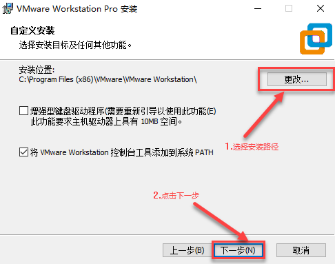
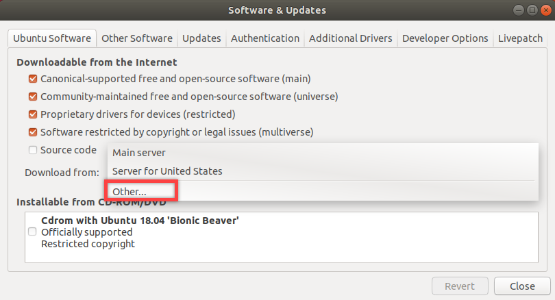
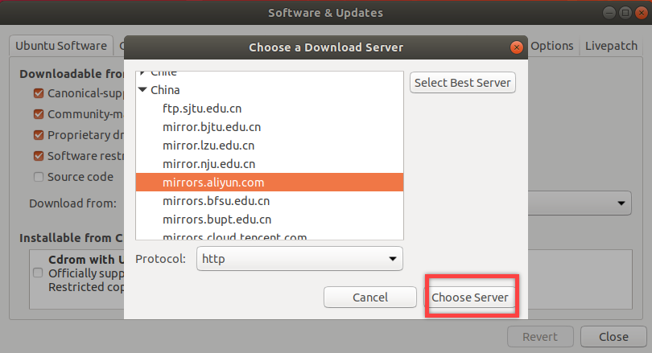
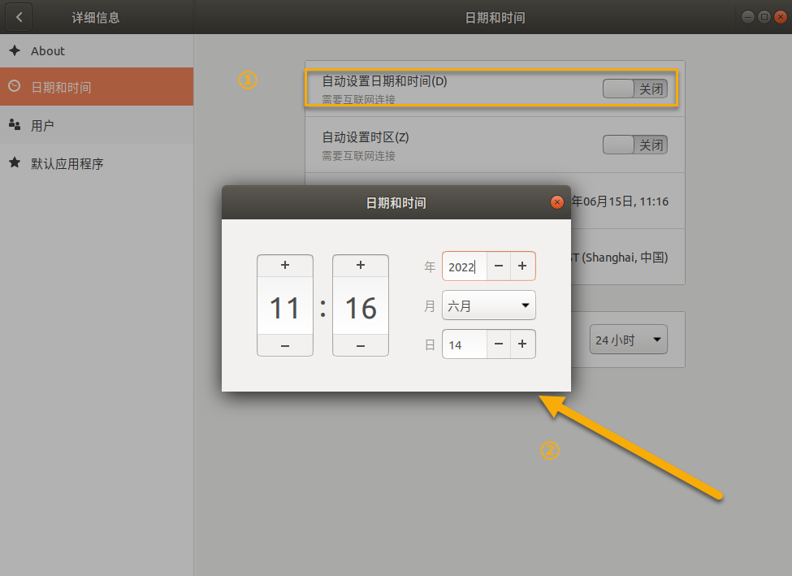
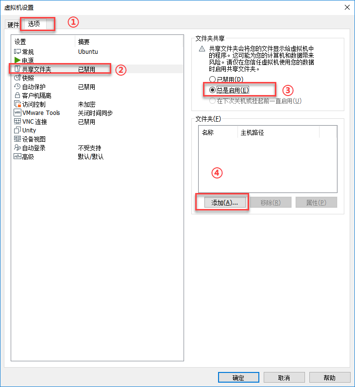
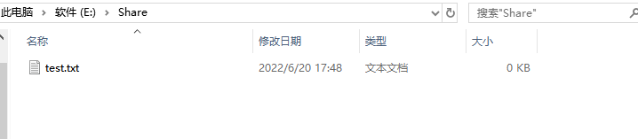
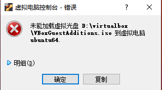
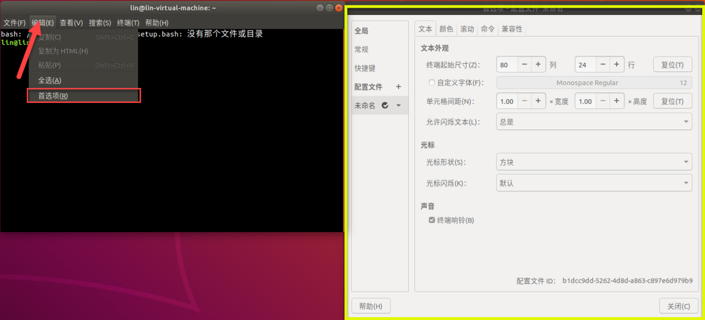

# Linux基础课程

## 1. Linux系统简介

### 1.1 操作系统介绍

要知道Linux是什么，首先说一下什么是操作系统。

计算机是一台机器，它可以按照用户的要求接收信息、存储数据、处理数据，然后再将处理结果输出（文字、图片、音频、视频等）。

硬件是计算机赖以工作的实体，包括显示器、键盘等，软件会按照用户的要求来协调整台计算机的工作。所以操作系统是软件的一部分，是硬件和其它软件沟通的桥梁，可以理解为接口、中间人或者中介等。

操作系统会控制其它程序运行，管理系统资源，提供最基本的计算功能，比如管理系统资源，提供最基本的计算功能。

我们平时接触到的Windows，大家都不陌生，可以玩游戏、听音乐、看电影，它就是以图形用户界面为基础研发的操作系统。

### 1.2 Linux发展历史

与大家熟知的 Windows 操作系统软件一样，Linux 也是一个操作系统软件。它的Logo是一只企鹅。与Windows不同的是，Linux是一套开源的操作系统。


1993年，大约有100余名程序员参与了Linux内核代码编写、修改工作。

1994年，Linux1.0发布，代码量17万行，当时按照完全自由免费的协议。

1995年，Bob Young创办了RedHat（小红帽），以GNU、Linux为核心，集成了400多个源代码开放的程序模块，搞出了一种冠以品牌的Linux，即RedHat Linux，称为Linux发行版，在市场上出售。

1996年6月，Linux 2.0内核发布，此内核有大约40万行代码，并可以支持多个处理器。此时的Linux 已经进入了实用阶段，全球大约有350万人使用。

### 1.3 Linux的特点

在过去的20年里，Linux 系统主要被应用于服务器端、嵌入式开发和PC桌面3大领域，其中服务器端领域是重中之重。例如国内很多互联网企业都在使用Linux系统作为其服务器端的程序运行平台，全球及国内排名前1000的90%以上的网站使用的主流系统都是Linux系统。

所以从上面内容可以看出，Linux操作系统之所以如此流行，是因为它具备以下优秀的特点：

- 免费且开源

- 完全兼容

- 多用户、多任务

- Linux让开展各种实际有用且具有创造性的事情成为可能。

- Linux 的自生系统引导映像（live boot image），启动一台硬盘已经崩溃的计算机，之后查找并解决该问题。或者，因为 Linux 是一个真正的多用户操作系统，它具有非常好的私密性和稳定性，整个团队可以同时从本地或远程登录进行工作。

- Linux 提供了复杂的软件包管理系统，可以放心地安装和维护每一个在线资源库中的软件应用。

### 1.4 Linux系统版本介绍

Linux操作系统有许多发行版本，很难说Linux版本中哪个更好，每个版本都有对应的特点。下面介绍一下常见的系统。

1. Ubuntu（**本章节系列后续课程会以Ubuntu镜像为例，进行讲解说明。**）

Ubuntu是一款基于Debian派生的操作系统，该操作系统成为市场上专有桌面操作系统有力的竞争者。对新款硬件具有极强的兼容能力。特点是界面非常友好，容易上手，对硬件支持非常全面，是最适合做桌面系统的Linux发行版本，同时Ubuntu也可用于服务器领域。


Ubuntu的目标在于为一般用户提供一个最新的，同时又相对稳定的主要自由软件构建而成的操作系统。Ubuntu具有强大的社区力量，用户可以方便地从社区获取帮助。

2. Debian

1993年首次公布，该发行版本非常稳定，卓越的质量控制，包含超过30000个软件包，支持比任何其他Linux发行版本更多的处理器体系结构。


3.  RHEL红帽


Redhat，应该称为Redhat系列，包括：

- RHEL （Redhat Enterprise Linux，也就是所谓的Redhat Advance Server，收费版本，稳定性非常好，适合服务器使用）

- Fedora Core （由原来的Redhat桌面版本发展而来，免费版本，稳定性较差，最好只用于桌面应用）

- CentOS （RHEL的社区克隆版本，免费版本，稳定性非常好，适合服务器使用）

4. Fedora

由全球社区爱好者构建的面向日常应用的快速且强大的操作系统。它允许任何人自由地使用、修改和重发布，无论现在还是将来。它由一个强大的社群开发，这个社群的成员以自己的不懈努力，提供并维护自由、开源代码的软件和开放的标准。Fedora 项目由 Fedora 基金会管理和控制，得到了Red Hat 的支持。


Fedora （第七版以前为Fedora Core）是一款基于 Linux 的操作系统，也是一组维持计算机正常运行的软件集合。其目标是创建一套新颖、多功能并且自由和开源的操作系统。

5. OpenSUSE

德国著名的Linux系统，全球范围内有着不错的声誉及市场占有率，发行量在欧洲占第一位。OpenSUSE对个人来说是完全免费的，包括使用和在线更新。


OpenSUSE被评价为最华丽的Linux桌面发行版，甚至超越win7，但它的优势绝不仅仅局限于win7还要绚丽的用户交互界面，其性能也绝不亚于其他Linux桌面发行版！

## 2. Windows下的环境配置-虚拟机安装

本节课程提供了两种虚拟机的安装方法，用户可根据实际需求选择安装VMware或VirtualBox虚拟机。后续的课程以VMware虚拟机为例进行操作，它同样适用于VirtualBox。

### 2.1 VMware虚拟机的安装

- #### 2.1.1安装VMware

简单来说，虚拟机是允许我们在操作系统中运行其它操作系统的软件。这里我们以VMware Workstation软件为例，安装的步骤如下所示：

1) 将"**配置文件-\>VMware**"路径下的虚拟机软件压缩包进行解压。


2) 找到解压后的虚拟机文件夹，双击虚拟机可执行文件（后缀名为.exe）。


3) 接着按照图示顺序完成虚拟机的安装。





4) 第一次启动虚拟机时，需要输入产品秘钥。此时，填入虚拟机文件夹"**VMware16 激活密钥**"文件中的任意一个秘钥，点击"**继续**"即可。


<p id="anchor_2_1_2"></p>

- #### 2.1.2启动电脑本地的VMware相关服务

1.  切换至电脑本地，使用快捷键"**WIN+R**"打开运行窗口。随后，输入"**control**"，并按下回车，打开"**控制面板**"。


2.  单击"**管理工具**"进入面板，双击"**服务**"选项。


3.  找到VMware相关服务，如下图所示：


4.  右键点击"**启动**"按键，启动所有VMware相关服务。


### 2.2 VirtualBox安装

1)  打开同目录下的软件安装包，点击下一步。


2)  自行修改需要安装的路径，然后点击下一步。


3)  无需改动，直接下一步。


4)  确定安装，点击开始安装。


5)  安装结束，点击完成。


## 3. Linux系统安装及换源方法

用户可根据上一节课程所安装的虚拟机，选择对应的安装及配置方法。

### 3.1 VMware虚拟机下系统的安装及配置

- #### 3.1.1 创建新的虚拟机

1)  将Ubuntu镜像压缩包进行解压。

2)  进入虚拟机界面后，点击"**创建新的虚拟机**"。


3)  在弹出的界面中选择"**自定义**"后，接着点击"**下一步**"，然后依次按图示设置即可。


:::{Note}
这里建议最大磁盘大小调大一些，例如120G，以防后期开发学习空间紧张。
:::


:::{Note}
请确保放置在空间充足的磁盘中。
:::


4)  配置完成后，界面如下图所示，然后会跳转进入简易安装模式，等待安装完成即可。


5)  安装完成将显示用户登陆的主界面，输入设置的密码即可进入系统桌面，然后按照后续图示依次点击完成。


- #### 3.1.2 换源

:::{Note}
本节步骤非常重要，请勿跳过！否则后续下载开发所需的一些安装包会因为网络问题出错！
:::

初学者可能不知道什么是源？其实它就像苹果和安卓的软件应用商店一样，为Linux用户提供软件下载及更新服务的。

Ubuntu是国外开发的系统，默认的软件下载服务器是官方指定的，可能会造成下载文件比较慢或出错的情况。

大家可将软件服务器切换到国内的源进行下载，为后边系统更换输入法等配置工作做准备。下面以更换阿里云源为例，进行说明。

1)  首先按照下图所示点击对应按钮，确认网络连接状态。


2)  点击下图所示位置，然后在输入栏输入设置"**Settings**"。


3)  然后搜索软件和更新"**Software & Updates**"，并双击打开。


4)  打开以后，依次点击下载自-\>其他站点"**Download from-\>Other**"。




5)  滑动找到阿里云"**mirrors.aliyun.com**"的服务器。




6)  如果不确定要选择哪个服务器，也可以点击选择最佳服务器"**Select Best Server**"，会执行一系列的测试，系统进行匹配。但是注意有的时候匹配可能不那么准确。

选择完成后，会提示认证，输入设定的密码即可。


- #### 3.1.3 初次配置

1)  由于简易安装下默认为英文系统界面，我们需要更改系统语言及设置中文输入法。按照下方图示，点击系统左下角的按钮，在搜索栏输入"**Language Support**"，然后双击打开此按钮。


2)  打开后，会弹出下方图示界面，点击"Install"进行下载语言包。


3)  输入设置的密码。


4)  然后等待语言包安装完成即可。


5)  下载完成后，点击"**Install/Remove language**"按钮。添加"**Chinese(simplified)**"后，点击"**Apply**"即可。


6)  安装完成后回到下面的界面，把汉语从最后一位通过鼠标拖到第一个。


7)  然后切换到"**Regional Formats**"，选择"**汉语（中国）**"，点击"**Apply System-wide**"，弹出密码确认的话就输入密码，授权就可以了。


8)  然后再次输入密码。


9)  按照下图所示进行重启。


10) 重启后，可以看到界面已经中文成功设置，点击"**更新名称**"即可。


11) 接下来我们进行中文输入法的设置，点击设置按钮，点击"**区域和语言**"，在展开的右侧界面内，找到"**输入源**"，点击下方的"**+**"按钮。


12) 点击"**汉语**"，然后在展开的输入法中选择第一个，点击"**添加**"。（这里以第一种拼音为例进行添加，有五笔需求的用户可自行选择）


13) 添加完成后，界面的右上角将可看到添加结果。


同Windows中英文切换快捷键不同的是，按"**Win键+空格键**"即可切换输入法。

14) 最后我们来对系统日期和时间进行设置，同样还是打开设置，搜索"**日期和时间**"。


15) 关闭"**自动设置日期和时间**"，可以在下方"**日期和时间**"内进行设置。点击"**时区**"，选择"**Shanghai,中国**"。




- #### 3.1.4 修改分辨率 ####

如果需要修改显示的分辨率，我们可以通过设置来改变。

1)  点击下图所示位置，然后在输入栏输入"**设置**"。


2)  然后双击打开图标，点击搜索按钮，输入"**显示**"。


3)  根据个人需求选择显示的分辨率，然后按照后续提示操作即可完成更改。


4)  这里完成更改后，效果如下：


<p id="anchor_3_1_5"></p>

- #### 3.1.5 共享文件夹的实现

在进行后续程序的开发中，我们经常需要在主机和虚拟机之间传递文件，比如说，源代码位于虚拟机，而在主机下阅读或修改源代码，这里就需要用到共享文件夹这个机制。

由于本章教程是以Vmware虚拟机来进行的，所以我们就以其自带的功能进行说明。

**创建并查看共享文件夹**

1)  关闭Ubuntu系统，然后点击"**虚拟机**-\>**设置**"。


2)  然后在弹出的界面中，依次点击"**选项**-\>**共享文件夹**-\>**文件夹共享**"，然后单击"**总是启用**"，再点击"**添加**"。



3)  在弹出的界面中，点击"**下一步**"，然后点击"**浏览**"，根据需求选择盘符，自行创建一个文件夹。这里以创建名为"**Share**"为例进行：

:::{Note}
创建的共享文件夹内，初次配置时必须为空，否则会配置失败。如有文件，可暂先移出备份。
:::


4. 开启虚拟机，启动系统。如提示无法连接虚拟设备的弹窗提示，直接选"**否**"。


5. 进入桌面后按下"**Ctrl+Alt+T**"打开命令行终端。

6. 输入指令"**sudo apt install open-vm-tools**"，然后在弹出的选项中输入设置的密码。（指令输入可直接复制并粘贴到命令行终端。密码输入不显示，输入完成后按下回车即可）。

```commandline
sudo apt install open-vm-tools
```


:::{Note}
若在安装时出现如下所示提示内容。
:::


可参照"[2. Windows下的环境配置\ 启动电脑本地的VMware相关服务](#anchor_2_1_2)"文档内容，重新开启NAT服务，再输入指令"sudo apt install open-vm-tools"重新安装即可。

```commandline
sudo apt install open-vm-tools
```

4. 确认一下前面虚拟机配置后，系统"**/mnt**"目录下是否生成了"**hgfs**"文件夹。输入指令"**ls /mnt/**"。

```commandline
ls /mnt/
```

:::{Note}
若未有"hgfs"文件夹生成则需要手动创建
:::

输入指令"sudo mkdir /mnt/hgfs"（同样指令输入可直接复制并粘贴到命令行终端。密码输入不显示，输入完成后按下回车即可）。

```commandline
sudo mkdir /mnt/hgfs
```

8. 确定"**/mnt**"目录下有"**hgfs**"文件夹后，再进行是手动挂载，输入指令"**sudo mount -t fuse.vmhgfs-fuse .host:/ /mnt/hgfs -o allow_other**"即可手动挂载。

```commandline
sudo mount -t fuse.vmhgfs-fuse .host:/ /mnt/hgfs -o allow_other
```

注意：若手动挂载时出现如下所示提示，


输入"sudo mount -t fuse.vmhgfs-fuse .host:/ /mnt/hgfs -o allow_other -o nonempty"重新挂载即可。


9. 挂载完成以后，输入指令"**cd /mnt/hgfs/Share**"，进入共享文件夹。

:::{Note}
虚拟机这里的共享文件夹名称与主机环境下创建的文件夹名称必须一致。若不一致，请修改为统一名称！
:::

10. 现在主机的共享文件夹位于E:\Share，那虚拟机的路径在\*\*/mnt/hgfs/Share/\*\*。可做个测试：在主机的共享文件夹内放入test.txt。



在虚拟机下/mnt/hgfs/Share/下输入"**ls**"指令，可见到此文件说明配置完成。


- #### 3.1.6 共享文件及常见问题解决

**文件无法共享**

1)  确认是否创建了hgfs共享目录，可参照"**[创建并查看共享文件夹](#anchor_3_1_5)-\>7)**"进行查看与手动创建共享目录。

2)  查看本地共享文件夹目录是否为空，若为空可参照"**[创建并查看共享文件夹](#anchor_3_1_5)-\>2）-3)**"进行新建共享文件夹。

3)  再次配置虚拟机共享文件夹设置，可参照"**[创建并查看共享文件夹](#anchor_3_1_5)-\>1)-2)**"进行共享文件夹的设置。

**重启虚拟机找不到共享文件夹**

如果手动挂载以后，再次登陆开机发现找不到配置的共享文件夹，可通过自动挂载的形式来解决。自动挂载可通过vi编辑起来配置。vi编辑器是Linux操作系统中最经典的文本编辑器。由于Ubuntu系统中预装的是简易版的vi编辑器，为了更好的编辑文件，我们需要将它卸载并重新安装完整版的vi编辑器。

1)  打开命令行终端输入"**sudo apt-get remove vim-common**"将vi编辑器卸载。


2)  输入"**sudo apt-get install vim**"指令安装完整版vi编辑器。


3)  输入指令"**sudo vi /etc/fstab**"，通过vi编辑器打开这个配置文件，在弹出的选项中输入设置的密码。（指令输入可直接复制并粘贴到命令行终端。密码输入不显示，输入完成后按下回车即可）。


4)  复制"**.host:/ /mnt/hgfs fuse.vmhgfs-fuse auto,allow_other 0 0**"。

5)  返回vi编辑器，按下键盘"**i**"键，通过键盘"**↑↓←→**"按键，移动到文件内的末行。


6)  按下回车，鼠标右键选择"**粘贴**"即可将前面复制的内容粘贴过来。


7)  按下"**Esc**"，按下"**：**"，然后输入"**wq**"，回车退出并保存。


8)  重新启动虚拟机再次按照[创建并查看共享文件夹](#anchor_3_1_5)内容进行查看。

关于指令和终端界面的详细介绍，可学习后面的课程。

### 3.2 VirtualBox虚拟机下系统的安装及配置

- #### 3.2.1 新建虚拟机

1)  点击新建，然后自行按需设置名称和路径，类型固定为Linux，版本固定为Ubuntu64位。设置完成后，点击下一步。


2)  修改虚拟机内存大小，建议设置为2G。


3)  点击创建虚拟硬盘，硬盘文件类型默认VDI，默认动态分配方式，点击下一步。


4)  设置文件位置和硬盘的大小，硬盘大小建议为20G，最后点击创建。


- #### 3.2.2 虚拟机配置

1)  点击设置，打开全局设置界面。


2)  解压同目录下的Ubuntu镜像文件，然后依次点击存储-\>没有盘片-\>选择虚拟光盘文件。


3)  找到解压的Ubuntu文件路径，点击Ubuntu镜像，选择打开。


4)  点击OK，保存设置。


5)  点击管理，再点击全局设定。


6)  点击显示，最大屏幕尺寸选择为"**提示**"，按需修改屏幕尺寸，最后点击OK保存。


7)  再次点击全局设定，选择网络，再点击添加NAT网络，最后点击OK保存。


8)  点击设置，进入虚拟机设置界面。


9)  左侧点击网络，连接方式选择"**NAT网络**"，界面名称为全局设定中新添加的NAT网络，然后点击高级设定。


10) 勾选接入网线，点击OK保存。


11) 点击启动，打开虚拟机。


12) 左侧设置安装语言，然后点击安装。


13) 选择完安装选项后，等待安装完成。


14) 安装完成将显示用户登陆的主界面，输入设置的密码即可进入系统桌面，然后 按照后续图示依次点击完成。


15) 虚拟机关闭后，再次启动前，需要修改启动顺序，否则会重新安装系统。点击设置，进入设置界面。


16) 左侧点击系统，将启动顺序中除了硬盘的选项都取消勾选，然后将硬盘选项上升到顶部，最后点击OK保存。


- #### 3.2.3 设置共享文件夹

1)  点击设置，进入虚拟机设置界面。


2)  左侧点击共享文件夹，再点击加号添加共享文件夹，设置共享文件夹路径和名称，接着勾选自动挂载，输入挂载点"**/mnt/share/**"，然后点击OK保存，再点击OK退出设置。

:::{Note}
共享文件夹所在路径，设置前文件内容需为空，否则会设置失败。
:::


3)  点击启动，开启虚拟机。


4)  点击设备，再点击安装增强功能。


如果出现以下错误提示，回到桌面，右键光盘，选择弹出，再次点击安装即可。




5)  点击安装后，选择运行该软件。


6)  输入密码，点击认证。


7)  出现如下提示，就已安装完成，按下回车退出即可。


8)  右键桌面，选择打开命令行终端。


:::{Note}
输入指令时需要严格区分大小写，且可使用"Tab"键补齐关键词。
:::

9)  输入指令"**sudo mkdir /mnt/share**"，创建共享文件夹。

执行需要输入密码，密码不显示，输完按下回传即可。


10) 输入指令"**sudo mount -t vboxsf share /mnt/share**"，搭载共享文件夹，其中第一个"**share**"是主机下的共享文件夹路径，根据实际情况修改。


11) 搭载完成后，需要修改权限才能访问，输入指令"**sudo usermod -aG vboxsf \$(whoami)**"，添加权限，最后重启虚拟机即可。


12) 现在共享文件夹已设置完毕，添加文件测试效果，在主机共享文件夹放入测试文件。


13) 在虚拟机打开命令行终端，输入指令"**cd /mnt/share**"，进入共享文件夹。


14) 输入指令"**ls**"，查看该目录所有文件，文件一致，完成共享。


## 4. Linux的基本操作

### 4.1 图形界面介绍

本节以Ubuntu系统的GUI为例进行说明，Linux其他版本可自行网搜。

1)  图形系统进入后，左侧黄框内为菜单栏，右侧为桌面，顶端黄框内为状态栏，菜单栏最下方为工具栏。


2)  菜单栏自上到下为简易安装后的基本工具，比如浏览器、邮件、办公Office，可以满足基本的使用需求。

3)  点击菜单栏最下方的"**工具栏**"。


4)  在工具栏内，我们可以选择各种工具，黄框内为搜索栏，输入工具名称既可查找到对应的工具。


5)  点击状态栏的最右方。


6)  点击以后出现下图：


7)  点击"**设置**"按钮。


8)  在下图界面即可对Ubuntu系统进行设置。


9)  单击系统桌面右上角的电源按钮，然后如下图所示进行操作：


10) 按下键盘上的"**win**"键，并将鼠标移动到最右侧。


11) 鼠标点击下图黄框所示位置：


12) 即可切换成新的桌面。


13) 点击右侧文件夹按钮，可打开文件管理器。如下图所示：


14) 右键红框内的空白区域。


15) 点击"**新建文件夹**"。


16) 在红框内输入文件夹的名称，这里我们以"**test**"为例，输入完毕，点击右上角的"创建"。


17) 成功新建文件夹后，新文件夹如下图所示：


18) 右键"**test**"文件夹，点击"**复制**"。


19) 点击"**桌面**"。


20) 右键空白区域，弹出红框内容，点击"**粘贴**"。


21) 若"桌面"出现"**test**"文件夹，则复制成功。


22) 右键桌面的"**test**"文件夹，点击"**移动到回收站**"，删除文件夹。其他文件操作均与windows系统相同。


### 4.2 终端界面介绍

下面介绍终端，终端是Linux系统的控制台，我们依靠各种命令与内核打交道来完成我们日常的任务。

终端从用户接收键盘输入，并将输入发送给主机系统，主机系统处理用户输入后将结果返回至终端。

1)  打开终端的方式也很简单，按下键盘"**Ctrl+Alt+T**"或点击左下角"**显示应用程序**"，再点击"**终端**"。


2)  点击"**编辑**"，选择"**首选项**"，我们即可在右边黄框内，对命令栏的样式、字体等根据自己的喜好进行更改。



3)  当我们打开终端界面后，我们看到的格式是类似\[hiwonder@ubuntu~\]#这种格式的一串字符，这串字符就是命令提示符。

其中，hiwonder：当前用户的名称。

- @：分隔符。

- Ubuntu：当前的主机名。

- ~：用户当前所在目录的名称，"~"为主目录，即home目录。

- \#：用户身份提示符，#代表超级用户，也就是管理员；\$表示普通用户。


## 5. Linux目录介绍

系统目录就是指操作系统的主要文件存放的目录，目录中的文件直接影响到系统是否正常工作，了解这些目录的功能，对使用系统会有很大的帮助。

### 5.1 打开系统目录

在虚拟机中，依次输入两次命令"**cd ..**"和一次命令"**ls**"（注意：cd 和..中间有一个空格），然后分别按键盘上的回车键。


在 Linux 中系统目录指的是下图所示方框范围的文件夹。Linux 的操作系统完全基于文件和文件系统建立，任何信息都以文件的形式存储，通过文件名和路径定义。

在Linux系统中目录结构是一种树形结构，"**/**"标识代表了这个树形结构的根部，也就是人们常说的根目录。


### 5.2 查看系统目录

我们可以命令的形式在Linux上查看系统目录，为了更加直观的展现及帮助用户理解，可使用树状分布图的形式来操作，操作步骤如下：

输入下图所示命令："**sudo apt-get install tree**"，安装软件包。


**注意**：**若出现安装失败的情况，如下图所示（无法找到安装包）：**


我们需要输入"**sudo apt-get update**"指令，更新源。


更新完成后输入"**sudo apt-get install tree**"指令重新安装即可。

安装完成后，就可以使用 tree 的相关命令，可按照如下示例命令进行尝试：

tree：以树状图显示所有文件。

tree -L N：以树状图显示所有文件夹，子文件夹显示至第 N 层。（"tree"和"-"之间，"L" 和"N"之间各有一个空格；N 需用数字代替，表示文件夹层数。）

输入"**tree -L 1**"命令，显示子文件夹至第 1 层，如下图所示。Windows 系统同样采用了树状结构，但是它是以磁盘为根分区，形成的 C 盘、D 盘等相当于子文件夹的第一层。

对于 Linux 系统而言，"**/**"相当于一块完整的硬盘，我们把这个硬盘划分为"**/etc**"，"**/dev**"，"**/lib**" 等多个分区。


下表记录了各个主要目录的功能：

| 目录名称 |                           对应功能                           |
| :------: | :----------------------------------------------------------: |
|   bin    |                    存放Linux的常用命令。                     |
|   boot   |                    存放Linux的启动文件。                     |
|   dev    |                    存放Linux的外部设备。                     |
|   etc    |         存放所有系统管理需要的各种配置文件和子目录。         |
|   home   |                         存放主目录。                         |
|   lib    |                     存放动态链接共享库。                     |
|  media   |               提供所有可移动设备的常规挂载点。               |
|   mnt    |                       临时文件挂载点。                       |
|   proc   |                   存放有关系统资源的信息。                   |
|   root   |                     表示根用户的主目录。                     |
|   sbin   | 存放系统中非必备和并不特别重要的系统二进制文件及网络应用工具。 |
|   sys    |                存放内核、固件及系统相关文件。                |
|   tmp    |                        存放临时文件。                        |
|   usr    | 存放用户文档、游戏、图形文件、库以及各种其他用户和管理命令及文件。 |
|   var    |              存放的是不断扩充且经常修改的目录。              |

## 6. Linux常见指令

通过前面的学习，我们已经掌握了一些基本的Linux指令。对于Linux新手来说，记忆数量巨大的Linux指令是学习的一大难点。不过无需担心，实际上我们只要掌握常见的十余种指令就可以上手Linux了。

下表为Linux常用的一些指令。

|   指令名    |             英文全称/翻译             |             意义             |
| :---------: | :-----------------------------------: | :--------------------------: |
|     Ls      |               List/列出               |     列出当前目录下的文件     |
|     cd      |       Change Directory/更改目录       |           切换路径           |
|     pwd     | Print Working Directory/显示工作目录  |         显示所在目录         |
|    ping     | Packet Internet Groper/因特网包探索器 |         测试网络连接         |
|  shutdown   |            Shut down/关掉             |           用于关机           |
|   reboot    |              Reboot/重启              |           用于重启           |
|     cp      |               Copy/复制               |           用于复制           |
|     rm      |              Remove/去掉              |             删除             |
|    mkdir    |       Make directory/创建文件夹       |          创建文件夹          |
| man command |              Manual/手册              |    显示command的帮助信息     |
|    echo     |               Echo/回显               | 将输入的内容回显到终端界面上 |
|    sudo     |       Superuser do/超级用户进行       |   以系统管理员身份执行指令   |
|    clear    |              Clear/清除               |       清除终端上的信息       |
|    Find     |               Find/查找               |           查找功能           |
|     mv      |               Move/移动               |   通过移动文件来实现重命名   |
|    date     |               Date/日期               |     读取系统的日期/时间      |

我们可以看到，这些指令基本是基于英文单词全称或简称组成的，如果你有一些英文基础，相信指令记起来会更加容易。另外需要说明一点，在Linux内是是严格区分大小写的，包括指令中大写和小写也是不同的。

### 6.1 Linux指令格式

指令+选项+操作对象这三部分构成了一个标准的Linux命令，其中命令部分需要输入命令的名称，选项部分定义命令的执行特性，这一特性可以有长短两个选项。

比如像长选项用" --"引导，后面跟一个完整的单词，如--help；短选项用‘**-**’引导，后面跟单个的字符， 如 -a 。多个短选项可以组合使用，例如：-h -l -a == -hla，但是长选项不能组合使用，如--help后面就不能再跟另外一个单词了。例如下图所示：


大家需要注意，命令与选项，选项与选项，选项与操作对象，操作对象与操作对象它们之间是必须用空格分隔！至于操作对象就是图片中的/boot，操作对象是可以有多个的，操作对象与操作对象它们之间是必须用空格分隔！

### 6.2 Linux指令的实操

1.  启动虚拟机，使用快捷键"**Ctrl+Alt+T**"或者右键桌面选择黄框内的选项，进入终端界面。


2. 输入第一个指令"**pwd**"。我们知道"**pwd**"指令是用于显示所在目录，可以看到当前是处在/home目录下/hiwonder的文件夹内。


3. 紧接着输入指令"**ls**"。"**ls**"指令是让系统列出当前所在目录的文件信息，可使用"**ls -l**"和"**ls -a**"这样的参数获取文件权限、修改日期等信息。


4. 接下来因示例需要，顺便介绍一些实用技巧。点击键盘"**PrtSC**或**PRTSCR**"按键，将会自动对当前画面进行截屏，截屏的图片会存放在/home/Pictures下，截取完毕，单击左上角的"**文件管理器**"图标为即可找到。


5. 回到终端界面，使用"**cd**"指令跳转。前面我们已经列出所在目录的文件信息，接下来使用指令跳转到玩法所在 "**/Pictures**" 文件夹内。

:::{Note}
在Linux系统中，可以使用"**Tab**"键来辅助指令输入。"**Tab**"键可以自动补全指令或文件（目录）名或文件（目录）路径。
:::

例如，当我们想要"**/Pictures**"目录时，输入指令"**cd Pict**"，然后在键盘上按一下"Tab"键，指令会被自动补齐为"**cd Pictures/**"。每次按下"**Tab**"键后，若无相重合的字符，完整的文件名会立刻出现在指令行；若有名称字符重合，则会出现当前目录下所有以这几个字符开头的文件名称。


6. 现在已经进入截屏所在的目录，可再次使用指令"ls"查看该目录下有哪些文件。


7.  这些文件中以"**2019-08-28**"开头，"**.png**"结尾的文件就是我们刚才的截图文件。在以后的项目管理中，大家可以通过该方法来直接查找所需的项目或者文件。

### 6.3 高效的输入指令建议

- #### 6.3.1 通过help

1)  在终端中以"**‘命令’ --help**"格式，可以帮助你查看某个命令的详细用法，我们以"**ls**"为例。

2)  在终端输入"**ls --help**"，黄框内是"**ls**"的更多用法。


3)  例如：在终端输入"**ls -a**"，即可看到文件夹内所有文件。


4)  例如：在终端输入"**ls -al**"，即可看到文件夹内，所有文件的属性。


- #### 6.3.2 man手册介绍

接下来输入"**man**"指令。"**man**"指令是帮助手册manuel的缩写。当你忘记某一指令的时候或查看某指令的参数时，只要输入"**man**"指令，然后根据提示输入想要查找的东西，就得到详细的答案了。


1)  可以通过快捷键进行翻页操作，下表为页面操作快捷键。

|    功能    |            快捷键            |
| :--------: | :--------------------------: |
| 往后翻一屏 |        SPACE（空格）         |
| 往前翻一屏 |              B               |
| 往后翻一行 |        ENTER（回车）         |
| 往前翻一行 |              K               |
|  返回终端  | :Q（先输入":"号，再输入"Q"） |

2)  除了上述的指令和按键以外，在Linux系统内还有一些特殊控制按键。

|        |                    |
| :----: | :----------------: |
|  按键  |        作用        |
|   ↑    |      指令历史      |
|  Tab   |      自动补全      |
| Ctrl+C |    中断运行程序    |
| Ctrl+D |    退出终端界面    |
| Ctrl+A | 光标移动到本行开头 |
| Ctrl+X | 光标移动到本行结尾 |

3)  比如要查询"**cp**"指令的意义，可以输入"**man cp**"指令，回车后可以看到下图所示内容。如图中红框处标注出来的内容就是"**cp**"指令的含义：复制文件和文件夹。


4)  接着往下翻，会有一个"**DESCRPTION**"，下面的内容是关于"**cp**"这个指令的详细说明。


- #### 6.3.3 使用tab键补齐

1)  例如在终端输入"**re**"，并且按下"**Tab**"键。终端弹出带有"**re**"的命令供我们选择。


2)  在终端输入"**cd D**"，按下"**Tab**"键，将弹出该路径下所有名称含"**D**"的文件供我们选择。


3)  在终端根据提示输入文件时，按下"**Tab**"键，可以将文件名称自动补全。


## 7. Linux权限介绍

权限在生活中无处不在，例如游戏中会有防沉迷，电影平台非VIP用户无法观看VIP视频等，同样在操作系统中也不例外，访问文件需要权限，进入目录需要权限，更改文件需要权限。

在Linux系统中，不同的用户对应不同的权限，分为超级（root）用户和普通用户。超级用户即在Linux系统内可以做任何事情，几乎不受限制，而普通用户则只能去做权限内的事。

比如同样一个文件，超级用户可以对其进行编辑，而普通用户只能阅读，不能对其操作。

### 7.1 用户切换

用户切换的指令很简单，但由于Ubuntu默认的root密码在每次重启后都是随机生成的，所以我们需要先设置root固定密码。

打开命令行终端界面，输入指令"**sudo passwd**"，输入登陆密码后按下回车，随后设置root密码，需要连续两次。（**注意：输入密码界面不会显示，输入完成后按下回车即可**）


root密码设置完成后，接下来输入"**su**"，在提示的界面内，输入刚才设置的密码，回车，命令行之后的\$变成了#这样就切换回root目录。


### 7.2 文件权限说明

文件本身具有天然的权限属性，读、写、执行。

文件按访问者可分为三类：

- 拥有者：文件的拥有者user

- 所属组：文件所属的群组group

- 其他用户：other

这里的拥有者、所属组，其他用户是一种角色，而root用户、普通用户则是具体的人，就像程序员是一种角色而我们是具体的人。

对于每个身份，又有三种权限。

r：读权限（read）

对于文件来讲就是可以读取其内容的权限，对于目录来讲无法查看目录里面的内容。

w：写权限（write）

写权限：对于文件来讲就是可以向文件写数据，对于目录来讲无法删除目录里面的文件

x：可执行权限（execute）

对于可执行文件来讲无法运行（可以看到颜色都变了），对于目录来讲无法进入目录。

| Linux表示 | 八进制表示 |      解释说明      |
| :-------: | :--------: | :----------------: |
|    r--    |     4      |      只读权限      |
|    -w-    |     2      |      只写权限      |
|    --x    |     1      |     可执行权限     |
|    r-x    |     5      |   可读可执行权限   |
|    rw-    |     6      |    可读可写权限    |
|    -wx    |     3      |   可写可执行权限   |
|    rwx    |     7      | 可读可写可执行权限 |

### 7.3 权限更改说明

权限更改将用到chmod指令，可以分为两种方法，第一种是通过数字形式改变权限，第二种是字符形式改变。

1)  打开终端界面，首先输入指令"**touch test.txt**"，创建一个txt文件。


如上图所框，也就是文件拥有者拥有读和写的权限，所属群组及其它用户只有读的权限。

2)  那比如说我们将此文件权限修改一下，所属群组和其它用户都有读写执行的权限。输入指令"**chmod 777 test.txt**"。


3)  再次输入"**ls -al**"，查看权限，可以看到已修改成功。


这种数字形式一次可以改变文件三种身份的所有权限，接下来我们来说第二种方式，以字符形式改变文件权限。

字符形式更加灵活，可以给某个身份的某个权限单独设置。例如我们再次创建一个记事本文件，命名为"**test_1**"，输入指令"**touch test_1.txt**"。


4)  再次输入指令"**ls -al**"查看文件权限。


5)  这里我们举例分别给拥有者、群组及其他用户赋予执行的权限。

指令依次如下：

```commandline
chmod u+x test_1.txt

chmod g+x test_1.txt

chmod o+x test_1.txt
```

6)  同理，如果需要设置读及写的权限，将x（执行）换成r（读）或w（写）


7)  设置完成后，我们再次查看一下文件的属性，输入"**ls -al**"指令。


8)  如果不想分开设置，通过字符的方式，例如我们将三种身份都增加写的权限，可以输入指令"**chmod a+w test_1.txt**"。其中a表示所有身份。


9)  然后输入"**ls -al**"指令来查看效果。


如果需要去掉某个身份的某种权限，只需将"**+**"换为"**-**"即可。例如去除其他用户执行的权限。

10) 输入指令"**chmod o-x test_1.txt**"。


11) 然后输入"**ls -al**"指令来查看效果。

