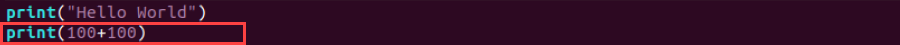
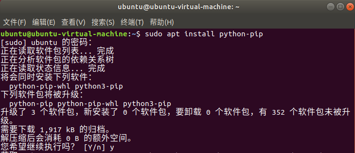

# Python基础课程

## 1. Python介绍与安装

### 1.1 Python介绍

- ####  1.1.1 面向对象概述

Python是一种面向对象的计算机程序设计语言，而面向对象（Object Oriented）是一种软件开发方式，是一种编程范式。面向对象是相对于面向过程（Procedure Oriented）来讲的，两者的编程思想如下：

| **软件开发方式** | **编程思想** |
|:--:|:--:|
| 面向过程（Procedure Oriented） | 以过程为中心，分析解决问题的步骤，并用函数依次实现步骤。 |
| 面向对象（Object Oriented） | 以对象为中心，把构成问题的事物分解为各个对象，描述某个对象在整体解决方案中的行为。 |

为了更通俗易懂地解释两者的差异，此处以五子棋游戏为例。

面向过程的设计思路如下：

(1) 分析解决方法，将其分为九个步骤：开始游戏、落黑子、绘制画面、判断输赢、落白子、绘制画面、判断输赢、返回步骤、输出结果；

(2) 用函数依次实现上述步骤，并在主函数内依次调用各个步骤的函数。

而面向对象的设计思路如下：

(1) 将五子棋游戏分为3个对象：黑白双方、棋盘系统（负责绘制画面）、规则系统（负责判断输赢）；

(2) 为所有对象赋予属性、行为。第一类对象（黑白双方）负责接受用户输入，并将棋子布局的变化告知第二类对象（棋盘系统）。第二类对象（棋盘系统）接收变化信息后，将其显示于屏幕，同时利用第三类对象（规则系统）对棋局进行判定。

- #### 1.1.2 Python概述

Python是一种跨平台的计算机程序设计语言，它的第一个公开发行版发布于1991年。"Python"这个名字源于创始人Guido van Rossum喜欢的戏剧团体Monty Python。

Python提供了丰富的API（Application Programming Interface，应用程序接口）和工具，程序员能够轻松地使用C语言、C++、Cython来编写扩充模块。除此之外，Python编译器本身也可以被集成到其它需要脚本语言的程序内，所以Python常被用于集成与封装其它语言编写的程序。

Python的语法、动态类型和其解释型语言的本质，使它成为多数平台上写脚本和快速开发应用的编程语言。随着版本的不断更新和语言新功能的添加，Python逐渐被用于独立的、大型项目的开发。

:::{Note}
Python2.0版本自2020年起已停止维护，因此建议使用Python3.0及以上版本。
:::

- #### 1.1.3 Python特点

(1) 易于学习：Python有相对较少的关键字，结构简单，语法定义明确。

(2) 易于阅读、维护：Python代码定义清晰，源代码容易维护。

(3) 运行速度快：Python的底层与很多标准库、第三方库是用C语言写的，运行速度非常快。

(4) 免费、开源。

(5) 丰富的库：Python具备庞大的标准库，可用于处理各种工作，包括正则表达式、文档生成、单元测试、线程、数据库、网页浏览器、CGI、FTP和其他与系统有关的操作。

(6) 可移植：由于Python的开源本质，它已经被移植在许多平台上，如Linux、Windows等。

### 1.2 查看Python

:::{Note}
本套Python教程的操作是基于系统Ubuntu18.04所进行的，该系统自带Python3.6.9。为避免在后续学习过程中因版本差异出现问题，建议用户保留Python3.6.9版本，对本节内容仅做了解即可。
:::

输入指令"**python3 -V**"，并按下回车，即可查看当前的Python版本。

```bash
python3 -V
```

### 1.3 PyCharm安装方法

为了方便学习python语言，本节会对PyCharm编辑器的安装进行教学。

- #### 1.3.1 下载PyCharm

(1) 输入指令"**sudo apt install snapd snapd-xdg-open**"安装snap 安装包格式。

```bash
sudo apt install snapd snapd-xdg-open
```

(2) 输入指令"**snap refresh**"刷新snap。

```bash
snap refresh
```

:::{Note}
如果下面的错误无法连接进行刷新，可以更换其他的源，例如清华源再进行刷新。
:::


(3) 输入指令"**sudo snap install pycharm-community --classic**"安装PyCharm。

```bash
sudo snap install pycharm-community --classic
```

- #### 1.3.2 打开PyCharm

(1) 我们打开"**菜单**"点击PyCharm。


(2) 创建并配置PyCharm工程。点击New Project新建PyCharm工程。


(3) 选择 Previously configured interpreter并点击。


(4) 选择System lnterprefter。


(5) 点击"create"。


(6) 最后进入下图界面，即完成。


- #### 1.3.3 汉化PyCharm

(1) 点击"**file**"。


(2) 点击"**settings**"。


(3) 选择Plugins，并在搜索栏内输入chinese，然后安装前面图中两个包。


(4) 若在安装时遇到图中提示，点击"**accept**"。


(5) 点击"**Restart IDE**"。


(6) 重启PyCharm后完成汉化。


- #### 1.3.4 PyCharm的基本介绍和基本使用方法

(1) 界面基本布局如下图：


(3) 点击新建，选着python文件。


(4) 然后给你新建的python文件命名。


(5) 最后结果如下图：


(6) 右键代码区我们可以选择运行，在输出终端可以到输出的结果。


想要了解更多PyCharm的使用，请访问PyCharm官：https://www.jetbrains.com/zh-cn/pycharm/。

## 2. 第一个程序

字符串即多个字符的集合，由双引号或单引号包围。字符串内可包含英文字母、阿拉伯数字、汉字以及各种符号。

本节会讲解一个简单、常用的Python程序——在屏幕打印字符串"**Hello World**"。

### 2.1 操作步骤

```bash
sudo apt-get install vim
```

(1) 若出现是否继续执行的相关提示，输入"**Y**"，并按下回车。若安装过程中没有出现报错，则安装成功。


(2) 输入指令"**mkdir test**"，并按下回车，在当前目录新建一个名为"**test**"的文件夹。

```bash
mkdir test
```


(3) 输入指令"**cd test/**"，并按下回车，进入"**test**"文件夹。

```bash
cd test/
```

(4) 输入指令"**sudo apt install vim**"，并按下回车，新建一个名为"**hello**"的程序文件。

```bash
sudo apt install vim
```

(5) 输入指令"**touch hello.py**"，并按下回车，新建一个名为"**hello**"的程序文件。

```bash
touch hello.py
```

(6) 输入指令"**vim hello.py**"，并按下回车，打开程序文件。

```bash
vim hello.py
```

(7) 按下"**I**"键进入编辑模式，并输入代码"**print("Hello World")**"。


(8) 按下"**Esc**"键，输入"**:wq**"并回车，进行保存与退出。

```bash
:wq
```

(9) 输入指令"**python3 hello.py**"，并按下回车，运行程序文件，终端界面会打印指定字符串。

```bash
python3 hello.py
```


### 2.2 拓展内容

除了字符串，print()函数还可以用于输出数学表达式的结果。此处以**在程序文件内添加包含数学表达式的print()函数**为例，具体操作步骤如下：

(1) 启动虚拟机，点击系统任务栏的图标，并点击图标，或使用快捷键"**Ctrl+Alt+T**"，打开命令行终端。

(2) 输入指令"**cd test/**"，并按下回车，进入"**test**"文件夹。

```bash
cd test/
```

(3) 输入指令"**vim hello.py**"，并按下回车，打开程序文件。

```bash
vim hello.py
```

(4) 按下"**I**"键进入编辑模式，并输入代码"**print(100+100)**"。



:::{Note}
数学表达式两端无需添加双引号。
:::

(5) 按下"**Esc**"键，输入"**:wq**"并回车，进行保存与退出。

```bash
:wq
```

(6) 输入指令"**python3 hello.py**"，并按下回车，运行程序文件，终端界面会打印数学表达式的计算结果。

```bash
python3 hello.py
```


### 2.3 函数说明

print()函数用于打印输出，语法格式如下：

```python
print(*objects, sep='', end='\n', file=sys.stdout, flush=False)
```

第一个参数"**objects**"是输出对象。一次输出多个对象时，对象之间需用逗号"**,**"分隔；

第二个参数"**sep**"用于在输出对象之间插入字符串，默认值为一个空格符；

第三个参数"**end**"用于在输出结尾添加字符串，默认值为一个换行符；

第四个参数"**file**"是写入的文件对象，默认值为系统标准输出"**sys.stdout**"，即屏幕；

第五个参数"**flush**"用于控制输出缓存，默认值为"**False**"。

## 3. Python基础语法

本节会对Python的基础语法进行讲解说明，如注释、缩进规则、编码规范等。

### 3.1 注释

注释是对程序的解释和说明。Python支持两种注释类型：单行注释、多行注释。

(1) 单行注释

使用井号键"#"作为单行注释的符号，语法格式如下：

```python
# 注释内容
```

(2) 多行注释

在注释内容的开头与结尾处各自使用三个单引号"**'''**"或三个双引号"**"""**"（单引号和双引号请通过英文输入法下进行），即可对多行内容进行注释，语法格式如下：

```python
'''
注释内容
注释内容
'''
```

或者：

```python
"""
注释内容
注释内容
"""
```

### 3.2 缩进规则

Python采用代码缩进和冒号"**:**"来区分代码块之间的层次。

在Python中，对于类定义、函数定义、流程控制语句、异常处理语句等，行尾的冒号和下一行的缩进，代表下一个代码块的开始，而缩进的结束则表示此代码块的结束。

以下图代码为例，每一个红框为一个代码块。


Python对代码的缩进要求非常严格，同一级别代码块的缩进量必须保持一致。在编码时，可以使用"**Tab**"键进行缩进，也可以通过自行输入4个空格进行缩进。

:::{Note}
通常以4个空格为一个缩进单位。默认情况下，一个"Tab"键代表4个空格。
:::

### 3.3 编码规范

Python采用PEP8作为编码规范。其中，"**PEP**"是指Python增强建议书（Python Enhancement Proposal），而"**8**"是指Python代码的样式指南。

在编码时严格遵守编码规范，能够令代码看起来更整洁、美观，有益于增加代码的可读性。下面是部分编码规则：

(1) 一个import导入一个模块，尽量避免一次导入多个模块。


| **推荐做法** |  |
|:--:|:--:|
| **不推荐做法** |  |

(2) 不在行尾添加分号"**;**"，不将两条命令放置在同一行。

| **推荐做法** |  |
|:--:|:--:|
| **不推荐做法** |  |

(3) 每行的字符数尽量不多于80，可将命令分为多行，并使用小括号"**()**"进行连接。此外，不推荐使用反斜杠"**\\**"连接多行内容。


| **推荐做法** |  |
|:--:|:--:|
| **不推荐做法** |  |

(4) 使用必要的空行可以增加代码的可读性。

(5) 通常情况下，运算符两侧、函数参数之间以及逗号两侧，都建议使用空格进行分隔。

### 3.4 标识符命名规范

标识符的主要作用就是作为变量、函数、类、模块以及其他对象的名称。在Python中，标识符的命名需要遵守一定的命令规则，例如：

(1) 标识符由字符（A~Z、a~z）、下划线"**\_**"和数字组成，但不能使用数字作为第一个字符。

(2) 标识符不能和Python中的关键字/保留字相同，可以查看下面的"**5.关键字/保留字**"的相关介绍。

(3) 标识符中不能包含空格、"**@**"、"**%**"和"**\$**"等特殊字符。

结合上述三点规则，下表列举了部分命名合法的标识符与不合法的标识符：

| **命名合法的标识符** |  |
|:--:|:--:|
| **命名不合法的标识符** |  |

(4) 标识符中的字母是严格区分大小写的。以"**num**"、"**Num**"和"**NUM**"为例，这三个变量是完全独立、毫无关联的。

(5) 以下划线"\_"为开头的标识符具备特殊含义，除非特定场景需要，应避免使用以下划线开头的标识符。

| **标识符** | **含义** | **例子** |
|:--:|:--:|:--:|
| 以单下划线开头 | 不能直接访问的类属性，其无法通过"from...import\*"的方式导入 | \_width |
| 以双下划线开头 | 类的私有成员 | \_\_add |
| 以双下划线作为开头和结尾 | 专用标识符 | \_\_init\_\_ |

(6) Python支持使用汉字作为标识符，但为了避免出现奇怪错误，应尽量避免如此命名标识符。

除了上述规则，在不同场景下，标识符的命名也有对应的规范需要注意，例如：

① 用作模块名时，应尽量短小，且全部使用小写字母，可以使用下划线进行分割，如"game_mian"、"game_register"。

② 用作包的名称时，应尽量短小，全部使用小写字母，如"com.mr"、"com.mr.book"，不推荐使用下划线。

③ 用作类名时，应采用单词首字母大写的形式。如"Book"定义一个图书类。

④ 用作模块内部的类名时，可采用"下划线+首字母大写"的形式，如"\_Book"。

⑤ 用作函数名、类中的属性名和方法名时，应全部使用小写字母，多个单词之间可以用下划线进行分割。

⑥ 用作常量的名称时，应全部使用大写字母，单词之间可以用下划线进行分割。

### 3.5 关键字/保留字

保留字，也可称作关键字，是Python语言中一些已经被赋予特定意义的单词。在编程时，不能将这些保留字作为标识符给变量、函数、类、模板或其他对象命名。

在Python交互式编程环境内可以查看Python的保留字，具体操作步骤如下：

(1) 打开虚拟机，启动系统。点击系统任务栏的图标，并点击图标，或使用快捷键"**Ctrl+Alt+T**"，打开命令行终端。

(2) 输入指令"**python3**"，并按下回车，进入Python交互式编程环境。

```bash
python3
```

(3) 输入指令"**import keyword**"，并按下回车，导入模块"**keyword**"。

```bash
import keyword
```

(4) 输入指令"**keyword.kwlist**"，并按下回车，即可查看Python的所有保留字。

```bash
keyword.kwlist
```


(5) 输入指令"**exit()**"，并按下回车，即可退出Python交互式编程环境。

```bash
exit()
```

:::{Note}
Python严格区分大小写的规则同样适用于保留字，即"if"是保留字，但"IF"、"iF"和"If"不是保留字。
:::

- #### 3.5.1 数据类型

Python3中的数据类型分为六大类：数字（Number）、字符串（String）、列表（List）、元组（Tuple）、字典（Dictionary）和集合（Set）。

其中，数字（Number）、字符串（String）和元组（Tuple）是不可变数据，而列表（List）、字典（Dictionary）和集合（Set）是可变数据。

:::{Note}
在Python中，可以利用type()函数查看变量的类型。
:::

**(1)  数字（Number）**

表示数字或数值的数据类型称为数字类型。数字类型包含以下四种：

① 整型（int）：表现形式有二进制、八进制、十进制和十六进制。

② 浮点型（float）：一般以十进制表示，由整数和小数组成。每个浮点型数据占8个字节，即64位。

③ 复数类型（complex）：由实部和虚部组成，实部部分和虚部部分都是浮点型。

④ 布尔类型（bool）：仅有"**True**"和"**False**"两个取值，"**True**"对应整数"**1**"，"**False**"对应整数"**0**"。

**(2) 字符串（String）**

一个字符串就是若干个字符的集合。在Python语言中，字符串的表示方法有三种：

① 单引号

```python
'
```

② 双引号

```python
"
```

③ 三重引号

```python
'''
```

其中，用单引号和双引号表示的字符串是等价的，且返回对象的类型相同。

:::{Note}
当字符串内出现引号，需要对其进行转义处理，即在引号前添加反斜杠"\\，以免出现语法错误。
:::

**(3) 列表（List）**

列表是Python中的一种序列结构，可以存储任意类型的数据，如整数、小数、字符串、列表、元组等，其创建格式如下：

```python
变量名 = [元素1, 元素2,..., 元素n]
```

列表不限制元素个数，且同一列表内可包含不同数据类型的元素。但为了程序的可读性，建议一个列表内只存放一种类型的数据。

列表的每一个元素都对应一个整数型的索引值，可以通过索引值来得到相应的元素值，进而对其进行修改与删除。

**(4) 元组（Tuple）**

元组是Python中另一种重要的序列结构，和列表类似，其创建格式如下：

```python
变量名 = (元素1, 元素2,..., 元素n)
```

与列表不同，元组是不可变序列，不支持修改或删除元素值。此外，元组内只包含一个元素时，需要在元素后面添加逗号，否则括号会被当作运算符使用。

**(5) 字典（Dictionary）**

字典是一种无序的、可变的序列，其创建格式如下：

```python
变量名 = (key1:value1, key2:value2,…, keyn:valuen)
```

字典是Python中唯一的映射类型，即元素之间存在相互对应的关系。一般将各个元素对应的索引称为"**键（key）**"，各个键对应的元素称为"**值（value）**"，键与其关联的值称为"**键值对**"。

字典的元素可以是列表、元组、字典等任意数据类型，但键（key）值必须使用不可变类型。此外，在同一个字典变量中，键（key）值必须是唯一的。

**(6) 集合（Set）**

集合用于存储不重复的元素，其创建格式如下：

```python
变量名 = {元素1, 元素2,..., 元素n}
```

集合只能存储不可变的数据类型，如整形、浮点型、字符串、元组，而无法存储列表、字典、集合这些可变的数据类型。

## 4. Python条件语句

本节会对Python的条件语句进行介绍说明，并通过结合相关例程加深理解。

### 4.1 条件语句介绍

条件语句，即通过判断条件是否成立，根据条件表达式的结果，控制不同代码块的执行。

### 4.2 条件表达式

条件表达式由运算符和操作数组成，以"**a\<4**"为例，其中，"**a**"和"**4**"都为操作数，"**\<**"为运算符。

判断条件可以是具有布尔属性的任意元素，包括数据、变量、由变量与运算符组成的表达式。若其布尔属性为"**True**"，条件成立；若为"**False**"，则条件不成立。

条件表达式常用的运算符如下表所示：


<table class="docutils-nobg" border="1">
    <thead><tr><th>分类</th><th>运算符</th><th>数学符号</th><th>操作符含义</th</tr></thead>
    <tbody>
        <tr><td rowspan="7">算术运算符</td><td>+</td><td>+</td><td>加法</td></tr>
        <tr><td>-</td><td>-</td><td>减法</td></tr>
        <tr><td>*</td><td>×</td><td>乘法</td></tr>
        <tr><td>/</td><td>÷</td><td>除法，结果为浮点数</td></tr>
        <tr><td>//</td><td> </td><td>除法，结果为向下取整的整数</td></tr>
        <tr><td>%</td><td>%</td><td>取模/求余</td></tr>
        <tr><td>**</td><td>^</td><td>幂运算</td></tr>
        <tr><td rowspan="6">关系运算符</td><td>==</td><td>=</td><td>等于</td></tr>
        <tr><td>!=</td><td>≠</td><td>不等于</td></tr>
        <tr><td>></td><td>></td><td>大于</td></tr>
        <tr><td><</td><td><</td><td>小于</td></tr>
        <tr><td>>=</td><td>>=</td><td>大于或等于</td></tr>
        <tr><td><=</td><td><=</td><td>小于或等于</td></tr>
        <tr><td rowspan="2">成员运算符</td><td>in</td><td>∈</td><td>存在/属于</td></tr>
        <tr><td>not in</td><td>∉</td><td>不存在/不属于</td></tr>
    </tbody>
</table>

Python支持通过保留字"**not**"、"**and**"和"**or**"对判断条件进行逻辑组合。

(1) not：表示单个条件的"**否**"关系。若"**条件**"的布尔属性为"**True**"，则"**not 条件**"的布尔属性为"**False**"；若"条件"的布尔属性为"**False**"，则"**not 条件**"的布尔属性为"**True**"。

(2) and：表示多个条件之间的"**与**"关系。当且仅当使用and连接的所有条件的布尔属性都为"**True**"时，逻辑表达式的布尔属性为"**True**"，否则为"**False**"。

(3) or：表示多个条件之间的"**或**"关系。当且仅当使用or连接的所有条件的布尔属性都是"**False**"时，逻辑表达式的布尔属性为"**False**"，否则为"**True**"。

### 4.3 选择结构

条件语句可分为三种形式：单分支选择结构、双分支选择结构和多分支选择结构。

- #### 4.3.1单分支选择结构

单分支选择结构的语法格式和执行流程如下：

| **语法格式** | **执行流程** |
|:--:|:--:|
|  |  |

若if语句中的判断条件成立，则依次执行代码块1和代码块2；否则，直接跳过if语句后的代码块1，执行代码块2。

- #### 4.3.2 双分支选择结构

双分支选择结构的语法格式和执行流程如下：

| **语法格式** | **执行流程** |
|:--:|:--:|
|  |  |

若if语句中的判断条件成立，则执行代码块1；若判断条件不成立，则执行代码块2。

- #### 4.2.3 多分支选择结构

多分支选择结构的语法格式和执行流程如下：

| **语法格式** | **执行流程** |
|:--:|:--:|
|  |  |

(1) 若if语句中的判断条件1成立，则执行代码块1。

(2) 若判断条件1不成立，则依次对elif语句中的判断条件进行判断，当出现成立的判断条件，则执行该条件对应的代码块。

(3) 若if语句和elif语句中的判断条件皆不成立，则执行代码块n+1。

### 4.4 实验步骤

本节例程会**根据输入的身高、体重，计算对应的BMI值，并进行健康评估**。

开始操作前，需要先将目录"**第3章 Python编程语言-\>Python基础及进阶学习-\>第4课 Python条件语句-\>例程源码**"下的例程"**conditional_statement.py**"复制到共享文件夹。

关于共享文件夹的配置方法，可参考目录"**第2章 Linux系统简介及使用入门-\>Linux基础课程-\>第3课 Linux系统安装及换源方法**"下的文档。

:::{Note}
输入指令时需严格区分大小写，且可以使用"Tab"键补齐关键字。
:::

(1) 启动虚拟机，点击系统任务栏的图标，并点击图标，或使用快捷键"**Ctrl+Alt+T**"，打开命令行终端。

(2) 输入指令"**cd /mnt/hgfs/Share/**"，并按下回车，进入共享文件夹。

```bash
cd /mnt/hgfs/Share/
```

(3) 输入指令"**python3 conditional_statement.py**"，并按下回车，运行例程。

```bash
python3 conditional_statement.py
```

### 4.5 实验效果

依次输入身高和体重，并按下回车，终端处会打印对应的BMI指数和评估结果。


### 4.6 程序分析

可以在目录"**[OpenCV计算机视觉学习-\>图像处理进阶篇-\>第5课 图像处理——形态学处理-\>例程源码]()**"下查看例程"**conditional_statement.py**"。

```python
height = float(input("height(m):"))
weight = float(input("weight(kg):"))

bmi = weight/(height ** 2) # 计算BMI指数
print("BMI: " + str(bmi))

if bmi < 18.5:
    print("体重过轻")
elif bmi >= 18.5 and bmi < 24.9:
    print("正常范围，注意保持")
elif bmi >= 24.9 and bmi < 29.9:
    print("体重过重")
else:
    print("肥胖")
```

**(1) 数据输入**

通过调用input()函数来接收输入数据，函数括号内为提示信息。

```python
height = float(input("height(m):"))
weight = float(input("weight(kg):"))
```

**(2) 数据计算**

根据BMI指数的计算公式，对输入数值进行处理，并通过print()函数将计算结果打印至终端界面。

```python
bmi = weight/(height ** 2) # 计算BMI指数
print("BMI: " + str(bmi))
```

print()函数的语法格式如下：

```python
print(\*objects, sep=’ ’, end=’\n’, file=sys.stdout, flush=False)
```

第一个参数"**objects**"是输出对象。一次输出多个对象时，对象之间需要用逗号"**,**"分隔；

第二个参数"**sep**"用于在输出对象之间插入字符串，默认值为一个空格符；

第三个参数"**end**"用于在输出结尾添加字符串，默认值为一个换行符；

第四个参数"**file**"是写入的文件对象，默认值为系统标准输出"**sys.stdout**"，即屏幕；

第五个参数"**flush**"用于控制输出缓存，默认值为"**False**"。

**(3) 范围判断**

由于判别结果多于两个，此处需要采用多分支选择结构，即if-elif-else语句。

```python
if bmi < 18.5:
    print("体重过轻")
elif bmi >= 18.5 and bmi < 24.9:
    print("正常范围，注意保持")
elif bmi >= 24.9 and bmi < 29.9:
    print("体重过重")
else:
    print("肥胖")
```

① 当BMI指数小于18.5，打印评估结果"**体重过轻**"；

② 当BMI指数大于或等于18.5，且小于24.9，打印评估结果"**正常范围，注意保持**"；

③ 当BMI指数大于或等于24.9，且小于29.9，打印评估结果"**体重过重**"；

④ 当BMI指数大于或等于29.9，打印评估结果"**肥胖**"。

## 5. Python循环语句

在程序设计中，算法的某些操作步骤在一定的条件下会被重复执行，这就是循环结构。本节会对Python的循环语句进行介绍说明，并通过结合相关例程加深理解。

### 5.1 循环语句介绍

循环语句包含"**while**"和"**for**"，可以用于重复进行某些操作。

- #### 5.1.1 while循环

while循环的语法格式和执行流程如下：

| **语法格式** | **执行流程** |
|:--:|:--:|
|  |  |

当循环条件为"**True**"，则循环执行while循环中的代码块，直至循环条件为"**False**"，循环结束。条件持续为"**True**"的while循环被称为"**死循环**"。

- #### 5.1.2 for循环

for循环的语法格式和执行流程如下：

| **语法格式** | **执行流程** |
|:--:|:--:|
|  |  |

"**目标**"可以是字符串、列表、元组、字典等序列类型，而"**循环变量**"用于存放从序列类型变量中读取到的元素。

进入for循环后，遍历目标内的元素，执行for循环内的代码块，直至遍历完成，循环结束。

### 5.2 循环控制语句介绍

当需要中断循环，或跳过本次循环，执行下一次循环，循环控制语句便可派上用场。循环控制语句包含"**break**"、"**continue**"和"**pass**"。

- #### 5.2.1 break语句

break语句用于跳出整个循环，其语法格式和执行流程如下：

| **语法格式** | **执行流程** |
|:--:|:--:|
|  |  |
|  |  |

当执行到判断条件语句，若判断条件为"**True**"，则跳出整个循环；若判断条件为"**False**"，则继续执行代码块2，继续循环。

- #### 5.2.2 continue语句

continue语句用于跳出本次循环，继续执行下次循环，其语法格式和执行流程如下：

| **语法格式** | **执行流程** |
|:--:|:--:|
|  |  |
|  |  |

当执行到判断条件语句，若判断条件为"**True**"，则直接结束本次循环，进入新一轮循环；若判断条件为"**False**"，则继续执行代码块2，完成本次循环。

- #### 5.2.3 pass语句

pass语句即为空语句，不执行任何动作，用于保持程序结构的完整性。

### 5.3 实验步骤

本节例程会**计算输入整数的阶乘，并打印输入字符串的各个元素**。

开始操作前，需要先将目录"**第3章 Python编程语言-\>Python基础及进阶学习-\>第5课 Python循环语句-\>例程源码**"下的例程"**loop_statement.py**"复制到共享文件夹。

关于共享文件夹的配置方法，可参考目录"**第2章 Linux系统简介及使用入门-\>Linux基础课程-\>第3课 Linux系统安装及换源方法**"下的文档。

```bash
输入指令时需严格区分大小写，且可以使用"Tab"键补齐关键字。
```

(1) 启动虚拟机，点击系统任务栏的图标，并点击图标，或使用快捷键"**Ctrl+Alt+T**"，打开命令行终端。

(2) 输入指令"**cd /mnt/hgfs/Share/**"，并按下回车，进入共享文件夹。

```bash
cd /mnt/hgfs/Share/c
```

(3) 输入指令"**python3 loop_statement.py**"，并按下回车，运行例程。

```bash
python3 loop_statement.py
```

### 5.4 实验效果

输入一个整数，并按下回车，终端处会打印该数的阶乘。


输入一个字符串，并按下回车，终端处会打印该字符串的各个元素。


### 5.5 程序分析

可以在目录**第3章 Python编程语言-\>Python基础及进阶学习-\>第5课 Python循环语句-\>例程源码**"下查看例程"**loop_statement.py**"。

```python
n = int(input("请输入一个整数："))
fact = 1
i = 1
while i <= n:
    fact = fact * i
    i = i + 1
print("n!={}".format(fact))

string = input("请输入一个字符串：")
for c in string:
    print(c)
```

### 5.6 计算数值的阶乘

**5.6.1 数据输入**

通过调用iuput()函数来接收输入数据，函数括号内为提示信息。

```python
n = int(input("请输入一个整数："))
```

**5.6.2 变量创建**

创建两个变量，用于后续的计算。其中，"**fact**"用于存储当前阶乘值。

```python
fact = 1
i = 1
```

**5.6.3 while循环**

利用while循环语句计算指定整数的阶乘。循环过程中，"**i**"值不断累加，当该值大于输入的整数时，循环结束。随后，通过调用print()函数，将计算结果打印至终端界面。

```python
while i <= n:
    fact = fact * i
    i = i + 1
print("n!={}".format(fact))
```

print()函数的语法格式如下：

```python
print(\*objects, sep=’ ’, end=’\n’, file=sys.stdout, flush=False)
```

第一个参数"**objects**"是输出对象。一次输出多个对象时，对象之间需用逗号"**,**"分隔；

第二个参数"**sep**"用于在输出对象之间插入字符串，默认值为一个空格符；

第三个参数"**end**"用于在输出结尾添加字符串，默认值为一个换行符；

第四个参数"**file**"是写入的文件对象，默认值为系统标准输出"**sys.stdout**"，即屏幕；

第五个参数"**flush**"用于控制输出缓存，默认值为"**False**"。

### 5.7 打印字符串元素

**5.7.1 数据输入**

通过调用iuput()函数来接收输入数据，函数括号内为提示信息。

```python
string = input("请输入一个字符串：")
```

**5.7.2 for循环**

利用for循环语句即可依次获取输入字符串的各个元素。随后，通过在循环结构内调用print()函数，便可实现输入字符串的拆分打印。

```python
for c in string:
    print(c)
```

## 6. Python函数和模块

本节会对Python的函数和模块进行介绍说明，并通过结合相关例程加深理解。

### 6.1 函数介绍

在Python语言中，函数可分为内置函数和自定义函数。

内置函数也称作内建函数，是Python自带的函数，无需导入任何函数库即可直接调用。常用的内置函数有print()、input()、range()等。

自定义函数就是将一段有规律的、可重复使用的代码定义成函数，以提升代码的复用率和可维护性。

### 6.2 函数定义

在Python语言中，函数通常是由函数名、参数列表以及一系列语句组成的函数体构成的。函数定义的一般格式如下：

```python
def 函数名(参数列表):
    函数体
```

(1) 函数代码块以关键字"**def**"开头，后接函数标识符名称和形参列表；

(2) 为方便后期维护，函数标识符名称最好能够体现出函数的功能；

(3) 参数列表用于设置该函数可接收的参数，多个参数之间用逗号"**,**"分隔；

(4) 任何传入的参数和自变量必须放在括号"**()**"内；

(5) 函数内容以冒号"**:**"起始，且严格统一缩进；

(6) 函数的第一行语句可选择性地使用文档字符串，即函数说明；

(7) 函数都有返回值，默认返回"**None**"。

:::{Note}
创建函数时，即使函数不包含任何参数，函数名后面的小括号"()"仍需保留。
:::

### 6.3 形参和实参

在编程语言中，函数定义时采用形参，调用时采用实参。两者的功能是数据传送。

**6.3.1 形参（parameter)**

形参，即形式参数，不是实际存在的变量，因此又称虚拟变量。形参是在定义函数名和函数体时使用的参数，用于接收调用该函数时传入的参数，其作用域一般仅限函数体内部。

**6.3.2 实参（argument）**

实参，即实际参数，是在调用时传递给函数的参数，可以是常量、变量、表达式、函数等，其作用域根据实际设置而定。

无论何种类型的实参，在进行函数调用时，它们都必须具有确定的值，以便把这些值传送给形参。

以下图代码为例，函数area()定义处的"**width**"和"**height**"是形式参数，而函数体外定义的变量"**w**"和"**h**"则是实际参数。

```python
# 计算矩形面积的函数area()
def area(width,height):
    return width * height

#调用area函数
w = 4
h = 9
print("width=",w,"height=",h,"area=",area(w,h))
```


将实参"**w**"和"**h**"传入函数体后，相应的值就被赋予形参"**width**"和"**height**"。形参"**width**"和"**height**"的作用域只限于area()函数体内，而实参"**w**"和"**h**"的作用域则根据外部调用处的设置而定。

### 6.4 函数返回值

在函数执行完成后，系统根据函数的具体定义，将某些值反馈至外部调用者，该值则称为函数的返回值。

在Python语言中，当函数运行到return语句，即表示函数执行完毕，会返回指定值。若函数内部没有return语句，则函数默认返回"**None**"。

以下图代码为例，调用add()函数后，该函数返回"**x+y**"的运算结果，并将值赋予变量"**result**"。

```python
# 函数定义
def add(x,y):
    print('x+y=',x+y)
    return x+y

#函数调用
result = add(y=1,x=2)
print(result)
```


需要注意的是，在Python语言中，函数可拥有多个返回值，以下图代码为例：

```python
# 函数定义
def calculate(x,y):
    print('x+y=',x+y)
    print('x*y=',x*y)
    return x + y,x * y

#函数调用
a,b = calculate(y=1,x=2)
print(a,b)
```


calculate()函数内有两个返回值，分别是"**x+y**"和"**x\*y**"，调用该函数后，两个返回值分别赋予变量"**a**"和变量"**b**"。

### 6.5 函数传递

函数参数分为可变类型和不可变类型，两者的调用结果是不同的。

- #### 6.5.1 可变类型

可变类型的调用类似C++的引用传递。如果传递的参数是可变类型，如列表、字典等，函数内部对传入参数的修改会影响到外部变量。

以下图代码为例，change_int()函数内部对传入的列表"**list_01**"进行修改后，外部的变量也会被更改。change_int()函数内的"**append**"作用为向列表内添加元素，这里我们将列表"**\[1，2，3\]**"作为元素添加到列表list_01。

```python
def change_int(list_01):
    list_01.append([1, 2, 3]) # 修改传入的列表
    print("函数内修改后的变量："，list_01)
    
list_01 = [10, 20, 30]
cjange_int(list_01)
print("函数外变量的值：",list_01)
```


- #### 6.5.2 不可变类型

不可变类型的调用类似C++的值传递。如果传递的参数是不可变类型，如整型、字符串、元组等，函数内部对传入参数的修改不会影响到外部变量。

以下图代码为例，变量"**b**"指向int对象"**2**"，在传递至unchange_int()函数时，按传值方式复制变量"**b**"，即变量"**a**"和变量"**b**"都指向了同一个int对象"**2**"。

然而，当执行"**a = 10**"，变量"**a**"指向新生成的int对象"**10**"。因此，外部变量未发生改变，程序打印的数值应为"**2**"。

```python
def unchange_int(a):
    a = 10
b = 2
unchange_int(b)
print(b)
```


### 6.6 参数类型

- #### 6.6.1 位置参数

调用函数时，每个实参都按照位置顺序关联至对应的形参，这种关联方式即为位置参数。

以下图代码为例，调用describe_student()函数时，需要依次提供姓名和年龄这两个参数，则实参"**Jack**"和"**18**"分别存储至形参"**person_name**"和"**student_age**"中。

```python
def describe_student(person_name,student_age):
    print("My name is ",person_name)
    print(person_name + "is " + student_age + "years old")

describe_student('Jack', '18')
```


- #### 6.6.2 默认参数

自定义函数时，可以为每个形参指定默认值。调用函数时，若给形参提供了实参，则采用指定实参；否则，采用形参的默认值。

以下图代码为例，将形参"**student_age**"的默认值设定为"**18**"。当调用describe_student()函数时有为形参"**student_age**"提供实参，则采用指定实参，此处为"**20**"；否则，采用默认值"**18**"。

```python
def describe_student(person_name,student_age='18'):
    print("My name is ",person_name)
    print(person_name + "is " + student_age + "years old")

describe_student('Jack', '20')
describe_student('Jack')
```


- #### 6.6.3 不定长参数

在Python语言中，函数还可以定义不定长参数，也叫可变参数。在标识符前面添加"**\***"即可将对应参数定义为不定长参数。

以下图代码为例，将参数"**number**"定义为不定长参数后，在调用calculate()函数时，即使传入参数不是列表或元组，函数也可直接使用。

```python
def calculate(*numbers):
    sum = 0
    for n in numbers:
        sum = sum + n
    return sum

print(calculate(1, 2, 3, 4))
print(calculate())
```


- #### 6.6.4 关键字参数

关键字参数就是采用"**形参名称-值**"对的方式进行参数传递。通过此方式指定函数实参时，不再需要与形参的位置完全一致，只需确保参数名称正确。

以下图代码为例，在传递参数时，即使调整了参数顺序，函数仍然能够正常输出。

```python
def describe_student(person_name,student_age):
    print(person_name + "is " + student_age + "years old")

    describe_student(person_name+'Jack',student_age='18')
    describe_student(student_age='20',person_name='Mike')
```


- #### 6.6.5 命名关键字参数

当需要限制参数只能按关键字进行传递时，可以采用命名关键字参数。在自定义函数时，用"**\\**"分隔形参，"**\\**"后面的形参即为命名关键字参数。

以下图代码为例，"**\\**"后面的形参"**live_city**"是命名关键字参数。因此，在传递参数时，它必须采用关键字参数的形式，否则程序会出现报错。

```python
def describe_student(person_name, student_age, *, live_city):
    print("Name: " + person_name)
    print("Age: " + student_age)
    print("City: " + live_city)
    
describe student('Jack', '18', live_city='Guangzhou')
```


:::{Note}
在Python语言中，参数的定义需要遵循一定的顺序：位置参数、默认参数、可变参数、命名关键字参数、关键字参数。
:::

### 6.7 模块介绍

一般情况下，模块（module）就是一个后缀名为"**.py**"的文件。此外，还有其他可作为module的文件类型，如"**.pyo**"、"**.pyc**"、"**.pyd**"、"**.so**"、"**.dll**"，但Python初学者暂不需要接触相关内容。

将能够实现某一特定功能的代码封装为一个独立的模块，这样既可以方便其它程序或脚本导入及使用，又可以有效避免函数名和变量名发生冲突。模块的来源有三种：

(1) Python内置模块（标准库）；

(2) 第三方模块；

(3) 自定义模块。

当需要调用某个模块的函数，需要先通过import语句导入该模块后，再对函数进行调用。常用的导入方法有两种（中括号"\[\]"里的内容可省略）：

(1) import 模块名称\[ as 别名\]

使用这种语法格式的 import 语句，会导入指定模块中的所有成员（包括变量、函数、类等）。当需要使用模块中的成员时，需用该模块名（或别名）作为前缀。

(2) from 模块名称 import 成员名称\[ as 别名\]

使用这种语法格式的 import 语句，只会导入模块中指定的成员，而不是全部成员。同时，当程序中使用该成员时，无需附加任何前缀，直接使用成员名（或别名）即可。

:::{Note}
采用"from 模块名称 import \*"的形式也可以导入指定模块的所有成员，但不推荐此操作。
:::

## 7. Python容器类型与相关操作

### 7.1 容器介绍

对象是Python中对数据的抽象，Python程序中的所有数据都是由对象或对象间关系来表示的。Python中，可包含其他对象的引用的对象，称之为"容器"。容器的例子有元组、列表和字典等。这些引用的对象是容器对象值的组成部分。

常用的容器主要划分为两种：序列（如：列表、元组等）和映射（如：字典）。序列中，每个元素都有下标，它们是有序的。映射中，每个元素都有名称（又称"键"），它们是无序的。除了序列和映射之外，还有一种需要注意的容器——"集合"。

### 7.2 四种容器介绍

- #### 7.2.1 列表

(1)  语法：**\[ 123 , "456" , classObjectA , \[123,"456"\] \]**

(2)  特征：列表使用中括号包裹，逗号隔开元素，元素类型任意，可以嵌套，可以用下标进行读写。

(3)  特点：列表元素类型不要求统一，可以对每个元素进行增删改查。可以按照下标删除元素(pop)，也可以按照值删除元素(remove)，可以插入元素到某个位置(insert)，也可以追加元素到列表尾部(append)。

```python
list1 = [123, "123", [123, 456]]
```

- #### 7.2.2 元组

(1) 语法：**（123，456，789，100）**。

(2) 特征：小括号包裹，逗号隔开元素，元素类型必须统一，可以嵌套但是满足类型统一，可以用 下标 进行读，但不可写，更不可增删。

(3) 特点：不可变的列表，所有操作都类似列表，唯一的不同就是只能查，不能增(没有append和insert)，删(没有remove和pop)，改(不能对元素赋值)。可以认为元组是一个元素类型必须统一且不可修改的列表，只能读里面的内容。

```python
tuple1 = (123, 456, 789)
```

- #### 7.2.3 集合

(1) 语法：{ 1，"23"，classObjectA }。

(2) 特征：大括号包裹，逗号隔开元素，元素类型任意，可以嵌套，可以用下标读写。基本和列表一致。

(3) 特点：可以认为是自动除重的列表 ，且不支持排序，其他和列表没区别。


```python
set1 = {123, "123"}
```

- #### 7.2.4 字典

(1) 语法：{"name" ："zhangsan"， "age"：50}

(2) 特征：大括号包裹，逗号隔开元素，元素构成必须统一格式(由分号分隔的两部分，前半部分必须是字符串，后半部分任意)，键一定是字符串，如果发现某个元素没包含冒号，则会被当做集合处理。

(3) 特点：最灵活的容器，不支持排序，可以嵌套，通过 \[ \] 和 get 进行元素访问，不可用下标 ，使用 pop 按键进行元素移除(没有remove)。

```python
dict1 = {"123":123, "456":"abc", {"qwe":789}}
```

### 7.3 容器基本操作

- #### 7.3.1 列表的基本操作

<table class="docutils-nobg" border="1">
    <thead><tr><th>分类</th><th>关键字/函数/方法</th><th>说明</th></tr></thead>
    <tbody>
    	<tr><td rowspan="2">增加</td><td>append()</td><td>添加元素至尾部</td></tr>
        <tr><td>insert()</td><td>在指定位置插入数据</td></tr>
        <tr><td rowspan="4">删除</td><td>clear()</td><td>清空列表</td></tr>
        <tr><td>pop()</td><td>默认弹出末尾数据</td></tr>
        <tr><td>pop(index)</td><td>掏出指定所有数据</td></tr>
        <tr><td>remove(data)</td><td>移除指定数据</td></tr>
        <tr><td>修改</td><td>extend(列表2)</td><td>将列表2的数据追加到列表</td></tr>
        <tr><td rowspan="2">查询</td><td>count(数据)</td><td>统计数据出现的次数</td></tr>
        <tr><td>index(内容)</td><td>查询内容所在位置</td></tr>
        <tr><td rowspan="3">其他</td><td>copy()</td><td>将列表复制一份</td></tr>
        <tr><td>sort()</td><td>排序</td></tr>
        <tr><td>reverse()</td><td>逆序列表</td></tr>
    </tbody>
</table>
(1) append：添加元素到列表尾部。

(2) insert：在指定的位置插入元素，参数中前者为位置，后者为元素。

(3) pop：弹出最后一个元素，也可指定弹出的元素位置。

(4) remove：移除指定的元素。

```python
list1 = [1, 2, 3, 4, 5, 6, 7]
list1.append(10)
print(list1)
list1.insert(2, 3)
print(list1)
list1.pop(0)
print(list1)
list1.remove(7)
print(list1)
```


(5) index：查询指定元素的位置。

(6) sort：把内容升序排序，也可改为降序排序。

```python
list1 = [1, 7, 3, 8, 5, 9, 4]
print(list1.index(4))
list1.sort()
print(list1)
```


- #### 7.3.2 元组的基本操作

元组的操作类似列表，主要有以下不同：

(1) 元组没有 append()、 extend() 和 insert() 等方法，无法向元组中添加元素。

(2) 元组没有 remove() 或 pop() 方法，也无法对元组元素进行 del 操作，不能从元组中删除元素。

- #### 7.3.3 字典的基本操作

<table class="docutils-nobg" border="1">
    <thead><tr><th>方法</th><th>用法</th></tr></thead>
    <tbody>
        <tr><td>get(key,default=None)</td><td>返回指定键的值，如果值不在字典中返回default值</td></tr>
        <tr><td>keys()</td><td>以列表返回一个字典所有的键</td></tr>
        <tr><td>values()</td><td>以列表返回字典中的所有值</td></tr>
        <tr><td>update(dict2)</td><td>把字典dict2的键/值对更新到dict里</td></tr>
        <tr><td>items()</td><td>以列表返回可遍历的(键，值)元组数据</td></tr>
    </tbody>
</table>
(1) get：返回指定键的值。

(2) keys：返回字典中所有的键。

(3) values：返回字典中所有的值。

```python
dect1 = {"星期一":1, "星期二":2, "星期三":3, "星期四":4, "星期五":5}
print(dict1.get("星期一"))
print(dict1.keys())
print(dict1.values())
```


(4) Update：更新已有的键值对，或添加新的键值对。

(5) items：以列表返回可遍历的键值对元组数组。

```python
dict1 = {"星期一":1, "星期二":2, "星期三":3, "星期四":4, "星期五":5}
dict2 = {"星期六":6, "星期天":7}
dict1.update(dict2)
print(dict1.items())
```


## 8. Python类和文件操作

### 8.1 面向对象

Python是面向对象的高级语言，在Python中一切都是对象。

面向对象是将变量和数据类型绑定到一起，分类进行封装，减少重复代码量。对象是对函数和变量的封装，面向对象的关注点在于谁来做，根据谁来做将一个对象中封装多个方法。

面向对象中有两个核心的概念：**类和对象**。

### 8.2 类和对象的介绍

- #### 8.2.1 类

类用来描述具有相同的属性和方法的对象集合，是抽象的，类不能直接被使用。它定义了该集合中每个对象所共有的属性和方法，而对象是类的实例。

例如创建一个"猫"类，猫的属性有名字，颜色，年龄等，猫的方法有吃，喝，喵喵叫等，而实例化的对象"橘猫"则会拥有这些定义的属性和方法。

- #### 8.2.2 对象

对象是根据类来创建的一个具体的实例，它具有所属类的属性和方法。在Python中，所有数据类型都被视为对象，也可以自定义对象，自定义对象数据类型就是面向对象中类的概念。

### 8.3 类的定义

(1) 通过 class 关键字定义，类名通用习惯为首字母大写。

(2) \_init_函数，对类初始化，相当于构造函数，每根据类创建新实例时，Python都会自动运行它。

(3) self函数，隐式形参，对象本身，相当于this函数。

(4) 属性相当于成员变量。

```python
chass Cat():
    def __init__(self, name, age):
        self.name=name
        self.age=age
    def eat(self):
        print("Let's Eat!")
    def meow(self):
        print("MEOW~")
```

### 8.4 实例的创建

(1) 通过类名创建，输入创建所需的属性。

(2) 可以直接调用这些属性和方法。


```python
my_cat = Cat("Tom", "6")
print("Name:" + my_cat.name + "Age:" + my_cat.age)
my_cat.eat()
my_cat.meow()
```


### 8.5 类的属性与实例属性

(1) 类的\_\_init\_\_下定义的为实例属性，类中\_\_init\_\_外定义的为类属性，类外创建类的实例可以定义属于该实例的属性。

(2) 私有变量：如果有属性不希望被外部访问，我们可以在属性命名时以双下划线开头( \_\_ )，那么该属性就不能使用原变量名访问，即不能从实例调用。

### 8.6 类的继承和多态

(1) 继承：类的创建时，可以在括号内写上父类的名称，让父类的属性和方法都被继承给子类，若子类没有初始化方法，则会调用父类的初始化方法。

(2) 方法重写：如果在子类中定义的一个方法，其名称、返回类型及参数列表正好与父类中某个方法的名称、返回类型及参数列表相匹配，则为子类的方法重写了父类的方法。

(3) 多态：从一个父类派生出多个子类，可以使子类之间有不同的行为，这种行为称之为多态。更直白的说，就是子类重写父类的方法，使子类具有不同的方法实现 子类与父类拥有同一个方法，子类的方法优先级高于父类，即子类覆盖父类。

```python
class Animal():
    def __init__(self, name, age):
        self.name = name
        self.age = age
    def eat(self):
        print("Let's Eat!")
class Cat(Animal):
    def eat(self):
        print("Eat Fish!")
class Mouse(Animal):
    def eat(self):
        print("Eat Cheese")
my_cat = Cat("Tom", "6")
print("Name:" + my_cat.name + "Age:" + my_cat.age)
my_cat.eat()
my_mouse = Mouse("Jerry", "5")
print("Name:" + my_mouse.name + "Age:" + my_mouse.age)
my_mouse.eat()
```


执行后，子类实例会自动调用父类构造方法，子类会覆盖重写父类同名方法。

### 8.7 文件的概念及存储方式

计算机中的文件，就是存储在某种长期存储设备上的一段数据，长期存储设备包括：硬盘、U盘、移动硬盘和光盘等等。

在计算机中，文件是以二进制的方式保存在磁盘上的。

文本文件和二进制文件：

- 文本文件

- 可以用文本编辑软件查看

- 本质上还是二进制

- 例如：Python源文件

- 二进制文件

- 保存的内容不是给人直接阅读的，而是提供给其他软件使用的

- 例如：图片文件、音频文件、视频文件等等

- 二进制文件不能直接使用文本编辑器查看

### 8.8 文件夹与文件路径

(1) 文件两个关键属性："文件名"（通常写成一个单词）和"路径"。

(2) 绝对路径与相对路径："绝对路径"，总是从根文件夹开始。"相对路径"，相对于程序的当前工作目录。例如在当前目录下的"test.py"文件，相对路径是"/test.py"，绝对路径是"python/scripts/test.py"。

(3) 点（.）和点点（..）文件夹：不是真正的文件夹，而是可以在路径中使用的特殊名称。单个的句点（"点"）用作文件夹目名称时，是"这个目录"的缩写。两个句点（"点点"）意思是父文件夹。

### 8.9 文件读写操作

(1) 打开和关闭文件：调用 open函数传入文件名和标识符，打开文件返回一个File对象，调用 File 对象的 close()方法，可以关闭该文件。也可以使用"with"语句在结束后自动关闭文件。

(2) 文件读取：调用read函数将文件内容读取到对象中，可以使用readline函数每次读取一行，或者readlines函数一次读取所有行，保存在一个列表中。

(3) 文件写入：打开文件时，可加入参数指定：读取模式（"r"）、写入模式（"w"）【从开头写】、附加模式（"a"）【在文件尾开始写】、同时读取和写入文件的模式（"r+"）。也可以直接用write方法写入。

```python
filename = 'num.txt'
with open(filename, 'r+') as file_object:
    file_object.write("Hiwonder")
file_object = open(filename, 'r')
lines = file_object.readlines()
print(lines[0])
```


执行后，会读取刚才写入的第一行数据。

## 9. Python异常处理

### 9.1 异常与错误

程序错误是指语法错误（指令输入不正确）和逻辑错误（程序执行结果不正确），而程序异常是一个意外事件，该事件会在程序执行过程中发生，影响了程序的正常执行，比如：打开的文件不存在、被除数为0、操作的数据类型不对、存储错误，互联网请求错误等等。

一般情况下，在Python无法正常处理程序时就会发生一个异常。异常是Python对象，表示一个错误。当Python脚本发生异常时我们需要捕获处理它，否则程序会终止执行。

### 9.2 常见的异常类

- **NameError**：尝试访问一个没有声明的变量。

- **ZeroDivisionError**：被除数为0。

- **SyntaxError**：语法错误。

- **IndexError**：索引超出序列范围。

- **KeyError**：请求一个不存在的字典关键字。

- **IOError**：输入输出错误。

- **AttributeError**：尝试访问未知的对象属性。

- **ValueError**：传给函数的参数类型部正确。

- #### 9.2.1 异常处理

在代码被解释执行的过程中可能会抛出异常，而异常的处理则采用try....except...的方式。如果try中的代码发生异常，则会跳到expect捕获处理这个异常。

```python
try:
    print('try...')
    r = 10 / int('2')
    print('result:', r)
except ValueError as e:
    print('ValueError:', e)
except ZeroDivisionError as e:
    print('ZeroDivisionError', e)
else:
    print('no error!')
finally:
    print('finelly...')
print('END')
```


(1) try代码块为可能发生异常的代码。

(2) except后面是可能发生的异常类型和处理内容。

(3) except可以有多个分支，异常发生匹配到第一个except则退出，如果异常类存在子类和父类，父类异常在前面，则后面的子类异常会无法匹配到。

(4) else语句会在没有发生异常时执行。

(5) finally语句则无论异常有没有发生，都会执行。

## 10. Python内置函数

### 10.1 什么是内置函数

Python解释器也是一个程序，它给用户提供了一些常用功能，并给它们起了独一无二的名字，这些常用功能就是内置函数。Python解释器启动以后，内置函数也生效了，可以直接拿来使用。

内置函数是解释器的一部分，它随着解释器的启动而生效；标准库函数是解释器的外部扩展，导入模块以后才能生效。一般来说，内置函数的执行效率要高于标准库函数。

内置函数的数量必须被严格控制，否则 Python 解释器会变得庞大和臃肿。一般来说，只有那些使用频繁或者和语言本身绑定比较紧密的函数，才会被提升为内置函数。例如，在屏幕上输出文本就是使用最频繁的功能之一，所以print()是Python的内置函数。

### 10.2 内置函数列表

<table class="docutils-nobg" border="1">
    <thead><tr><th colspan="5">内置函数</th></tr></thead>
    <tbody>
    	<tr><td>abs()</td><td>delattr()</td><td>hash()</td><td>memoryview()</td><td>set()</td></tr>
        <tr><td>all()</td><td>dict()</td><td>help()</td><td>min()</td><td>setattr()</td></tr>
        <tr><td>any()</td><td>dir()</td><td>hex()</td><td>next()</td><td>slicea()</td></tr>
        <tr><td>ascii()</td><td>divmod()</td><td>id()</td><td>boject()</td><td>sorted()</td></tr>
        <tr><td>bin()</td><td>enumerate()</td><td>input()</td><td>oct()</td><td>staticmethod()</td></tr>
        <tr><td>bool()</td><td>eval()</td><td>int()</td><td>open()</td><td>str()</td></tr>
        <tr><td>breakpoint()</td><td>exec()</td><td>isinstance()</td><td>ord()</td><td>sum()</td></tr>
        <tr><td>bytearray()</td><td>fillter()</td><td>issubclass()</td><td>pow()</td><td>super()</td></tr>
        <tr><td>bytes()</td><td>float()</td><td>iter()</td><td>print()</td><td>tuple()</td></tr>
        <tr><td>callable()</td><td>format()</td><td>len()</td><td>property(0</td><td>type()</td></tr>
        <tr><td>chr()</td><td>frozenset()</td><td>list()</td><td>range()</td><td>vars()</td></tr>
        <tr><td>classmethod()</td><td>getattr()</td><td>locals()</td><td>repr()</td><td>zip()</td></tr>
        <tr><td>compile()</td><td>globals()</td><td>map()</td><td>reversed()</td><td>_import_()</td></tr>
        <tr><td>complex()</td><td>hasattr()</td><td>max()</td><td>round()</td><td></td></tr>
    </tbody>
</table>

- #### 10.2.1 运算类型

(1) **abs(x)**：abs函数用来返回一个数值的绝对值，输入的参数x可以是整数浮点数，也可以是复数。

(2) **max(x，key=None)**：max函数的参数x是可迭代对象或者是多个参数，返回其中的最大的元素。max函数可以通过指定关键参数key，来返回最大值。如果有多个最大值时，则返回第一个值。

(3) **min(x,key=None)**：min函数同max函数的用法是一致的，min函数返回的是可迭代对象或者是多个参数中的最小值。

```python
print(abs(-46))
print(max(2, 3, 4, 5))
print(min(2, 3, 4, 5))
```


(4) **pow(x,y, mod)**：pow函数当只有x和y两个参数时，它的作用是返回x的y次幂，当存在第三个参数mod存在时，pow函数是在x的y次幂基础上对mod进行取余。

(5) **round(number,ndigits)**：返回number舍入到小数点后 ndigits位精度的值。如果ndigits被省略，则返回最接近number的整数。

(6) **sum(x, start=0)**：sum函数是将x中的数值进行从左向右的求和，然后加上start的数值，求和并返回总值。

(7) **divmod(a, b)**：divmod函数将a、b两个数值作为实参，返回a/b的商值和余数。

```python
print(pow(2, 3))
print(round(1.234, 3))
print(sum(1, 2, 3, 4), 2)
print(divmod(5, 2))
```


- #### 10.2.2 转换类型

- **int(x)**：对于输入的数字或者是字符串x，返回x的整数形式，如果x数值为空时，则返回0。

- **float(x)**：对于输入的数字或者是字符串x，返回x的浮点数形式，如果x数值为空时，则返回0.0。

- **complex(real, imag)**：complex函数的返回值为real + imag\*1j的复数形式，或者将字符串或数字转换为复数形式。如果第一个参数real是字符串，那么就不能存在第二个参数。

```python\
print(int(2.3))
print(float(3))
print(complex(2, 3))
```


- **bool(x)**：判断参数x是否为真，并返回True或者False。

- **str(x)**：将输入值x转换为字符串类型，并将结果进行返回。

- **bytearray(x, encoding="utf-8")**：bytearray是将输入值x转变为字节组成的有序的可变数组，并将数组进行返回。

- **bytes(x, encoding="utf-8")**：bytes则是将传入的参数x转变为一个不可变的字节数组，并返回该数组。

- **memoryview(x)**：memoryview函数返回的是参数x的内存查看对象，而内存查看对象指的是对支持缓冲区协议的数据，进行包装的一种形式，其返回的对象是元组列表的形式。需要注意的是，传入参数x必须为bytes类型值。

```python
# bool函数
print(bool(3 > 4))
print(bool("2" == "2"))
# str函数
print(str(3.45))
print(str[3, 4])
# bytearray函数
print(bytearray("python", encoding="utf-8"))
# bytes函数
print(bytes("python", encoding="utf-8"))
# memoryview函数
print(memoryview(bytes(123)))
```


- #### 10.2.3 进制转换

- **bin(x)**：将输入的整数x转变为一个前缀为"0b"的二进制字符串。

- **oct(x)**：将输入的整数x转变为一个前缀为"0o"的八进制字符串。

- **hex(x)**：将输入的整数x转变为一个前缀为"0x"的十六进制字符串。

- **ord(x)**：对于输入的单个Unicode字符，返回它对应的Unicode码整数。

- **chr(x)**：chr函数是ord函数的逆函数，其作用是对于输入的整数值x，返回其对应的单个Unicode字符。

```python
# bin 函数
print(bin(3))
# oct 函数
print(oct(3))
# hex 函数
print(hex(3))
# ord 函数
print(ord('c'))
# chr 函数
print(chr(99))
```


- #### 10.2.4 数值操作

- **list(x)**：list函数将传入的参数改变为新的列表并进行返回，除此之外，list本身也是一个可变对象。

- **dict(x)**：dict函数将传入的参数值x改变成新的字典对象并进行返回，字典对象为不可变类型。

- **set(x)**：set函数用来将输入的参数x，改变为新的集合对象，并进行返回，set对象为可变对象，同时它内部的元素都是不可重复的。

- **frozenset(x)**：从名字上可以看出，frozenset函数同样可以完成set函数的功能，但是frozenset对象属于不可变对象。因此无法向frozenset对象中插入数值。

```python
# list 函数
print(list("1234"))
print(list())
# dict 函数
print(dict(a=2, b=4))
print(dict())
# set 函数
print(set())
set1 = set([1, 2, 3, 4, 1, 2, 3, 4])
print(set1)
set1.add(5)
print(set1)
# frozenset 函数
forzenset1 = frozenset([1, 2, 3, 4, 1, 2, 3, 41])
print(frozenset1)
```


- **tuple(x)**：tuple函数将传入的参数值x改变成新的元组对象并进行返回，元组对象为不可变类型。

- **enumerate(x)**：enumerate函数返回的是一个枚举对象，输入的参数x是一个可迭代对象。返回的枚举对象通过\_\_next\_\_()方法来返回一个元组，包含了计数值和通过迭代获取得到的x中的数值。

- **range(x)**：range函数通过输入值x生成不可变的数字序列，通常用于在for循环中循环指定的次数。

- **iter(x)**：iter函数根据输入参数x生成一个可迭代对象，并返回该可迭代对象。

```python
# tuple 函数
print(tuple([1, 2, 3, 4]))
print(tuple())
# enumerate 函数
for index, value in envmerate("abed"):
    print(index, ":", value)
# range 函数
print(range(10))
print(range(0, 10, 2))
# iter 函数
iter1 = iter([1, 2, 4, 5])
for i in range(3):
    print(next(iter1))
```


- **slice(x)**：slice函数主要用作灵活的构建切片，其返回的也是一个slice对象。

- **object()**：在Python中，object类是所有类的基类，object函数不接受任何参数，返回的是一个没有任何特征的对象。

- **super()**：super函数常用在Python类对象，子类对于父类的继承中，子类用来引用父类中的对象和方法，而不需要显式的指明父类的名称。

```python
# slice 函数
print(slice(5))
print(slice(0, 5, 2))
# object 函数
print(object())

# super 函数
class A:
    def __init__(self):
        self.fathername = "A"

class B(A):
    def __init__(self):
        super().__init__()
        self.sonname = "B"
        
print(B().fathername)
print(B().sonname)
```


- #### 10.2.5 排序操作

- **sorted(x, key=None, reverse=False)**：对可迭代对象x进行排序，并返回一个排序后的新的对象，key参数可以规定按照何种方式进行比较，而reverse为True时，表示按照递减的方式进行排序

- **reversed(seq )**：对于输入的序列seq进行反转，生成新的可迭代对象并返回。

```python
# sorted 函数
print(sorted([1, 3, 6, 4, 7, 2]))
print(sorted([1, 3, 6, 4, 7, 2]), reverse=True)
print(sorted({"a":3, "b":6, "c":11}.itens(), key=lambda x: x[1]))

# revered 函数
print(list(reversed([1, 2, 3, 4, 5, 6])))
print(list(reversed("abcd")))
```


- #### 10.2.6. 序列操作

- **all(x)**：针对于可迭代对象x中的每一个元素，判断是否都为真，如果有一个元素为False(0)，则返回False。

- **any(x)**：与all函数相同，any函数对于输入的可迭代对象x，判断x中每一个元素是否为True，只要有一个元素为True，则返回True。

- **map(func, iter)**：map函数返回的是一个迭代器，在该迭代器中，func函数将应用于 可迭代对象iter中的每一个元素。

- **filter(func, iter)**：通过func函数来过滤可迭代对象iter中的元素值，并返回由过滤元素所构成新的迭代器。

- **next(iter)**：next函数返回可迭代对象中的下一个元素值。

```python
# all 函数
print(all([i > 2 for i in [1, 2, 3, 4, 5]]))
# any 函数
print(any([i > 2 for i in [1, 2, 3, 4, 5]]))

# map 函数
def func(x):
    return x > 3

print(map(func, [1, 2, 3, 4, 5]))
for i in map(func, [1, 2, 3, 4, 5]):
    print(i, end=' )t')
    
# filter 函数
print(filter(func, [1, 2, 3, 4, 5]))
for i in filter(func, [1, 2, 3, 4, 5]):
    print(i, end=' It')
    
# next 函数
iterl = iter([1, 2, 3])
for i in range(3):
    print(next(iterl), end=' It')
```


- **zip(\*iter)**：根据多个不同的迭代器，进行对应位置元素的聚合，并返回一个新的迭代器。

```python
# zip 函数
for a, b in zip([1, 2, 3, 4, 5], "abcde"):
    print(a, b)
```


- **reduce(func,sequence\[,initial\])**：将双参数的函数func以迭代的方式从左到右依次应用至序列seq中每个元素，最终返回单个值作为结果。在Python2.x中是内置函数，Python3.x中需要从functools中导入reduce函数再使用。

```python
import functools
def add(x, y):
    # 两数相加
    return x + y
sum1 = functools.reduce(add, [1, 2, 3, 4, 5]) # 计算列表和：1+2+3+4+5
sum2 = functools.reduce(lambda x, y: x + y, [1, 2, 3, 4, 5]) # 使用lambda函数计算列表和
print(sum1)
print(sum2)
```


- #### 10.2.7 对象元素操作

- **help(object)**：通过help函数可以帮助用户来查询不同对象的信息，包括内置方法、属性等信息。

- **id(object)**：返回object对象的标识值，这个标识值是一个整数，且在对象的生命周期中保持唯一。

```python
help 函数
help(int)
```


```python
# id 函数
num = 10
print(id(num))
```


- **hash(object)**：如果object对象有对应的哈希值则返回对应的哈希值。

- **type(object)**：type函数用来返回object对象的所属类型。

- **dir(object)**：如果没有实参object，则dir函数返回的是当前本地作用域中的名称列表。如果有实参object，函数会尝试返回该对象的有效属性列表。

- **len(object)**：返回object对象的长度或者是所包含的元素个数。

```python
# hash 函数
print(hash("python"))
# type 函数
str1 = "python"
list1 = [1, 2]
print(type(str1))
print(type(list1))
# dir 函数
list2 = [1, 2, 3, 4]
str2 = "ererdfff"
print(len(list2))
print(len(str2))
```


- **repr(object)**：repr函数返回包含一个对象的可打印表示形式的字符串。

- **ascii(object)**：ascii函数与repr的功能相似，ascii函数返回包含一个对象的可打印表示形式的字符串，，但是与repr函数不同的是，ascii()比repr()多一个对于非ASCII编码的字符的转义处理。

- **format(value, format_spec)**：format函数将value转换为由format_spec参数控制的"格式化"表示形式，多用在字符串的格式化处理中。

- **vars(object)**：函数返回模块、类、实例等具有_dict\_\_属性的对象的_dict\_\_属性。

```python
# repr 函数
print(repr([1, 2, 3, 4]))
print(repr("python"))
# ascii 函数
print(ascii([1, 2, 3, 4]))
print(ascii("python"))
print("python ()".format(123))
# 按照八进制输出123
print(format(123, 'o'))
# 按照十六进制输出123
print(format(123, 'x'))

# vars 函数
class A:
    def _init_(self):
        self.name = "python"
        self.age = 10
       
print(vars(A()))
```


- #### 10.2.8 属性操作

- **isinstance(object, classinfo)**：函数用来判断object对象是否属于classinfo的类型，如果是则返回True，否则返回False。

- **issubclass(class, classinfo)**：如果class是classinfo类的子类，则函数返回True，否则返回False。

```python
# isinstance 函数
print(isinstance("python", str))
print(isinstance("python", int))

# issubclassa 函数
class A:
    def init_(self):
        pass
    
class B(A):
    def _init(self):
        pass
    
print(issubclass(B, A))
print(issubclass(int, object))
```


- **hasattr(object, name)**：如果name字符串是object对象的属性之一的名称，则返回True，否则返回False。

- **getattr(object, name)**：返回对象命名属性的值。name必须是字符串。如果字符串name是object对象的属性之一，则返回该属性的值。

- **setattr(object, name, value)**：字符串name是指对于object对象的一个已经存在的属性或者新增属性。只要object对象允许setattr操作，函数会将值value赋给该属性。

- **delattr(object, name)**：字符串name必须是object对象的某个属性的名字。如果object对象允许删除属性，则delattr函数将删除指定的name属性。

- **\_\_import(name)\_\_**：通过动态的方式来导入模块。

- **callable(object)**：如果对象 object 是可调用的就返回True，否则返回False。

```python
# hasattr, getattr, setattr, delattr 函数
class A:
    def __init__(self)：
    	self.name = "python"
        self.age = 10
        self.sex = "male"
        
myclass = A()
print(hasattr(myclass, "name"))
print(getattr(myclass, "age"))
setarrt(myclass, "num", 12345)
print(vars(myclass))
delattr(myclass, "name")
print(vars(myclass))
# __impot__ 函数
np = __import__("numpy")
print(np._version)
# callable 函数
print(callable(A))
```


- #### 10.2.9 变量操作

- **globals()**：返回作用域内的全局变量和其数值所构成的字典。

- **locals()**：与globals函数对应的，locals函数返回的是当前作用域下局部变量和其数值所构成的字典。

```python
# globals 函数
print(globals())
```


```python
# celocals 函数
def fune():
    local_varl = 123
    ocal_var2 = "python"
    print(locals())
    
fune()
```


- #### 10.2.10 人机交互操作

- **print(\*objects, end='\n', file=sys.stdout)**：将objects的内容打印到file指定的文本流当中，末尾以end作为结束。

- **input()**：用来读取用户的输入值。

- **open(file, mode='r')**：打开file并返回对应的file object对象，mode对应的是向file文件进行读或者是写等操作。如果该文件不能被打开，那么程序会引发OSError报错。

```python
# print 函数
print("python")
print(124)
#input 函数
input("请输入数值：")
# open 函数
with open("a.txt", 'w') as fw:
    fw.write("python")
    fw.write("in")
with open("a.txt", 'r') as fr:
    print(fr.readlines())
```


- #### 10.2.11 编译操作

- **compile(source,, mode)**：函数将source编译成代码，然后被exec函数或者是eval函数执行，其中mode参数表示的是编译代码所需要使用的模式。

- **exec(object)**：exec函数支持动态的来执行Python代码，其中object必须是字符串或者是代码对象。如果是字符串，则字符串会被解析成Python语句来执行，如果是目标代码的话，则直接执行。

- **eval(expression)**：eval函数会将字符串expression当成有效的表达式来求值并返回计算结果。eval函数只能单个运算表达式，而不能是复杂的代码逻辑或者是赋值运算。

```python
# complie, exec 函数
str_code = "print ([i**2 for i in range (5) ])"
compilel = compile(str_code, '', mode="exec")
exec(compilel)
# eval 函数
print(eval("12*34+4"))
print(eval("float (200) "))
```


- #### 10.2.12 装饰器函数

- **classmethod()**：classmethod的作用是将一个方法封装成类方法，可以在不创建类对象的前提下调用该装饰器修似的方法。

- **staticmethod()**：staticmethod方法是将类中的方法转换为静态的方法，静态方法不会接受隐式的参数，同样也可以在不创建类对象的前提下调用静态方法。

- **property()**：作为装饰器，property可以将类方法转换为类属性来使用。

```python
class MyClass(object):
    district = "BeiJing"
    
   	def __init__(self, firstname="Joe", lastname="Harris"):
        self.firstname = firstname
        self.lastname = lastname
        self.age = 20
       
    # property, classmethod, staticmethod 函数
    @property
    def fullName(self):
        print("ful1Name: (). 1)").format(self.firstname, self.lastname)
       
    @classnethod
    def showDistrict(cls):
        print("I an in ".format(cls.district()))
       
    @staticmethod
    def showStaticmethod():
        print("this is showStaticmethod")
       
   
MyClass("hah", "lala").fullName
MyClass.showDistrict()
MyClass.showStaticmethod()
```


## 11. Python多线程

### 11.1 进程和线程

进程就是程序执行的载体，我们打开的每个软件、游戏，执行的每一个Python脚本都是启动一个进程。

线程是进程中执行运算的最小单位，是进程中的一个实体，是被系统独立调度和分派的基本单位。例如车间的生产是一个进程，那每个流水线就是它的一个线程。

线程自己不拥有系统资源，只拥有一点在运行中必不可少的资源，但它可与同属一个进程的其它线程共享进程所拥有的全部资源。一个线程可以创建和撤消另一个线程，同一进程中的多个线程之间可以并发执行。

进程提供线程执行程序的前置要求，线程在重组的资源配备下，去执行程序。Python3线程中常用的两个模块是"\_thread"和"threading"（推荐使用）。

thread模块已被废弃。用户可以使用threading模块代替。所以，在Python3中不能再使用"thread"模块。为了兼容性，Python3将thread重命名为"\_thread"。

### 11.2 线程对象Thread

```python
class threading.Thread(grounp=None, target=None, name=None, args={}, kwargs={})
```

- **group**：应该为None，为了日后扩展ThreadGroup类实现而保留。

- **target**：是用于run()方法调用的可调用对象，默认是None，表示不需要调用任何方法。

- **name**：线程名称，默认情况下，由"Thread-N"格式构成一个唯一的名称，其中N是小的十进制数。

- **args**：用于调用目标函数的参数元组，默认是()。

- **kwargs**：用于调用目标函数的关键字参数字典，默认是{}。

### 11.3 Thread类的方法

<table class="docutils-nobg" border="1">
    <thead><tr><th>方法名</th><th>说明</th><th>用法</th></tr></thead>
    <tbody>
    	<tr><td>start</td><td>启动线程<br>它在一个线程里最多只能被调用一次。它安排对象的run()方法在一个独立的控制进程中调用</td><td>start()</td></tr>
        <tr><td>run</td><td>线程活动</td><td>run()</td></tr>
        <tr><td>join</td><td>阻塞知道线程执行结束<br>这会阻塞调用这个方法的线程，知道被调用join()的线程终结<br>不管是正常终结还是抛出未处理异常,或者知道发生超时，超时选项是可选的。<br>一定要在join()后调用is_alive()才能判断是否发生超时，如果线程仍然存活，则join()超时。<br>一个线程可以被join()很多次</td><td>join(timeout=None)</td></tr>
        <tr><td>getName</td><td>获取线程的名字</td><td>getName()</td></tr>
        <tr><td>setName</td><td>设置线程的名字</td><td>setName(name)</td></tr>
        <tr><td>is_alive</td><td>判读线程是否存活</td><td>is_alive()</td></tr>
        <tr><td>setDaemon</td><td>守护线程</td><td>setDaemon(True)</td></tr>
    </tbody>
</table>

### 11.4 创建Thread对象

- #### 11.4.1 直接创建Thread

将一个函数对象从类的构造器传递进去，这个对象就是回调函数，用来处理任务。

```python
from threading impport Thread

def task():
    print('i am sub_thread')
   
if __name__=='__main__':
    t = Thread(target=task)
    t.start()
    print('i an main-thread')
```


- #### 11.4.2 继承Thread类

编写一个自定义类继承Thread，然后重写run()方法，在run()方法中编写任务处理代码，然后创建这个Thread的子类。

```python
from threading impport Thread

def task():
    print('i am sub_thread')
   
class MyThread(Thread):
    def run(self):
        task()
   
if __name__=='__main__':
    t = MyThread()
    t.start()
    print('i an main-thread')
```


### 11.5 多线程

多线程类似于车间生产时，有多条流水线在运作，可以提高生产的效率。创建Thread对象,然后让它们运行，每个Thread对象代表一个线程，在每个线程中我们可以让程序处理不同的任务，这就是多线程编程。

这里创建了7个线程执行任务，同时调用join方法等待线程执行结束，比单一主线程执行更加快速。

```python
import threading

def func(n):
    while n > 0:
        print("当前线程数：",threading.activeCount())
        n -= 1
  
threads = []
for x in range(5):
    t = threading.Thread(target=func, args=(2,))
    threads.append(t)
    t.start()
   
for t in threads:
    t.join()
   
print("主线程：",threading.current_thread().name)
```


### 11.6 线程同步

如果多个线程共同对某个数据修改，则可能出现不可预料的结果，为了保证数据的正确性，需要对多个线程进行同步。使用Thread对象的Lock和Rlock可以实现简单的线程同步。

- #### 11.6.1 LOCK锁

- **acquire(blocking=True, timeout=-1)**：使线程进入同步阻塞状态，尝试获得锁定。当调用时参数blocking设置为True，阻塞直到锁被释放，然后将锁锁定并返回True。在参数blocking被设置为False，将不会发生阻塞。

- **release()**：释放锁。使用前线程必须已获得锁定，否则将抛出异常。

release()只在锁定状态下调用，它将状态改为非锁定并立即返回。如果尝试释放一个非锁定的锁，则会引发RuntimeError异常。对于Lock对象而言，如果一个线程连续两次release，会使得线程死锁。所以Lock不常用，一般采用Rlock进行线程锁的设定。

```python
import threading

def job1():
    global A, lock
    lock.acquire()
    for i in range(10):
        A += 1
        print('job1', A)
    lock.release()
   
def job2():
    global A, lock
    lock.acquire()
    for i in range(10):
        A += 10
        print('job2', A)
    lock.release()
   
if __name__ == '__main__':
    lock = threading.Lock()
    A = 0
    t1 = threading.Thread(target=job1)
    t2 = threading.Thread(target=job2)
    t1.start()
    t2.start()
    t1.join()
    t2.join()
```


执行后，t1先获得锁，执行完成后再释放锁，t2再获得锁，继续执行后再释放锁，这样避免同时处理，导致数据出错。

- #### 11.6.2 RLock锁

- **acquire(blocking=True, timeout=-1)**：可以阻塞或非阻塞地获得锁，当无参数调用时，如果这个线程已经拥有锁，递归级别增加一，并立即返回。否则，如果其他线程拥有该锁，则阻塞至该锁解锁。

一旦锁被解锁（不属于任何线程），则抢夺所有权，设置递归等级为一，并返回。如果多个线程被阻塞，等待锁被解锁，一次只有一个线程能抢到锁的所有权。在这种情况下，没有返回值。

- **release()**：释放锁，自减递归等级。如果减到零，则将锁重置为非锁定状态（不被任何线程拥有），并且，如果其他线程正被阻塞着等待锁被解锁，则仅允许其中一个线程继续。如果自减后，递归等级仍然不是零，则锁保持锁定，仍由调用线程拥有。

```python
import threading

lock = threading.RLock()

ret = lock.acquire()
print(ret)
ret = lock.acquire(timeout=3)
print(ret)
ret = lock.acquire(True)
print(ret)
ret = lock.acquire(False)
print(ret)

lock.release()
lock.release()
lock.release()
lock.release()
```


RLock（可重入锁）是一个可以被同一个线程请求多次的同步指令。RLock使用了"拥有的线程"和"递归等级"的概念，处于锁定状态时，RLock被某个线程拥有。拥有RLock的线程可以再次调用acquire()，释放锁时需要调用release()相同次数。

RLock相当于包含一个锁定池和一个初始值为0的计数器，每次成功调用acquire()/release()，计数器将+1/-1，为0时锁处于未锁定状态。

## 12. Python PiP的使用

### 12.1 简单介绍

pip是Python包管理工具，该工具提供了对Python包的查找、下载、安装和卸载的功能，现在大家用到的所有包不是自带的就是通过pip安装的。Python 2.7.9+或Python 3.4以上版本都自带pip工具。

### 12.2 下载安装

打开命令行终端，输入"**pip**"，如果出现下图的信息则说明已经安装了pip。


如果你还未安装，则可以在命令行终端输入指令"**sudo apt install python3-pip**"安装。指令执行后会需要输入设置的权限密码，然后选择"**y**"继续安装。



### 12.3 常用指令

(1) install：安装指令包，格式为"**pip3 install \<packagename\>**"，packagename为实际要操作的包名。

```bash
pip3 install numpy
```

(2) uninstall：卸载指定包，格式为"**pip3 uninstall \<packagename\>**"。

```bash
pip3 uninstall numpy
```

(3) list：列出已安装的包名，格式为"**pip3 list**"。

```bash
pip3 list
```

(4) show：查看已安装包的信息，格式为"**pip3 show \<packagename\>**"。

```bash
pip3 show numpy
```

## 13. Python Numpy基础操作

### 13.1 简单介绍

NumPy(Numerical Python) 是Python语言的一个扩展程序库，支持大量的维度数组与矩阵运算，此外也针对数组运算提供大量的数学函数库。

(1) 在某些方面，Numpy数组与Python内置的list列表类型非常相似，是Python数据科学的核心工具。

(2) numpy一维数组可以理解为向量，二维数组即是数据框（更准确来说，对应R里的matrix矩阵）....。

(3) numpy数组与python里的list列表最大的不同是前者需包含同一种数据类型才行，后者则没有此限制。

### 13.2 Numpy的导入

Numpy是一个第三方库，需要先安装，打开命令行终端输入指令安装"**pip3 install numpy**"。

```bash
pip3 install numpy
```

然后我们需要在python中导入，直接用"**import numpy**"就可以导入。我们可以使用"**import numpy as np**"取"**np**"作为别名。

### 13.3 创建数组

(1) np.array()：直接创建。


### 13.4 固定取值

- **np.zeros(n, dtype=int)**：创建长度为n，值全为0的整型的一维数组。

- **np.ones((a,b), dtype=float)**：创建a行b列，值全为1的浮点型的二维数组。

- **np.full((a,b),x, dtype=int/float)**：创建a行b列，值全为x的二维数组。

```python
np.full((3, 3), 1.11)
# array([1.11, 1.11, 1.11],
#		[1.11, 1.11, 1.11],
#		[1.11, 1.11, 1.11])
```

### 13.5 规律分布

- **np.arange()**：等差数列。


- **np.random.randint()**：随机整数。


- **np.random.random(10)**：长度为10，符合0~1均匀分布的一维数组。

- **np.random.normal(0, 1, c(2,3))**：两行三列的，符合均值为0，标准差为1正态分布的二维数组。

### 13.6 数值取子集

- #### 13.6.1 索引从0开始

(1) 类似python的list取子集方式，numpy数组的索引也是从0开始。

(2) 负数的索引可以理解为倒数第n个值。

- #### 13.6.2 取单个值的子集

直接用元素下标查看。


- #### 13.6.3 切片取子集

(1) 对于长度为10的一维数组x1,x1\[0:5\]表示索引0到索引4的子集（不包括索引5），默认步长为1。

(2) \[a:b\:c\]中，a为0时，可省略；a，b均省略时，则表示全集。

(3) 步长为负数时，表示逆序取子集。


- #### 13.6.4 列表多个索引值取子集

按索引值依次取出。


- #### 13.6.5 逻辑布尔值取子集


- #### 13.6.6 创建不相关联的子集副本

copy()方法可创建不相关联的子集副本。


### 13.6.7 数组维度变换

(1) 矩阵转置T()方法：行列转换。


(2) 维度转换reshaple()方法：按照希望的可执行的维度结果转换。


### 13.7 数组的合并与拆分

- #### 13.7.1 数组合并

(1) concatenate()：可连接两个一维数组，或者按行/列合并两个二维数组。


(2) vstack()：纵向合并两个数组，只要这两个数组的列数相同。


(3) hstack()：横向合并两个数组，只要这两个数组的行数相同。


- #### 13.7.2 数组拆分

(1) split()：拆分一维数组，参数的索引值指定分裂点的位置，当函数结果返回多个对象时，在等号前就要设置相应个数的对象名


(2) vsplit()：横向拆分一个二维数组（上下），同理hsplit()，纵向拆分一个二维数组数组拆分（左右）。


