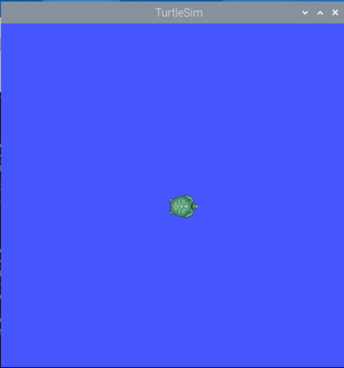
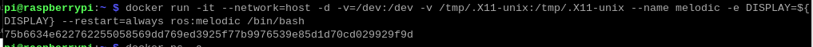
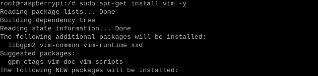
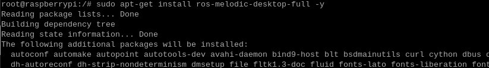

# ROS2基础课程

## 1. ROS2简介和ROS1的对比

### 1.1 ROS2概述

ROS2是第二代的Robot Operating System，是ROS1的升级版本，解决了ROS1存在的一些问题。ROS2最早出现的版本Arden是在2017年，随着版本的迭代，不断地更新优化，现如今已经有了稳定的版本。与ROS1相同，Linux版本与ROS2版本的选择也是有关系的，两者对应的版本如下：

| ROS2版本 | Ubuntu版本  |
|:--------:|:-----------:|
|   Foxy   | Ubuntu20.04 |
| Galactic | Ubuntu20.04 |
|  Humble  | Ubuntu22.04 |

### 1.2 ROS2的特点

(1)  分布式架构：ROS 2采用分布式架构，允许在多个计算机上运行不同的节点。这使得ROS 2系统可以在更大规模的机器人系统中运行，并支持更高级别的并行处理和通信。

(2)  支持多语言：ROS 2支持多种编程语言，包括C++、Python、Java等。这使得开发人员可以使用自己熟悉的语言编写ROS 2应用程序，提高了开发效率和灵活性。

(3)  强化的通信机制：ROS 2引入了一种新的通信机制，称为Data Distribution Service（DDS）。DDS是一种高性能、实时的消息传递协议，可以在ROS 2系统中实现可靠的数据通信。

(4)  系统级别的工具：ROS 2提供了一套系统级别的工具，用于管理和监控ROS 2系统。这些工具包括包管理工具（如Colcon）、日志记录工具（如Rosout）和诊断工具（如Rqt）等，可以帮助开发人员更好地调试和管理机器人应用程序。

(5)  实时性能：ROS 2在设计上考虑了实时性能，并提供了一些实时性能工具和库，如Real-Time Executor（RTE）、Real-Time Publisher（RTPS）等。这使得ROS 2可以在对实时性能要求较高的应用场景中使用。

(6)  易于扩展和集成：ROS 2支持模块化的架构，允许开发人员方便地添加新的功能和扩展ROS 2系统。此外，ROS 2还与其他常用的机器人软件和库集成，例如Gazebo仿真器和MoveIt机器人运动规划库。

### 1.3 ROS2与ROS1的区别

(1) 平台

ROS1目前来说仅支持在Linux系统中运行使用，常见的是在Ubuntu中搭建使用。而ROS2目前在Ubuntu、Windows甚至嵌入式开发板上都可以搭建使用，平台更加广泛。

(2) 语言

① C++

ROS1的核心是C++03，而ROS2广泛使用C++11.

② Python

ROS1的Python使用版本是Python2，而ROS2使用的Python版本至少是3.5以上，Humble使用的Python版本是3.6。

(3) 中间件

ROS1启动前需要开启roscore，这个master掌握所有的节点之间的通讯，而ROS2则没有，只有一个抽象的中间件接口，通过该接口进行传输数据。目前，此接口的所有实现都基于DDS标准。这使得ROS2能够提供各种优质的Qos服务策略，从而改善不同网络的通信。


(4) 编译命令

ROS1的编译命令是catkin_make，而ROS2的编译命令使用colcon build命令。

如需要进一步开发学习，可以参考官方（https://docs.ros.org/en/rolling/index.html） 的教程。

## 2. ROS2安装方法

:::{Note}
我们的树莓派镜像出厂时已经安装好ROS2环境，这里是测试ROS2是否可以正常使用。
:::

### 2.1 测试步骤（测试已安装的ROS2环境）

(1) 按下“**Ctrl+Alt+T**”，打开命令行终端，在终端输入docker version。如果报错提示docker未找到命令，输入sudo snap install docker安装docker后再输入docker version，就会显示docker版本。


(2) 输入“**ros2 run turtlesim turtlesim_node**”，启动小海龟GUI界面，启动成功即说明ROS2能正常使用。

```bash
ros2 run turtlesim turtlesim_node
```



### 2.2 安装步骤

**如果想自己学习安装配置ROS2的环境，可以参考下方步骤，这里以humble版本为例（需要联网。请到第2章 树莓派5基础操作和配置 第7课 配置网络方法）。**

(1)  按下“**Ctrl+Alt+T**”，打开命令行终端，在终端输入“**docker pull ros:humble**”，下载ROS2镜像，镜像下载需要一些时间，请耐心等待一会。

```bash
docker pull ros:humble
```

(2)  镜像下载完成后，在终端输入“**docker run -it --network=host -d -v=/dev:/dev -v /tmp/.X11-unix:/tmp/.X11-unix --name humble -e DISPLAY=\${DISPLAY} --restart=always ros:humble /bin/bash**”，运行容器并指定名称为 humble。

```bash
docker run -it --network=host -d -v=/dev:/dev -v /tmp/.X11-unix:/tmp/.X11-unix --name humble -e DISPLAY=\${DISPLAY} --restart=always ros:humble /bin/bash
```



(3)  在终端输入“**xhost +**”,开启 X Server 的访问控制。

```bash
xhost +
```


(4)  在终端输入“**docker ps**”查看新创建容器的ID。

```bash
docker ps
```


(5)  在终端输入“**docker exec -it 55ce /bin/bash**”进入容器（容器的ID可以简写，只要是该容器唯一标识即可）。

```bash
docker exec -it 55ce /bin/bash
```

(6)  在终端输入“**useradd -m -s /bin/bash ubuntu**”，创建一个新用户。

```bash
useradd -m -s /bin/bash ubuntu
```

(7)  在终端输入“**passwd ubuntu**”，设置“**ubuntu**”的密码，这里我们设置为“**ubuntu**”输入密码按下之后，需要重新输入一遍密码。

```bash
passwd ubuntu
```


(8)  在终端输入“**usermod -aG sudo ubuntu**”，将新用户 ubuntu 添加sudo ，使其具有超级用户权限。

```bash
usermod -aG sudo ubuntu
```

(9)  在终端输入“**sudo apt-get update -y && sudo apt-get upgrade -y”**，更新可用软件包列表并升级系统上已安装的软件包。

```bash
sudo apt-get update -y && sudo apt-get upgrade -y
```


(10) 在终端输入“**sudo apt-get install vim -y”**，安装 Vim 文本编辑器。

```bash
sudo apt-get install vim -y
```



(11) 在终端输入“**sudo apt-get install ros-humble-desktop-full -y**”，安装 ROS Humble 版本的完整桌面环境。

```bash
sudo apt-get install ros-humble-desktop-full -y
```



(12) 输入“**docker exec -it -u ubuntu -w /home/ubuntu 55ce /bin/bash**”指令，进入容器。（注意：55ce是装有ROS2环境的容器ID）

```bash
docker exec -it -u ubuntu -w /home/ubuntu 55ce /bin/bash
```

(13) 输入“**source /opt/ros/humble/setup.bash**”指令，手动配置ROS2环境。

```bash
source /opt/ros/humble/setup.bash
```

(14) 每一次打开终端都执行（3）步骤加载工作空间，可以在终端输入“**echo “source /opt/ros/humble/setup.bash” \>\> ~/.bashrc**”指令，将该指令写入.bashrc文件中。

```bash
echo "source /opt/ros/humble/setup.bash" >> ~/.bashrc
```

(15) 然后输入“**source ~/.bashrc**”指令，让 **.bashrc** 文件生效。这样就不需要每一次加载工作空间环境。

```bash
source ~/.bashrc
```

(16) 输入“**ros2 run turtlesim turtlesim_node**”，启动小海龟GUI界面，启动成功即说明ROS2安装成功。

```bash
ros2 run turtlesim turtlesim_node
```


## 3. ROS2命令行操作

### 3.1 ROS2文件系统的组成

ROS2文件是由Packages和Manifests（package.xml）组成。

Packages（功能包）是ROS 2软件中的基本单元，它是一组相关的文件和目录的集合，用于组织和管理ROS 2的节点、库和资源等。功能包中包含了节点的源代码、配置文件、消息和服务定义等。

Manifests（package.xml）是功能包的描述文件，用于定义功能包的相关元信息和依赖关系。在ROS 2中，功能包通常包含一个名为package.xml的文件，其中包含有关功能包的元数据信息，如名称、版本、维护者、许可协议和依赖关系等。

Manifest文件（package.xml）在ROS 2中具有重要的作用，它提供了对功能包的描述和管理，使得ROS 2系统能够正确地处理功能包之间的依赖关系，并进行合适的构建和运行。

### 3.2 了解ROS2的基本术语

下表是对ROS2的部分基本术语的解释说明：

<table class="docutils" border="1">
<colgroup>
<col style="width: 30%" />
<col style="width: 69%" />
</colgroup>
<tbody>
<tr>
<td style="text-align: center;"><strong>术语名称</strong></td>
<td style="text-align: center;"><strong>说明</strong></td>
</tr>
<tr>
<td style="text-align: center;">底层通讯层（DDS）</td>
<td style="text-align: left;">提供了高性能、可靠、实时的数据通信和集成能力，为ROS 2的节点之间的消息传递和服务调用提供了基础支持</td>
</tr>
<tr>
<td style="text-align: center;">节点（Node）</td>
<td style="text-align: left;">在ROS中运行的最小处理单元，通常是一个可执行文件。每个节点可使用话题或服务与其它节点进行通信。</td>
</tr>
<tr>
<td style="text-align: center;">消息（Message）</td>
<td style="text-align: left;">是int、float和boolean等数据类型的变量。</td>
</tr>
<tr>
<td style="text-align: center;">话题（Topic）</td>
<td style="text-align: left;">一种单向异步通信机制。通过发布消息到话题或订阅话题的形式，可以在节点之间实现数据的传输。话题的类型由对应消息的类型决定。</td>
</tr>
<tr>
<td style="text-align: center;">发布（Publishing）</td>
<td style="text-align: left;">以与话题内容对应的消息类型发送数据。</td>
</tr>
<tr>
<td style="text-align: center;">发布者（Publishs）</td>
<td style="text-align: left;">为执行发布，发布者节点在主节点上注册自己的话题等多种信息，并向希望订阅的订阅者节点发送消息。</td>
</tr>
<tr>
<td style="text-align: center;">订阅（Subscribing）</td>
<td style="text-align: left;">以与话题内容对应的消息类型接收数据。</td>
</tr>
<tr>
<td style="text-align: center;">订阅者（Subscribers）</td>
<td style="text-align: left;">为执行订阅，订阅者节点在主节点上注册自己的话题等多种信息，并从主节点接收所有发布了此节点需订阅话题的发布者节点的信息。</td>
</tr>
<tr>
<td style="text-align: center;">服务（Services）</td>
<td style="text-align: left;">一种双向同步通信机制。服务客户端请求对应于特定目的任务的服务，服务服务端进行服务响应。</td>
</tr>
<tr>
<td style="text-align: center;"><p>服务服务器</p>
<p>（Service Servers）</p></td>
<td style="text-align: left;">以请求作为输入，响应作为输出的节点。</td>
</tr>
<tr>
<td style="text-align: center;"><p>服务客户端</p>
<p>（Service Clients）</p></td>
<td style="text-align: left;">以响应作为输入，请求作为输出的节点。</td>
</tr>
</tbody>
</table>

### 3.3 了解ROS2的常用文件

下表是对ROS2中部分常用文件的介绍说明：

| **术语名称** | **说明** |
|:--:|:--:|
| urdf文件 | 描述机器人所有元素的模型文件，包含连杆（link）、关节（joint）、运动学参数（axis）、动力学参数（dynamics）、可视化模型（visual）和碰撞检测模型（collision）。 |
| srv文件 | 存放在srv文件夹下，用于定义ROS服务消息，包含请求和响应两个部分，请求与响应之间使用符号“---”进行分隔。 |
| msg文件 | 存放在msg文件夹下，用于定义ROS话题消息。 |
| package.xml | 描述功能包的属性，包含功能包的名字、版本号、作者等。 |
| CmakeLists.txt | 编译配置文件，使用Cmake编译。 |
| launch文件 | 启动文件，包含系统性启动机器人所需的node和services。 |

### 3.4 了解常用命令

(1) 包管理工具

ros2 pkg有create、executables、list、prefix、xml共5个命令。

|       **命令**       |                   **详细说明**                   |
|:--------------------:|:------------------------------------------------:|
|   ros2 pkg create    | 创建功能包，指定包名、编译方式、依赖项、节点名等 |
|    ros2 pkg list     |               查看系统中功能包列表               |
| ros2 pkg executables |              查看包内可执行文件列表              |
|   ros2 pkg prefix    |           查看指定功能包的安装路径前缀           |
|     ros2 pkg xml     |      查看指定功能包的 package.xml 文件内容       |

(2) 节点运行工具

ros2 run的功能是运行包内节点，格式为：“**ros2 run \<package_name\> \<node_name\>**”，如：


(3) 节点查看工具

ros2 node命令用于查看节点消息。

|    **命令**    |                        **详细说明**                        |
|:--------------:|:----------------------------------------------------------:|
| ros2 node list |  查看当前域内（ROS_DOMAIN_ID相同的节点组）活动的节点列表   |
| ros2 node info | 查看节点详细信息，包括订阅、发布的消息，开启的服务和动作等 |

(4) 主题操作工具

ros2 topic命令是用于对ROS2中的话题进行操作。

|     **命令**     |                **详细说明**                |
|:----------------:|:------------------------------------------:|
| ros2 topic list  |          列出域内可使用的主题列表          |
| ros2 topic info  | 显示主题消息类型、订阅者数量、发布者数量等 |
| ros2 topic type  |              查看主题消息类型              |
| ros2 topic find  |           按消息类型查找相关主题           |
|  ros2 topic hz   |            显示主题平均发布频率            |
|  ros2 topic bw   |            显示所查阅主题的带宽            |
| ros2 topic delay |      通过header中的时间戳计算消息延迟      |
| ros2 topic echo  |            在控制台显示主题消息            |
|  ros2 topic pub  |         通过命令行发布指定主题消息         |

(5) 接口操作工具

ros2 interface指令是用于对ROS2中的接口进行操作。

| **命令** | **详细说明** |
|:--:|:--:|
| ros2 interface list | 显示系统内所有的接口，包括消息（Messages）、服务（Services）、动作（Actions） |
| ros2 interface package | 显示指定接口包内的子接口 |
| ros2 interface packages | 显示指定接口包 |
| ros2 interface show | 显示指定接口的详细内容 |
| ros2 interface proto | 显示消息模板 |

## 4. ROS2开发环境配置

:::{Note}
我们的树莓派镜像出厂时已经安装好配置好开发环境，这里只供学习参考。
:::

在后续学习和开发程序时，我们可以通过优化开发环境和安装插件来提高效率。

### 4.1 调整分辨率

(1)  按下“**Ctrl+Alt+T**”，打开命令行终端，输入“**sudo raspi-config**”命令，然后按下回车。

```bash
sudo raspi-config
```

(2)  在该界面使用“↑↓”箭头选择，“**Enter**”回车键用于确定，“**Esc**”键用于返回上一级。


(3)  选择“**2 Display Options**”，然后按下“Enter”回车键确定。


(4)  选择“**D3 VNC Resolution**”，然后按下“Enter”回车键确定。


(5)  选择“**1920\*1080**”，然后选择“**\<Select\>**”，按下“Enter”回车键确定。


(6)  修改完后会重启树莓派，重新进入树莓派后即可完成修改。

### 4.2 更换软件源

我们从 DockerHub 上拉取镜像、创建容器以实现各种各样的功能。但是由于大部分的 Docker 镜像都是默认国外的软件源，下载更新非常慢，更改 Docker 容器国内软件源，即可提高下载更新速度。

(1)  点击左上角的logo，选择System Tools →Terminator。


(2)  输入以下指令，按下回车键即可换回国内的清华源。

```bash
echo -e "deb https://mirrors.tuna.tsinghua.edu.cn/debian/ buster main contrib non-free\ndeb

https://mirrors.tuna.tsinghua.edu.cn/debian/ buster-updates main contrib non-free\ndeb

https://mirrors.tuna.tsinghua.edu.cn/debian/ buster-backports main contrib non-free\ndeb

https://mirrors.tuna.tsinghua.edu.cn/debian-security buster/updates main contrib non-free" >> sources.list
```


(3)  输入“sudo apt update”指令，更新软件源即可。

```bash
sudo apt update
```

### 4.3 便携工具使用

在后续的ROS开发，需要同时开启多个终端，在这个时候就需要terminator工具。

(1)  点击左上角的logo，选择System Tools →Terminator。


(2)  输入“**docker exec -it -u ubuntu -w /home/ubuntu 1318 /bin/bash**”进入容器。

```bash
docker exec -it -u ubuntu -w /home/ubuntu 1318 /bin/bash
```

每次进入容器之前都需要输入在terminator终端输入指令，这就很麻烦，可以在terminator工具里面设置进入容器的指令。

(3)  在terminator窗口右键，选择“**Preference**”点击。


(4)  选择**Profiles→Command**。


(5)  在方框内“**√**”中，输入“**docker exec -it -u ubuntu -w /home/ubuntu 1318 /bin/bash**”进入容器的指令。（注意：1318是装有ros2环境的容器ID）


(6)  然后点击关闭，这样每次开启terminal，可以直接进入装ros2环境的容器内。


### 4.4 Tree工具安装

Tree 工具是一个命令行工具，用于以树状结构显示目录和文件的层次结构。它可以帮助用户以清晰的方式查看文件系统中的目录结构，包括文件和子目录。

(1)  点击左上角的logo，选择System Tools →Terminator。


(2)  输入“sudo apt-get install tree”指令，即可对tree工具进行安装。

```bash
sudo apt-get install tree
```

(3)  安装成功后，输入“**tree -L 1**”，即可对当前文件夹的一级目录结构进行显示。


<p id="anchor_4_5"></p>

### 4.5 pip 软件包安装

python3-pip 是 Python 3 的包管理工具 pip 的一个软件包。pip 是 Python 的官方包管理工具，用于安装、升级和管理 Python 包。

输入“sudo apt-get install python3-pip”即可进行安装。

```bash
sudo apt-get install python3-pip
```

### 4.6 transforms3d库安装

transforms3d 是一个 Python 库，用于进行三维变换和旋转矩阵的计算。它提供了一组函数和类，用于在三维空间中执行各种变换操作，如旋转、平移和缩放。transforms3d 库具有简单易用的接口，可以用于处理 3D 图形、机器人运动学、计算机视觉等领域。它支持多种常见的旋转表示方式，如欧拉角、四元数和旋转矩阵，并提供了转换函数，可以在这些表示之间进行转换。

输入“sudo pip3 install transforms3d”即可进行安装。

```bash
sudo pip3 install transforms3d
```

:::{Note}
安装transforms3d库请先安装[4.5 pip 软件包安装](#anchor_4_5)。
:::

### 4.7 turtle-tf2-py和tf2-tools库安装

turtle-tf2-py 和 tf2-tools 是 ROS（机器人操作系统）的两个软件包，用于在 Python 中使用 TF2（Transform Library）进行坐标变换的相关功能。

turtle-tf2-py 是一个 ROS 软件包，它为 Python 提供了一个轻量级的 TF2 客户端库，可以方便地在 ROS 中进行坐标变换操作。通过使用 ros-humble-turtle-tf2-py，你可以监听坐标变换、查询坐标变换、执行坐标变换等操作。

tf2-tools 是另一个 ROS 软件包，它提供了一些与 TF2 相关的实用工具。其中包含了一些常用的功能，如坐标变换的插值、坐标变换的发布和监听、坐标系的可视化等。

输入“**sudo apt install ros-humble-turtle-tf2-py ros-humble-tf2-tools**”即可进行安装。（humble为ROS2的版本号）

```bash
sudo apt install ros-humble-turtle-tf2-py ros-humble-tf2-tools
```

### 4.8 Gazebo安装

Gazebo是一个功能强大的开源三维机器人模拟软件,它可以帮助我们在计算机上快速地创建和测试各种真实世界场景。Gazebo内置了精确的物理引擎来模拟各种动态对象在场景中的交互,如地心引力、摩擦力等影响。它同时提供出色的三维可视化效果,我们可以通过视觉客户端清晰地看到模拟过程。最重要的是,Gazebo与ROS完美集成,我们可以直接在其中开发和测试ROS节点,将仿真代码轻松移植到实体机器人上。

输入“**sudo apt-get install ros-humble-ros-gz**”即可进行安装。（humble为ROS2的版本号）

```bash
sudo apt-get install ros-humble-ros-gz
```

## 5. ROS2工作空间

### 5.1 工作空间简介

在ROS机器人开发中，我们针对机器人某些功能进行开发时，各种编写的代码、参数、脚本等文件，需要放置在某一个文件夹里进行管理，这个文件夹在ROS系统中就叫做工作空间。所以工作空间是一个存放项目开发相关文件的文件夹，也是开发过程中存放所有资料的大本营。

### 5.2 创建和编译工作空间

(1)  点击左上角的logo，选择System Tools →Terminator。


(2)  在命令行终端输入“**docker ps**”，显示当前正在运行的容器。

```bash
docker ps
```


(3)  输入“**docker exec -it -u ubuntu -w /home/ubuntu 55ce /bin/bash**”（容器的ID可以简写，只要是该容器唯一标识即可）指令，进行正在装有ros2的容器中。

```bash
docker exec -it -u ubuntu -w /home/ubuntu 55ce /bin/bash
```


(4)  输入“**mkdir -p ~/hiwonder_ws/src**”指令，创建一个叫“**hiwonder_ws**”的工作空间。

```bash
mkdir -p ~/hiwonder_ws/src
```


(5)  输入“**cd hiwonder_ws**”指令，切换到“**hiwonder_ws**”的工作空间。

```bash
cd hiwonder_ws
```

(6)  输入“**colcon build**”指令，对工作空间进行编译。

```bash
colcon build
```


(7)  输入“**source ~/hiwonder_ws/install/setup.bash**”指令，在ROS2中加载工作空间环境。

```bash
source ~/hiwonder_ws/install/setup.bash
```

(8)  每一次打开都执行7）步骤加载工作空间，可以在终端输入 “**echo “source ~/hiwonder_ws/install/setup.bash” \>\> ~/.bashrc**”指令，将该指令写入.bashrc文件中。

```bash
echo "source ~/hiwonder_ws/install/setup.bash" >> ~/.bashrc
```

(9)  然后输入“source ~/.bashrc”指令，让 **.bashrc** 文件生效。这样就不需要每一次加载工作空间环境。

```bash
source ~/.bashrc
```

### 5.3 工作空间介绍

编译完成后，可以输入“**tree -L 1**”指令，查看工作空间的根目录。

```bash
tree -L 1
```


ROS系统中一个典型的工作空间结构如上所示，这个hiwonder_ws就是工作空间的根目录，里边会有四个子目录，或者叫做四个子空间。

| **名字** | **含义** |                    **详细说明**                    |
|:--------:|:--------:|:--------------------------------------------------:|
|  build   | 编译空间 |            保存编译过程中产生的中间文件            |
| install  | 安装空间 |           放置编译得到的可执行文件和脚本           |
|   log    | 日志空间 | 编译和运行过程中，保存各种警告、错误、信息等日志。 |
|   src    | 代码空间 |   未来编写的代码、脚本，都需要人为地放置到这里。   |

总体来讲，这四个空间的文件夹，我们绝大部分操作都是在src中进行的，编译成功后，就会执行install里边的结果，build和log两个文件夹用的很少。

此外，工作空间的名称是可以自定义，且数量也不是唯一的，比如：

工作空间1：hiwonder_ws_a, 用于A机器人的开发

工作空间2：hiwonder_ws_b, 用于B机器人的开发

工作空间3：hiwonder_ws_c, 用于C机器人的开发

以上情况是完成允许的，就像是在集成开发环境中创建了多个新工程一样，都是并列存在的关系。

## 6. ROS2功能包

### 6.1 功能包简介

每个机器人可能有很多功能，比如移动控制、视觉感知、自主导航等，如果我们把这些功能的源码都放在一起当然也是可以的，但是当我们想把其中某些功能分享给别人时，就会发现代码都混合到了一起，很难拆分出来。

功能就是这个原理，我们把不同功能的代码划分到不同的功能包中，尽量降低他们之间的耦合关系，当需要在ROS社区中分享给别人的时候，只需要说明这个功能包该如何使用，别人很快就可以用起来了。

所以功能包的机制，是提高ROS中软件复用率的重要方法之一。

### 6.2 创建和编译功能包

(1)  点击左上角的logo，选择System Tools →Terminator。


(2)  输入“**cd hiwonder_ws/src/**”指令，切换到hiwonder_ws工作空间的src文件夹中。

```bash
cd hiwonder_ws/src/
```

(3)  输入“**ros2 pkg create hello_world_demo --build-type ament_python --dependencies rclpy --node-name hello_world**”并按下回车，创建一个名为“**hello_world_demo**”的功能包，添加依赖关系rclpy，并生成一个名为“**hello_world**”的执行程序。

```bash
ros2 pkg create hello_world_demo --build-type ament_python --dependencies rclpy --node-name hello_world
```

(4)  输入“**cd ~/hiwonder_ws**”指令，切换到工作空间的根目录。

```bash
cd ~/hiwonder_ws
```

(5)  输入“**colcon build**”指令，对工作空间的功能包进行编译。

```bash
colcon build
```

(6)  编译完成后，输入进入功能包所在目录的指令“**cd src/hello_world_demo/**”，并按下回车，验证功能包是否创建成功。

```bash
cd src/hello_world_demo/
```

### 6.3 功能包介绍

编译完成后，可以输入“**tree -L 1**”指令，查看工作空间的根目录。

```bash
tree -L 1
```


ROS系统中一个典型的功能包结构如上所示，这个hello_world_demo就是功能包的根目录，里边会有6个文件或子目录。

|     **名字**     |               **详细说明**               |
|:----------------:|:----------------------------------------:|
| hello_world_demo |     功能包同名目录：Python源文件目录     |
|   package.xml    | 包的信息，比如：包名、版本、作者、依赖性 |
|     resource     |                 资源目录                 |
|    setup.cfg     |            功能包基本配置文件            |
|     setup.py     |     与C++功能包的CMakeLists.txt类似      |
|       test       |             存储测试相关文件             |

## 7. ROS2节点

### 7.1 节点简介

在通信时，不论采用何种方式，通信对象的构建都依赖于节点（Node），在ROS2中，一般情况下每个节点都对应某一单一的功能模块（例如：雷达驱动节点可能负责发布雷达消息，摄像头驱动节点可能负责发布图像消息）。一个完整的机器人系统可能由许多协同工作的节点组成，ROS2中的单个可执行文件（C++程序或python程序）可以包含一个或多个节点。

### 7.2 创建节点

(1)  点击左上角的logo，选择System Tools →Terminator。


(2)  输入指令“**cd hiwonder_ws/src/hello_world_demo/hello_world_demo**”，回车，切换到“**hello_world_demo**”功能包的路径下。

```bash
cd hiwonder_ws/src/hello_world_demo/hello_world_demo
```

(3)  输入指令“**vim hello_world.py**”编辑程序，复制下面程序。如需修改，再按下“**i**”即可修改。修改完成，按下“**Esc**”，输入“**：wq**”保存并退出。

```bash
vim hello_world.py
```

```python
import rclpy

from rclpy.node import Node

import time

class HelloWorldNode(Node):

    def __init__(self):

        # 调用基类 Node 的构造函数，设置节点名称

        super().\_\_init\_\_('hello_world_demo')

    def run(self):
    
        # 在 ROS2 系统正常运行的情况下执行循环
        
        while rclpy.ok():
        
            # 打印 "Hello World" 到节点的日志
            
            self.get_logger().info('Hello World')
            
            # 休眠 0.5 秒，控制循环时间
            
            time.sleep(0.5)

    def main(args=None):
    
        # 初始化 ROS2 Python 接口
        
        rclpy.init(args=args)
        
        # 创建 HelloWorldNode 实例
        
        node = HelloWorldNode()
        
        try:
        
            # 运行节点的主循环
            
            node.run()
        
        except KeyboardInterrupt:
        
            pass
        
        finally:
        
            # 销毁节点对象
            
            node.destroy_node()
            
            # 关闭 ROS2 Python 接口
            
            rclpy.shutdown()

if __name__ == '__main__':

    # 执行主函数
    
    main()
```


(4)  输入指令“**chmod +x hello_world.py**”，并按下回车，为保存的hello_world.py赋予可执行权限。

```bash
chmod +x hello_world.py
```

### 7.3 编译运行

(1)  赋予可执行权限后，输入“**cd ~/hiwonder_ws/**”指令，切换到工作空间的目录。

```bash
cd ~/hiwonder_ws/
```

(2)  输入“**colcon build**”指令，并按下回车，编译工作空间中的功能包。

```bash
colcon build
```

(3)  再输入指令“**source ./install/setup.bash**”，并按下回车，让环境变量生效。

```bash
source ./install/setup.bash
```

(4)  输入指令“**ros2 run hello_world_demo hello_world**”，并按下回车，启动hello_world节点。

```bash
ros2 run hello_world_demo hello_world
```


### 7.4 程序分析

创建了一个名为HelloWorldNode的节点，并在节点的主循环中以0.5秒的间隔打印"Hello World"到节点的日志中。在程序运行时，首先会初始化ROS2 Python接口，然后创建节点实例并运行其主循环。当程序被中断时，将销毁节点对象并关闭ROS2 Python接口。

(1) 主函数


首先调用rclpy.init()对ROS2 Python接口进行初始化，然后实例化HelloWorldNode，然后执行node.run()函数。

(2) HelloWorldNode类


首先创建了一个名为HelloWorldNode的节点，run()函数里面在在节点的主循环中以0.5秒的间隔打印"Hello World"到节点的日志中。

## 8. ROS2话题

### 8.1 话题通信简介

话题通信是ROS2视频频率最高的一种通信方式，有发布者发布指定话题的数据，订阅者只要订阅了该话题的数据，就可以接收到数据。

话题通信是基于发布/订阅模型，如图：


话题数据传输的特性是从一个节点到另外一个节点，发送数据的对象称之为发布者，接收数据的对象称之为订阅者，每一个话题都需要一个名字，传输的数据也需要有固定的数据类型。

### 8.2 创建话题

- #### 8.2.1 创建发布者

(1)  点击左上角的logo，选择System Tools →Terminator。


(2)  输入“**cd hiwonder_ws/src/**”指令，切换到hiwonder_ws工作空间的src文件夹中。

```bash
cd hiwonder_ws/src/
```

(3)  输入“**ros2 pkg create topic_demo --build-type ament_python --dependencies rclpy**”并按下回车，创建一个名为“**topic_demo**”的功能包，添加依赖关系rclpy。

```bash
ros2 pkg create topic_demo --build-type ament_python --dependencies rclpy
```

(4)  输入“**cd topic_demo/topic_demo/**”指令，切换到topic_demo功能包下。

```bash
cd topic_demo/topic_demo/
```

(5)  输入指令“**vim topic_pub.py**”编辑程序，复制下面程序。如需修改，再按下“**i**”即可修改。修改完成，按下“**Esc**”，输入“**：wq**”保存并退出。

```bash
vim topic_pub.py
```

```python
import rclpy

from rclpy.node import Node

from std_msgs.msg import String

# 定义一个继承自Node的MinimalPublisher类

class MinimalPublisher(Node):

    # 类的初始化方法
    
    def __init__(self):

        # 调用Node类的初始化方法，设置节点名称为'minimal_publisher'
        
        super().__init__('minimal_publisher')
        
        # 创建一个发布者，发布String类型消息到'topic'，队列大小为10
        
        self.publisher_ = self.create_publisher(String, 'topic', 10)
        
        # 创建一个定时器，每0.5秒触发一次timer_callback方法
        
        timer_period = 0.5 # 秒
        
        self.timer = self.create_timer(timer_period, self.timer_callback)
        
        # 计数器，用于生成消息中的数字
        
        self.i = 0

    # 定义定时器回调函数
    
    def timer_callback(self):

        # 创建一个String类型的消息
        
        msg = String()
        
        # 设置消息数据为'Hello World: 数字'
        
        msg.data = 'Hello World: %d' % self.i
        
        # 发布消息
        
        self.publisher_.publish(msg)
        
        # 计数器自增
        
        self.i += 1

    # 主函数
    
    def main(args=None):
    
        # 初始化ROS 2节点
        
        rclpy.init(args=args)
        
        # 创建MinimalPublisher对象
        
        minimal_publisher = MinimalPublisher()
        
        # 进入ROS 2节点的事件循环
        
        rclpy.spin(minimal_publisher)
        
        # 销毁节点对象
        
        minimal_publisher.destroy_node()
        
        # 关闭ROS 2节点
        
        rclpy.shutdown()

# 如果该脚本是主程序，则执行main函数

if __name__ == '__main__':

    main()
```


(6)  输入指令“**chmod +x topic_pub.py**”，并按下回车，为保存的topic_pub.py赋予可执行权限。

```bash
chmod +x topic_pub.py
```

- #### 8.2.2 创建订阅者

(1)  输入指令“**vim topic_sub.py**”编辑程序，复制下面程序。如需修改，再按下“**i**”即可修改。修改完成，按下“**Esc**”，输入“**：wq**”保存并退出。

```bash
vim topic_sub.py
```

```python
import rclpy

from rclpy.node import Node

from std_msgs.msg import String

# 定义一个继承自Node的MinimalSubscriber类

class MinimalSubscriber(Node):

    # 类的初始化方法
    
    def __init__(self):

        # 调用Node类的初始化方法
        
        super().__init__('minimal_subscriber')
        
        # 创建一个订阅者，订阅名为'topic'的String类型消息，回调函数为listener_callback，队列大小为10
        
        self.subscription = self.create_subscription(String, 'topic', self.listener_callback, 10)

    # 定义消息回调函数
    
    def listener_callback(self, msg):
    
        # 获取日志记录器并打印收到的消息
        
        self.get_logger().info('I heard: "%s"' % msg.data)

    # 主函数
    
    def main(args=None):
    
        # 初始化ROS 2节点
        
        rclpy.init(args=args)
        
        # 创建MinimalSubscriber对象
        
        minimal_subscriber = MinimalSubscriber()
        
        # 进入ROS 2节点的事件循环
        
        rclpy.spin(minimal_subscriber)
        
        # 销毁节点对象
        
        minimal_subscriber.destroy_node()
        
        # 关闭ROS 2节点
        
        rclpy.shutdown()

# 如果该脚本是主程序，则执行main函数

if __name__ == '__main__':

    main()
```


(2)  输入指令“**chmod +x topic_sub.py**”，并按下回车，为保存的topic_sub.py赋予可执行权限。

```bash
chmod +x topic_sub.py
```

### 8.3 setup.py文件设置

setup.py文件是定义一个ROS2包的远数据和构建配置，提供了包的元数据、依赖关系、构建配置和安装逻辑等信息，可以帮助开发者正确构建、安装和使用ROS2包。需要将**topic_pub.py**和**topic_sub.py**的程序入口写到setup.py文件中。

(1)  输入“**cd ..**”指令，切换到上一级目录。

```bash
cd ..
```

(2)  输入“**vim setup.py**”指令，并按下回车，打开setup.py文件。

```bash
vim setup.py
```

(3)  按下“i”键进入可编辑模式，输入以下代码到相应的位置上。

```bash
'topic_pub = topic_demo.topic_pub:main',

'topic_sub = topic_demo.topic_sub:main'
```


(4)  然后输入“:wq”，保存并退出文件。

```bash
:wq
```

<p id="anchor_8_4"></p>

### 8.4 编译运行

(1)  赋予可执行权限后，输入“**cd ~/hiwonder_ws/**”指令，切换到工作空间的目录。

```bash
cd ~/hiwonder_ws/
```

(2)  输入“**colcon build**”指令，并按下回车，编译工作空间中的功能包。

```bash
colcon build
```

(3)  再输入指令“**source ./install/setup.bash**”，并按下回车，让环境变量生效。

```bash
source ./install/setup.bash
```

(4)  输入指令“**ros2 run topic_demo topic_pub**”，并按下回车，启动topic_pub话题发布节点。

```bash
ros2 run topic_demo topic_pub
```

(5)  鼠标右键，选择“**Split Vertically**”点击，新建一个新的终端窗口。


(6)  输入指令“**ros2 run topic_demo topic_sub**”，并按下回车，启动topic_sub话题发布节点。

```bash
ros2 run topic_demo topic_sub
```


### 8.5 程序分析

- #### 8.5.1 话题发布

创建了一个名为minimal_publisher的发布者，该发布者每0.5秒发布一个带有递增数字的消息到topic话题。在程序运行时，首先会初始化ROS2节点，然后创建MinimalPublisher对象并进入ROS 2节点的事件循环。当程序被中断时，会销毁节点对象并关闭ROS 2节点。

(1) 主函数


首先调用rclpy.init()对ROS2 Python接口进行初始化，然后实例化MinimalPublisher()，然后在ROS2节点的事件循环执行minimal_publisher。

(2) MinimalPublisher类


首先创建了一个名为minimal_publisher的节点，然后创建一个名为publisher_的发布者，timier_callback()回调函数里面以0.5秒的间隔打印带有递增数字的消息到节点的日志中。

- #### 8.5.2 话题订阅

创建了一个名为minimal_sublisher的订阅者，该订阅者打印订阅的消息到日志记录器。在程序运行时，首先会初始化ROS2节点，然后创建MinimalSublisher对象并进入ROS 2节点的事件循环。当程序被中断时，会销毁节点对象并关闭ROS 2节点。

(1) 主函数


首先调用rclpy.init()对ROS2 Python接口进行初始化，然后实例化MinimalSublisher()，然后在ROS2节点的事件循环执行minimal_sublisher。

(2) MinimalSublisher类


首先创建了一个名为minimal_sublisher的节点，然后创建一个名为subscription的订阅者，listener_callback()回调函数里面打印订阅到的消息内容到日志记录器上。

### 8.6 自定义接口

topic_pub.py和topic_pub.py都使用了ROS2官方的接口。


虽然使用预定义的接口定义是一种很好的做法，但有时可能还需要定义自己的消息和服务。接下来演示如何创建自定义接口定义的方法。

(1)  输入“**cd ~/hiwonder_ws/src/**”指令，切换到hiwonder_ws工作空间的src文件夹中。

```bash
cd ~/hiwonder_ws/src/
```

(2)  输入“**ros2 pkg create demo_interfaces --build-type ament_cmake --dependencies rclcpp** ”并按下回车，创建一个名为“**demo_interfaces**”的功能包。

```bash
ros2 pkg create demo_interfaces --build-type ament_cmake --dependencies rclcpp
```

(3)  输入“**cd demo_interfaces**”指令，进入自定义接口的功能包。

```bash
cd demo_interfaces
```

(4)  输入“**mkdir msg**”指令，创建文件夹。

```bash
mkdir msg
```

(5)  输入“**cd msg**”指令，进入msg文件夹。

```bash
cd msg
```

(6)  输入指令“**vim String.msg**”编辑程序，输入“**string data**”。如需修改，再按下“**i**”即可修改。修改完成，按下“**Esc**”，输入“**:wq**”保存并退出。

```bash
vim String.msg
```


(7)  先输入“cd ..”返回上一级文件夹，再输入“vim CMakeLists.txt”，复制下面程序，在下图所示位置添加代码。如需修改，再按下“i”即可修改。修改完成，按下“Esc”，输入“：wq”保存并退出。

```bash
cd ..
```

```python
find_package(rosidl_default_generators REQUIRED)
rosidl_generate_interfaces( ${PROJECT_NAME}
"msg/String.msg"
)
```


(8)  再输入“**vim package.xml**”，复制下面程序，在下图所示位置添加代码。如需修改，再按下“i”即可修改。修改完成，按下“Esc”，输入“：wq”保存并退出。

```bash
vim package.xml
```

```xml
<build_depend>rosidl_default_generators</build_depend>
<exec_depend>rosidl_default_runtime</exec_depend>
<member_of_group>rosidl_interface_packages</member_of_group>
```


(9)  参考[4.编译运行](#anchor_8_4)的1）、2）、3）步骤，对工作空间进行编译。

(10) 将红色方框内的代码修改成“**from demo_interfaces.msg import String**”语句，即可完成自定义消息的使用，实现效果与原来的一致。

```bash
from demo_interfaces.msg import String
```


## 9. ROS2服务说明

### 9.1 服务通讯简介

服务通讯是一种基于请求响应的通信模型，在通信双方中，客户端发送请求数据到服务端，服务端相应结果给客户端。


从服务的实现机制上来看，这种你问我答的形式叫做客户端/服务器模型，简称为CS模型，客户端在需要某些数据的时候，针对某个具体的服务，发送请求信息。服务器端收到请求之后，就会进行处理并反馈应答信息。

这种通信机制在生活中也很常见，比如我们经常浏览的各种网页，此时你的电脑浏览器就是客户端，通过域名或者各种操作，向网站服务器发送请求，服务器收到之后返回需要展现的页面数据。

### 9.2 创建接口

(1)  点击左上角的logo，选择System Tools →Terminator。


(2)  输入“**cd hiwonder_ws/src/demo_interfaces/**”指令，切换到demo_interfaces功能包中。

```bash
cd hiwonder_ws/src/demo_interfaces/
```

(3)  输入“**mkdir srv**”指令，创建srv文件夹。

```bash
mkdir srv
```

(4)  输入“**cd srv**”指令，进入srv文件夹。

```bash
cd srv
```

(5)  输入指令“**vim AddInts.srv**”编辑程序，输入以下代码。如需修改，再按下“**i**”即可修改。修改完成，按下“**Esc**”，输入“**：wq**”保存并退出。

```bash
vim AddInts.srv
```

```srv
int32 num1

int32 num2

---

int32 sum
```


(6)  先输入“**cd ..**”返回上一级文件夹，再输入“**vim CMakeLists.txt**”，复制下面程序，在下图所示位置添加代码。如需修改，再按下“i”即可修改。修改完成，按下“**Esc**”，输入“**：wq**”保存并退出。

```bash
cd ..
```

```bash
    find_package(rosidl_default_generators REQUIRED)
    rosidl_generate_interfaces( ${PROJECT_NAME}
    "msg/String.msg"
    "srv/AddInts.srv"
    )
```


### 9.3 创建服务

- #### 9.3.1 创建服务端

(1)  点击左上角的logo，选择System Tools →Terminator。


(2)  输入“**cd hiwonder_ws/src/**”指令，切换到hiwonder_ws工作空间的src文件夹中。

```bash
cd hiwonder_ws/src/
```

(3)  输入“**ros2 pkg create service_demo --build-type ament_python --dependencies rclpy**”并按下回车，创建一个名为“**service_demo**”的功能包，添加依赖关系rclpy。

```bash
ros2 pkg create service_demo --build-type ament_python --dependencies rclpy
```

(4)  输入“**cd service_demo/service_demo/**”指令，切换到service_demo功能包下。

```bash
cd service_demo/service_demo/
```

(5)  输入指令“**vim service_server.py**”编辑程序，复制下面程序。如需修改，再按下“**i**”即可修改。修改完成，按下“**Esc**”，输入“**：wq**”保存并退出。

```bash
vim service_server.py
```

```python
import rclpy

from rclpy.node import Node

from demo_interfaces.srv import AddInts

# 定义一个继承自Node的MinimalService类

class MinimalService(Node):

    # 类的初始化方法
    
    def __init__(self):
    
        # 调用Node类的初始化方法，设置节点名称为'minimal_service'
        
        super().__init__('minimal_service')
        
        # 创建一个服务，提供AddInts类型的服务，服务名称为'add_two_ints'，回调函数为add_two_ints_callback
        
        self.srv = self.create_service(AddInts, 'add_two_ints', self.add_two_ints_callback)

    # 定义服务回调函数
    
    def add_two_ints_callback(self, request, response):
    
        # 在日志中记录接收到的请求的num1和num2
        
        self.get_logger().info('Incoming request\nnum1: %d num2: %d' % (request.num1, request.num2))
        
        # 计算并设置响应的sum字段
        
        response.sum = request.num1 + request.num2
        
        # 返回响应
        
        return response

    # 主函数
    
    def main():
        
        # 初始化ROS 2节点
        
        rclpy.init()
        
        # 创建MinimalService对象
        
        minimal_service = MinimalService()
        
        # 进入ROS 2节点的事件循环
        
        rclpy.spin(minimal_service)
        
        # 关闭ROS 2节点
        
        rclpy.shutdown()

# 如果该脚本是主程序，则执行main函数

if __name__ == '__main__':

    main()
```


(6)  输入指令“**chmod +x service_server.py**”，并按下回车，为保存的service_server.py赋予可执行权限。

```bash
chmod +x service_server.py
```

- #### 9.3.2 创建客户端

(1)  输入指令“**vim service_client.py**”编辑程序，复制下面程序。如需修改，再按下“**i**”即可修改。修改完成，按下“**Esc**”，输入“**：wq**”保存并退出。

```bash
vim service_client.py
```

```python
import sys

import rclpy

from rclpy.node import Node

from rclpy.logging import get_logger

from demo_interfaces.srv import AddInts

# 定义一个继承自Node的MinimalClient类

class MinimalClient(Node):

    # 类的初始化方法
    
    def __init__(self):
    
        # 调用Node类的初始化方法，设置节点名称为'minimal_client'
        
        super().__init__('minimal_client')
        
        # 创建一个服务客户端，连接到名为'add_two_ints'的AddInts服务
        
        self.cli = self.create_client(AddInts, 'add_two_ints')
        
        # 等待服务连接，最多等待1秒
        
        while not self.cli.wait_for_service(timeout_sec=1.0):
        
            self.get_logger().info('service is connecting...')

    # 发送服务请求的方法
    
    def send_request(self):
    
        # 创建一个AddInts请求对象
        
        request = AddInts.Request()
        
        # 从命令行参数中获取两个整数，并设置到请求对象中
        
        request.num1 = int(sys.argv[1])
        
        request.num2 = int(sys.argv[2])
        
        # 异步调用服务，并获取一个Future对象
        
        self.future = self.cli.call_async(request)

    # 主函数
    
    def main():
    
        # 检查命令行参数是否包含两个整数
        
        if len(sys.argv) != 3:
        
            get_logger("rclpy").error("请提供两个整数值")
            
            return

        # 初始化ROS 2节点
        
        rclpy.init()
        
        # 创建MinimalClient对象
        
        minimal_client = MinimalClient()
        
        # 发送服务请求
        
        minimal_client.send_request()
        
        # 阻塞等待服务调用完成
        
        rclpy.spin_until_future_complete(minimal_client, minimal_client.future)
        
        try:
        
            # 获取服务调用的响应
            
            response = minimal_client.future.result()
            
            # 打印响应结果
            
            minimal_client.get_logger().info("请求结果：sum = %d" % response.sum)
        
        except Exception:
        
            # 打印请求失败的错误信息
            
            minimal_client.get_logger().error("请求失败")
            
        # 销毁节点对象
        
        minimal_client.destroy_node()
        
        # 关闭ROS 2节点
        
        rclpy.shutdown()

# 如果该脚本是主程序，则执行main函数

if __name__ == '__main__':

    main()
```


(2)  输入指令“**chmod +x service_client.py**”，并按下回车，为保存的service_client.py赋予可执行权限。

```bash
chmod +x service_client.py
```

### 9.3.4 setup.py文件设置

setup.py文件是定义一个ROS2包的远数据和构建配置，提供了包的元数据、依赖关系、构建配置和安装逻辑等信息，可以帮助开发者正确构建、安装和使用ROS2包。需要将service_client.py和service_server.py的程序入口写到setup.py文件中。

(1)  输入“**cd ..**”指令，切换到上一级目录。

```bash
cd ..
```

(2)  输入“**vim setup.py**”指令，并按下回车，打开setup.py文件。

```bash
vim setup.py
```

(3)  按下“i”键进入可编辑模式，输入以下代码到相应的位置上。

```python
'service_server = service_demo.service_server:main',
'service_client = service_demo.service_client:main'
```


(4)  然后输入“:wq”，保存并退出文件。

### 9.3.5 编译运行

(1)  赋予可执行权限后，输入“**cd ~/hiwonder_ws/**”指令，切换到工作空间的目录。

```bash
cd ~/hiwonder_ws/
```

(2)  输入“**colcon build**”指令，并按下回车，编译工作空间中的功能包。

```bash
colcon build
```

(3)  再输入指令“**source ./install/setup.bash**”，并按下回车，让环境变量生效。

```bash
source ./install/setup.bash
```

(4)  输入指令“**ros2 run service_demo service_server**”，并按下回车，启动service_server服务端。

```bash
ros2 run service_demo service_server
```

(5)  鼠标右键，选择“**Split Vertically**”点击，新建一个新的终端窗口。


(6)  输入指令“**ros2 run service_demo service_client 1 2**”，并按下回车，启动**service_client**客户端发送数字1 和数字2的运算请求，服务端收到数字1和数字2的运算请求后，将运算后的结果发送给客户端。

```bash
ros2 run service_demo service_client 1 2
```


### 9.6 程序分析

- #### 9.6.1 服务端

创建了一个名为minimal_service的服务端，该服务端将收到的请求进行运算，把运算后的结果进行应答响应。在程序运行时，首先会初始化ROS2节点，然后创建MinimalService对象并进入ROS 2节点的事件循环。当程序被中断时，会销毁节点对象并关闭ROS 2节点。

(1) 主函数


首先调用rclpy.init()对ROS2 Python接口进行初始化，然后实例化MinimalService()，然后在ROS2节点的事件循环执行minimal_service。

(2) MinimalService类


首先创建了一个名为minimal_service的节点，然后创建一个服务，提供AddInts类型的服务，服务名称为'add_two_ints'，add_two_ints_callback()回调函数里面接收请求的两个数据，并对其进行运算处理，把运算后的结果响应返回。

- #### 9.6.2 客户端

创建了一个名为minimal_client的客户端，该客户端连接到连接到名为'add_two_ints'的AddInts服务，将请求的两个数据发送出去。在程序运行时，首先会初始化ROS2节点，然后创建MinimalClient对象，发送服务请求，并将响应的结果打印到出来。当程序被中断时，会销毁节点对象并关闭ROS 2节点。

(1) 主函数


首先调用rclpy.init()对ROS2 Python接口进行初始化，然后实例化MinimalClient()，接着发送服务请求，最后处理响应的数据。

(2) MinimalClient类


首先创建了一个名为minimal_client的节点，然后 创建一个服务客户端，连接到名为'add_two_ints'的AddInts服务，然后在send_request()函数，将命令行终端的两个参数作为请求对象的数据，发送请求。

## 10. ROS2动作

### 10.1 动作通信简介

动作通信是一种带有连续反馈的通信模型，在通信双方中，客户端发送请求数据到服务端，服务端响应结果给客户端，但是在服务端接收到请求到产生最终响应的过程中，会发送连续的反馈信息到客户端。

动作通信客户端/服务端模型如下：


### 10.2 创建接口

(1)  点击左上角的logo，选择System Tools →Terminator。


(2)  输入“**cd hiwonder_ws/src/demo_interfaces/**”指令，切换到demo_interfaces功能包中。

```bash
cd hiwonder_ws/src/demo_interfaces/
```

(3)  输入“**mkdir action**”指令，创建action文件夹。

```bash
mkdir action
```

(4)  输入“**cd action**”指令，进入action文件夹。

```bash
cd action
```

(5)  输入指令“**vim FileDownload.action**”编辑程序，输入以下代码。如需修改，再按下“**i**”即可修改。修改完成，按下“**Esc**”，输入“**：wq**”保存并退出。

```bash
vim FileDownload.action
```

```acthion
int32 file_size

---

int32 current_size

---

float32 completion_percentage
```


(6)  先输入“**cd ..**”返回上一级文件夹，再输入“**vim CMakeLists.txt**”，复制下面程序，在下图所示位置添加代码。如需修改，再按下“i”即可修改。修改完成，按下“**Esc**”，输入“**：wq**”保存并退出。

```bash
cd ..
```

```bash
vim CMakeLists.txt
```

```python
find_package(rosidl_default_generators REQUIRED)
rosidl_generate_interfaces( ${PROJECT_NAME}
"msg/Student.msg"
"srv/AddInts.srv"
"action/FileDownload.action"
)
```


### 10.3 创建动作通信

- #### 10.3.1 创建服务端

(1)  点击左上角的logo，选择System Tools →Terminator。


(2)  输入“**cd hiwonder_ws/src/**”指令，切换到hiwonder_ws工作空间的src文件夹中。

```bash
cd hiwonder_ws/src/
```

(3)  输入“**ros2 pkg create action_demo --build-type ament_python --dependencies rclpy**”并按下回车，创建一个名为“**action_demo**”的功能包，添加依赖关系rclpy。

```bash
ros2 pkg create action_demo --build-type ament_python --dependencies rclpy
```

(4)  输入“**cd action_demo/action_demo/**”指令，切换到action_demo功能包下。

```bash
cd action_demo/action_demo/
```

(5)  输入指令“**vim action_server.py**”编辑程序，复制下面程序。如需修改，再按下“**i**”即可修改。修改完成，按下“**Esc**”，输入“**：wq**”保存并退出。

```bash
vim action_server.py
```

```python
import rclpy # 导入rclpy模块

from rclpy.node import Node # 导入Node类

from rclpy.action import ActionServer # 导入ActionServer类

from demo_interfaces.action import FileDownload # 导入FileDownload action接口

import random # 导入random模块

class FileDownloadActionServer(Node): # 定义一个继承自Node类的FileDownloadActionServer类

    def __init__(self):
    
        super().__init__('file_download_action_server') # 调用父类构造函数初始化节点
        
        self._action_server = ActionServer(
        
        self,
        
        FileDownload, # 使用FileDownload action接口
        
        'file_download', # 定义action的名称为file_download
        
        self.execute_callback) # 设置回调函数为execute_callback

    def execute_callback(self, goal_handle):
    
        # 服务器端执行的回调函数
        
        self.get_logger().info(f'Start file download for {goal_handle.request.file_size} bytes...') # 打印开始下载的日志
        
        feedback_msg = FileDownload.Feedback() # 创建Feedback消息类型的对象
        
        current_size = 0 # 初始化当前下载的文件大小为0
        
        while current_size < goal_handle.request.file_size:
        
            increment_size = random.randint(1, 10) # 模拟随机增加下载大小
            
            current_size += increment_size # 更新当前下载的文件大小
        
        if current_size > goal_handle.request.file_size:
        
            current_size = goal_handle.request.file_size
            
            completion_percentage = (current_size / goal_handle.request.file_size) * 100 # 计算下载进度百分比
            
            feedback_msg.completion_percentage = completion_percentage # 更新Feedback消息的下载进度
            
            self.get_logger().info(f'Publishing feedback: {completion_percentage:.2f}% downloaded') # 打印发布的反馈消息
            
            goal_handle.publish_feedback(feedback_msg) # 发布反馈消息
            
            rclpy.spin_once(self, timeout_sec=1.0) # 模拟时间的流逝
            
            goal_handle.succeed() # 指示目标已完成
            
            result = FileDownload.Result() # 创建Result消息类型的对象
            
            result.current_size = current_size # 设置Result消息的当前文件大小
            
            self.get_logger().info('File download completed！') # 打印文件下载完成的日志
        
        return result # 返回结果
    
    def main(args=None):
    
        rclpy.init(args=args) # 初始化ROS节点
        
        server = FileDownloadActionServer() # 创建FileDownloadActionServer对象
        
        rclpy.spin(server) # 进入主循环
        
        server.destroy_node() # 销毁节点
        
        rclpy.shutdown() # 关闭ROS

if __name__ == '__main__':

    main()
```


(6)  输入指令“**chmod +x action_server.py**”，并按下回车，为保存的action_server.py赋予可执行权限。

```bash
chmod +x action_server.py
```

- #### 10.3.2 创建客户端

(1)  输入指令“**vim action_client.py**”编辑程序，复制下面程序。如需修改，再按下“**i**”即可修改。修改完成，按下“**Esc**”，输入“**：wq**”保存并退出。

```bash
vim action_client.py
```

```python
import rclpy # 导入rclpy模块

from rclpy.node import Node # 导入Node类

from rclpy.action import ActionClient # 导入ActionClient类

from demo_interfaces.action import FileDownload # 导入FileDownload action接口

class FileDownloadActionClient(Node): # 定义一个继承自Node类的FileDownloadActionClient类

    def __init__(self):
    
        super().__init__('file_download_action_client') # 调用父类构造函数初始化节点
        
        self._action_client = ActionClient(self, FileDownload, 'file_download') # 创建ActionClient对象
        
    def send_goal(self, file_size):
        
        goal_msg = FileDownload.Goal() # 创建Goal消息类型的对象
        
        goal_msg.file_size = file_size # 设置文件大小
        
        self.get_logger().info(f'Sending file download goal for {file_size} bytes') # 打印发送目标的日志
        
        self._action_client.wait_for_server() # 等待服务器可用
        
        self.future = self._action_client.send_goal_async(goal_msg, feedback_callback=self.feedback_callback) # 发送目标异步请求
        
        self.future.add_done_callback(self.goal_response_callback) # 添加目标响应回调函数
        
    def goal_response_callback(self,future):
        
        goal_handle = future.result() # 获取目标句柄
        
        if not goal_handle.accepted:
        
            self.get_logger().info("Goal rejected") # 打印目标被拒绝的日志
            
            return
        
        self.get_logger().info("Goal accepted") # 打印目标被接受的日志
        
        self._get_result_future = goal_handle.get_result_async() # 获取目标结果异步请求
        
        self._get_result_future.add_done_callback(self.get_result_callback) # 添加获取结果的回调函数
        
    def get_result_callback(self,future):
        
        self.get_logger().info("File download completed successfully.") # 打印文件下载成功完成的日志
        
    def feedback_callback(self, feedback_msg):
        
        self.get_logger().info(f'Received feedback: {feedback_msg.feedback.completion_percentage:.2f}% downloaded') # 打印接收到的反馈消息
        
    def main(args=None):
        
        rclpy.init(args=args) # 初始化ROS节点
        
        client = FileDownloadActionClient() # 创建FileDownloadActionClient对象
        
        result = client.send_goal(100) # 发送目标
        
        rclpy.spin(client) # 进入主循环
        
        client.destroy_node() # 销毁节点
        
        rclpy.shutdown() # 关闭ROS

if __name__ == '__main__':

    main()
```


(2)  输入指令“**chmod +x action_client.py**”，并按下回车，为保存的action_client.py赋予可执行权限。

```bash
chmod +x action_client.py
```

- #### 10.3.3 setup.py文件设置

setup.py文件是定义一个ROS2包的远数据和构建配置，提供了包的元数据、依赖关系、构建配置和安装逻辑等信息，可以帮助开发者正确构建、安装和使用ROS2包。需要将action_server.py和action_client.py的程序入口写到setup.py文件中。

(1)  输入“**cd ..**”指令，切换到上一级目录。

```bash
cd ..
```

(2)  输入“**vim setup.py**”指令，并按下回车，打开setup.py文件。

```bash
vim setup.py
```

(3)  按下“i”键进入可编辑模式，输入以下代码到相应的位置上。

```python
'action_server = action_demo.action_server:main',
'action_client = action_demo.action_client:main'
```


(4)  然后输入“:wq”，保存并退出文件。

```bash
:wq
```

### 10.4 编译运行

(1)  赋予可执行权限后，输入“**cd ~/hiwonder_ws/**”指令，切换到工作空间的目录。

```bash
cd ~/hiwonder_ws/
```

(2)  输入“**colcon build**”指令，并按下回车，编译工作空间中的功能包。

```bash
colcon build
```

(3)  再输入指令“**source ./install/setup.bash**”，并按下回车，让环境变量生效。

```bash
source ./install/setup.bash
```

(4)  输入指令“**ros2 run action_demo action_server**”，并按下回车，启动action_server动作服务端。

```bash
ros2 run action_demo action_server
```

(5)  鼠标右键，选择“**Split Vertically**”点击，新建一个新的终端窗口。


(6)  输入指令“**ros2 run action_demo action_client**”，并按下回车，启动action_client动作客户端，这时候服务端也接收到请求。

```bash
ros2 run action_demo action_client
```


### 10.5 程序分析

- #### 10.5.1 服务端

首先定义了一个FileDownloadActionServer节点,构造一个FileDownload动作类型的ActionServer来提供任务服务。ActionServer的执行回调函数负责模拟执行真实下载任务的流程,它会随机增加下载进度来模拟文件下载,同时通过goal_handle对象不断发布下载进度反馈给客户端。任务执行完毕后,会将任务状态设为成功,并返回下载结果。

(1) 主函数


首先调用rclpy.init()对ROS2 Python接口进行初始化，然后实例化FileDownloadActionServer()，然后在ROS2节点的事件循环执行server。

(2) FileDownloadActionServer类


首先创建了一个ActionServer对象,将文件下载任务定义为FileDownload动作类型,并注册回调函数execute_callback。这个回调函数在被调用时就会执行文件下载任务,它通过一个while循环内部随机增加当前下载量,来模拟文件的实时下载过程。在下载过程中,它不断通过goal_handle对象发布当前下载进度作为反馈信息。任务下载完成后,会使用goal_handle将任务状态设置为成功,并返回最终下载结果。

- #### 10.5.2 订阅端

定义了一个FileDownloadActionClient类,在构造函数中创建一个ActionClient对象,配置文件下载任务类型。客户端提供了一个send_goal方法来发送下载目标文件大小作为动作Goal。同时它还注册了3个回调函数,用于处理Goal状态响应、任务进度反馈和最后结果。主函数中构造客户端实例,调用send_goal发送下载任务,并通过rclpy.spin()来运行回调函数从而获取任务执行全过程的状态变化。

(1) 主函数


首先调用rclpy.init()对ROS2 Python接口进行初始化，然后实例化FileDownloadActionClient()，发送一个下载任务，然后在ROS2节点的事件循环执行client。

(2) FileDownloadActionClient类


创建了一个ActionClient对象来与任务服务进行通信。客户端提供了一个send_goal方法发送下载目标,并注册了3个回调函数用于处理任务不同阶段的状态变化feedback。send_goal方法在发送Goal后,会通过future对象添加回调函数,等待ActionServer的响应。这3个回调函数分别用来获取Goal接收结果、任务进度更新以及完成结果,能覆盖任务整个生命周期。

## 11. ROS2通信接口

### 11.1 通信接口简介

在ROS系统中，无论话题、服务还是动作，都会用到一个重要的概念--通信接口。

通信并不是一个人自言自语，而是两个甚至更多人，你来我往的交流，交流的内容是什么呢？为了让大家都好理解，我们可以给传递的数据定义一个标准的结构，这就是通信接口。

接口可以让程序之间的依赖降低，便于我们使用别人的代码，也方便别人使用我们的代码，这就是ROS的核心目标，减少重复造轮子。


ROS有三种常用的通信机制，分别是话题、服务、动作，通过每一种通信定义的接口，各种节点才能有机的联系到一起。

### 11.2 自定义接口

在本章节的“**第8课 ROS2话题、第9课、服务说明、第10课 ROS2动作”**的课程中，我们创建了demo_interfaces的自定义接口功能包，并在包里创建了String.msg、FileDownload.action和AddInts.srv这三个自定义的接口。

(1)  点击左上角的logo，选择System Tools →Terminator。


(2)  输入“**cd hiwonder_ws/src/demo_interfaces**”指令，切换到demo_interfaces的自定义接口功能包中。

```bash
cd hiwonder_ws/src/demo_interfaces
```

(3)  输入“**tree -L 1**”并按下回车，查看功能包的根目录。

```bash
tree -L 1
```


demo_interfaces功能包中有action、msg和srv存放自定义接口文件的文件夹。以下是各文件夹的说明：

| **名字** |       **详细说明**        |
|:--------:|:-------------------------:|
|  action  | 存放动作通信的.action文件 |
|   msg    |  存放话题通信的.msg文件   |
|   srv    |  存放服务通信的.srv文件   |

## 12. ROS2参数说明

### 12.1 参数简介

类似C++编程中的全局变量，可以便于在多个程序中共享某些数据，参数是ROS机器人系统中的全局字典，可以运行多个节点中共享数据。

在ROS系统中，参数是以全局字典的形态存在的，什么叫字典？就像真实的字典一样，由名称和数值组成，也叫做键和值，合成键值。或者我们也可以理解为，就像编程中的参数一样，有一个参数名，然后跟一个等号，后边就是参数值了，在使用的时候，访问这个参数名即可。

参数的特性非常丰富，比如某一个节点共享了一个参数，其他节点都可以访问，如果某一个节点对参数进行了修改，其他节点也有办法立刻知道，从而获取最新的数值。

### 12.2 param参数

我们先来了解下param参数指令，详细说明如下：

|            **指令**            |     **说明**     |
|:------------------------------:|:----------------:|
|        ros2 param list         | 列出当前多个参数 |
|       ros2 get param_key       |  显示某个参数值  |
| ros2 set param_key param_value |  设置某个参数值  |
|   ros2 param dump file_name    |  保存参数到文件  |
|   ros2 param load file_name    |  从文件读取参数  |
|  ros2 param delete param_key   |     删除参数     |

### 12.3 创建参数案例

(1)  点击左上角的logo，选择System Tools →Terminator。


(2)  输入“**cd hiwonder_ws/src/**”指令，切换到hiwonder_ws工作空间的src文件夹中。

```bash
cd hiwonder_ws/src/
```

(3)  输入“**ros2 pkg create param_demo --build-type ament_python --dependencies rclpy**”并按下回车，创建一个名为“**param_demo**”的功能包，添加依赖关系rclpy。

```bash
ros2 pkg create param_demo --build-type ament_python --dependencies rclpy
```

(4)  输入“**cd param_demo/param_demo/**”指令，切换到param_demo功能包下。

```bash
cd param_demo/param_demo/
```

(5)  输入指令“**vim param_demo.py**”编辑程序，复制下面程序。如需修改，再按下“**i**”即可修改。修改完成，按下“**Esc**”，输入“**：wq**”保存并退出。

```bash
vim param_demo.py
```

```python
import rclpy # 导入rclpy模块

from rclpy.node import Node # 导入Node类

from rclpy.parameter import Parameter # 导入Parameter类

class MinimalParam(Node): # 定义一个继承自Node类的MinimalParam类

    def __init__(self):
    
        super().__init__('minimal_param_node') # 调用父类构造函数初始化节点
        
        self.declare_parameter('my_parameter', 'hiwonder') # 声明一个名为'my_parameter'的参数，并设置默认值为'hiwonder'
        
        self.timer = self.create_timer(1, self.timer_callback) # 创建定时器，设置回调函数为timer_callback，时间间隔为1秒

    def timer_callback(self):
    
        my_param = self.get_parameter('my_parameter').get_parameter_value().string_value \# 获取参数'my_parameter'的值，并转换为字符串
        
        self.get_logger().info('Hello %s!' % my_param) # 打印带有参数值的日志消息
        
        my_new_param = Parameter( # 创建一个新的参数对象
        
        'my_parameter', # 参数名称为'my_parameter'
        
        rclpy.Parameter.Type.STRING, # 参数类型为字符串
        
        'hiwonder' # 参数值为'hiwonder'
        
        )
    
        all_new_parameters = [my_new_param] # 将新的参数对象放入列表中
        
        self.set_parameters(all_new_parameters) # 设置节点的参数值为新的参数值

    def main():
    
        rclpy.init() # 初始化ROS节点
        
        node = MinimalParam() # 创建MinimalParam对象
        
        rclpy.spin(node) # 进入主循环

if __name__ == '__main__':

    main()
```


(1)  输入指令“**chmod +x param_demo.py**”，并按下回车，为保存的param_demo.py赋予可执行权限。

```bash
chmod +x param_demo.py
```

### 12.4 编译运行

(1) 赋予可执行权限后，输入“**cd ~/hiwonder_ws/**”指令，切换到工作空间的目录。

```bash
cd ~/hiwonder_ws/
```

(2) 输入“**colcon build**”指令，并按下回车，编译工作空间中的功能包。

```bash
colcon build
```

(3) 再输入指令“**source ./install/setup.bash**”，并按下回车，让环境变量生效。

```bash
source ./install/setup.bash
```

(4) 输入指令“**ros2 run param_demo param_demo**”，并按下回车，启动param_demo节点。

```bash
ros2 run param_demo param_demo
```


(5) 鼠标右键，选择“**Split Vertically**”点击，新建一个新的终端窗口。

```bash
Split Vertically
```


(6) 输入指令“**ros2 param set minimal_param_node my_parameter world**”，并按下回车，修改minimal_param_node这个节点的my_parameter参数为world。

```bash
ros2 param set minimal_param_node my_parameter world
```

这时候可以发现param_demo节点输出的信息为“**Hello world!**”，说明参数修改成功。


### 12.5 程序分析

创建了一个MinimalParam类,在构造函数中声明了一个字符串参数"my_parameter",并创建了一个1秒间隔的定时器。定时器回调函数每隔1秒会被调用,在回调内它首先获取参数当前的值,然后打印日志,再创建一个新的参数对象并设置新值,最后调用set_parameters函数来修改参数服务器中的参数值。主函数初始化ROS节点和环境,创建节点实例,并进入主循环来驱动定时器回调的执行。

(1) 主函数


首先调用rclpy.init()对ROS2 Python接口进行初始化，然后实例化 MinimalParam，然后执行node.run()函数。

(2) MinimalParam类


首先声明了一个名为"my_parameter"的字符串参数,并创建了一个1秒周期的定时器.定时器回调函数timer_callback会每秒被调用。它首先获取"my_parameter"参数目前的值,然后打印日志输出。紧接着,回调函数创建一个新参数对象,设置相同名称但值为"hiwonder"的新参数值。之后调用set_parameters函数来修改参数值。。

## 13. 分布式通信说明

### 13.1 分布式通信简介

多机通讯即分布式通信是指可以通过网络在不同主机之间实现数据交互的一种通信策略。

ROS2本身是一个分布式通信框架，可以很方便的实现不同设备之间的通信，ROS2所基于的中间件是DDS，当处于同一个网络中，通过DDS的域ID机制（ROS_DOMAIN_ID）可以实现分布式通信，大致流程是：在启动节点之前，可以设置域ID的值，不同节点如果域ID相同，那么可以自由发现并通信，反之，如果域ID值不同，则不能实现。默认情况下，所有节点启动时所使用的域ID为0，换而言之，只要保证在同一网络，你不需要做任何配置，不同ROS2设备上的不同节点即可实现分布式通信。

分布式通信的应用场景是较为广泛的，无人车编队、无人机编队、远程控制等等，这些数据的交互都依赖于分布式通信。

### 13.2 ROS2分布式网络分组

ROS2提供了一个DOMAIN的机制，就类似分组一样，处于同一个DOMAIN中的终端才能通信。

所有的ROS2节点默认使用DOMAIN的域ID为0，为避免消息混淆，同网络内运行ROS2的不同组的设备应该使用不同的DOMAIN的域ID，正常使用推荐\[0,101\]之间选择即可。

(1)  点击左上角的logo，选择System Tools →Terminator。


(2)  输入指令“**vim ~/.bashrc**”编辑.bashrc文件。

```bash
vim ~/.bashrc
```

(3)  按下“i”键，在对应的位置输入“**export ROS_DOMAIN_ID=25**”。如需修改，再按下“**i**”即可修改。修改完成，按下“**Esc**”，输入“**：wq**”保存并退出。


(4)  输入“**source ~/.bashrc**”指令，让环境变量生效。

```bash
source ~/.bashrc
```

在其他终端的.bashrc文件中加入“**export ROS_DOMAIN_ID=25**”语句，即可将两者分配到同一个小组中（即域ID25）中，可以进行分布式通信。如果分配的域ID不同，则两者无法实现通信。

### 13.3 ROS1与ROS2在分布式通信机制上的对比

ROS1的分布式通信机制：

(1) 使用匿名的TCP/IP通信进行分布式通信。

(2) 通信采用发布/订阅模式,通过central master实现。

(3) 节点需要主动向master注册以获取对等节点信息。

(4) 通信可靠性依赖于中心节点master。

ROS2的分布式通信机制：

(1) 使用常见传输协议如TCP、UDP、DDS等多种方式。

(2) 引入了带有discover、authentication和authorization机制的分布式服务发现。

(3) 节点直接与对等节点通信,无需通过中心master。

(4) 默认采用ZeroMQ搭建通信中间件,实现去中心化的分布式通信。

(5) 同时支持点对点及组播通信,扩展性更好。

(6) 容错能力更强,即使部分节点掉线也可以保持通信。

## 14. ROS2 DDS说明

### 14.1 DDS简介

DDS的全称是Data Distribution Service，也就是数据分发服务，2004年由对象管理组织OMG发布和维护，是一套专门为实时系统设计的数据分发/订阅标准，最早应用于美国海军，解决舰船复杂网络环境中大量软件升级的兼容性问题，现在已经成为强制标准。

DDS强调以数据为中心，可以提供丰富的服务质量策略，以保障数据进行实时、高效、灵活地分发，可满足各种分布式实时通信应用需求。

在前面课程中学习的话题、服务、动作，他们底层通信的具体实现过程，都是靠DDS来完成的，它相当于ROS机器人系统中的神经网络。常见的通信模型有以下四种：


(1)  点对点模型，许多客户端连接到一个服务端，每次通信时，通信双方必须建立一条连接。当通信节点增多时，连接数也会增多。而且每个客户端都需要知道服务器的具体地址和所提供的服务，一旦服务器地址发生变化，所有客户端都会受到影响。

(2)  Broker模型，针对点对点模型进行了优化，由Brocker集中处理所有人的请求，并进一步找到真正能响应该服务的角色。这样客户端就不用关心服务器的具体地址了。不过问题也很明显，Broker作为核心，它的处理速度会影响所有节点的效率，当系统规模增长到一定程序，Broker就会成为整个系统的性能瓶颈。更麻烦的是，如果Broker发生异常，可能导致整个系统都无法正常运转。之前的ROS1系统，使用的就是类似这样的架构。

(3)  广播模型，所有节点都可以在通道上广播消息，并且节点都可以收到消息。这个模型解决了服务器地址的问题，而且通信双方也不用单独建立连接，但是广播通道上的消息太多了，所有节点都必须关心每条消息，其实很多是和自己没有关系的。

(4)  以数据为中心的DDS模型，这种模型与广播模型有些类似，所有节点都可以在DataBus上发布和订阅消息。但它的先进之处在于，通信中包含了很多并行的通路，每个节点可以只关心自己感兴趣的消息，忽略不感兴趣的消息，有点像是一个旋转火锅，各种好吃的都在这个DataBus传送，我们只需要拿自己想吃的就行，其他的和我们没有关系。

### 14.2 DDS在ROS2中的应用

DDS在ROS2系统中的位置至关重要，所有上层建设都建立在DDS之上。在这个ROS2的架构图中，蓝色和红色部分就是DDS。


在ROS的四大组成部分中，由于DDS的加入，大大提高了分布式通信系统的综合能力，这样我们在开发机器人的过程中，就不需要纠结通信的问题，可以把更多时间放在其他部分的应用开发上。

### 14.3 质量服务策略Qos

DDS中的基本结构是Domain，Domain将各个应用程序绑定在一起进行通信。DDS中另外一个重要特性就是质量服务策略：Qos。

Qos是一种网络传输策略，应用程序指定所需要的网络传输质量行为，Qos服务实现这种行为要求，尽可能地满足客户对通信质量的需求，可以理解为数据提供者和接收者之间的合约。策略如下：

(1) DEADLINE策略，表示通信数据必须要在每次截止时间内完成一次通信；

(2) HISTORY策略，表示针对历史数据的一个缓存大小；

(3) RELIABILITY策略，表示数据通信的模式，配置成BEST_EFFORT，就是尽力传输模式，网络情况不好的时候，也要保证数据流畅，此时可能会导致数据丢失，配置成RELIABLE，就是可信赖模式，可以在通信中尽量保证图像的完整性，我们可以根据应用功能场景选择合适的通信模式；

(4) DURABILITY策略，可以配置针对晚加入的节点，也保证有一定的历史数据发送过去，可以让新节点快速适应系统。

### 14.4 命令行中配置DDS

(1)  点击左上角的logo，选择System Tools →Terminator。


(2)  输入“**ros2 topic pub /chatter std_msgs/msg/Int32 "data: 42" --qos-reliability best_effort**”指令，发布一个名为"/chatter"的话题，使用std_msgs/msg/Int32消息类型，并发送一个数据为42的整数消息。通过添加"--qos-reliability best_effort"选项，指定了发布者使用最佳尽力传输（best effort）的可靠性。

```bash
ros2 topic pub /chatter std_msgs/msg/Int32 "data: 42" --qos-reliability best_effort
```

(3)  鼠标右键，选择“**Split Vertically**”点击，新建一个新的终端窗口。

```bash
Split Vertically
```


(4)  输入“**ros2 topic echo /chatter --qos-reliability reliable**”指令，订阅一个名为"/chatter"的话题，并打印出接收到的消息。如果发布端使用reliableQoS策略发布,而接收端使用best_effort策略订阅,则无法实现数据通信。只有当发布端和接收端使用相同的QoS策略时,才能保证数据的正确传输。

```bash
ros2 topic echo /chatter --qos-reliability reliable
```


5)  输入“**ros2 topic echo /chatter --qos-reliability best_effort**”指令，订阅一个名为"/chatter"的话题，并打印出接收到的消息。通过添加"--qos-reliability reliable"选项

```bash
ros2 topic echo /chatter --qos-reliability best_effort
```


修改为同样的best_effort，才能实现数据传输。

### 14.5 DDS编程示例

- #### 14.5.1 创建发布者

(1)  点击左上角的logo，选择System Tools →Terminator。


(2)  输入“**cd hiwonder_ws/src/**”指令，切换到hiwonder_ws工作空间的src文件夹中。

```bash
cd hiwonder_ws/src/
```

(3)  输入“**ros2 pkg create DDS_qos_demo --build-type ament_python --dependencies rclpy**”并按下回车，创建一个名为“**DDS_qos_demo**”的功能包，添加依赖关系rclpy。

```bash
ros2 pkg create DDS_qos_demo --build-type ament_python --dependencies rclpy
```

(4)  输入“**cd DDS_qos_demo/DDS_qos_demo/**”指令，切换到DDS_qos_demo功能包下。

```bash
cd DDS_qos_demo/DDS_qos_demo/
```

(5)  输入指令“**vim DDS_qos_pub.py**”编辑程序，复制下面程序。如需修改，再按下“**i**”即可修改。修改完成，按下“**Esc**”，输入“**：wq**”保存并退出。

```bash
vim DDS_qos_pub.py
```

```python
import rclpy # 导入rclpy模块

from rclpy.node import Node # 导入Node类

from std_msgs.msg import String # 导入String消息类型

from rclpy.qos import QoSProfile, QoSReliabilityPolicy, QoSHistoryPolicy # 导入QoSProfile和QoSReliabilityPolicy、QoSHistoryPolicy类

class MinimalPublisher(Node): # 定义一个继承自Node类的MinimalPublisher类

    def __init__(self):
    
        super().__init__('minimal_publisher') # 调用父类构造函数初始化节点
        
        qos_profile = QoSProfile( # 创建QoSProfile对象
        
        reliability=QoSReliabilityPolicy.RELIABLE, # 设置可靠性策略为RELIABLE
        
        history=QoSHistoryPolicy.KEEP_LAST, # 设置历史策略为KEEP_LAST
        
        depth=1 # 设置深度为1
        
        )

        self.publisher_ = self.create_publisher(String, 'topic', qos_profile) # 创建发布者对象
        
        timer_period = 0.5 # 设置定时器回调的时间间隔为0.5秒
        
        self.timer = self.create_timer(timer_period, self.timer_callback) # 创建定时器，设置回调函数为timer_callback
        
        self.i = 0

    def timer_callback(self):
    
        msg = String() # 创建String消息类型的对象
        
        msg.data = 'Hello World: %d' % self.i # 设置消息的数据
        
        self.publisher_.publish(msg) # 发布消息
        
        self.i += 1 # 自增计数器

    def main(args=None):
    
        rclpy.init(args=args) # 初始化ROS节点
        
        minimal_publisher = MinimalPublisher() # 创建MinimalPublisher对象
        
        rclpy.spin(minimal_publisher) # 进入主循环
        
        minimal_publisher.destroy_node() # 销毁节点
        
        rclpy.shutdown() # 关闭ROS

if __name__ == '__main__':

    main()
```


(6)  输入指令“**chmod +x DDS_qos_pub.py**”，并按下回车，为保存的topic_pub.py赋予可执行权限。

```bash
chmod +x DDS_qos_pub.py
```

- #### 14.5.2 创建订阅者

(1)  输入指令“**vim DDS_qos_sub.py**”编辑程序，复制下面程序。如需修改，再按下“**i**”即可修改。修改完成，按下“**Esc**”，输入“**：wq**”保存并退出。

```bash
vim DDS_qos_sub.py
```

```python
import rclpy # 导入rclpy模块

from rclpy.node import Node # 导入Node类

from std_msgs.msg import String # 导入String消息类型

from rclpy.qos import QoSProfile, QoSReliabilityPolicy, QoSHistoryPolicy # 导入QoSProfile和QoSReliabilityPolicy、QoSHistoryPolicy类

class MinimalSubscriber(Node): # 定义一个继承自Node类的MinimalSubscriber类

    def __init__(self):
    
        super().__init__('minimal_subscriber') # 调用父类构造函数初始化节点
        
        qos_profile = QoSProfile( # 创建QoSProfile对象
        
        reliability=QoSReliabilityPolicy.RELIABLE, # 设置可靠性策略为RELIABLE
        
        history=QoSHistoryPolicy.KEEP_LAST, # 设置历史策略为KEEP_LAST
        
        depth=1 # 设置深度为1
        
        )
        
        self.subscription = self.create_subscription(String, 'topic', self.listener_callback, qos_profile) # 创建订阅者对象，并设置回调函数为listener_callback

    def listener_callback(self, msg):
    
        self.get_logger().info('I heard: "%s"' % msg.data) # 打印接收到的消息内容

    def main(args=None):
    
        rclpy.init(args=args) # 初始化ROS节点
        
        minimal_subscriber = MinimalSubscriber() # 创建MinimalSubscriber对象
        
        rclpy.spin(minimal_subscriber) # 进入主循环
        
        minimal_subscriber.destroy_node() # 销毁节点
        
        rclpy.shutdown() # 关闭ROS

if __name__ == '__main__':

    main()
```


(2)  输入指令“**chmod +x DDS_qos_sub.py**”，并按下回车，为保存的topic_sub.py赋予可执行权限。

```bash
chmod +x DDS_qos_sub.py
```

###  14.6 setup.py 文件设置

setup.py文件是定义一个ROS2包的远数据和构建配置，提供了包的元数据、依赖关系、构建配置和安装逻辑等信息，可以帮助开发者正确构建、安装和使用ROS2包。需要将**topic_pub.py**和**topic_sub.py**的程序入口写到setup.py文件中。

(1)  输入“**cd ..**”指令，切换到上一级目录。

```bash
cd ..
```

(2)  输入“**vim setup.py**”指令，并按下回车，打开setup.py文件。

```bash
vim setup.py
```

(3)  按下“i”键进入可编辑模式，输入以下代码到相应的位置上。

```bash
'DDS_qos_pub = DDS_qos_demo.DDS_qos_pub:main',
'DDS_qos_sub = DDS_qos_demo.DDS_qos_sub:main'
```


(4)  然后输入“:wq”，保存并退出文件。

```bash
:wq
```


### 14.7 编译运行

(1)  赋予可执行权限后，输入“**cd ~/hiwonder_ws/**”指令，切换到工作空间的目录。

```bash
cd ~/hiwonder_ws/
```

(2)  输入“**colcon build**”指令，并按下回车，编译工作空间中的功能包。

```bash
colcon build
```

(3)  再输入指令“**source ./install/setup.bash**”，并按下回车，让环境变量生效。

```bash
source ./install/setup.bash
```

(4)  输入指令“**ros2 run DDS_qos_demo DDS_qos_pub**”，并按下回车，启动DDS_qos_pub话题发布节点。

```bash
ros2 run DDS_qos_demo DDS_qos_pub
```

(5)  鼠标右键，选择“**Split Vertically**”点击，新建一个新的终端窗口。

```bash
Split Vertically
```


(6)  输入指令“**ros2 run DDS_qos_demo DDS_qos_sub**”，并按下回车，启动DDS_qos_sub话题订阅节点。

```bash
ros2 run DDS_qos_demo DDS_qos_sub
```

### 14.8 程序分析

- #### 14.8.1 话题发布

创建了一个MinimalPublisher节点类,在构造函数中创建了一个QosProfile对象,配置发布为可靠模式,保证最后一次或第一条消息,并设置缓冲深度为1。然后创建了一个0.5秒周期的定时器对象。定时器回调函数timer_callback中,会构造String类型消息,随着循环计数器i增加,改变消息内容。并通过发布者对象publisher_发布这条消息字符串。主函数首先初始化ROS节点环境,然后创建节点实例,进入主循环来驱动定时任务的执行。定时任务使发布内容能循环发送。最后清理节点资源。

(1) 主函数


首先调用rclpy.init()对ROS2 Python接口进行初始化，然后实例化MinimalPublisher()，然后在ROS2节点的事件循环执行minimal_publisher。

(2) MinimalPublisher类


首先创建了一个MinimalPublisher节点类,用于实现ROS2可靠模式下的循环发布。在构造函数\_\_init\_\_()中,首先创建了一个QosProfile对象,将发布质量配置为可靠模式;然后通过QosProfile对创建的发布者对象publisher_进行了初始化。构造函数还设置了定时器周期0.5s,并创建定时器对象。并将计数器i初始化为0。定义了定时器回调函数timer_callback,在函数体中,首先构造了String类型的消息对象msg,并利用字符串格式化将当前计数i值写入消息内容。然后通过之前定义的publisher_对象发布这条消息。最后计数i增加1。

- #### 14.8.2 话题订阅

创建了一个MinimalSubscriber节点类,用于实现ROS2下的可靠模式订阅。在构造函数中,它首先使用QosProfile对象配置订阅质量,将可靠性设置为RELIABLE,保留历史记录的最近一条消息,并将缓冲区 depth 设置为1。然后通过QosProfile对象来创建订阅者对象,订阅 topic 并指定回调函数。回调函数 listener_callback 只是简单打印接收到的消息内容。主函数用于初始化节点,创建订阅者实例,进入主循环驱动回调函数,和释放节点资源。通过QosProfile的配置,可以保证订阅者在回调中能获得最近一条正确的消息。

(1) 主函数


首先调用rclpy.init()对ROS2 Python接口进行初始化，然后实例化MinimalSublisher()，然后在ROS2节点的事件循环执行minimal_sublisher。

(2) MinimalSubscriber类


首先创建了一个MinimalSubscriber节点类,用于实现ROS2下的可靠订阅功能。它在构造函数\_\_init\_\_()中,首先创建了QosProfile对象,将订阅质量配置为可靠模式(RELIABLE、KEEP_LAST等)。然后通过QosProfile对象和指定的回调函数,创建了订阅对象subscription,订阅 topic 和指定回调函数。定义了订阅回调函数listener_callback,这个回调函数仅仅是打印接收到的消息内容msg。

## 15. ROS2 Launch多节点启动与配置脚本

### 15.1 Launch简介

到目前为止，每当我们运行一个ROS节点，都需要打开一个新的终端运行一个命令。机器人系统中节点很多，每次都这样启动好麻烦。有没有一种方式可以一次性启动所有节点呢？答案当然是肯定的，那就是Launch启动文件，它是ROS系统中多节点启动与配置的一种脚本。

ROS2中，Launch用于多节点启动和配置程序运行参数等功能，ROS2的Launch文件格式有xml、yaml和Python格式。本节课程以Python格式的Launch文件为例，相对于另外两种格式，Python格式的更加灵活：

(1) Python拥有众多的函数库，可以在启动文件中使用；

(2) ROS2通用启动特性和特定启动特性是用Python编写的，因此可以访问XML和YAML可能没有公开的启动特性。

使用Python语言编写ROS2 launch文件，最主要的是每个节点、文件、脚本等抽象成一个action，用统一的接口来启动，主要结构是：

```python
def generate_launch_description():
    return LaunchDescription([
        action_1,
        action_2,
        ...
        action_n
    ])
```

### 15.2 单个节点Launch文件

- #### 15.2.1 single_node.launch.py创建

(1)  点击左上角的logo，选择System Tools →Terminator。


(2)  输入“**cd hiwonder_ws/src/**”指令，切换到hiwonder_ws工作空间的src文件夹中。

```bash
cd hiwonder_ws/src/
```

(3)  输入“**ros2 pkg create launch_demo --build-type ament_python --dependencies rclpy**”并按下回车，创建一个名为“**launch_demo**”的功能包，添加依赖关系rclpy。

```bash
ros2 pkg create launch_demo --build-type ament_python --dependencies rclpy
```

(4)  输入“**cd launch_demo/**”指令，切换到launch_demo功能包下。

```bash
cd launch_demo/
```

(5)  输入“**mkdir launch**”指令，创建launch文件夹。

```bash
mkdir launch
```

(6)  输入“**cd launch**”指令，切换到launch文件夹。

```bash
cd launch
```

(7)  输入指令“**vim single_node.launch.py**”编辑程序，复制下面程序。如需修改，再按下“**i**”即可修改。修改完成，按下“**Esc**”，输入“**：wq**”保存并退出。

```bash
vim single_node.launch.py
```

```python
from launch import LaunchDescription # launch文件的描述类

from launch_ros.actions import Node # 节点启动的描述类

def generate_launch_description(): # 自动生成launch文件的函数

    return LaunchDescription([# 返回launch文件的描述信息
        Node( # 配置一个节点的启动
            package='hello_world_demo', # 节点所在的功能包
            executable='hello_world', # 节点的可执行文件
        ),
    ])
```


(8)  输入指令“**chmod +x single_node.launch.py**”，并按下回车，为保存的single_node.launch.py赋予可执行权限。

```bash
chmod +x single_node.launch.py
```

- #### 15.2.2 setup.py文件设置

setup.py文件是定义一个ROS2包的远数据和构建配置，提供了包的元数据、依赖关系、构建配置和安装逻辑等信息，可以帮助开发者正确构建、安装和使用ROS2包。需要将**single_node.launch.py**的程序入口写到setup.py文件中。

(1)  输入“**cd ..**”指令，切换到上一级目录。

```bash
cd ..
```

(2)  输入“**vim setup.py**”指令，并按下回车，打开setup.py文件。

```bash
vim setup.py
```

(3)  按下“i”键进入可编辑模式，输入以下代码到相应的位置上。

```bash
from setuptools import find_packages, setup

import os

from glob import glob

(os.path.join('share', package_name, 'launch'), glob(os.path.join('launch', '*.launch.py'))),
```


(4)  然后输入“:wq”，保存并退出文件。

```bash
:wq
```


- #### 15.2.3 编译运行

(1)  赋予可执行权限后，输入“**cd ~/hiwonder_ws/**”指令，切换到工作空间的目录。

```bash
cd ~/hiwonder_ws/
```

(2)  输入“**colcon build**”指令，并按下回车，编译工作空间中的功能包。

```bash
colcon build
```

(3)  再输入指令“**source ./install/setup.bash**”，并按下回车，让环境变量生效。

```bash
source ./install/setup.bash
```

(4)  输入指令“**ros2 launch launch_demo single_node.launch.py**”，并按下回车，启动single_node.launch.py文件。

```bash
ros2 launch launch_demo single_node.launch.py
```


- #### 15.2.4 程序分析

通过Node描述一个hello_world节点的启动任务,包括节点所在的包名和执行文件,并返回LaunchDescription对象包含该节点任务,实现生成一个launch文件以描述和启动hello_world节点。


### 15.3 多个节点Launch文件

- #### 15.3.1 multi_node.launch.py创建

(1)  输入“**cd hiwonder_ws/src/launch_demo/launch**”指令，切换到launch_demo工作空间的launch文件夹中。

```bash
cd hiwonder_ws/src/launch_demo/launch
```

(2)  输入指令“**vim multi_node.launch.py**”编辑程序，复制下面程序。如需修改，再按下“**i**”即可修改。修改完成，按下“**Esc**”，输入“**：wq**”保存并退出。

```bash
vim multi_node.launch.py
```

```python
from launch import LaunchDescription # launch文件的描述类

from launch_ros.actions import Node # 节点启动的描述类

def generate_launch_description(): # 自动生成launch文件的函数

    return LaunchDescription([ # 返回launch文件的描述信息
    
        Node( # 配置一个节点的启动
        
        package='topic_demo', # 节点所在的功能包
        
        executable='topic_pub', # 节点的可执行文件
        
        ),
        
        Node( # 配置一个节点的启动
        
        package='topic_demo', # 节点所在的功能包
        
        executable='topic_sub', # 节点的可执行文件名
        
        ),
    
    ])
```


(3)  输入指令“**chmod +x multi_node.launch.py**”，并按下回车，为保存的multi_node.launch.py赋予可执行权限。

```bash
chmod +x multi_node.launch.py
```

- #### 15.3.2 编译运行

(1)  赋予可执行权限后，输入“**cd ~/hiwonder_ws/**”指令，切换到工作空间的目录。

```bash
cd ~/hiwonder_ws/
```

(2)  输入“**colcon build**”指令，并按下回车，编译工作空间中的功能包。

```bash
colcon build
```

(3)  再输入指令“**source ./install/setup.bash**”，并按下回车，让环境变量生效。

```bash
source ./install/setup.bash
```

(4)  输入指令“**ros2 launch launch_demo multi_node.launch.py**”，并按下回车，启动multi_node.launch.py文件。

```bash
ros2 launch launch_demo multi_node.launch.py
```

- #### 15.3.3 程序分析

通过Node描述了两个topic_demo包下的节点启动任务(一个发布节点和一个订阅节点),并将两个节点任务加入到LaunchDescription对象中返回,生成一个描述式的launch文件自动启动这两个topic交互的节点任务。


### 15.4 重映射Launch文件

ROS社区中的资源非常多，当使用别人代码的时候，经常会发现通信的话题名称不太符合我们的要求，能否对类似的资源重新命名呢？为了提高软件的复用性，ROS提供了资源重映射的机制。

- #### 15.4.1 remapping.launch.py创建

(1)  输入“**cd hiwonder_ws/src/launch_demo/launch**”指令，切换到launch_demo工作空间的launch文件夹中。

```bash
cd hiwonder_ws/src/launch_demo/launch
```

(2)  输入指令“**vim remapping.launch.py**”编辑程序，复制下面程序。如需修改，再按下“**i**”即可修改。修改完成，按下“**Esc**”，输入“**：wq**”保存并退出。

```bash
vim remapping.launch.py
```

```python
from launch import LaunchDescription # launch文件的描述类

from launch_ros.actions import Node # 节点启动的描述类

def generate_launch_description(): # 自动生成launch文件的函数

    return LaunchDescription([ # 返回launch文件的描述信息
    
        Node( # 配置一个节点的启动
        
        package='topic_demo', # 节点所在的功能包
        
        executable='topic_pub', # 节点的可执行文件
        
        remappings=[("/topic","topic_pub")]
        
        ),
    
    ])
```


(3)  输入指令“**chmod +x remapping.launch.py**”，并按下回车，为保存的remapping.launch.py赋予可执行权限。

```bash
chmod +x remapping.launch.py
```

- #### 15.4.2 编译运行

(1)  赋予可执行权限后，输入“**cd ~/hiwonder_ws/**”指令，切换到工作空间的目录。

```bash
cd ~/hiwonder_ws/
```

(2)  输入“**colcon build**”指令，并按下回车，编译工作空间中的功能包。

```bash
colcon build
```

(3)  再输入指令“**source ./install/setup.bash**”，并按下回车，让环境变量生效。

```bash
source ./install/setup.bash
```

(4)  输入指令“**ros2 launch launch_demo remapping.launch.py**”，并按下回车，启动remapping.launch.py文件。原先话题名称为“**/topic**”，重映射后话题名称为“**/topic_pub**”。

```bash
ros2 launch launch_demo remapping.launch.py
```


(5)  鼠标右键，选择“**Split Vertically**”点击，新建一个新的终端窗口。


(6)  输入“**ros2 topic list**”指令，查看当前话题列表。原先话题名称为“**/topic**”，重映射后话题名称为“**/topic_pub**”。

```bash
ros2 topic list
```


- #### 15.4.3 程序分析

通过Node动作描述了一个从topic_demo包下执行topic_pub节点的启动任务,并且通过remappings参数将节点发布的topic名称从"/topic"重映射为"topic_pub",最后将此节点任务添加到LaunchDescription对象并返回,目的就是自动生成一个描述文件的launch文件来启动描述中的节点任务,同时实现了话题名称的重映射配置。


### 15.5 设置参数Launch文件

- #### 15.5.1 param.launch.py创建

(1)  输入“**cd hiwonder_ws/src/launch_demo/launch**”指令，切换到launch_demo工作空间的launch文件夹中。

```bash
cd hiwonder_ws/src/launch_demo/launch
```

(2)  输入指令“**vim param.launch.py**”编辑程序，复制下面程序。如需修改，再按下“**i**”即可修改。修改完成，按下“**Esc**”，输入“**：wq**”保存并退出。

```bash
vim param.launch.py
```

```python
from launch import LaunchDescription # launch文件的描述类

from launch.actions import DeclareLaunchArgument # 声明launch文件内使用的Argument类

from launch.substitutions import LaunchConfiguration, TextSubstitution

from launch_ros.actions import Node # 节点启动的描述类

def generate_launch_description(): # 自动生成launch文件的函数

    background_r_launch_arg = DeclareLaunchArgument(
    
    'background_r', default_value=TextSubstitution(text='0') # 创建一个Launch文件内参数（arg）background_r
    
    )
    
    background_g_launch_arg = DeclareLaunchArgument(
    
    'background_g', default_value=TextSubstitution(text='120') # 创建一个Launch文件内参数（arg）background_g
    
    )
    
    background_b_launch_arg = DeclareLaunchArgument(
    
    'background_b', default_value=TextSubstitution(text='90') # 创建一个Launch文件内参数（arg）background_b
    
    )

    return LaunchDescription([ # 返回launch文件的描述信息
    
        background_r_launch_arg, # 调用以上创建的参数（arg）
        
        background_g_launch_arg,
        
        background_b_launch_arg,
        
        Node( # 配置一个节点的启动
        
            package='turtlesim',
            
            executable='turtlesim_node', # 节点所在的功能包
            
            name='sim', # 对节点重新命名
            
            parameters=[{ # ROS参数列表
            
            'background_r': LaunchConfiguration('background_r'), # 创建参数background_r
            
            'background_g': LaunchConfiguration('background_g'), # 创建参数background_g
            
            'background_b': LaunchConfiguration('background_b'), # 创建参数background_b
            
            }]
        
        ),
    
    ])
```


(3)  输入指令“**chmod +x param.launch.py**”，并按下回车，为保存的param.launch.py赋予可执行权限。

```bash
chmod +x param.launch.py
```

- #### 15.5.2 编译运行

(1)  赋予可执行权限后，输入“**cd ~/hiwonder_ws/**”指令，切换到工作空间的目录。

```bash
cd ~/hiwonder_ws/
```

(2)  输入“**colcon build**”指令，并按下回车，编译工作空间中的功能包。

```bash
colcon build
```

(3)  再输入指令“**source ./install/setup.bash**”，并按下回车，让环境变量生效。

```bash
source ./install/setup.bash
```

(4)  输入指令“**ros2 launch launch_demo param.launch.py**”，并按下回车，启动param.launch.py文件。

```bash
ros2 launch launch_demo param.launch.py
```


- #### 15.5.3 程序分析

通过DeclareLaunchArgument声明了3个参数background_r、g、b,并在参数中设置默认值,然后通过Node描述turtlesim节点的启动任务,将这3个参数通过LaunchConfiguration注入到节点参数中,生成一个携带参数定义的launch文件,通过启动文件可以动态设置背景颜色参数以控制turtle模拟器的背景色。


### 15.6 YAML参数Launch文件

- #### 15.6.1 param_yaml.launch.py创建

(1)  输入“**cd hiwonder_ws/src/launch_demo/launch**”指令，切换到launch_demo工作空间的launch文件夹中。

```bash
cd hiwonder_ws/src/launch_demo/launch
```

(2)  输入指令“**vim param_yaml.launch.py**”编辑程序，复制下面程序。如需修改，再按下“**i**”即可修改。修改完成，按下“**Esc**”，输入“**：wq**”保存并退出。

```bash
vim param_yaml.launch.py
```

```python
import os

from ament_index_python.packages import get_package_share_directory # 查询功能包路径的方法

from launch import LaunchDescription # launch文件的描述类

from launch_ros.actions import Node # 节点启动的描述类

def generate_launch_description(): # 自动生成launch文件的函数

    config = os.path.join( # 找到参数文件的完整路径
    
    get_package_share_directory('launch_demo'),
    
    'config',
    
    'turtlesim.yaml'
    
    )

    return LaunchDescription([ # 返回launch文件的描述信息
    
        Node( # 配置一个节点的启动
        
            package='turtlesim', # 节点所在的功能包
            
            executable='turtlesim_node', # 节点的可执行文件名
            
            namespace='turtlesim2', # 节点所在的命名空间
            
            name='sim', # 对节点重新命名
            
            parameters=[config] # 加载参数文件
        
        )
    
    ])
```


(3)  输入指令“**chmod +x param_yaml.launch.py**”，并按下回车，为保存的param_yaml.launch.py赋予可执行权限。

```bash
chmod +x param_yaml.launch.py
```

- #### 15.6.2 setup.py文件设置

setup.py文件是定义一个ROS2包的远数据和构建配置，提供了包的元数据、依赖关系、构建配置和安装逻辑等信息，可以帮助开发者正确构建、安装和使用ROS2包。需要将**param_yaml.launch.py**的程序入口写到setup.py文件中。

(1)  输入“**cd ..**”指令，切换到上一级目录。

```bash
cd ..
```

(2)  输入“**vim setup.py**”指令，并按下回车，打开setup.py文件。

```bash
vim setup.py
```

(3)  按下“i”键进入可编辑模式，输入以下代码到相应的位置上。

```python
(os.path.join('share', package_name, 'config'), glob(os.path.join('config', '*.*'))),
```


(4)  然后输入“:wq”，保存并退出文件。

```bash
:wq
```


- #### 15.6.3编译运行

(1)  赋予可执行权限后，输入“**cd ~/hiwonder_ws/**”指令，切换到工作空间的目录。

```bash
cd ~/hiwonder_ws/
```

(2)  输入“**colcon build**”指令，并按下回车，编译工作空间中的功能包。

```bash
colcon build
```

(3)  再输入指令“**source ./install/setup.bash**”，并按下回车，让环境变量生效。

```bash
source ./install/setup.bash
```

(4)  输入指令“**ros2 launch launch_demo param_yaml.launch.py**”，并按下回车，启动param_yaml.launch.py文件。

```bash
ros2 launch launch_demo param_yaml.launch.py
```


- #### 15.6.4 程序分析

通过Node描述一个turtlesim节点的启动任务,设置了包名、执行文件名、命名空间和名称标签,并通过parameters从指定路径加载配置文件turtlesim.yaml,最后将此任务添加到LaunchDescription中返回,生成一个用来描述和启动带参数的turtlesim节点的launch文件。


### 15.7 Launch文件启动Launch

- #### 15.7.1 launch_include.launch.py创建

(1)  输入“**cd hiwonder_ws/src/launch_demo/launch**”指令，切换到launch_demo工作空间的launch文件夹中。

```bash
cd hiwonder_ws/src/launch_demo/launch
```

(2)  输入指令“**vim launch_include.launch.py**”编辑程序，复制下面程序。如需修改，再按下“**i**”即可修改。修改完成，按下“**Esc**”，输入“**：wq**”保存并退出。

```bash
vim launch_include.launch.py
```

```python
import os

from ament_index_python.packages import get_package_share_directory # 查询功能包路径的方法

from launch import LaunchDescription # launch文件的描述类

from launch.actions import IncludeLaunchDescription # 节点启动的描述类

from launch.launch_description_sources import PythonLaunchDescriptionSource

from launch.actions import GroupAction # launch文件中的执行动作

from launch_ros.actions import PushRosNamespace # ROS命名空间配置

    def generate_launch_description(): # 自动生成launch文件的函数
    
        hello_world = IncludeLaunchDescription( # 包含指定路径下的另外一个launch文件
        
            PythonLaunchDescriptionSource([os.path.join(
            
                get_package_share_directory('launch_demo'), 'launch'),
                
                '/single_node.launch.py'])
        
        )
        
        return LaunchDescription([ # 返回launch文件的描述信息
        
            hello_world
        
        ])
```


(3)  输入指令“**chmod +x launch_include.launch.py**”，并按下回车，为保存的launch_include.launch.py赋予可执行权限。

```bash
chmod +x launch_include.launch.py
```

- #### 15.7.2 编译运行

(1)  赋予可执行权限后，输入“**cd ~/hiwonder_ws/**”指令，切换到工作空间的目录。

```bash
cd ~/hiwonder_ws/
```

(2)  输入“**colcon build**”指令，并按下回车，编译工作空间中的功能包。

```bash
colcon build
```

(3)  再输入指令“**source ./install/setup.bash**”，并按下回车，让环境变量生效。

```bash
source ./install/setup.bash
```

(4)  输入指令“**ros2 launch launch_demo launch_include.launch.py**”，并按下回车，启动**launch_include.launch.py**文件。

```bash
ros2 launch launch_demo launch_include.launch.py
```


- #### 15.7.3 程序分析

通过IncludeLaunchDescription动作从指定路径引入了另一个launch文件single_node.launch.py描述的任务,并将这个任务加入到LaunchDescription对象返回,生成一个主launch文件以包含和运行在子launch文件中定义的节点任务。


## 16. ROS2 TF2机器人坐标系管理器

### 16.1 TF2简介

坐标系是我们非常熟悉的一个概念，也是机器人学中的重要基础，在一个完整的机器人系统中，会存在很多坐标系，这些坐标系之间的位置关系该如何管理？ROS给我们提供了一个坐标系的管理神奇：TF2。

在移动机器人系统中，坐标系一样至关重要，比如一个移动机器人的中心点是基坐标系Base Link，雷达所在的位置叫做雷达坐标系laser link，机器人要移动，里程计会累计位置，这个位置的参考系叫做里程计坐标系odom，里程计又会有累计误差和飘逸，绝对位置的参考系叫做地图坐标系map。

一层一层坐标系之间关系复杂，有一些是相对固定的，也有一些是不断变化的，看似简单的坐标系也在空间范围内变得复杂，良好的坐标系管理系统就显得格外重要。


关于坐标系变换关系的基本理论，在每一个机器人学的教材中都会讲解，可以分解为平移和旋转两个部分，通过一个4\*4的矩阵进行描述，在空间中画出坐标系，那两者之间的变换关系，其实就是向量的教学描述。

ROS中TF功能的底层原理，就是对这些数学变换进行了封装，详细的理论知识大家可以参考机器人学的教材，我们主要讲解TF坐标管理系统的使用方法。

### 16.2 TF命令行操作

(1)  点击左上角的logo，选择System Tools →Terminator。


(2)  输入“**ros2 launch turtle_tf2_py turtle_tf2_demo.launch.py**”指令，运行turtle_tf2_demo.launch.py文件。

```bash
ros2 launch turtle_tf2_py turtle_tf2_demo.launch.py
```

(3) 鼠标右键，选择“**Split Vertically**”点击，新建一个新的终端窗口。


(4)  输入“**ros2 run turtlesim turtle_teleop_key**”指令，运行小海龟键盘控制节点。

```bash
ros2 run turtlesim turtle_teleop_key
```

(5)  按“**↑↓←→**”键控制小海龟移动，另外一只小海龟也会跟着运动。


(6)  参考步骤3，新建一个终端。输入“**ros2 run tf2_ros tf2_echo turtle2 turtle1**”指令，查看turtle1和turtle2两个坐标系之间的具体关系。

```bash
ros2 run tf2_ros tf2_echo turtle2 turtle1
```


终端中循环打印坐标系的变换数值，由平移和旋转两个部分组成，还有旋转矩阵。

### 16.3 静态TF广播

- #### 16.3.1 创建static_tf_broadcaster.py

(1) 点击左上角的logo，选择System Tools →Terminator。


(2)  输入“**cd hiwonder_ws/src/**”指令，切换到hiwonder_ws工作空间的src文件夹中。

```bash
cd hiwonder_ws/src/
```

(3)  输入“**ros2 pkg create tf_demo --build-type ament_python --dependencies rclpy**”并按下回车，创建一个名为“**tf_demo**”的功能包，添加依赖关系rclpy。

```bash
ros2 pkg create tf_demo --build-type ament_python --dependencies rclpy
```

(4)  输入“**cd tf_demo/tf_demo/**”指令，切换到tf_demo功能包下。

```bash
cd tf_demo/tf_demo/
```

(5)  输入指令“**vim static_tf_broadcaster.py**”编辑程序，复制下面程序。如需修改，再按下“**i**”即可修改。修改完成，按下“**Esc**”，输入“**：wq**”保存并退出。

```bash
vim static_tf_broadcaster.py
```

```python
#!/usr/bin/env python3

# -\*- coding: utf-8 -\*-

import rclpy # ROS2 Python接口库

from rclpy.node import Node # ROS2 节点类

from geometry_msgs.msg import TransformStamped # 坐标变换消息

import tf_transformations # TF坐标变换库

from tf2_ros.static_transform_broadcaster import StaticTransformBroadcaster # TF静态坐标系广播器类

class StaticTFBroadcaster(Node):

    def __init__(self, name):
    
        super().__init__(name) # ROS2节点父类初始化
        
        self.tf_broadcaster = StaticTransformBroadcaster(self) # 创建一个TF广播器对象
        
        static_transformStamped = TransformStamped() # 创建一个坐标变换的消息对象
        
        static_transformStamped.header.stamp = self.get_clock().now().to_msg() # 设置坐标变换消息的时间戳
        
        static_transformStamped.header.frame_id = 'world' # 设置一个坐标变换的源坐标系
        
        static_transformStamped.child_frame_id = 'house' # 设置一个坐标变换的目标坐标系
        
        static_transformStamped.transform.translation.x = 10.0 # 设置坐标变换中的X、Y、Z向的平移
        
        static_transformStamped.transform.translation.y = 5.0
        
        static_transformStamped.transform.translation.z = 0.0
        
        quat = tf_transformations.quaternion_from_euler(0.0, 0.0, 0.0) # 将欧拉角转换为四元数（roll, pitch, yaw）
        
        static_transformStamped.transform.rotation.x = quat[0] # 设置坐标变换中的X、Y、Z向的旋转（四元数）
        
        static_transformStamped.transform.rotation.y = quat[1]
        
        static_transformStamped.transform.rotation.z = quat[2]
        
        static_transformStamped.transform.rotation.w = quat[3]
        
        self.tf_broadcaster.sendTransform(static_transformStamped) # 广播静态坐标变换，广播后两个坐标系的位置关系保持不变
    
    def main(args=None):
    
        rclpy.init(args=args) # ROS2 Python接口初始化
        
        node = StaticTFBroadcaster("static_tf_broadcaster") # 创建ROS2节点对象并进行初始化
        
        rclpy.spin(node) # 循环等待ROS2退出
        
        node.destroy_node() # 销毁节点对象
        
        rclpy.shutdown()
```


(6)  输入指令“**chmod +x static_tf_broadcaster.py**”，并按下回车，为保存的static_tf_broadcaster.py赋予可执行权限。

```bash
chmod +x static_tf_broadcaster.py
```

- #### 16.3.2 创建tf_listener.py

(1)  输入指令“**vim tf_listener.py**”编辑程序，复制下面程序。如需修改，再按下“**i**”即可修改。修改完成，按下“**Esc**”，输入“**：wq**”保存并退出。

```bash
vim tf_listener.py
```

```python
#!/usr/bin/env python3

# -*- coding: utf-8 -*-

import rclpy # ROS2 Python接口库

from rclpy.node import Node # ROS2 节点类

import tf_transformations # TF坐标变换库

from tf2_ros import TransformException # TF左边变换的异常类

from tf2_ros.buffer import Buffer # 存储坐标变换信息的缓冲类

from tf2_ros.transform_listener import TransformListener # 监听坐标变换的监听器类

class TFListener(Node):

    def __init__(self, name):
    
        super().__init__(name) # ROS2节点父类初始化
        
        self.declare_parameter('source_frame', 'world') # 创建一个源坐标系名的参数
        
        self.source_frame = self.get_parameter( # 优先使用外部设置的参数值，否则用默认值
        
        'source_frame').get_parameter_value().string_value
        
        self.declare_parameter('target_frame', 'home') # 创建一个目标坐标系名的参数
        
        self.target_frame = self.get_parameter( # 优先使用外部设置的参数值，否则用默认值
        
        'target_frame').get_parameter_value().string_value
        
        self.tf_buffer = Buffer() # 创建保存坐标变换信息的缓冲区
        
        self.tf_listener = TransformListener(self.tf_buffer, self) # 创建坐标变换的监听器
        
        self.timer = self.create_timer(1.0, self.on_timer) # 创建一个固定周期的定时器，处理坐标信息

    def on_timer(self):
    
        try:
        
            now = rclpy.time.Time() # 获取ROS系统的当前时间
            
            trans = self.tf_buffer.lookup_transform( # 监听当前时刻源坐标系到目标坐标系的坐标变换
            
            self.target_frame,
            
            self.source_frame,
            
            now)
        
        except TransformException as ex: # 如果坐标变换获取失败，进入异常报告
        
            self.get_logger().info(
            
            f'Could not transform {self.target_frame} to {self.source_frame}: {ex}')
        
        return
        
            pos = trans.transform.translation # 获取位置信息
            
            quat = trans.transform.rotation # 获取姿态信息（四元数）
            
            euler = tf_transformations.euler_from_quaternion([quat.x, quat.y, quat.z, quat.w])
            
            self.get_logger().info('Get %s --> %s transform: [%f, %f, %f] [%f, %f, %f]'
            
            % (self.source_frame, self.target_frame, pos.x, pos.y, pos.z, euler[0], euler[1], euler[2]))

    def main(args=None):
    
        rclpy.init(args=args) # ROS2 Python接口初始化
        
        node = TFListener("tf_listener") # 创建ROS2节点对象并进行初始化
        
        rclpy.spin(node) # 循环等待ROS2退出
        
        node.destroy_node() # 销毁节点对象
        
        rclpy.shutdown() # 关闭ROS2 Python接口
```


(2)  输入指令“**chmod +x tf_listener.py**”，并按下回车，为保存的tf_listener.py赋予可执行权限。

```bash
chmod +x tf_listener.py
```

- #### 16.3.3 setup.py文件设置

setup.py文件是定义一个ROS2包的远数据和构建配置，提供了包的元数据、依赖关系、构建配置和安装逻辑等信息，可以帮助开发者正确构建、安装和使用ROS2包。需要将**static_tf_broadcaster.py**和**tf_listener.py**的程序入口写到setup.py文件中。

(1)  输入“**cd ..**”指令，切换到上一级目录。

```bash
cd ..
```

(2)  输入“**vim setup.py**”指令，并按下回车，打开setup.py文件。

```bash
vim setup.py
```

(3)  按下“i”键进入可编辑模式，输入以下代码到相应的位置上。

```python
'static_tf_broadcaster = tf_demo.static_tf_broadcaster:main',
'tf_listener = tf_demo.tf_listener:main',
```


(4)  然后输入“:wq”，保存并退出文件。

```python
:wq
```


- #### 16.3.4 编译运行

(1)  赋予可执行权限后，输入“**cd ~/hiwonder_ws/**”指令，切换到工作空间的目录。

```bash
cd ~/hiwonder_ws/
```

(2)  输入“**colcon build**”指令，并按下回车，编译工作空间中的功能包。

```bash
colcon build
```

(3)  再输入指令“**source ./install/setup.bash**”，并按下回车，让环境变量生效。

```bash
source ./install/setup.bash
```

(4)  输入指令“**ros2 run tf_demo static_tf_broadcaster**”，并按下回车，启动static_tf_broadcaster节点。

```bash
ros2 run tf_demo static_tf_broadcaster
```

(5)  鼠标右键，选择“**Split Vertically**”点击，新建一个新的终端窗口。


(6)  输入指令“**ros2 run tf_demo tf_listener**”，并按下回车，启动tf_listener监听。

```bash
ros2 run tf_demo tf_listener
```


可以看到当前系统中存在两个坐标系，一个是world，一个是house，两者之间的相对位置不会发生改变，通过一个静态的TF对象进行维护。

- #### 16.3.5 程序分析

(1) static_tf_broadcaster.py

创建了StaticTFBroadcaster节点类,初始化节点对象时创建了TF广播器,然后生成包含源坐标系世界坐标和目标home坐标以及转换信息如平移旋转等的坐标转换消息,利用tf_transformations将欧拉角转换成四元数格式,在节点运行期间通过广播器对象持续广播这个静态坐标转换信息,目的是为其他节点或工具提供从世界坐标到home坐标的坐标变换支持。

(2) tf_listener.py

创建了TFListener节点类,初始化节点对象时创建了TF缓冲区和监听器,设置了动态获取源目标坐标系的参数,通过定时器接口定期从监听器查询指定坐标系间的坐标转换关系,获取其位置姿态信息打印到日志,同时处理了坐标转换失败的异常情况,其作用是实时监测指定坐标系间的动态转换关系,并为其他节点或用户提供实时的坐标转换支持。

### 16.4 TF监听

- #### 16.4.1 创建turtle_tf_broadcaster.py

(1)  点击左上角的logo，选择System Tools →Terminator。


(2)  输入“**cd hiwonder_ws/src/tf_demo/tf_demo/**”指令，切换到tf_demo的文件夹中。

```bash
cd hiwonder_ws/src/tf_demo/tf_demo/
```

(3)  输入指令“**vim turtle_tf_broadcaster.py**”编辑程序，复制下面程序。如需修改，再按下“**i**”即可修改。修改完成，按下“**Esc**”，输入“**：wq**”保存并退出。

```bash
vim turtle_tf_broadcaster.py
```

```python
# !/usr/bin/env python3

# -*- coding: utf-8 -*-

import rclpy # ROS2 Python接口库

from rclpy.node import Node # ROS2 节点类

from geometry_msgs.msg import TransformStamped # 坐标变换消息

import tf_transformations # TF坐标变换库

from tf2_ros import TransformBroadcaster # TF坐标变换广播器

from turtlesim.msg import Pose # turtlesim小海龟位置消息

class TurtleTFBroadcaster(Node):

    def __init__(self, name):
    
        super().__init__(name) # ROS2节点父类初始化
        
        self.declare_parameter('turtlename', 'turtle') # 创建一个海龟名称的参数
        
        self.turtlename = self.get_parameter( # 优先使用外部设置的参数值，否则用默认值
        
        'turtlename').get_parameter_value().string_value
        
        self.tf_broadcaster = TransformBroadcaster(self) # 创建一个TF坐标变换的广播对象并初始化
        
        self.subscription = self.create_subscription( # 创建一个订阅者，订阅海龟的位置消息
        
        Pose,
        
        f'/{self.turtlename}/pose', # 使用参数中获取到的海龟名称
        
        self.turtle_pose_callback, 1)

    def turtle_pose_callback(self, msg): # 创建一个处理海龟位置消息的回调函数，将位置消息转变成坐标变换
    
        transform = TransformStamped() # 创建一个坐标变换的消息对象
        
        transform.header.stamp = self.get_clock().now().to_msg() # 设置坐标变换消息的时间戳
        
        transform.header.frame_id = 'world' # 设置一个坐标变换的源坐标系
        
        transform.child_frame_id = self.turtlename # 设置一个坐标变换的目标坐标系
        
        transform.transform.translation.x = msg.x # 设置坐标变换中的X、Y、Z向的平移
        
        transform.transform.translation.y = msg.y
        
        transform.transform.translation.z = 0.0
        
        q = tf_transformations.quaternion_from_euler(0, 0, msg.theta) # 将欧拉角转换为四元数（roll, pitch, yaw）
        
        transform.transform.rotation.x = q[0] # 设置坐标变换中的X、Y、Z向的旋转（四元数）
        
        transform.transform.rotation.y = q[1]
        
        transform.transform.rotation.z = q[2]
        
        transform.transform.rotation.w = q[3]
        
        # Send the transformation
        
        self.tf_broadcaster.sendTransform(transform) # 广播坐标变换，海龟位置变化后，将及时更新坐标变换信息

    def main(args=None):
    
        rclpy.init(args=args) # ROS2 Python接口初始化
        
        node = TurtleTFBroadcaster("turtle_tf_broadcaster") # 创建ROS2节点对象并进行初始化
        
        rclpy.spin(node) # 循环等待ROS2退出
        
        node.destroy_node() # 销毁节点对象
        
        rclpy.shutdown() # 关闭ROS2 Python接口
```


(4)  输入指令“**chmod +x turtle_tf_broadcaster.py**”，并按下回车，为保存的turtle_tf_broadcaster.py赋予可执行权限。

```bash
chmod +x turtle_tf_broadcaster.py
```

- #### 16.4.2 创建turtle_following.py

(1)  输入指令“**vim turtle_following.py**”编辑程序，复制下面程序。如需修改，再按下“**i**”即可修改。修改完成，按下“**Esc**”，输入“**：wq**”保存并退出。

```bash
vim turtle_following.py
```

```python
#!/usr/bin/env python3

# -*- coding: utf-8 -*-

import math

import rclpy # ROS2 Python接口库

from rclpy.node import Node # ROS2 节点类

import tf_transformations # TF坐标变换库

from tf2_ros import TransformException # TF左边变换的异常类

from tf2_ros.buffer import Buffer # 存储坐标变换信息的缓冲类

from tf2_ros.transform_listener import TransformListener # 监听坐标变换的监听器类

from geometry_msgs.msg import Twist # ROS2 速度控制消息

from turtlesim.srv import Spawn # 海龟生成的服务接口

class TurtleFollowing(Node):

    def __init__(self, name):
    
        super().__init__(name) # ROS2节点父类初始化
        
        self.declare_parameter('source_frame', 'turtle1') # 创建一个源坐标系名的参数
        
        self.source_frame = self.get_parameter( # 优先使用外部设置的参数值，否则用默认值
        
        'source_frame').get_parameter_value().string_value
        
        self.tf_buffer = Buffer() # 创建保存坐标变换信息的缓冲区
        
        self.tf_listener = TransformListener(self.tf_buffer, self) # 创建坐标变换的监听器
        
        self.spawner = self.create_client(Spawn, 'spawn') # 创建一个请求产生海龟的客户端
        
        self.turtle_spawning_service_ready = False # 是否已经请求海龟生成服务的标志位
        
        self.turtle_spawned = False # 海龟是否产生成功的标志位
        
        self.publisher = self.create_publisher(Twist, 'turtle2/cmd_vel', 1) # 创建跟随运动海龟的速度话题
        
        self.timer = self.create_timer(1.0, self.on_timer) # 创建一个固定周期的定时器，控制跟随海龟的运动

    def on_timer(self):
    
        from_frame_rel = self.source_frame # 源坐标系
        
        to_frame_rel = 'turtle2' # 目标坐标系
        
        if self.turtle_spawning_service_ready: # 如果已经请求海龟生成服务
        
            if self.turtle_spawned: # 如果跟随海龟已经生成
            
                try:
                
                    now = rclpy.time.Time() # 获取ROS系统的当前时间
                    
                    trans = self.tf_buffer.lookup_transform( # 监听当前时刻源坐标系到目标坐标系的坐标变换
                    
                    to_frame_rel,
                    
                    from_frame_rel,
                    
                    now)
                
                except TransformException as ex: # 如果坐标变换获取失败，进入异常报告
                
                    self.get_logger().info(
                    
                    f'Could not transform {to_frame_rel} to {from_frame_rel}: {ex}')
                    
                    return
        
                msg = Twist() # 创建速度控制消息
                
                scale_rotation_rate = 1.0 # 根据海龟角度，计算角速度
                
                msg.angular.z = scale_rotation_rate * math.atan2(
                
                trans.transform.translation.y,
                
                trans.transform.translation.x)
                
                scale_forward_speed = 0.5 # 根据海龟距离，计算线速度
                
                msg.linear.x = scale_forward_speed * math.sqrt(
                
                trans.transform.translation.x ** 2 +
                
                trans.transform.translation.y ** 2)
                
                self.publisher.publish(msg) # 发布速度指令，海龟跟随运动
        
            else: # 如果跟随海龟没有生成
        
                if self.result.done(): # 查看海龟是否生成
                
                self.get_logger().info(
                
                f'Successfully spawned {self.result.result().name}')
                
                self.turtle_spawned = True
                
                else: # 依然没有生成跟随海龟
                
                self.get_logger().info('Spawn is not finished')
        
        else: # 如果没有请求海龟生成服务
        
            if self.spawner.service_is_ready(): # 如果海龟生成服务器已经准备就绪
            
                request = Spawn.Request() # 创建一个请求的数据
                
                request.name = 'turtle2' # 设置请求数据的内容，包括海龟名、xy位置、姿态
                
                request.x = float(4)
                
                request.y = float(2)
                
                request.theta = float(0)
                
                self.result = self.spawner.call_async(request) # 发送服务请求
                
                self.turtle_spawning_service_ready = True # 设置标志位，表示已经发送请求
            
            else:
            
                self.get_logger().info('Service is not ready') # 海龟生成服务器还没准备就绪的提示
    
    def main(args=None):
    
        rclpy.init(args=args) # ROS2 Python接口初始化
        
        node = TurtleFollowing("turtle_following") # 创建ROS2节点对象并进行初始化
        
        rclpy.spin(node) # 循环等待ROS2退出
        
        node.destroy_node() # 销毁节点对象
        
        rclpy.shutdown() # 关闭ROS2 Python接口
```


(2)  输入指令“**chmod +x turtle_following.py**”，并按下回车，为保存的turtle_following.py赋予可执行权限。

```bash
chmod +x turtle_following.py
```

- #### 16.4.3 创建turtle_following.launch.py

在这个例程我们需要开启小海龟仿真器、海龟1的坐标系广播、海龟2的坐标系广播和海龟跟随控制的四个节点，可以将开启这四个节点的指令写在同一个launch文件中，运行launch文件即可完成四个节点开启。

(1)  输入“**cd ..**”指令，返回上一级目录。

```bash
cd ..
```

(2)  然后输入“**mkdir launch**”指令，创建launch文件夹。

```bash
mkdir launch
```

(3)  输入“cd launch/”指令，进入launch文件夹。

```bash
cd launch/
```

(4)  输入指令“**vim turtle_following.launch.py**”编辑程序，复制下面程序。如需修改，再按下“**i**”即可修改。修改完成，按下“**Esc**”，输入“**：wq**”保存并退出。

```bash
vim turtle_following.launch.py
```

```bash
from launch import LaunchDescription

from launch.actions import DeclareLaunchArgument

from launch.substitutions import LaunchConfiguration

from launch_ros.actions import Node

def generate_launch_description():

    return LaunchDescription([

        Node(
        
            package='turtlesim',
            
            executable='turtlesim_node',
            
            name='sim'
        
        ),
        
        Node(
        
            package='tf_demo',
            
            executable='turtle_tf_broadcaster',
            
            name='broadcaster1',
            
            parameters=[
            
                {'turtlename': 'turtle1'}
            
            ]
        
        ),
        
        DeclareLaunchArgument(
        
            'target_frame', default_value='turtle1',
            
            description='Target frame name.'
        
        ),
        
        Node(
        
            package='tf_demo',
            
            executable='turtle_tf_broadcaster',
            
            name='broadcaster2',
            
            parameters=[
            
                {'turtlename': 'turtle2'}
            
            ]
        
        ),
        
        Node(
        
            package='tf_demo',
            
            executable='turtle_following',
            
            name='listener',
            
            parameters=[
            
                {'target_frame': LaunchConfiguration('target_frame')}
            
            ]
        
        ),
        
    ])
```


(5)  输入指令“**chmod +x turtle_following.launch.py**”，并按下回车，为保存的turtle_following.launch.py赋予可执行权限。

```bash
chmod +x turtle_following.launch.py
```

- #### 16.4.3 setup.py文件设置

setup.py文件是定义一个ROS2包的远数据和构建配置，提供了包的元数据、依赖关系、构建配置和安装逻辑等信息，可以帮助开发者正确构建、安装和使用ROS2包。需要将**turtle_tf_broadcaster.py**和**turtle_following.py**的程序入口写到setup.py文件中。

(1)  输入“**cd ..**”指令，切换到上一级目录。

```bash
cd ..
```

(2)  输入“**vim setup.py**”指令，并按下回车，打开setup.py文件。

```bash
vim setup.py
```

(3)  按下“i”键进入可编辑模式，输入以下代码到相应的位置上。

```bash
import os

from glob import glob

(os.path.join('share', package_name, 'launch'), glob(os.path.join('launch', '\*.launch.py'))),

'turtle_tf_broadcaster = tf_demo.turtle_tf_broadcaster:main',

'turtle_following = tf_demo.turtle_following:main',
```


(4)  然后输入“:wq”，保存并退出文件。

```bash
:wq
```


- #### 16.4.4 编译运行

(1)  赋予可执行权限后，输入“**cd ~/hiwonder_ws/**”指令，切换到工作空间的目录。

```bash
cd ~/hiwonder_ws/
```

(2)  输入“**colcon build**”指令，并按下回车，编译工作空间中的功能包。

```bash
colcon build
```

(3)  再输入指令“**source ./install/setup.bash**”，并按下回车，让环境变量生效。

```bash
source ./install/setup.bash
```

(4)  输入指令“**ros2 launch tf_demo turtle_fllowing.launch.py**”，并按下回车，启动turtle_fllowing.launch.py文件。

```bash
ros2 launch tf_demo turtle_fllowing.launch.py
```

(5)  鼠标右键，选择“**Split Vertically**”点击，新建一个新的终端窗口。


(6)  输入指令“**ros2 run turtlesim turtle_teleop_key**”，并按下回车，启动turtle_teleop_key控制节点。

```bash
ros2 run turtlesim turtle_teleop_key
```

按“**↑↓←→**”键控制小海龟移动，另外一只小海龟也会跟着运动。


- #### 16.4.5 程序分析

(1) turtle_tf_broadcaster.py

创建了TurtleTFBroadcaster节点类,初始化节点对象时创建TF广播器,进而订阅小海龟位置消息,在位置回调函数中根据消息生成世界坐标到海龟坐标的坐标变换消息,设置平移为位置,旋转利用欧拉角转换成四元数,并通过广播器实时将坐标变换信息传播出去,从而能根据小海龟实时位置动态更新它在世界坐标下的坐标变换关系,为后续规划控制等节点和用户提供小海龟实时坐标转换支持。

(2) turtle_following.py

创建了TurtleFollowing节点类,初始化节点后创建了TF监听器和速度 publisher,通过定期查询TF获取源海龟与目标海龟的坐标关系,计算出目标海龟的速度指令值,第一步请求生成跟随海龟,然后按源海龟的位置和姿态实时控制目标海龟运动实现跟随效果,从而基于TF坐标变换关系实现了ROS2环境下两个海龟间的跟随控制应用。

## 17. ROS2 URDF机器人建模方法

### 17.1 URDF简介

ROS中的建模方法叫做URDF，全称是统一机器人描述格式，不仅可以清晰描述机器人自身的模型，还可以描述机器人的外部环境。URDF模型文件使用的是XML格式。

### 17.2 机器人的组成

建模描述机器人的过程中，我们自己需要先熟悉机器人的组成和参数，比如机器人一般是由硬件结构、驱动系统、传感器系统、控制系统四大部分组成，市面上一些常见的机器人，无论是移动机器人还是机械臂，我们都可以按照这四大组成部分进行分解。


(1) 硬件结构就是底盘、外壳、电机等实打实可以看到的设备；

(2) 驱动系统就是可以驱使这些设备正常使用的装置，比如电机的驱动器、电源管理系统等；

(3) 传感系统包括电机上的编码器、板载的IMU、安装的摄像头、雷达等等，便于机器人感知自己的状态和外部的环境；

(4) 控制系统就是我们开发过程的主要载体了，一般是树莓派、电脑等计算平台，以及里边的操作系统和应用软件。

### 17.3 URDF语法

- #### 17.3.1 连杆Link的描述

标签用来描述机器人某个刚体部分的外观和物理属性，外观包括尺寸、颜色、形状，物理属性包括质量、惯性矩阵、碰撞参数等。


以这个机械臂连杆为例，它的link描述如下：

\<link name="link 4"\>

\<visual\>

\<geometry\>

\<mesh filename="link 4.stl"/\>

\</geometry\>

\<origin xyz="0 0 0" rpy="0 0 0" /\>

\</visual\>

\<collision\>

\<geometry\>

\<cylinder length="0.5" radius="0.1"/\>

\</geometry\>

\<origin xyz="0 0 -0.05" rpy="0 0 0" /\>

\</collision\>

\</link\>

link标签中的name表示该连杆的名称，我们可以自定义，未来joint连接link的时候，会使用到这个名称。

link里边的\<visual\>部分用来描述机器人的外观，比如：

(1) \<geometry\>表示几何形状，里边使用\<mesh\>调用了一个在三维软件中提前设计好的蓝色外观，就是这个stl文件，看上去和真实机器人是一致的。

(2) \<origin\>表示坐标系相对初始位置的偏移，分别是x、y、z方向上的平移，和roll、pitch、raw旋转，不需要偏移的话，就全为0。

第二部分\<collision\>，描述碰撞参数，里边的内容似乎和\<visual\>一样，也有\<geometry\>和\<origin\>，看似相同，其实区别还是比较大的。

(3) \<visual\>部分重在描述机器人看上去的状态，也就是视觉效果。

(4) \<collision\>部分则是描述机器人运动过程中的状态，比如机器人与外界如何接触算作碰撞。

- #### 17.3.2 关节joint描述

机器人模型中的刚体最终要通过关节joint连接之后，才能产生相对运动。

URDF中的关节有六种运动类型。

| **关节类型** |                     **描述**                     |
|:------------:|:------------------------------------------------:|
|  continuous  |          旋转关节，可以围绕单轴无限旋转          |
|   revolute   | 旋转关节，类似于continuous，但是有旋转的角度极限 |
|  prismatic   |   滑动关节，沿某一轴线移动的关节，带有位置极限   |
|    fixed     |          固定关节，不允许运动的特殊关节          |
|   floating   |         浮动关节，允许进行平移、旋转运动         |
|    planar    |    平面关节，允许在平面正交方向上平移或者旋转    |

(1)  continuous，描述旋转运动，可以围绕某一个轴无限旋转，比如小车的轮子，就属于这种类型。

(2)  revolute，也是旋转关节，和continuous类型的区别在于不能无限旋转，而是带有角度限制，比如机械臂的两个连杆，就属于这种运动。

(3)  prismatic，是滑动关节，可以沿某一个轴平移，也带有位置的极限，一般直线电机就是这种运动方式。

(4)  fixed，固定关节，是唯一一种不允许运动的关节，不过使用还是比较频繁的，比如相机这个连杆，安装在机器人上，相对位置是不会变化的，此时使用的连接方式就是Fixed。

(5)  Floating是浮动关节，第六种planar是平面关节，这两种使用相对较少。

在URDF模型中，每一个link都使用这样一段xml内容描述，比如关节的名字叫什么，运动类型是哪一种。

\<joint name="joint 2" type="revoluteu"\>

\<parent link=link 1"/\>

\<child link=ulink 2"/\>

\<origin xyz="0.2 0.2 0" rpy="0 0 0"/\>

\<axis xyz="0 0 1"/\>

\<limit lower="-3.14" upper="3.14" velocity="1.0"/\>

\</joint\>

① parent标签：描述父连杆；

② child标签：描述子连杆，子连杆会相对父连杆发生运动；

③ origin：表示两个连杆坐标系之间的关系，也就是图中红色的向量，可以理解为这两个连杆该如何安装到一起；

④ axis表示关节运动轴的单位向量，比如z等于1，就表示这个旋转运动是围绕z轴的正方向进行的；

⑤ limit就表示运动的一些限制了，比如最小位置，最大位置，和最大速度等。

:::{Note}
ROS中关于平移的默认单位是m，旋转是弧度（不是度），所以这里的3.14就表示可以在-180度到180度之间运动，线速度是m/s，角速度是rad/s。
:::

### 17.4 完整机器人模型

- #### 17.4.1 创建机器人模型

(1)  点击左上角的logo，选择System Tools →Terminator。


(2)  输入“**cd hiwonder_ws/src/**”指令，切换到hiwonder_ws工作空间的src文件夹中。

```bash
cd hiwonder_ws/src/
```

(3)  输入“**ros2 pkg create urdf_demo --build-type ament_python --dependencies rclpy**”并按下回车，创建一个名为“**urdf_demo**”的功能包，添加依赖关系rclpy。

```bash
ros2 pkg create urdf_demo --build-type ament_python --dependencies rclpy
```

(4)  输入“**cd urdf_demo/**”指令，切换到urdf_demo功能包下。

```bash
cd urdf_demo/
```

(5)  输入“mkdir urdf”指令，创建urdf文件夹。

```bash
mkdir urdf
```

(6)  输入“**cd urdf/**”指令，切换到urdf文件夹下。

```bash
cd urdf/
```

(7)  输入指令“**vim simple_demo.urdf**”编辑程序，复制下面程序。如需修改，再按下“**i**”即可修改。修改完成，按下“**Esc**”，输入“**：wq**”保存并退出。

```bash
vim simple_demo.urdf
```

\<?xml version="1.0"?\>

\<robot name="materials"\>

\<material name="blue"\>

\<color rgba="0 0 0.8 1"/\>

\</material\>

\<material name="white"\>

\<color rgba="1 1 1 1"/\>

\</material\>

\<link name="base_link"\>

\<visual\>

\<geometry\>

\<cylinder length="0.6" radius="0.2"/\>

\</geometry\>

\<material name="blue"/\>

\</visual\>

\</link\>

\<link name="right_leg"\>

\<visual\>

\<geometry\>

\<box size="0.6 0.1 0.2"/\>

\</geometry\>

\<origin rpy="0 1.57075 0" xyz="0 0 -0.3"/\>

\<material name="white"/\>

\</visual\>

\</link\>

\<joint name="base_to_right_leg" type="fixed"\>

\<parent link="base_link"/\>

\<child link="right_leg"/\>

\<origin xyz="0 -0.22 0.25"/\>

\</joint\>

\<link name="left_leg"\>

\<visual\>

\<geometry\>

\<box size="0.6 0.1 0.2"/\>

\</geometry\>

\<origin rpy="0 1.57075 0" xyz="0 0 -0.3"/\>

\<material name="white"/\>

\</visual\>

\</link\>

\<joint name="base_to_left_leg" type="fixed"\>

\<parent link="base_link"/\>

\<child link="left_leg"/\>

\<origin xyz="0 0.22 0.25"/\>

\</joint\>

\</robot\>


(8)  输入指令“**chmod +x simple_demo.urdf**”，并按下回车，为保存的simple_demo.urdf赋予可执行权限。

```bash
chmod +x simple_demo.urdf
```

- #### 17.4.2 机器人模型加载

上面代码加载出来的模型如下所示：


定义了一个简单的机器人模型,主要组成和功能如下:

(1)  定义了两个材质 - 蓝色和白色。


(2)  定义了基座连杆(base_link),使用蓝色材质和圆柱体几何.


(3)  定义了右腿和左腿连杆,使用白色材质和箱体几何。


(4)  为右腿和左腿定义了固定连接的转动关节,分别连接到基座连杆右腿连接的原点位于(0, -0.22, 0.25),左腿位于(0, 0.22, 0.25)，腿部箱体设置了旋转角度,使其竖立直立。


主要功能是定义了这个简单机器人的材质、几何形状、连杆及其连接关系。

通过定义材质、连杆、视觉组件、关节等基本语法,完成了这个机器人模型的定义。

## 18. ROS2 Gazebo三维物理仿真平台

### 18.1 Gazebo简介

Gazebo是ROS系统中最为常用的三维物理仿真平台，支持动力学引擎，可以实现高质量的图形渲染，不仅可以模拟机器人及周边环境，还可以加入摩擦力、弹性系数等物理属性。

比如我们要开发一个火星车，那就可以在Gazebo中模拟火星表面的环境，再比如我们做无人机续航和限飞都导致我们没有办法频繁用实物做实验，此时不妨使用Gazebo先做仿真，等算法开发得差不多了，再部署到实物上来运行。

所以类似Gazebo这样的仿真平台，可以帮助我们验证机器人算法、优化机器人设计、测试机器人场景应用，为机器人开发提供更多可能。

### 18.2 运行Gazebo

(1)  点击左上角的logo，选择System Tools →Terminator。


(2)  输入“**ros2 launch ros_gz_sim_demos robot_description_publisher.launch.py**”并按下回车，运行robot_description_publisher.launch.py文件。

```bash
ros2 launch ros_gz_sim_demos robot_description_publisher.launch.py
```

运行成功后，会打开Ignition的仿真界面和Rviz上位机，我们可以看到小球的图像数据。


## 19. ROS2 Rviz工具使用

### 19.1 Rviz2简介

机器人开发过程中，各种各样的功能，如果我们只是从数据层面去做分析，很难快速理解数据的效果，比如机器人模型，我们需要知道自己设计的模型长啥样，还有模型内部众多坐标系在运动过程中都在哪些位置。

再比如机械臂运动规划和移动机器人自主导航，我们希望可以看到机器人周边的环境、规划的路径，当然会还有传感器的信息，摄像头、三维相机、激光雷达等等，数据是用来做计算的，可视化的效果才是给人看的。

所以，数据可视化可以大大提高开发效率，Rviz2就是这样一款机器人开发过程中的数据可视化软件，机器人模型、传感器信息、环境信息等等，全都可以在这里搞定。

### 19.2 Rviz2 启动

(1)  点击左上角的logo，选择System Tools →Terminator。


(2)  输入“**rviz2**”指令，打开Rviz2工具。

```bash
rviz2
```

Rviz的界面主要可分为五个区域，分别是工具栏区域、显示项列表、3D视图区、视角设置区和时间显示区。


- #### 19.2.1 工具栏区域

<table class="docutils" border="1">
<colgroup>
<col style="width: 28%" />
<col style="width: 71%" />
</colgroup>
<tbody>
<tr>
<td style="text-align: center;"><strong>图标</strong></td>
<td style="text-align: center;"><strong>功能说明</strong></td>
</tr>
<tr>
<td style="text-align: center;"></td>
<td style="text-align: left;">选择机器人或者指定位置调整角度。</td>
</tr>
<tr>
<td style="text-align: center;"></td>
<td style="text-align: left;">选中该工具后，在三维视图内长按鼠标左键并拖动鼠标，即可调整相机角度。</td>
</tr>
<tr>
<td style="text-align: center;"></td>
<td style="text-align: left;">选中该工具后，在三维视图内长按鼠标左键，即可框选模型。</td>
</tr>
<tr>
<td style="text-align: center;"></td>
<td style="text-align: left;">选中该工具后，在三维视图内的任意一处单击鼠标左键，即可将该点设置为地图中心点。</td>
</tr>
<tr>
<td style="text-align: center;"></td>
<td style="text-align: left;">选中该工具后，在三维视图内的起点与终点处各单击鼠标左键一次，即可测出两点间距。</td>
</tr>
<tr>
<td style="text-align: center;"></td>
<td style="text-align: left;"><p>设置机器人在三维视图内的位置，此功能仅在导航时可用。</p>
<p>当机器人发生位移，即实际位置与三维视图内的位置不匹配，需重新设置机器人在三维视图内的位置，以免影响导航效果。</p>
<p>选中该工具后，在三维视图内的任意一处单击鼠标左键，即可将该点设置为机器人位置。</p></td>
</tr>
<tr>
<td style="text-align: center;"></td>
<td style="text-align: left;"><p>设置机器人的单个目标点，此功能仅在导航时可用。</p>
<p>选中该工具后，在地图显示区域内的任意一处单击鼠标左键，即可将该点设置为目标点。</p>
<p>设置完成后，机器人会自动生成行进路线，并跟随路线移动至目标点。</p></td>
</tr>
<tr>
<td style="text-align: center;"></td>
<td style="text-align: left;"><p>设置机器人的多个目标点，此功能仅在导航时可用。</p>
<p>此工具的用法与“<strong>2D Nav Goal</strong>”大致相同，但此工具可设置多个目标点。每点击一次即可设置一个目标点，最多可设置三个目标点。</p>
<p>设置完成后，机器人会根据设置顺序自动生成行进路线，并跟随路线依次移动至目标点。</p></td>
</tr>
</tbody>
</table>

- #### 19.2.2 显示项列表

(1) **Global Options：全局选项**


|     **图标**      |               **功能说明**                |
|:-----------------:|:-----------------------------------------:|
|    Fixed Frame    | 用作所有其他坐标系（frame）的参考坐标系。 |
| Blackground Color |           三维视图的背景颜色。            |
|    Frame Rate     |           三维视图的刷新帧率。            |
|   Default Light   |           当前三维视图的光源。            |

(2) **Grid：网格**


| **图标** | **功能说明** |
|:--:|:--:|
| Reference Frame | 用作网格坐标的参考坐标系。 |
| Plane Cell Count | 网格平面中要绘制的单元格数。 |
| Normal Cell Count | 沿网格法向量绘制的单元格数。 |
| Cell Size | 单元格大小，即每个网格单元格的尺寸，单位为米。 |
| Line Style | 网格线条维度。 |
| Color | 网格底色。 |
| Alpha | 网格线条粗细。 |
| Plane | 用于绘制网格的平面。 |
| Offset | 从坐标系原点偏移栅格，三个参数分别是X、Y、Z轴的偏移量，单位为米。 |

### 19.3 Rviz加载URDF模型

- #### 19.3.1 编写launch文件

(1)  点击左上角的logo，选择System Tools →Terminator。


(2)  输入“**cd hiwonder_ws/src/urdf_demo/**”指令，切换到urdf_demo工作空间中。

```bash
cd hiwonder_ws/src/urdf_demo/
```

(3)  输入“**mkdir rviz launch**”并按下回车，创建rviz和launch两个文件夹。

```bash
mkdir rviz launch
```

(4)  输入“**cd launch/**”指令，切换到launch文件夹下。

```bash
cd launch/
```

(5)  输入指令“**vim rviz_view.launch.py**”编辑程序，复制下面程序。如需修改，再按下“**i**”即可修改。修改完成，按下“**Esc**”，输入“**：wq**”保存并退出。

```bash
vim rviz_view.launch.py
```

```python
from launch import LaunchDescription # 导入LaunchDescription类，用于描述launch文件

from launch_ros.actions import Node # 导入Node类，用于启动ROS节点

from ament_index_python.packages import get_package_share_directory # 导入get_package_share_directory函数，用于获取包的共享目录

def generate_launch_description():

    # 获取URDF文件的路径
    
    urdf_file_path = get_package_share_directory('urdf_demo') + '/urdf/simple_demo.urdf'
    
    # 创建参数节点，将URDF文件加载到参数服务器
    
    load_urdf_param_node = Node(
    
        package='robot_state_publisher', # 包名
        
        executable='robot_state_publisher', # 可执行文件名
        
        name='robot_state_publisher', # 节点名称
        
        parameters=[{'robot_description': open(urdf_file_path).read()}] # 将URDF文件加载到参数服务器中
    
    )

    # 启动RViz节点，并加载URDF模型
    
    rviz_node = Node(
    
        package='rviz2', # 包名
        
        executable='rviz2', # 可执行文件名
        
        name='rviz2', # 节点名称
        
        output='screen', # 输出屏幕信息
    
    )

    return LaunchDescription([
    
        load_urdf_param_node,
        
        rviz_node
    
    ])

```
   


- #### 19.3.2 setup.py文件设置

setup.py文件是定义一个ROS2包的远数据和构建配置，提供了包的元数据、依赖关系、构建配置和安装逻辑等信息，可以帮助开发者正确构建、安装和使用ROS2包。需要将rviz_view.launch.py的程序入口写到setup.py文件中。

(1)  输入“**cd ..**”指令，切换到上一级目录。

```bash
cd ..
```

(2)  输入“**vim setup.py**”指令，并按下回车，打开setup.py文件。

```bash
vim setup.py
```

(3)  按下“i”键进入可编辑模式，输入以下代码到相应的位置上。

```python
from setuptools import find_packages, setup

import os

from glob import glob

(os.path.join('share', package_name, 'launch'), glob(os.path.join('launch', '\*.launch.py'))),

(os.path.join('share', package_name, 'urdf'), glob(os.path.join('urdf', '\*.\*'))),

(os.path.join('share', package_name, 'urdf/sensors'), glob(os.path.join('urdf/sensors', '\*.\*'))),

(os.path.join('share', package_name, 'meshes'), glob(os.path.join('meshes', '\*.\*'))),

(os.path.join('share', package_name, 'rviz'), glob(os.path.join('rviz', '\*.rviz'))),
```


(4)  然后输入“:wq”，保存并退出文件。

```bash
:wq
```


<p id="anchor_19_3_3"></p>

- #### 19.3.3 编译运行

(1)  赋予可执行权限后，输入“**cd ~/hiwonder_ws/**”指令，切换到工作空间的目录。

```bash
cd ~/hiwonder_ws/
```

(2)  输入“**colcon build**”指令，并按下回车，编译工作空间中的功能包。

```bash
colcon build
```

(3)  再输入指令“**source ./install/setup.bash**”，并按下回车，让环境变量生效。

```bash
source ./install/setup.bash
```

(4)  输入指令“**ros2 launch urdf_demo rviz_view.launch.py**”，并按下回车，启动rviz_view.launch.py文件。

```bash
ros2 launch urdf_demo rviz_view.launch.py
```

(5)  在Rviz工具中，选择“**base_link**”。


(6)  点击“**Add**”按钮，选中“**RobotModel**”模型，然后点击“**OK**”，对模型进行添加。


(7)  在“**Description Source**”一栏中选择“**/robot_description**”，然后点击空白处，即可对模型进行加载。


(8)  选择左上角File→Save Config As,将模型设置参数进行保存。


(9)  点击左上角的logo，选择System Tools →Terminator。


(10) 输入“**cd hiwonder_ws/src/urdf_demo/launch/**”指令，切换到launch文件夹下。

```bash
cd hiwonder_ws/src/urdf_demo/launch/
```

(11) 输入指令“**vim rviz_view.launch.py**”编辑程序，复制下面程序。如需修改，再按下“**i**”即可修改。修改完成，按下“**Esc**”，输入“**：wq**”保存并退出。

```bash
vim rviz_view.launch.py
```

arguments=\['-d', get_package_share_directory('urdf_demo') + '/rviz/rviz.rviz'\] \# 加载RViz配置文件以显示URDF模型


(12) 然后输入“:wq”，保存并退出文件。

```bash
:wq
```


(13) 重新执行[编译运行](#anchor_19_3_3)步骤，即可完成修改。

##  20. ROS2 RQT工具使用

### 20.1 RQT简介

ROS中的Rviz功能已经很强大了，不过有些场景下，我们可能更需要一些简单的模块化的可视化工具，比如只显示一个摄像头的图像，使用Rviz的话，难免会觉得操作有点麻烦。此时，我们就会用到ROS提供的另外一种模块化可视化工具--RQT。

正如RQT的命名，它和Rviz一样，也是基于QT可视化工具而来。

(1)  点击左上角的logo，选择System Tools →Terminator。


(2)  输入“**rqt**”指令，打开RQT工具。

```bash
rqt
```


里面可以加载很多小模块，每个模块都可以实现一个具体的的小功能，常用的模块有话题、服务、动作、参数、日志等，可以按照我们的需求选用，方便地调试ROS2程序。

### 20.2 日志显示

(1)  点击左上角的logo，选择System Tools →Terminator。


(2)  输入“**ros2 run turtlesim turtlesim_node**”指令，启动小海龟节点。

```bash
ros2 run turtlesim turtlesim_node
```


(3)  鼠标右键，选择“**Split Vertically**”点击，新建一个新的终端窗口。


(4)  输入“**ros2 run turtlesim turtle_teleop_key**”并按下回车，启动小海龟键盘控制节点。

```bash
ros2 run turtlesim turtle_teleop_key
```


(5)  参考3）步骤，新开一个窗口，输入“rqt”指令，开启RQT工具。

```bash
rqt
```

(6)  选择Plugins→Logging→Console，打开日志显示。


(7)  使用“↑↓←→”键控制小海龟移动，如果小海龟触碰到墙壁，会显示日志信息。


### 20.3 topic插件

(1)  选择Plugins→Topic→Message Publisher，打开话题插件。


(2)  点击刷新按钮，然后选择“/turtel/cmd_vel/”话题，然后点击添加按钮。


(3)  修改线速度X的值和角速度Z的值，然后选中勾选。


小海龟则会根据给定的线速度和角速度数据进行移动了。


### 20.4 Service插件

(1)  选择Plugins→Services→Services Caller，打开服务插件。


(2)  选择“**/spawn**”服务，然后设置新生成小海龟的位置，名字为turtle2，最后点击Call。


(3)  这个时候会生成一只叫“turtle2”的小海龟。


### 20.5 画图插件

(1)  选择Plugins→Visualization→Plot，打开画图插件。


(2)  输入“**/turtle/pose/**”，选择小海龟位置数据，然后点击添加。


(3)  插件就会将小海龟的角速度、线速度、角度、X坐标和Y坐标进行实时可视化。


想进一步学习RQT工具其他插件，请去官方（[https://www.ros.org/](https://www.ros.org)） 查看教程。