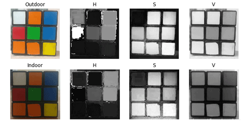
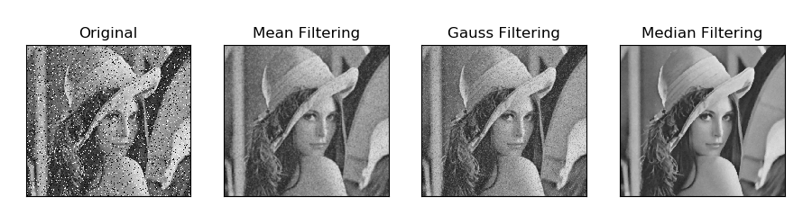
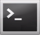
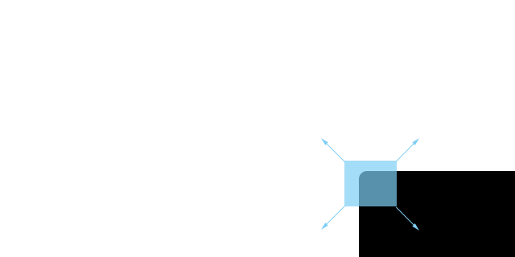

# OpenCV计算机视觉学习

## 1. 计算机视觉和OpenCV介绍

### 1.1 机器是如何"看"的

我们人类可以通过眼睛看到五颜六色的世界，是因为人眼的视觉细胞中存在分别对红、绿、蓝敏感的3种细胞。其中的光感色素根据光线的不同进行不同比例的分解，从而让我们识别到各种颜色。

对人工智能而言，学会"**看**"也是非常关键的一步。那么机器人是如何看到这个世界的呢？这就涉及到人工智能方向重要的分支--机器视觉。

机器视觉即用机器人代替人眼来做测量和判断，通过机器视觉产品（即图像摄取装置，分 CMOS 和CCD 两种）将被摄取的目标转换成图像信号，传送给专用的图像处理系统，根据像素分布和亮度、颜色等信息，转变成数字化信号。

图像系统对这些信号进行各种运算来抽取目标的特征，进而根据判别的结果来控制现场的设备动作。

### 1.2 机器视觉技术的常见应用

随着人工智能的推进、5G时代的到来，中国正成为世界机器视觉发展最为活跃的地区之一。机器视觉技术的应用范围涵盖工业、农业、军事、医药、航天、交通、科研、安防等多个行业。下面我们来看看这项技术常见的应用领域：

1. **智慧交通**

城市交通拥堵情况日益严重，如何快速有效地检测拥堵状态对于解决这个问题具有极其重要的意义。机器视觉在交通领域上的应用，越来越常见，也发挥着越来越重要的作用。

例如，2016年杭州萧山试点的"**城市大脑**"人工智能系统便是一个典型应用。通过对监控摄像头、红绿灯每天产生的海量数据进行自我管理，对红绿灯进行统筹调节，使得车辆在高架路上的通行时间平均缩短5分钟，在普通道路上的车速提高15%-20%。

2. **智能家居**

机器视觉在智能家居方面的应用，与我们的生活密切相关。人工智能技术的运用，使得我们的家电越来越"聪明"。而视觉模块就相当于智能家电的"**眼睛**"，是感知层最为重要的核心器件之一。

普通家电主要是通过遥控器、APP进行操控。在增加了摄像头、语音识别、语音合成等感知模块后，家电产品便能够"**看懂**"、"**听懂**"、"**说出**"，和用户进行交流，了解用户需求。

例如，人脸识别门禁系统能够与室内的空调、热水器、电灯等家电结合起来，实现对屋主与陌生人进行识别、区分，从而控制大门及家电的开关。

### 1.3 图像识别介绍

图像识别技术是人工智能的重要领域。它是一种利用计算机对图像进行处理、分析，以识别各种不同模式的目标和对象的技术。

正如我们人眼识别图像，往往是从变化最大或突然改变的地方开始，从一个特征到下一个特征。大脑控制眼睛采集图像的主要特征，排除冗杂的非必要信息，再将主要特征的信息整合成完整的视觉映象。

计算机的图像识别与人眼识别图像的原理相同，识别过程大同小异，大致可分为四个步骤：

1. **信息获取**：通过传感器将光信号、声音信号等转换为电信号，即对基本信息进行获取。

2. **图像预处理**：主要指采用平滑、去噪等手段对图像进行处理，突出图像的主要特征。

3. **特征抽取和选择**：在模式识别中，抽取和选择图像特征。这是图像识别过程中的关键步骤之一。

4. **图像分类**：根据训练结果制定识别规则，即设计分类器，得到特征的主要种类，进而使图像识别的辨识率不断提高。

### 1.4 图像识别技术的常见应用

在AI领域，图像识别技术占据着极为重要的地位。随着计算机技术与信息技术的不断发展，图像识别技术的应用范围也在不断拓宽。

1. **遥感图像识别**

航空遥感和卫星遥感图像通常采用图像识别技术进行加工，提取有用信息。该技术主要用于地形地质探测、气象卫星云图处理、环境污染检测等。

2. **机器视觉领域**

图像处理作为热门研究课题--人工智能的重要组成部分，其应用非常广泛，并且与我们的生活紧密相连。例如快递无人车、家庭服务智能机器人、扫地机器人、玩具机器人等。

### 1.5 OpenCV介绍

OpenCV（Open Source Capture Vision）是一个免费的计算机视觉库。它可以处理图像和视频的各种任务，比如显示摄像头采集到的画面以及让机器人识别现实生活中的物体。


虽然Python自带图像处理库PIL，但是其功能比OpenCV逊色很多。OpenCV提供完整的Python接口，而且在我们提供的镜像系统中已经集成Python3.5和opencv-python库文件，大家可以直接使用这个强大的计算机视觉库。

### 1.6 图像在计算机中的存储形式

在识别到图像后，计算机是如何存储不同图像的呢？

一般来说，图像是由一个个像素点构成，而每个像素点又可以用范围在0-255的R、G、B分量表示。OpenCV则将每个像素用一个三元数组存储起来，这便可以记录图像的全部信息。另外，我们需要注意OpenCV在记录RGB图像三个颜色通道的数据时，记录顺序会变为BGR。

此外，其它标准（例如 HSV）的图像，也是通过多元数组的形式进行存储。OpenCV图像是.array类型的二维或三维数组，8位的灰度图像（只有黑，白色的图像）是一个二维数组，24位的BGR图像是一个三维数组。

比如，对于一个BGR图像来说，"**image\[0,0,0\]**"元素的第一个值表示像素的Y轴坐标或者行号（0代表顶部）；第二个值代表像素的X轴坐标或列号（0表示最左边）；第三个值表示颜色通道。

这些记录图像的数组和普通的Python数组一样可以单独访问，从而可以获得某个颜色通道的数据，或截取图像某个区域的图像。

## 2. OpenCV环境搭建

:::{Note]
本文档以下操作全部基于ubuntu官方镜像下进行，如之前进行了换源操作（清华大学开源软件镜像站或阿里云），可能导致OpenCV软件包安装失败。
:::

### 2.1 安装Numpy

每一张图像都有很多个像素点，这也导致了程序中会涉及大量的数组处理。Numpy是

一个Python的拓展库，它对多维数组的处理效率比Python自带的数组结构强很多，同时可以提高我们代码的可读性。

打开命令行终端，输入指令"**pip3 install numpy**"，即可安装Numpy。

```commandline
pip3 install numpy
```

### 2.2 从Ubuntu存储库安装OpenCV

可从Ubuntu发行存储库中获得OpenCV软件包，刷新软件包索引并通过输入以下内容安装OpenCV软件包：

1.  输入指令：**sudo apt update**，回车，刷新软件包索引

```commandline
sudo apt update
```

2.  输入指令：**sudo apt install python3-opencv**，回车，安装软件包，安装时，可能需要输入"**y**"选择继续执行，安装时间根据网速而定。

```commandline
sudo apt install python3-opencv
```

### 2.3 验证OpenCV安装

安装完OpenCV之后，需要进行验证，我们将导入cv2模块并打印OpenCV版本：

1. 打开终端，输入指令：python3，回车，进入python

2. 接着输入：import cv2 ，回车，导入cv2模块

3. 再输入指令：cv2.\_\_version\_\_ 回车，查看版本号

如下图所示，成功查看版本号，就说明安装成功了。


## 3. OpenCV包含模块及组成结构

### 3.1 OpenCV的组成结构

OpenCV是由很多模块组成的，这些模块可以分成很多层：

1. 最底层是基于硬件加速层（HAL）的各种硬件优化。

2. 再上一层是 opencv_contrib 模块所包含的 OpenCV 由其他开发人员所贡献的代码，其包含大多数高层级的函数功能。这就是OpenCV的核心。

3. 接下来是语言绑定和示例应用程序。

4. 处于最上层的是 OpenCV 和操作系统的交互。


### 3.2 OpenCV的具体模块

1. Core ：该模块包含 OpenCV 库的基础结构以及基本操作。

2.Improc：图像处理模块包含基本的图像转换，包括滤波以及类似的卷积操作。

3. Highgui：在 OpenCV 3.0中，分割为 imcodecs、videoio 以及 highgui 三部分，这个模块包含可以用来显示图像或者简单的输入的用户交互函数。这可以看作是一个非常轻量级的 Windows UI 工具包。

4. Video：该模块包含读取和写视频流的函数。

5. Calib3d：这个模块包括校准单个、双目以及多个相机的算法实现。

6. Feature2d ：这个模块包含用于检测、描述以及匹配特征点的算法。

7. Objdectect：这个模块包含检测特定目标，比如人脸或者行人的算法。也可以训练检测器并用来检测其他物体。

8. Ml：机器学习模块本身是一个非常完备的模块，包含大量的机器学习算法实现并且这些算法都能和 OpenCV 的数据类型自然交互。

9. Flann：Flann 的意思是"快速最邻近库"。这个库包含一些你也许不会直接使用的方法，但是其他模块中的函数会调用它在数据集中进行最邻近搜索。

10. GPU：在 OpenCV 中被分割为多个 cuda\* 模块。GPU 模块主要是函数在 CUDA GPU 上的优化实现，此外，还有一些仅用于 GPU 的功 能。其中一些函数能够返回很好的结果，但是需要足够好的计算资源，如果硬件没有GPU，则不会有什么提升。

11. Photo：这是一个相当新的模块，包含计算摄影学的一些函数工具。

12. Stitching：本模块是一个精巧的图像拼接流程实现。这是库中的新功能，但是，就像 Photo 模块一样，这个领域未来预计有很大的增长。

13. Nonfree：在 OpenCV 3.0 中，被移到 opencv_contrib/xfeatures2d。OpenCV 包含一些受到专利保护的或者受到使用限制的（比如 SIFT 算法）算法。这些算法被隔离到它们自己的模块中，以表明你需要做一些特殊的工作，才可以在商业产品中使用它们。

14. Contrib：在 OpenCV 3.0 中，融合进了 opencv_contrib。这个模块包含一些新的、还没有被集成进 OpenCV 库的东西。

15. Legacy：在 OpenCV 3.0 中，被取消。这个模块包含一些老的尚未被完全取消的东西。

16. Ocl：在OpenCV 3.0 中，被取消，取而代之的是 T-API。这是一个较新的模块，可以认为它和 GPU 模块相似，它实现了开放并行编程的 Khronos OpenCL 标准。

虽然现在模块的特性比 GPU 模块少很多，但 ocl 模块的目标是提供可以运行在任何GPU 或者是其他可以搭载 Khronos 的并行设备。这与GPU模块形成了鲜明的对比，后者使用Nvidia CUDA工具包进行开发，因此只能在Nvidia GPU设备上工作。

## 4. 图片&视频加载及展示

### 4.1 图像读写

读取图像：cv2.imread(Location，Model) 。

1. Location——想要读取图像所在地址。地址可以为绝对路径，也可以是相对路径，但是 要注意在不同操作系统中路径斜杠的用法。

2. Model——图片加载模式，第一种为 cv2.IMREAD_COLOR，用于加载一张彩色图片， 但不加载其自带的 Alpha 通道（记录透明度）；第二种为 cv2.IMREAD_GRAYSCALE，用于加载一张灰度图；第三种为 cv2.IMREAD_UNCHANGED，加载图像的同时加载 Alpha 通道。

3. 显示图像：cv2.imshow("Name", Pic)。

4. Name——显示图像的窗口的名字。

5. Pic——要显示的图像（在前面已经使用 cv2.imread()读入的图像对象）。

示例：新建一个py文件，并在该 py 文件同一个文件夹放一张全名为"**camera.png**"的图片，输入如下代码，运行后可看到显示出该图像，按下任意键后图像隐藏。


:::{Note}
cv2.waitKey()函数会等待键盘任意键被按下，cv2.destroyALLWindows()函数会关闭所有窗口。
:::

### 4.2 视频读写

视频可以看成快速切换的图像，所以视频读写其实可以看成是图像读写的延续。摄像头初始化：cv2.VideoCapture(Number)。

1. Number——摄像头编号，一般是0。

读取摄像头帧：cap.read()。

2. cap——指的是前面定义过的摄像头对象。

释放摄像头资源：cap.release()。

示例：在桌面上显示摄像头镜头画面，当按下q键的时候停止显示。


:::{Note}
cv2.waitKey(delay)是等待键盘输入，在视频中有刷新图像的作用，括号里的delay 是等待时间，当显示一帧图像后程序等待"**delay**"ms后再显示视频的下一帧。
:::

### 4.3 功能体验

:::{Note}
输入指令时需严格区分大小写，且可以使用"Tab"键补齐关键字。
:::

1. 使用VNC远程连接树莓派。

2. 将鼠标移动到远程桌面居中最上端位置，窗口会弹出下图选项，点击下图红框内的传输按钮。


3. 点击下方红框位置开始旋转需要传输的文件。


4. 将同文档目录下"**例程源码**"文件夹打开，然后勾选下图程序中的两个文件，点击打开。VNC会将所选的文件传输到树莓派的桌面。

源码对应功能名称：

图像读写：show_test_1

视频读写：show_test_2


5. 打开终端，输入指令"**cd Desktop**"，回车，进入例程所在路径，即进入桌面。

```commandline
cd Desktop
```

6. 然后开启图像读写，输入指令"**sudo python3 show_test_1.py**"，**并按下回车，运行例程。

```commandline
sudo python3 show_test_1.py
```

开启成功后即可查看随例程一起导入的图片，如下图所示：


7. 再开启视频读写功能，输入指令"**sudo python3 show_test_2.py**"，按下回车，即可运行程序。

```commandline
sudo python3 show_test_2.py
```

下图为摄像头回传画面。


8. 选择命令栏后输入按下ctrl+c键，停止程序，请多次尝试。

## 5. 图像的绘制方法

OpenCV提供了方便的绘图功能，使用其中的绘图函数可以绘制直线、矩形、圆等多种几何图形，还能在图像中的指定位置添加文字说明，下面本节将对上述内容做简要的说明。

### 5.1 画线

函数格式：**cv2.line(image,pt1,pt2,color,thickness)**。

1. image：它是要在其上绘制线条的图像。

2. pt1：它是线的起始坐标。坐标表示为两个值的元组，即(X坐标值，Y坐标值)。

3. pt2：它是直线的终点坐标。坐标表示为两个值的元组，即(X坐标值ÿ坐标值)。

4. color：它是要绘制的线条的颜色。对于BGR，我们通过一个元组表示。例如：(255，0，0)为蓝色。

5. thickness：它是线的粗细像素。


### 5.2 画矩形

函数格式：**cv2.rectangle(image,pt1,pt2,color,thickness)**。

1. image：它是要在其上绘制矩形的图像。

2. pt1：矩形框的一个顶点坐标，是一个包含两个数字的元组，表示(x, y)。

3. pt2：pt1的对角线顶点坐标，类型同pt1。

4. color：它是要绘制的矩形的颜色。对于BGR，我们通过一个元组表示。例如：(255，0，0)为蓝色。

5. thickness：线宽，数值越大表示线宽越宽；如果取值为负数或者cv2.FILLED，那么将画一个填充的矩形。


### 5.3 画圆

函数格式：**cv2.circle(image,center,radius,color,thickness)**。

1. image：它是要在其上绘制圆形的图像。

2. center：绘制圆形的圆心，是一个包含两个数字的元组，表示(x, y)。

3. radius：绘制圆形的半径。

4. color：它是要绘制的圆形的颜色。对于BGR，我们通过一个元组表示。例如：(255，0，0)为蓝色。

5. thickness：线宽，数值越大表示线宽越宽；如果取值为负数或者cv2.FILLED，那么将画一个实心圆。


### 5.4 画多边形

函数格式：**cv2.polylines(image,pts,isClosed,color,thickness)**。

1. image：它是要在其上绘制多边形的图像。

2. pts：为所画多边形的顶点坐标，当一张图片需要多个四边形时，该数组ndarray的shape应该为（N，4，2）。

3. isClosed：所画多边形是否闭合，通常为True。

4. color：它是要绘制的多边形的颜色。对于BGR，我们通过一个元组表示。例如：(255，0，0)为蓝色。

5. thickness：线宽，数值越大表示线宽越宽。


### 5.5 画文本

函数格式：**cv2.putText(image,text,pt,font,fontScale,color)**。

1. image：它是要在其上绘制文本的图像。

2. text：要绘制的文本内容。

3. pt：为所画文本左上角的坐标。

4. font：文本的字体格式。

5. fontScale：字体的大小。

6. color：它是要绘制的文本的颜色。对于BGR，我们通过一个元组表示。例如：(255，0，0)为蓝色。


### 5.6 功能体验

:::{Note}
输入指令时需严格区分大小写，且可以使用"Tab"键补齐关键字。
:::

1. 使用VNC远程连接树莓派。

2. 将鼠标移动到远程桌面居中最上端位置，窗口会弹出下图选项，点击下图红框内的传输按钮。


3. 点击下方红框位置开始旋转需要传输的文件。


4. 将同文档目录下"**例程源码**"文件夹打开，然后勾选下图程序中的两个文件，点击打开。VNC会将所选的文件传输到树莓派的桌面。

源码对应功能名称：

画线：cv2_line

画矩形：cv2_rectangle

画圆：cv2_circle

画多边形：cv2_polylines

画文本：cv2_putText


5. 打开虚拟机，启动系统。点击系统任务栏的图标，并点击图标，或使用快捷键"Ctrl+Alt+T"，打开命令行终端。

6. 画线：输入指令"**sudo python3 ./Desktop/cv2_line.py**"，并按下回车，运行例程。

```commandline
sudo python3 ./Desktop/cv2_line.py
```

画矩形：输入指令"**sudo python3 ./Desktop/cv2_rectangle.py**"，并按下回车，运行例程。

```commandline
sudo python3 ./Desktop/cv2_rectangle.py
```

画圆：输入指令"**sudo python3 ./Desktop/cv2_circle.py**"，并按下回车，运行例程。

```commandline
sudo python3 ./Desktop/cv2_circle.py
```

画多边形：输入指令"**sudo python3 ./Desktop/cv2_polylines.py**"，并按下回车，运行例程。

```commandline
sudo python3 ./Desktop/cv2_polylines.py
```

画文本：输入指令"**sudo python3 ./Desktop/cv2_putText.py**"，并按下回车，运行例程。

```commandline
sudo python3 ./Desktop/cv2_putText.py
```

7. 选择命令栏后输入按下ctrl+c键，停止程序，请多次尝试。

## 6. 图像的基础操作

### 6.1 获取并修改图像中的像素点

我们可以通过行和列的坐标值获取该像素点的像素值。对于BGR图像，它返回一个蓝，绿，红值的数组；对于灰度图像，仅返回相应的强度值。使用相同的方法对像素值进行修改。

1)  **img\[x,y\]**：获取某个像素点的值，返回该像素点的BGR值。

2)  **img\[x,y,index\]**：获取像素点某个颜色通道的值，颜色通道顺序是BGR。

3)  **img\[x,y\]=\[B,G,R\]**：修改该像素点的颜色通道数值。


### 6.2 获取图像的属性

1)  **shape**：如果是彩色图像，获取图像的形状，返回包含行数、列数、通道数的数组；如果是二值图像或者灰度图像，则仅返回行数和列数。通过该属性的返回值是否包含通道数，可以判断一幅图像是灰度图像（或二值图像）还是彩色图像。

2)  **size**：返回图像的像素数目。其值为"行×列×通道数"，灰度图像或者二值图像的通道数为1。

3)  **dtype**：返回图像的数据类型。


### 6.3 图像通道的拆分与合并

- #### 6.3.1 图像通道的拆分

**split**：输入要拆分的图像，返回三个单独颜色通道的图片对象。


- #### 6.3.2 图像通道的合并

**merge**：把B,G,R单通道合并为三通道BGR图像。


### 6.4 颜色空间的转换

OpenCV中有150多种颜色转换方法，常用的有BGR转GRAY和BGR转HSV。函数格式：**cvtColor(img,flag)**。

1. **img**：进行颜色空间转换的图像。

2. **flag**：转换类型，例如：**cv2.COLOR_BGR2HSV**，就是BGR转HSV。


### 6.5 功能体验

:::{Note}
输入指令时需严格区分大小写，且可以使用"Tab"键补齐关键字。
:::

1.  使用VNC远程连接树莓派。

2.  将鼠标移动到远程桌面居中最上端位置，窗口会弹出下图选项，点击下图红框内的传输按钮。


3.  点击下方红框位置开始旋转需要传输的文件。


4. 将同文档目录下"**例程源码**"文件夹打开，然后勾选下图程序中的两个文件，点击打开。VNC会将所选的文件传输到树莓派的桌面。

源码对应功能名称：

修改像素：cv2_pixel

图像属性：cv2_property

图像通道切分：cv2_img_split

图像通道合并：cv2_img_merge

颜色空间转换：cv2_Color_format


5. 打开虚拟机，启动系统。点击系统任务栏的图标，并点击图标，或使用快捷键"Ctrl+Alt+T"，打开命令行终端。

6. 修改像素：输入指令"**sudo python3 ./Desktop/cv2_pixel.py**"，并按下回车，运行例程。

```commandline
sudo python3 ./Desktop/cv2_pixel.py
```

图像属性：输入指令"**sudo python3 ./Desktop/cv2_property.py**"，并按下回车，运行例程。

```commandline
sudo python3 ./Desktop/cv2_property.py
```

图像通道切分：输入指令"**sudo python3 ./Desktop/cv2_img_split.py**"，并按下回车，运行例程。

```commandline
sudo python3 ./Desktop/cv2_img_split.py
```

图像通道合并：输入指令"**sudo python3 ./Desktop/cv2_img_merge.py**"，并按下回车，运行例程。

```commandline
sudo python3 ./Desktop/cv2_img_merge.py
```

颜色空间转换：输入指令"**sudo python3 ./Desktop/cv2_Color_format.py**"，并按下回车，运行例程。

```commandline
sudo python3 ./Desktop/cv2_Color_format.py
```

7. 选择命令栏后输入按下ctrl+c键，停止程序，请多次尝试。

## 7. 图像处理-颜色空间学习

### 7.1 颜色空间介绍

我们所看到的图像信息，其实每一帧都是由B、G、R三个颜色分量所构成的像素点排列而成。

颜色模型也被称为颜色空间，是用一组数值来描述颜色的数学模型。

RGB图像是一种比较常见的颜色空间类型，除此以外，还有一些还有一些其他的颜色空间，比较常见的包括 GRAY颜色空间（灰度图像）、Lab颜色空间、XYZ颜色空间、YCrCb 颜色空间、HSV颜色空间、HLS颜色空间、CIEL\*a\*b\*颜色空间、CIEL\*u\*v\*颜色空间、Bayer 颜色空间等。

每个颜色空间都有自己擅长的处理问题的领域，因此，为了更方便地处理某个具体问题，就要用到颜色空间类型转换。

颜色空间类型转换是指，将图像从一个颜色空间转换到另外一个颜色空间。例如，在使用OpenCV处理图像时，可能会在RGB颜色空间和Lab颜色空间之间进行转换。在进行图像的特征提取、距离计算时，往往先将图像从RGB颜色空间处理为灰度颜色空间。在一些应用中，可能需要将颜色空间的图像转换为二值图像。

下面将列举介绍几种常见的空间。

### 7.2 常用颜色空间类型学习

- #### 7.2.1 RGB颜色空间

RGB颜色空间具有以下属性：

1. 它是一种加色空间，其中颜色通过红色R，绿色G和蓝色B的线性组合获得。

2. 物体光照会影响该颜色空间各个通道值，三个颜色通道是具有相关性的。让我们将上面图像分成R，G和B分量并观察它们以更深入地了解颜色空间。

从下图可以看到如果你看蓝色通道，可以看到在室内光照条件下第二张图像中的魔方蓝色和白色部分看起来相似，但第一张图像有明显差异。这种不均匀性使得在该颜色空间中基于颜色的分割非常困难。此外，两个图像的值之间存在总体差异。因此RGB颜色空间存在颜色值分布不均匀以及色度和亮度混合在一起的问题。


- #### 7.2.2 Lab颜色空间

类似RGB空间，Lab也有三个图像通道。

L：亮度通道，表亮度。

a：颜色通道a，表示从绿色到洋红色的颜色。

b：颜色通道b，表示从蓝色到黄色的颜色。


Lab颜色空间与RGB颜色空间完全不同。在RGB颜色空间中，颜色信息被分成三个通道，但是相同的三个通道也包含亮度信息。另一方面，在Lab颜色空间中，L通道独立于颜色信息并仅只含亮度信息。另外两个通道编码颜色。

L分量：表示像素的亮度。L值越大，亮度越高。

a分量：表示从红色到绿色的范围。

b分量：表示从黄色到蓝色的范围。

在OpenCV里，RGB颜色空间中R、G、B的数值范围均为\[0-255\]。在Lab颜色空间中的L数值范围是\[0-100\]，L为0时代表黑色，为100时代表白色。a和b的数值范围是\[-128,127\]，a和b为0时都代表灰色。

为了进一步帮助大家了解RGB和Lab的对照关系，这里以PS软件为例进行说明：

1.  在PS软件中使用"**吸管工具**"，选择需要吸取的颜色；

2.  点击左下方"**拾色器**"，可以看到Lab与RGB的对应关系如下图所示：


Lab颜色空间还具有以下特性：1.感知上均匀的颜色空间近似于我们如何感知颜色。2.独立于设备（捕获或显示）。3.广泛用于Adobe Photoshop。4.通过复数变换方程与RGB颜色空间相关。 OpenCV中读取图像，转换为Lab空间图像结果如下图所示：


- #### 7.2.3 Ycrcb颜色空间

人眼视觉系统（HVS，Human Visual System）对颜色的敏感度要低于对亮度的敏感度。在传统的 RGB 颜色空间内，RGB 三原色具有相同的重要性，但是忽略了亮度信息。

在YCrCb颜色空间中，Y代表光源的亮度，色度信息保存在Cr和Cb中，其中，Cr表示

红色分量信息，Cb表示蓝色分量信息。亮度给出了颜色亮或暗的程度信息，该信息可以通过照明中强度成分的加权和来计算。在RGB光源中，绿色分量的影响最大，蓝色分量的影响最小。


对于照度变化，可以针对强度和颜色分量对LAB进行类似的观察。与LAB相比，室外图像中红色和橙色之间的感知差异较小，白色在所有3个组件中发生了变化。

- #### 7.2.4 HSV颜色空间

HSV颜色空间是一种面向视觉感知的颜色模型，具有以下三个成分：

H色调，S饱和度，V明度。


色调：色调与混合光谱中的主要光波长相关，例如"赤橙黄绿青蓝紫"分别表示不同的色调。如果从波长的角度考虑，不同波长的光表现为不同的颜色，实际上它们体现的是色调的差异。

饱和度：指相对纯净度，或一种颜色混合白光的数量。纯谱色是全饱和的，像深红色（红

加白）和淡紫色（紫加白）这样的彩色是欠饱和的，饱和度与所加白光的数量成反比。

亮度：反映的是人眼感受到的光的明暗程度，该指标与物体的反射度有关。对于颜色来讲，如果在其中掺入的白色越多，则其亮度越高；如果在其中掺入的黑色越多，则其亮度越低。

HSV最大的特点是它只使用一个通道来描述颜色（H），这使得指定颜色变得非常直观。但是HSV颜色取决于设备。

从下图可以看到：



H分量在两个图像中非常相似，这表明即使在光照变化下颜色信息也是完整的。

两个图像中的S分量也非常相似，V分量表示亮度，因此它会因照明变化而发生变化。

红色室外和室内图像的值之间存在巨大差异。这是因为H值是以角度表示红色表示起始角度。因此它可能会取角度 \[300,360\]和\[0,60\]之间的值。

- #### 7.2.5 Gray颜色空间

GRAY颜色空间通常指的是灰度图像，灰度图像是一种每个像素都是从黑到白，被处理为256个灰度级别的单色图像。

这256个灰度级别分别用区间\[0,255\]中的数值表示，其中，"0"表示纯黑色，"255"表示白色，0~255之间的数值表示不同的亮度（即颜色的深浅程度）的深灰色或者浅灰色。

### 7.3 颜色转换实战

在了解Lab颜色模型后，接下来看下OpenCV中颜色转换的函数：

dst = cv2.cvtColor( src, code \[, dstCn\] )

dst表示输出图像，与原始输入图像具有同样的数据类型和深度。 src表示原始输入图像。

code是颜色空间转换的标志。

dstCn是目标图像的通道数，默认为0。

|       标记        | 简记 |               作用               |
| :---------------: | :--: | :------------------------------: |
| cv.COLOR_BGR2BGRA |  0   |        为RGB添加alpha通道        |
| cv.COLOR_BGR2RGB  |  4   |    更改彩色图像通道颜色的顺序    |
| cv.COLOR_BGR2GRAY |  10  |      把彩色图像转成灰度图像      |
| cv.COLOR_GRAY2BGR |  8   | 把灰度图像转成彩色图像（伪彩色） |
| cv.COLOR_BGR2YUV  |  82  |   从RGB颜色空间转成YUV颜色空间   |
| cv.COLOR_YUV2BGR  |  84  |   从YUV颜色空间转成RGB颜色空间   |
| cv.COLOR_BGR2HSV  |  40  |   从RGB颜色空间转成HSV颜色空间   |
| cv.COLOR_HSV2BGR  |  54  |   从HSV颜色空间转成RGB颜色空间   |
| cv.COLOR_BGR2Lab  |  44  |   从RGB颜色空间转成Lab颜色空间   |
| cv.COLOR_Lab2BGR  |  56  |   从Lab颜色空间转成RGB颜色空间   |

例如：cv2.cvtColor(frame, cv2.COLOR_RGB2LAB)

其中"frame"为需要进行处理的图片；"cv2.COLOR_RGB2LAB"为指定颜色转换模式，这里是将RGB颜色空间的frame信息转换为LAB颜色空间。

下面我们就以一张图片为例，通过转换几种常用的颜色空间来查看效果。

- #### 7.3.1 实验步骤

开始操作前，需要先将目录"**[OpenCV计算机视觉学习-\>7.图像处理—颜色空间转换-\>例程源码]()**"下的例程"**color_conversion.py**"和示例图片"img1.jpg"复制到共享文件夹。

:::{Note}
输入指令时需严格区分大小写，且可以使用"Tab"键补齐关键字。
:::

1.  使用VNC远程连接树莓派。

2.  将鼠标移动到远程桌面居中最上端位置，窗口会弹出下图选项，点击下图红框内的传输按钮。


3.  点击下方红框位置开始旋转需要传输的文件。


4.  将同文档目录下"**例程源码**"文件夹打开，然后勾选下图程序中的两个文件，点击打开。


5.  VNC会将两个文件传输到树莓派的桌面。


6. 打开终端，输入指令"**cd Desktop**"，回车，进入例程所在路径，即进入桌面。

```commandline
cd Desktop
```

7. 然后输入以下指令"**python3 color_conversion.py**"，回车，即可运行例程，

```commandline
python3 color_conversion.py
```

- #### 7.3.2 实验效果

执行程序后，图像处理的结果如下图所示：


- #### 7.3.3 实验分析

1)  首先导入模块，通过import语句导入所需模块。


2)  通过调用cv2模块中的imread()函数，读取用于缩放处理的图像。


3)  函数括号内的参数是图像名称，然后设置插入图片的长宽大小。如下图所示：


4)  下面依次创建四个函数，分别来转换Gray、Lab、Ycrcb、HSV的颜色空间。


5)  接着将转换前及转换后的效果分别显示出来。


6)  最后通过函数来关闭窗口。


cv2.waitKey()是一个键盘绑定函数。它的时间量度是毫秒ms。函数会等待（n）里面的n毫秒，看是否有键盘输入。若有键盘输入，则返回按键的ASCII值。没有键盘输入，则返回-1。一般设置为0，将无线等待键盘的输入。

cv2.destroyAllWindows() 用来删除窗口的，()里不指定任何参数，则删除所有窗口，删除特定的窗口，往()输入特定的窗口值。

- #### 7.3.4整理程序文件

为了方便后期查看，我们可将此文件剪切到"home\pi\OpenCV_vision\Color_conversion"文件夹目录下(用户需自行在主目录下创建OpenCV_vision\Color_conversion文件夹)。


## 8. 图像处理-几何变换

### 8.1 简述

图像几何变换又称为图像空间变换，它将一幅图像中的坐标位置映射到另一幅图像中的新坐标位置。几何变换并不改变图像的像素值，只是在图像平面上进行像素的重新安排。

根据OpenCV函数的不同，本节课将映射关系划分为缩放、翻转、仿射变换、透视等。


### 8.2 导入例程

开始操作前，需要先将本文档同路径下的例程文件夹通过VNC文件快传的方式复制到系统桌面，步骤如下：

1.  将鼠标移动到远程桌面居中最上端位置，窗口会弹出下图选项，点击下图红框内的传输按钮。


2.  点击下方红框位置开始旋转需要传输的文件。


3.  将同文档目录下"**例程源码**"文件夹打开，然后进入例程文件夹，勾选下图程序中的文件，点击打开。VNC会将所选的文件传输到树莓派的桌面（这里以Perspective例程为例，其他文件的传输参照此方法）。


返回桌面即可看到传输的文件。


本节课所用的全部例程如下图所示：


### 8.3 缩放

图像缩放，是指对图像的大小进行调整的过程。比如放大图片，缩小图片。在OpenCV中，使用函数cv2.resize()实现对图像的缩放，此函数的具体形式为：

**dst = cv2.resize(src, dsize\[, fx\[, fy\[, interpolation\] \] \] )**

其中dst代表输出的目标图像，该图像的类型与src相同，其大小为dsize（当该值非零时），或者可以通过src.size()、fx、fy计算得到。

1)  src代表需要缩放的原始图像。

2)  dsize代表输出图像大小。

3)  fx代表水平方向的缩放比例，非0。

4)  fy代表垂直方向的缩放比例，非0。

5)  interpolation 代表插值方式，具体如下表所示：

<table class="docutils-nobg" border="1">
<colgroup>
<col  />
<col  />
</colgroup>
<tbody>
<tr>
<td ><strong>类型</strong></td>
<td ><strong>说明</strong></td>
</tr>
<tr>
<td >cv2.INTER_NEAREST</td>
<td >最临近插值</td>
</tr>
<tr>
<td >cv2.INTER_LINEAR</td>
<td >双线性插值（默认方式）</td>
</tr>
<tr>
<td >cv2.INTER_CUBIC</td>
<td >三次样条插值。首先对源图像附近的 4×4 近邻区域进行三次样条拟合，然后将目标像素对应的三次样条值作为目标图像对应像素点的值。</td>
</tr>
<tr>
<td >cv2.INTER_AREA</td>
<td >区域插值，根据当前像素点周边区域的像素实现当前像素点的采样。该方法类似最临近插值方式。</td>
</tr>
<tr>
<td >cv2.INTER_LANCZOS4</td>
<td >一种使用 8×8 近邻的 Lanczos 插值方法</td>
</tr>
<tr>
<td >cv2.INTER_LINEAR_EXACT</td>
<td >位精确双线性插值</td>
</tr>
<tr>
<td >cv2.INTER_MAX</td>
<td >差值编码掩码</td>
</tr>
<tr>
<td >cv2.WARP_FILL_OUTLIERS</td>
<td >标志，填补目标图像中的所有像素。如果它们中的一些对应源图像中的奇异点（离群值），则将它们设置为零</td>
</tr>
<tr>
<td >cv2.WARP_INVERSE_MAP</td>
<td ><p>标志，逆变换。例如，极坐标变换：如果 flag 未被设置，则进行转换：dst(ρ,ϕ)=src(x,y)</p>
<p>如果flag被设置，则进行转换：dst(x,y)=src(ρ,ϕ)</p></td>
</tr>
</tbody>
</table>

- #### 8.3.1 实验步骤

本节例程会对图像分别进行缩放。

:::{Note}
输入指令时需严格区分大小写，且可以使用"Tab"键补齐关键字。
:::

1.  打开终端，输入指令"**cd Desktop/**"，并按下回车，进入系统桌面。

```commandline
cd Desktop/
```

2. 输入指令"**python3 Scale.py**"，并按下回车，运行例程。

```commandline
python3 Scale.py
```

- #### 8.3.2 实验效果

执行程序后，图像处理的结果如下图所示：


1.  **src**：原始图片。尺寸为宽度492像素，高度为430像素。

2.  **res1**：原始图片放大的大小。尺寸为宽度590像素，高度512像素。

3.  **res2**：原始图片缩小的大小。尺寸为295像素，高度为258像素。

- #### 8.3.3 实验分析

可以在目录"**[8. 图像处理—几何变换-\>例程源码-\>Scale]()**"下查看例程"**Scale.py**"。

```python
import numpy as np
import cv2 as cv

src =cv.imread('1.jpg')
# method 直接设置输出尺寸

height, width = src.shape[:2]  # 获得原尺寸
res1 = cv.resize(src, (int(1.2*width), int(1.2*height)),interpolation=CV.INTER CUBIC)
res2 = cv.resize(src, (int(0.6*width), int(0.6*height)),interpolation=CV.INTER CUBIC)
cv.imshow("src", src)
cv.imshow("res1", res1)
cv.imshow("res2", res2)
print("src.shape=", src.shape)
print("resl.shape=", res1.shape)
print("res2.shape=", res2.shape)
cy.waitKey()
cv.destroyAllwindows()
```

首先，通过import语句导入所需模块。

```python
import numpy as np
import cv2 as cv
```

通过调用cv2模块中的imread()函数，读取用于缩放处理的图像。

```python
src =  cv.imcread("1.jpg")
```

函数括号内的参数是图像名称。

原始图片宽度492像素，高度为430像素。我们这里通过参数dsize（输出图像大小）的方式来指定目标图像res1（自定义命名）和res2（自定义命名）的大小。

dsize内第1个参数对应缩放后图像的宽度（width，即列数cols，与参数fx相关），第2个参数对应缩放后图像的高度（height，即行数 rows，与参数fy相关）。

这种方式，如果指定参数dsize的值，则无论是否指定了参数fx和fy的值，都由参数dsize来决定目标图像的大小。

```python
height, width = src.shape[:2]  # 获得原尺寸
res1 = cv.resize(src, (int(1.2*width), int(1.2*height)),interpolation=CV.INTER CUBIC)
res2 = cv.resize(src, (int(0.6*width), int(0.6*height)),interpolation=CV.INTER CUBIC)
```

所以在这里，我们需要让程序先获取原图尺寸信息，然后直接在宽度和高度上进行处理。示例将res1宽放大为原来的1.2倍，高放大为原来的1.2倍，计算后得到为宽度492x1.2=590像素，高度430x 1.2=516像素，最终呈现原图放大效果。

缩小这里示例将res2宽度变为原来0.6倍，高度变为原来0.6倍，计算后得到492x0.6=295像素，高度430x0.6=258像素，最终呈现原图缩小的效果。如下图所示，我们可将处理前后的图片尺寸信息打印出来：


### 8.4 仿射变换

仿射变换是指图像可以通过一系列的几何变换来实现平移、旋转等多种操作。该变换能够保持图像的平直性和平行性。

平直性是指图像经过仿射变换后，直线仍然是直线，平行性是指图像在完成仿射变换后，平行线仍是平行线。

平移和旋转都是仿射变换的特例，OpenCV所用函数都为cv2.warpAffine()，其通过一个变换矩阵（映射矩阵）M 实现变换，平移和旋转转换矩阵不同）具体为：


如下图所示，可以通过一个变换矩阵 M，将原始图像O变换为仿射图像R。


cv2.warpAffine()函数的语法格式如下：

```python
dst = cv2.warpAffine( src, M, dsize[, flags[, borderMode[, borderValue]]] )
```

式中：

1.  **dst**：代表仿射后的输出图像，该图像的类型和原始图像的类型相同。dsize决定输出图像的实际大小。

2.  **src**：代表要仿射的原始图像。

3.  **M**：代表一个2×3的变换矩阵。使用不同的变换矩阵，就可以实现不同的仿射变换。dsize 代表输出图像的尺寸大小。

4.  **flags**：代表插值方法，默认为INTER_LINEAR。当该值为WARP_INVERSE_MAP时，

意味着M是逆变换类型，实现从目标图像dst到原始图像src的逆变换。具体可选值borderMode代表边类型，默认为BORDER_CONSTANT。

当该值为BORDER_TRANSPARENT时，意味着目标图像内的值不做改变，这些值对应原始图像内的异常值。

5.  **borderValue**：代表边界值，默认是0。

通过以上分析可知，在OpenCV中使用函数cv2.warpAffine()实现仿射变换，忽略其可选参数后的语法格式为：

```python
dst = cv2.warpAffine( src , M , dsize )
```

其通过转换矩阵 M 将原始图像 src 转换为目标图像 dst：


因此，进行何种形式的仿射变换完全取决于转换矩阵 M。下面分别介绍通过不同的转换矩阵M实现的不同的仿射变换。

- ####  8.4.1 平移

平移是物体的移动，如果知道物体平移的坐标，可以创建如下变换矩阵：


将其放入类型为np.float32的数组中，将M矩阵赋值给cv2.warpAffine() 函数，即可实现平移。

1.  **实验步骤**

本节例程会**对图像向右平移**，所用文件如下图所示：


- 点击图标，或使用快捷键"**Ctrl+Alt+T**"，打开命令行终端。

- 输入指令"**cd /Desktop**"，并按下回车，进入系统桌面。

```commandline
cd /Desktop
```

- 输入指令"**sudo python3 Translation.py**"，并按下回车，运行例程。

```commandline
sudo python3 Translation.py
```

2. **实验效果**

执行程序后，图像处理的结果如下图所示：


3.  **实验分析**

可以在目录"**[图像处理——几何变换\例程源码\Translation]()**"下查看例程"**Translation.py**"。

```py
import numpy as np
import cv2

img = cv2.imread('1.jpg')
rows, cols, ch = img.shape
M = np.float32([[1, 0, 300], [0, 1, 50]])

dst =cv2.warpAffine(img, M, (cols, rows))
cv2.imshow('imgl', img)
cv2.imshow('src', dst)
cv2.waitKey(0)
cv2.destroyAllwindows()
```

-  首先导入模块，通过import语句导入所需模块。

```py
import cv2
import numpy as np
```

-  通过调用cv2模块中的imread()函数，读取用于平移处理的图像。

```py
img = cv2.imread('1.jpg')
```

-  将图片的像素的行数、列数、频道返回给rows、cols、ch。

```py
rows, cols, ch = img.shape
```

-  根据前面学习的公式，如果知道物体平移的坐标，可以创建变换矩阵。这里以偏移（300，50）为例：


```py
M = np.float32([1, 0, 300], [0, 1, 50])
```

设置完成后，我们通过imshow函数分别显示原图及平移后的图片。

```py
cv2.imshow('img1', img)
cv2.imshow('src', dst)
```

- 最后通过函数来关闭窗口，这里使用键盘上的任意按键即可退出程序。

```py
cv2.waitKey(0)
cv2.destroyAllwindows()
```

cv2.waitKey()是一个键盘绑定函数。它的时间量度是毫秒ms。函数会等待（n）里面的n毫秒，看是否有键盘输入。若有键盘输入，则返回按键的ASCII值。没有键盘输入，则返回-1。一般设置为0，将无线等待键盘的输入。

cv2.destroyAllWindows() 用来删除窗口的，()里不指定任何参数，则删除所有窗口，删除特定的窗口，往()输入特定的窗口值。

4. **整理程序文件**

为了方便后期查看，我们可将此程序剪切到"**home\pi\OpenCV_vision\Translation**"文件夹目录下(用户需自行在主目录下创建**OpenCV_vision\Translation**文件夹)。


- #### 8.4.2 旋转

平移和旋转都是仿射变换的特例，所用函数都是cv2.warpAffine，只是转换矩阵M有所不同。在使用函数cv2.warpAffine()对图像进行旋转时，可通过函数cv2.getRotationMatrix2D()来获取转换矩阵。

该函数的语法格式为：

```python
retval=cv2.getRotationMatrix2D(center, angle, scale)
```

式中：

- center为旋转的中心点。

-  angle为旋转角度，设为正数表示逆时针旋转，负数表示顺时针旋转。

- scale为变换尺度（缩放大小）。

图像旋转θ度由变换矩阵M可得到：


OpenCV改进了这个矩阵，如下图，使得提供了缩放旋转与可调的旋转中心。


上述矩阵表示绕center.x，center.y旋转θ度。

例如，想要以图像中心为圆点，逆时针旋转45°，并将目标图像缩小为原始图像的0.6倍，则在调用函数cv2.getRotationMatrix2D()生成转换矩阵M时，如下设置：

```py
M=cv2.getRotationMatrix2D((height / 2, width / 2), 45, 0.6)
```

1. **实验步骤**

本节例程会**对图像逆时针旋转90°**，所用例程如下图所示：


- 点击图标，或使用快捷键"**Ctrl+Alt+T**"，打开命令行终端。

-  输入指令"**cd /Desktop**"，并按下回车，进入系统桌面。

```commandline
cd /Desktop
```

- 输入指令"**sudo python3 Revolve.py**"，并按下回车，运行例程。

```commandline
sudo python3 Revolve.py
```

2. **实验效果**

执行程序后，图像处理的结果如下图所示：


3. **实验分析**

可以在目录"**[8. 图像处理——几何变换\例程源码\Revolve]()**"下查看例程"**Revolve.py**"。

```python
import cv2
import numpy as np
img = cv2.imread('1.jpg')
rows, cols, ch = img.shape
# 旋转中心 旋转角度 缩放系数
M=cv2.getRotationMatrix2D(((cols-1) / 2.0, (rows-1) / 2.0), 90, 1)
#原图像 变换矩阵 输出图像尺寸中心
dst =cv2.warpAffine(img, M, (cols, rows))
cv2.imshow('img', img)
cv2.imshow('dst', dst)
cv2.waitKey(0)
cv2.destroyAllwindows()
```

-  首先导入模块，通过import语句导入所需模块。

```python
import cv2
import numpy as np
```

- 通过调用cv2模块中的imread()函数，读取用于旋转处理的图像。

```py
img = cv2.imcread('1.jpg')
```

- 将图片的像素的行数、列数、频道返回给rows、cols、ch。

```py
rows, cols, ch = img.shape
```

- 然后以图像中心为圆点，逆时针旋转90°，图像大小和原来保持不变。

```py
M = cv2.getRotationMatrix2D(((cols - 1) / 2.0, (rows - 1) / 2.0), 90, 1)
```

- 输出原图的尺寸中心。

```py
dst = cv2.warpAffine(img, M, (cols, rows))
```

- 设置完成后，我们通过imshow函数分别显示原图及旋转后的图片。

```py
cv2.imshow('img', img)
cv2.imshow('dst', dst)
```

-  最后通过函数来关闭窗口，这里使用键盘上的任意按键即可退出程序。

```py
cv2.waitKey(0)
cv2.destroyAllwindows()
```

cv2.waitKey()是一个键盘绑定函数。它的时间量度是毫秒ms。函数会等待（n）里面的n毫秒，看是否有键盘输入。若有键盘输入，则返回按键的ASCII值。没有键盘输入，则返回-1。一般设置为0，将无线等待键盘的输入。

cv2.destroyAllWindows()用来删除窗口的，()里不指定任何参数，则删除所有窗口，删除特定的窗口，往()输入特定的窗口值。

4. **整理程序文件**

为了方便后期查看，我们可将此程序剪切到"**home\pi\OpenCV_vision\Revolve**"文件夹目录下(用户需自行在主目录下创建**OpenCV_vision\Revolve**文件夹)。


### 8.5 透视变换

如果说仿射变换是在二维空间中的旋转、平移及缩放，而透视变换则是在三维空间中视角的变化。

透视变换通过函数 cv2.warpPerspective()实现，该函数的语法是：

```py
dst = cv2.warpPerspective( src, M, dsize[, flags[, borderMode[, borderValue]]] )
```

式中：

1)  dst代表透视处理后的输出图像，该图像和原始图像具有相同的类型。dsize 决定输出图像的实际大小。

2)  src代表要透视的图像。

3)  M代表一个3×3的变换矩阵。

4)  dsize代表输出图像的尺寸大小。

5)  flags代表插值方法，默认为 INTER_LINEAR。当该值为WARP_INVERSE_MAP 时，意味着 M 是逆变换类型，能实现从目标图像dst到原始图像src的逆变换。具体可选值borderMode代表边类型， 默认为BORDER_CONSTANT。

当该值为BORDER_TRANSPARENT时，意味着目标图像内的值不做改变，这些值对应原始图像内的异常值。

- #### 8.5.1 实验步骤

本节例程会对图像进行透视变换，所用例程如下图所示：


1.  点击图标，或使用快捷键"**Ctrl+Alt+T**"，打开命令行终端。

2.  输入指令"**cd Desktop/**"，并按下回车，进入系统桌面。

```commandline
cd Desktop/
```

3. 输入指令"**sudo python3 Perspective.py**"，并按下回车，运行例程。

```py
sudo python3 Perspective.py
```

- #### 8.5.2 实验效果

执行程序后，图像处理的结果如下图所示：


- #### 8.5.3 实验分析

可以在目录"**[OpenCV计算机视觉学习\8. 图像处理——几何变换\例程源码\Perspective]()**"下查看例程"**Perspective.py**"。

```py
import cv2
import numpy as np
img = cv2.imcread('1.jpg')
rows, cols = img.shape[:2]
print(rows, cols)

pts1 = np.float32([[150, 50], [400, 50], [60, 450], [310, 450]])
pts2 = np.float32([[50, 50], [rows-50, 50], [50, co1s-50], [rows-50, cols-50]])
M = cv2.getPerspectiveTransform(ptsl, pts2)
dst = cv2.warpPerspective(img, M, (cols, rows))

cv2.imshow("img", img)
cv2.imshow("dst", dst)
cv2.waitKey()
cv2.destroyAllwindows()
```

1)  首先导入模块，通过import语句导入所需模块。


```py
import cv2
import numpy as np
```

2. 通过调用cv2模块中的imread()函数，读取用于透视变换的图像。

```py
img = cv2.imcread('1.jpg')
```

3)  将图片的像素的行数、列数、频道返回给rows、cols、ch。

```py
rwos, cols = img.shape[:2]
```

4)  在本例中，指定原始图像中平行四边形的四个顶点pts1，指定目标图像中矩形的四个顶点pts2，使用 M=cv2.getPerspectiveTransform(pts1,pts2)生成转换矩阵 M。接下来，使用语句dst=cv2.warpPerspective(img,M,(cols,rows))完成从平行四边形到矩形的转换。

```py
pts1 = np.float32([[150, 50], [400, 501], [60, 450], [310, 450]])
pts2 = np.float32([[50, 50], [rows-50, 50], [50, cols-50], [rows-50, cols-50]])
M = cv2.getPerspectiveTransform(pts1, pts2)
dst = cv2.warpPerspective(img, M, (cols, rows))
```

5)  设置完成后，我们通过imshow函数分别显示原图及旋转后的图片。

```py
cv2.imshow("img", img)
cv2.imshow("dst", dst)
```

6)  最后通过函数来关闭窗口，这里使用键盘上的任意按键即可退出程序。

```py
cv2.waitKey()
cv2.destroyAllwindows()
```

cv2.waitKey()是一个键盘绑定函数。它的时间量度是毫秒ms。函数会等待（n）里面的n毫秒，看是否有键盘输入。若有键盘输入，则返回按键的ASCII值。没有键盘输入，则返回-1。一般设置为0，将无线等待键盘的输入。

cv2.destroyAllWindows()用来删除窗口的，()里不指定任何参数，则删除所有窗口，删除特定的窗口，往()输入特定的窗口值。

- #### 8.5.4 整理程序文件

为了方便后期查看，我们可将此程序剪切到"**home\pi\OpenCV_vision\Perspective**"文件夹目录下(用户需自行在主目录下创建**OpenCV_vision\Perspective**文件夹)。


### 8.6 重映射

什么是重映射？简单来说把一副图像内的像素点按照规则映射到到另外一幅图像内的对应位置上去，形成一张新的图像。

因为原图像与目标图像的像素坐标不是一一对应的。一般情况下，我们通过重映射来表达每个像素的位置（x,y），像这样：

g(x,y)=f(h(x,y))

在这里g()是目标图像，f()是源图像，而h(x,y)的映射方法函数，下面来看个例子。若有一幅图像I，对其按照下面条件作重映射：

h(x,y)=(I.cols-x,y)

图像会按照x轴方向发生翻转，OpenCV提供了多种重映射方式，OpenCV内的重映射函数cv2.remap()提供了更方便、更自由的映射方式，其语法格式如下：

```python
dst = cv2.remap( src, map1, map2, interpolation[, borderMode[, borderValue]] )
```

式中：

1)  dst代表目标图像，它和src具有相同的大小和类型。

2)  src代表原始图像。

3)  map1参数有两种可能的值：

表示(x,y)点的一个映射，也可以表示 CV_16SC2 , CV_32FC1, CV_32FC2 类型(x,y)点的 x 值。

4)  map2参数同样有两种可能的值：

当map1表示(x,y)时，该值为空。

当map1表示(x,y)点的 x 值时，该值是 CV_16UC1, CV_32FC1 类型(x,y)点的y值。

需要注意，map1指代的是像素点所在位置的列号，map2指代的是像素点所在位置的行号。所以通常情况下，我们将map1写为mapx，并且将map2写成mapy，以方便理解。

5)  Interpolation代表插值方式。

6)  borderMode代表边界模式。当该值为 BORDER_TRANSPARENT 时，表示目标图像内的对应源图像内奇异点（outliers）的像素不会被修改。

7)  borderValue 代表边界值，该值默认为0。

- #### 8.6.1 复制像素点

1. **实验步骤**

现在我们假设有一个需求，将目标图像内的所有像素点都映射为原始图像内的第100行，200列上的像素点，所用例程如下图所示：


-  点击图标，或使用快捷键"**Ctrl+Alt+T**"，打开命令行终端。

- 输入指令"**cd Desktop/**"，并按下回车，进入系统桌面。

```commandline
cd Desktop/
```

- 输入指令"**sudo python3 copy.py**"，并按下回车，运行例程。

```commandline
sudo python3 copy.py
```

2. **实验效果**

执行程序后，会得到一个纯色的图像。效果如下图所示：


3. **实验分析**

可以在目录"**[8. 图像处理——几何变换\例程源码\Remap]()**"下查看例程"**copy.py**"。

```python
import cv2
import numpy as np

img = cv2.imread("1.jpg")
rows, cols, ch = img.shape
mapx = np.ones(img.shape[:2], np.float32) * 200
mapy = np.ones(img.shape[:2l, np.float32) * 100
result img = cv2.remap(img, mapx, mapy, CV2.INTER_LINEAR)
                         
cv2.imshow("img", img)
cv2.imshow("result img", result_img)
cv2.waitKey()
cv2.destroyAllwindows()
```

-  首先导入模块，通过import语句导入所需模块。

```python
import cv2
import numpy as np
```

-  通过调用cv2模块中的imread()函数，读取用于复制像素点的图像。

```python
img = cv2.imcread('1.jpg')
```

-  将图片的像素的行数、列数、频道返回给rows、cols、ch。

```python
rows, cols, ch = img.shape
```

-  参数mapx和参数mapy分别设置了x轴方向的坐标和y轴方向的坐标，将目标图像的所有像素点都映射为原始图像内的第100行，200列上的像素点。

```python
mapx = np.ones(img.shape[:2], np.float32) * 200
mapy = np.ones(img.shape[:2], np.float32) * 100
```

-  设置完成后，我们通过imshow函数分别显示原图及复制像素点后的图片，最后通过函数来关闭窗口，这里使用键盘上的任意按键即可退出程序。

```python
cv2.imshow("img", img)
cv2.imshow("result_img", result_img)
cv2.waitKey()
cv2.destroyAllWindows()
```

cv2.waitKey()是一个键盘绑定函数。它的时间量度是毫秒ms。函数会等待（n）里面的n毫秒，看是否有键盘输入。若有键盘输入，则返回按键的ASCII值。没有键盘输入，则返回-1。一般设置为0，将无线等待键盘的输入。

cv2.destroyAllWindows() 用来删除窗口的，()里不指定任何参数，则删除所有窗口，删除特定的窗口，往()输入特定的窗口值。

<p id="anchor_8_6_1_4"></p>

4. **整理程序文件**

为了方便后期查看，我们可将上方导入的程序剪切到"**home\pi\OpenCV_vision\Remap**"文件夹目录下(用户需自行在主目录下创建**OpenCV_vision\Remap**文件夹)。


在Remap文件夹内新建一个\_\_pycache\_\_文件夹，用来存放"**copy.cpython-36.pyc**"文件。


- #### 8.6.2 复制整个图像

1. **实验步骤**

那么既然能copy某个像素点，那么也肯定能copy整个图像。下面，我们将原图全部copy到右边。

开始操作前，确保已参照上文"[整理程序文件](#anchor_8_6_1_4)"将程序放置在了**Remap**文件夹中。

:::{Note}
输入指令时需严格区分大小写，且可以使用"Tab"键补齐关键字。
:::

-  使用VNC远程连接树莓派。

-  输入指令"**cd OpenCV_vision/Remap/**"，并按下回车，进入Remap文件夹。

```commandline
cd OpenCV_vision/Remap/
```

- 输入指令"**sudo python3 copy_all.py**"，并按下回车，运行例程。

```commandline
sudo python3 copy_all.py
```

2. **实验效果**

我们将所有像素点一一对应，就完成了copy原图像。执行程序后，图像处理的结果如下图所示：


3. **实验分析**

可以在目录"**[8. 图像处理——几何变换\例程源码\Remap]()**"下查看例程"**copy_all.py**"。

```python
import cv2
import numpy as np
img = cv2.imread("1.jpg")
rows, cols, ch = img.shape
mapx = np.ones(img.shape[:2], np.float32)
mapy = np.ones(img.shape[:2], np.float32)
for i in range(rows):
	for j in range(cols):
		mapx.itemset((i, j), j) # 设置每个点映射原图的Y坐标
		mapy.itemset((i, j), i) # 设置每个点映射原图的X坐标
result_img = cv2.remap(img, mapx, mapy, CV2.INTER_LINEAR)
cv2.imshow("img", img)
cv2.imshow("result_img", result_img)
cv2.waitKey()
cv2.destroyAllWindows()
```

- 首先导入模块，通过import语句导入所需模块。

```python
import cv2
import numpy as np
```

- 通过调用cv2模块中的imread()函数，读取用于复制像素点的图像。

```python
img = cv2.imcread('1.jpg')
```

- 将图片的像素的行数、列数、频道返回给rows、cols、channels。

```python
rows, cols, ch = img.shape
```

- 参数mapx和参数mapy分别设置了x轴方向的坐标和y轴方向的坐标。

```python
mapx = np.ones(img.shape[:2], np.float32)
mapy = np.ones(img.shape[:2], np.float32)
for i in range(rows):
	for j in range(cols):
		mapx.itemset((i, j), j) # 设置每个点映射原图的Y坐标
		mapy.itemset((i, j), i) # 设置每个点映射原图的X坐标
```

- 设置完成后，我们通过imshow函数分别显示原图及复制后的图片，最后通过函数来关闭窗口，这里使用键盘上的任意按键即可退出程序。

```python
cv2.imshow("img", img)
cv2.imshow("result_img", result_img)
cv2.waitKey()
cv2.destroyAllWindows()
```

cv2.waitKey()是一个键盘绑定函数。它的时间量度是毫秒ms。函数会等待（n）里面的n毫秒，看是否有键盘输入。若有键盘输入，则返回按键的ASCII值。没有键盘输入，则返回-1。一般设置为0，将无线等待键盘的输入。

cv2.destroyAllWindows() 用来删除窗口的，()里不指定任何参数，则删除所有窗口，删除特定的窗口，往()输入特定的窗口值。

- #### 8.6.3 绕X轴旋转

如果想让图像绕着x轴翻转，意味着在映射过程中：

x坐标轴的值保持不变。

y坐标轴的值以x轴为对称轴进行交换。

反映在map1和map2上：

map1的值保持不变。

map2的值调整为"**总行数-1-当前行号**"。

需要注意，OpenCV 中行号的下标是从 0 开始的，所以在对称关系中存在"**当前行号+对称行号=总行数-1**"的关系。因此，在绕着x轴翻转时，map2中当前行的行号调整为"**总行数**"-1-当前行号"。

1. **实验步骤**

通过cv2.remap()函数，我们不仅可以重映射像素点，还可以翻转过来映射，也就是通过它实现X轴的翻转效果，只要保证X轴不变，并且Y坐标值以X轴为对称进行交换即可。

开始操作前，确保已参照"[整理程序文件](#anchor_8_6_1_4)"将程序放置在了**Remap**文件夹中。

1.  输入指令"**cd OpenCV_vision/Remap/**"，并按下回车，进入Remap文件夹。

```commandline
cd OpenCV_vision/Remap/
```

2)  输入指令"**sudo python3 x_rotation.py**"，并按下回车，运行例程。

```commandline
sudo python3 x_rotation.py
```

**实验效果**

执行程序后，实现了X轴的翻转效果，图像处理的结果如下图所示：


**实验分析**

可以在目录"**[8. 图像处理——几何变换\例程源码\Remap]()**"下查看例程"**x_rotation.py**"。

```py
import cv2
import numpy as np
img = cv2.imread("1.jpg")
rows, cols, ch = img.shape
mapx = np.ones(img.shape[:2], np.float32)
mapy = np.ones(img.shape[:2], np.float32)
for i in range(rows):
	for j in range(cols):
		mapx.itemset((i, j), j)
		mapy.itemset((i, j), rows-1-i) # 修改这一行即可，对称
result_img = cv2.remap(img, mapx, mapy, cv2.INTER_LINEAR)
cv2.imshow("img", img)
cv2.imshow("result_img", result_img)
cv2.waitKey()
cv2 .destroyAllwindows()
```

1)  首先导入模块，通过import语句导入所需模块。

```py
import cv2
import numpy as np
```

2)  通过调用cv2模块中的imread()函数，读取用于复制像素点的图像。

```py
img = cv2.imcread('1.jpg')
```

3)  将图片的像素的行数、列数返回给rows、cols、channels。

```py
rows, cols, ch = img.shape
```

4)  参数mapx和参数mapy分别设置了x轴方向的坐标和y轴方向的坐标。所以mapx的值保持不变，mapy的值调整为"总行数-1-当前行号"。

```py
mapx = np.ones(img.shape[:2], np.float32)
mapy = np.ones(img.shape[:2], np.float32)
for i in range(rows):
	for j in range(cols):
		mapx.itemset((i, j), j)
		mapy.itemset((i, j), rows-1-i) # 修改这一行即可，对称
```

5)  设置完成后，我们通过imshow函数分别显示原图及绕X轴旋转的图片，最后通过函数来关闭窗口，这里使用键盘上的任意按键即可退出程序。

```py
cv2.imshow("img", img)
cv2.imshow("result_img", result_img)
cv2.waitKey()
cv2.destroyAllWindows()
```

cv2.waitKey()是一个键盘绑定函数。它的时间量度是毫秒ms。函数会等待（n）里面的n毫秒，看是否有键盘输入。若有键盘输入，则返回按键的ASCII值。没有键盘输入，则返回-1。一般设置为0，将无线等待键盘的输入。

cv2.destroyAllWindows() 用来删除窗口的，()里不指定任何参数，则删除所有窗口，删除特定的窗口，往()输入特定的窗口值。

- #### 8.6.4 绕Y轴旋转

如果想让图像绕着y轴翻转，意味着在映射过程中：

y坐标轴的值保持不变。

x坐标轴的值以y轴为对称轴进行交换。

反映在map1和map2上：

map2的值保持不变。

map1的值调整为"总列数-1-当前列号"。

需要注意，OpenCV 中列号的下标是从0开始的，所以在对称关系中存在"**当前列号+对称列号=总列数-1**"的关系。因此，在绕着y轴翻转时，map1中当前列的列号调整为"**总列数-1-当前列号**"。

1. **实验步骤**

只要将X坐标值以Y轴为对称进行交换即可。开始操作前，确保已参照"[整理程序文件](#anchor_8_6_1_4)"将程序放置在了**Remap**文件夹中。

- 输入指令"**cd OpenCV_vision/Remap/**"，并按下回车，进入Remap文件夹。

```commandline
cd OpenCV_vision/Remap/
```

- 输入指令"**sudo python3 y_rotation.py**"，并按下回车，运行例程。

```commandline
sudo python3 y_rotation.py
```

2. **实验效果**

执行程序后，实现了Y轴的翻转效果，图像处理的结果如下图所示：


3. **实验分析**

可以在目录"**[8. 图像处理——几何变换\例程源码\Remap]()**"下查看例程"**y_rotation.py**"。

```python
import cv2
import numpy as np

img = cv2.imread("1.jpg")
rows, cols, ch = img.shape
mapx = np.ones(img.shape[:2], np.float32)
mapy = np.ones(img.shape[:2], np.float32)
for i in range(rows):
	for j in range(cols):
		mapx.itemset((i, j), j)
		mapy.itemset((i, j), rows-1-i) # 修改这一行即可，对称
result_img = cv2.remap(img, mapx, mapy, cv2.INTER_LINEAR)
cv2.imshow("img", img)
cv2.imshow("result_img", result_img)
cv2.waitKey()
cv2 .destroyAllwindows()
```

-  首先导入模块，通过import语句导入所需模块。

```py
import cv2
import numpy as np
```

-  通过调用cv2模块中的imread()函数，读取用于复制像素点的图像。

```py
img = cv2.imcread('1.jpg')
```

-  将图片的像素的行数、列数返回给rows、cols、channels。

```py
rows, cols, ch = img.shape
```

-  参数mapx和参数mapy分别设置了x轴方向的坐标和y轴方向的坐标。mapy的值保持不变，mapx的值调整为"总列数-1-当前列号"。

```py
mapx = np.ones(img.shape[:2], np.float32)
mapy = np.ones(img.shape[:2], np.float32)
for i in range(rows):
	for j in range(cols):
		mapx.itemset((i, j), j)
		mapy.itemset((i, j), rows-1-i) # 修改这一行即可，对称
```

-  设置完成后，我们通过imshow函数分别显示原图及绕Y轴旋转的图片，最后通过函数来关闭窗口，这里使用键盘上的任意按键即可退出程序。

```py
cv2.imshow("img", img)
cv2.imshow("result_img", result_img)
cv2.waitKey()
cv2 .destroyAllwindows()
```

cv2.waitKey()是一个键盘绑定函数。它的时间量度是毫秒ms。函数会等待（n）里面的n毫秒，看是否有键盘输入。若有键盘输入，则返回按键的ASCII值。没有键盘输入，则返回-1。一般设置为0，将无线等待键盘的输入。

cv2.destroyAllWindows() 用来删除窗口的，()里不指定任何参数，则删除所有窗口，删除特定的窗口，往()输入特定的窗口值。

- #### 8.6.5 绕XY轴翻转

如果想让图像绕着 x 轴、y 轴翻转，意味着在映射过程中：

- x坐标轴的值以y轴为对称轴进行交换。

- y坐标轴的值以x轴为对称轴进行交换。

反映在map1和map2上：

- map1的值调整为"**总列数-1-当前列号**"。

- map2的值调整为"**总行数-1-当前行号**"。

1. **实验步骤**

开始操作前，确保已参照"[整理程序文件](#_5.1.4整理程序文件)"将程序放置在了**Remap**文件夹中。

:::{Note}
输入指令时需严格区分大小写，且可以使用"Tab"键补齐关键字。
:::

-  使用VNC远程连接树莓派。

-  输入指令"**cd OpenCV_vision/Remap/**"，并按下回车，进入Remap文件夹。

```commandline
cd OpenCV_vision/Remap/
```

- 输入指令"**sudo python3 xy_rotation.py**"，并按下回车，运行例程

```commandline
sudo python3 xy_rotation.py
```

2. **实验效果**

执行程序后，实现了绕XY轴的翻转效果，图像处理的结果如下图所示：


3. **实验分析**

可以在目录"**[8. 图像处理——几何变换\例程源码\Remap]()**"下查看例程"**xy_rotation.py**"。

```py
import cv2
import numpy as np

img = cv2.imread("1.jpg")
rows, cols, ch = img.shape
mapx = np.ones(img.shape[:2], np.float32)
mapy = np.ones(img.shape[:2], np.float32)
for i in range(rows):
    for j in range(cols):
        mapx.itemset((i,j),cols-1-j)
        mapy.itemset((i,j),rows-1-i)
result_img = cv2.remap(img, mapx, mapy, cv2.INTER_LINEAR)
cv2.imshow("img", img)
cv2.imshow("result_img", result_img)
cv2.waitKey()
cv2.destroyAllWindows()
```

-  首先导入模块，通过import语句导入所需模块。

```py
import cv2
import numpy as np
```

-  通过调用cv2模块中的imread()函数，读取用于复制像素点的图像。

```py
img = cv2.imread("1.jpg")
```

- 将图片的像素的行数、列数、频道返回给rows，cols，channels。

```py
rows, cols, ch = img.shape
```

- 参数mapx和参数mapy分别设置了x轴方向的坐标和y轴方向的坐标。mapy的值调整为"总行数-1-当前行号"，mapx的值调整为"总列数-1-当前列号"。

```py
mapx = np.ones(img.shape[:2], np.float32)
mapy = np.ones(img.shape[:2], np.float32)
for i in range(rows):
    for j in range(cols):
        mapx.itemset((i,j),cols-1-j)
        mapy.itemset((i,j),rows-1-i)
```

- 设置完成后，我们通过imshow函数分别显示原图及复制后的图片，最后通过函数来关闭窗口，这里使用键盘上的任意按键即可退出程序。

```py
cv2.imshow("img", img)
cv2.imshow("result_img", result_img)
cv2.waitKey()
cv2.destroyAllWindows()
```

cv2.waitKey()是一个键盘绑定函数。它的时间量度是毫秒ms。函数会等待（n）里面的n毫秒，看是否有键盘输入。若有键盘输入，则返回按键的ASCII值。没有键盘输入，则返回-1。一般设置为0，将无线等待键盘的输入。

cv2.destroyAllWindows() 用来删除窗口的，()里不指定任何参数，则删除所有窗口，删除特定的窗口，往()输入特定的窗口值。

- #### 8.6.6 压缩

压缩即将原图缩小一半，在处理更复杂的问题时，就需要对行、列值进行比较复杂的运算来实现。

1. **实验步骤**

开始操作前，确保已参照"[整理程序文件](#_5.1.4整理程序文件)"将程序放置在了**Remap**文件夹中。

:::{Note}
输入指令时需严格区分大小写，且可以使用"Tab"键补齐关键字。
:::

- 使用VNC远程连接树莓派。

- 输入指令"**cd OpenCV_vision/Remap/**"，并按下回车，进入Remap文件夹。

```commandline
cd OpenCV_vision/Remap/
```

- 输入指令"**sudo python3 half_size.py**"，并按下回车，运行例程。

```commandline
sudo python3 half_size.py
```

2. **实验效果**


3. **实验分析**

可以在目录"**[8. 图像处理——几何变换\例程源码\Remap]()**"下查看例程"**half_size.py**"。

```python
import cv2
import numpy as np

img = cv2.imread("1.jpg")
rows, cols, ch = img.shape
mapx = np.ones(img.shape[:2], np.float32)
mapy = np.ones(img.shape[:2], np.float32)
for i in range(rows):
    for j in range(cols):
        mapx.itemset((i,j),j)
        mapy.itemset((i,j),2*i)#修改这行代码即可
result_img = cv2.remap(img, mapx, mapy, cv2.INTER_LINEAR)
cv2.imshow("img", img)
cv2.imshow("result_img", result_img)
cv2.waitKey()
cv2.destroyAllWindows()
```

- 首先导入模块，通过import语句导入所需模块。

```py
import cv2
import numpy as np
```

- 通过调用cv2模块中的imread()函数，读取用于复制像素点的图像。

```python
img = cv2.imread("1.jpg")
```

- 将图片的像素的行数、列数返回给rows、cols、channels。

```python
rows, cols, ch = img.shape
```

- 参数mapx和参数mapy分别设置了x轴方向的坐标和y轴方向的坐标。这里将Y轴缩小一半，只需要将X轴设置为2倍即可。

```python
mapx = np.ones(img.shape[:2], np.float32)
mapy = np.ones(img.shape[:2], np.float32)
for i in range(rows):
    for j in range(cols):
        mapx.itemset((i,j),j)
        mapy.itemset((i,j),2*i)#修改这行代码即可
```

- 设置完成后，我们通过imshow函数分别显示原图及复制后的图片，最后通过函数来关闭窗口，这里使用键盘上的任意按键即可退出程序。

```python
cv2.imshow("img", img)
cv2.imshow("result_img", result_img)
cv2.waitKey()
cv2.destroyAllWindows()
```

cv2.waitKey()是一个键盘绑定函数。它的时间量度是毫秒ms。函数会等待（n）里面的n毫秒，看是否有键盘输入。若有键盘输入，则返回按键的ASCII值。没有键盘输入，则返回-1。一般设置为0，将无线等待键盘的输入。

cv2.destroyAllWindows() 用来删除窗口的，()里不指定任何参数，则删除所有窗口，删除特定的窗口，往()输入特定的窗口值。


## 9. 图像处理——平滑

### 9.1 图像噪声

在采集、处理和传输过程中，数字图像可能会受到不同噪声的干扰，从而导致图像质量降低、图像变得模糊、图像特征被淹没，而图像平滑处理就是通过除去噪声来达到图像增强的目的。常见的图像噪声有椒盐噪声、高斯噪声等。

- #### 9.1.1 椒盐噪声

椒盐噪声（Salt-and-pepper Noise）也称为脉冲噪声，是一种随机出现的白点或黑点，具体表现为亮的区域有黑色像素，或是暗的区域有白色像素，又或是两者皆有。

下面左侧为图像原图，右侧为添加椒盐噪声的效果图：


- #### 9.1.2 高斯噪声

高斯噪声（Gauss Noise）是指概率密度函数服从高斯分布（正态分布）的一类噪声。除了常用抑制噪声的方法外，常采用数理统计方法对高斯噪声进行抑制。

下面左侧为图像原图，右侧为添加高斯噪声的效果图：


### 9.2 图像平滑处理

从信号处理的角度分析，图像平滑就是去除其中的高频信息，保留低频信息，即可以通过低通滤波来去除图像中的噪声，实现对图像的平滑处理。

根据滤波器的不同，滤波方式可分为均值滤波、高斯滤波和中值滤波。

- #### 9.2.1 均值滤波

均值滤波（Mean Filtering）就是对图像的所有像素点进行取均值，即以一个方形区域为单位，将该区域的中心像素点赋值为区域内所有像素点的平均值。

以下图为例，设定3×3领域为核，图（a）的中心像素点值为"**226**"。图（a）中的9个像素点值之和除以像素点个数，所得值"**122**"就是中心像素点的新值，计算式如下：

$$(40 + 107 + 5 + 198 + 226 + 223 + 37 + 68 + 193) \div 9 = 122$$

将中心像素点的值替换为计算得到的新值，如图（b）：


均值滤波的算法简单、计算速度较快，但在图像去噪的同时也破环了图像的细节部分，从而导致图像清晰度降低。

- #### 9.2.2 高斯滤波

将各数值乘以相应的权数后加总求和，并将得到的总体值除以总的单位数，最后求得的值就是加权平均值。

高斯滤波（Gauss Filtering）就是对图像的所有像素点进行加权平均，即以一个方形区域为单位，将其中心像素点赋值为该区域的加权平均值。

以下图为例，图（a）的中心像素点值为"**226**"，根据图（b）的权重分配计算加权平均值，所得值"**164**"就是中心像素点的新值，计算式如下：

$$40 \times 0.05 + 107 \times 0.1 + 5 \times 0.05 + 198 \times 0.1 + 226 \times 0.4 + 223 \times 0.1 + 37 \times 0.05 + 68 \times 0.1 + 193 \times 0.05 = 164$$

将中心像素点的值替换为计算得到的新值，如图（c）：


- #### 9.2.3 中值滤波

将统计总体中的各个变量按值的大小顺序进行排列，形成一个数列，处于数列中间位置的变量值就称为中值。

中值滤波（Median Filtering）就是对图像的所有像素点进行取中值，即以一个方形区域为单位，将其中心像素点赋值为该区域的中值。

以下图为例，设定3×3领域为核，图（a）的中心像素点值为"**226**"，将图（a）中9个像素点值按照从小到大或从大到小的顺序进行排列，即5、37、40、68、107、193、198、223、226，中间值"**107**"就是中心像素点的新值。

将中心像素点的值替换为新值，如图（b）：


### 9.3 实验步骤

本节例程会对图像分别进行均值滤波、高斯滤波和中值滤波处理。

开始操作前，需要先将目录"**[9. 图像处理——平滑\例程源码]()**"下的例程"**filtering.py**"和示例图片"**noise.jpg**"上传到系统桌面。

:::{Note}
输入指令时需严格区分大小写，且可以使用"Tab"键补齐关键字。
:::

1.  使用VNC远程连接树莓派。

2.  将鼠标移动到远程桌面居中最上端位置，窗口会弹出下图选项，点击下图红框内的传输按钮。


3.  点击下方红框位置开始旋转需要传输的文件。


4.  将同文档目录下"**例程源码**"文件夹打开，然后勾选下图程序中的两个文件，点击打开。


5.  VNC会将两个文件传输到树莓派的桌面。


6.  点击图标，或使用快捷键"**Ctrl+Alt+T**"，打开命令行终端。

7.  输入指令"**cd Desktop/**"，并按下回车，进入系统桌面。

```commandline
cd Desktop/
```

8. 输入指令"**python3 filtering.py**"，并按下回车，运行例程。

```commandline
python3 filtering.py
```

9.  若出现以下提示，则表明还未没有安装matplotlib，我们需要手动安装一下。


10. 输入指令"**sudo apt update**"，回车，将可用的软件包进行更新。

```commandline
sudo apt update
```

11. 再输入指令"**sudo qpt-get install python3-matplotlib**"，回车，即可安装。

```commandline
sudo qpt-get install python3-matplotlib
```

12. 然后再重复**步骤8**，即可开启例程。

### 9.4 实验效果

执行程序后，图像处理结果如下图所示：



1.  Original：原始图像；

2.  Mean Filtering：对原图进行均值滤波处理的结果图像；

3.  Gauss Filtering：对原图进行高斯滤波处理的结果图像；

4.  Median Filtering：对原图进行中值滤波处理的结果图像。

### 9.5 程序分析

可以在目录"**[9. 图像处理——平滑\例程源码]()**"下查看例程"**filtering.py**"。

```commandline
import cv2
import numpy as np
import matplotlib.pyplot as plt

# 图像读取
img = cv2.imread('noise.jpg')

# 图像平滑
blur1 = cv2.blur(img, (5, 5))   # 均值滤波
blur2 = cv2.GaussianBlur(img, (5, 5), 1)    # 高斯滤波
blur3 = cv2.medianBlur(img, 5)  # 中值滤波

# 图像显示
plt.figure(figsize=(10, 5), dpi=100)
plt.rcParams['axes.unicode_minus'] = False
plt.subplot(141), plt.imshow(img), plt.title("Original")
plt.xticks([]), plt.yticks([])
plt.subplot(142), plt.imshow(blur1), plt.title("Mean Filtering")
plt.xticks([]), plt.yticks([])
plt.subplot(143), plt.imshow(blur2), plt.title("Gauss Filtering")
plt.xticks([]), plt.yticks([])
plt.subplot(144), plt.imshow(blur3), plt.title("Median Filtering")
plt.xticks([]), plt.yticks([])
plt.show()
```

- #### 9.5.1 图像处理

1. **导入模块**

首先，通过import语句导入所需模块。

```commandline
import cv2
import numpy as np
import matplotlib.pyplot as plt
```

2. **读取图像**

通过调用cv2模块中的imread()函数，读取用于滤波操作的图像。

```commandline
img = cv2.imread('noise.jpg')
```

函数括号内的参数是图像名称。

3. **均值滤波**

通过调用cv2模块中的blur()函数，对指定图像进行均值滤波处理。

```py
blur1 = cv2.blur(img, (5, 5))   # 均值滤波
```

blur()函数的语法格式如下：

cv2.blur(scr, ksize)

第一个参数"**scr**"是输入图像；

第二个参数"**ksize**"是卷积核的大小。

4. **高斯滤波**

通过调用cv2模块中的GaussianBlur()函数，对指定图像进行高斯滤波处理。

```py
blur2 = cv2.GaussianBlur(img, (5, 5), 1)    # 高斯滤波
```

GaussianBlur()函数的语法格式如下：

cv2.GaussianBlur(src, ksize, sigmaX, sigmaY, borderType)

第一个参数"**scr**"是输入图像；

第二个参数"**ksize**"是高斯卷积核的大小，卷积核的高度和宽度都必须为正数和奇数；

第三个参数"**sigmaX**"是水平方向的高斯核标准偏差；

第四个参数"**sigmaY**"是垂直方向的高斯核标准偏差，默认值为"**0**"，表示与参数"**sigmaX**"相同；

第五个参数"**borderType**"是边界的填充类型。

5. **中值滤波**

通过调用cv2模块中的medianBlur()函数，对指定图像进行中值滤波处理。

```py
blur3 = cv2.medianBlur(img, 5)  # 中值滤波
```

medianBlur()函数的语法格式如下：

cv2.medianBlur(src, ksize)

第一个参数"**scr**"是输入图像；

第二个参数"**ksize**"是卷积核的大小。

- #### 9.5.2 图像显示

1. **创建自定义图像**

通过调用matplotlib.pyplot模块中的figure()函数，创建一个自定义画像（Figure），用于显示滤波处理的结果图像。

```py
plt.figure(figsize=(10, 5), dpi=100)
```

figure()函数的语法格式如下：

matplotlib.pyplot.figure(num=None, figsize=None, dpi=None, facecolor=None, edgecolor=None, frameon=True, FigureClass=\<class 'matplotlib.figure.Figure'\>, clear=False, \*\*kwargs)

第一个参数"**num**"是画像的唯一标识符，即画像编号（数字）或名称（字符串）；

第二个参数"**figsize**"是画像的宽和高，单位为英寸；

第三个参数"**dpi**"是画像的分辨率，即每英寸的像素数；

第四个参数"**facecolor**"是画像的背景颜色；

第五个参数"**edgecolor**"是画像的边框颜色；

第六个参数"**frameon**"用于决定是否绘制画像，默认值为"**True**"；

第七个参数"**FigureClass**"是生成画像时选用的自定义Figure；

第八个参数"**clear**"用于决定当画像存在时是否清除原有画像；

第九个参数"**\*\*kwargs**"是画像的其他属性。

2. **修改matplotlib配置**

matplotlib是Python的绘图库，用户可以通过参数字典"**rcParams**"访问与修改matplotlib的配置项。

```python
plt.rcParams['axes.unicode_minus'] = False
```

上图所示代码用于控制正常字符显示。

3. **设置图像显示参数**

通过调用matplotlib.pyplot模块中的subplot()、imshow()和title()函数，指定画像（Figure）内的子图位置分布、子图颜色类型和子图标题。

```python
plt.subplot(141), plt.imshow(img), plt.title("Original")
```

- subplot()函数用于设置子图的位置分布，其语法格式如下：

```python
matplotlib.pyplot.subplot(nrows, ncols, index, **kwargs)
```

第一个参数"**nrows**"和第二个参数"**ncols**"分别是subplot的行、列数；

第三个参数"**index**"是索引位置，从"**1**"开始累计（左上角为"**1**"），依次向右递增。

当行、列数都小于"**10**"，可以将两个数值缩写为一个整数，例如，代码"**subplot(1, 4, 1)**"和"**subplot(141)**"的含义相同，都表示将画像分为1行4列，当前子图排在第1位，即第1行的第1列。

- imshow()函数用于设置子图颜色类型，其语法格式如下：

```python
matplotlib.pyplot.imshow(X, cmap=None)
```

第一个参数"**X**"是图像数据；

第二个参数"**cmap**"是颜色图谱（colormap），默认为RGB（A）颜色空间。

-  title()函数用于设置子图标题，函数括号内的参数是子图名称，其语法格式如下。

```python
matplotlib.pyplot.title(label, fontdict=None, loc=None, pad=None, *, y=None, **kwargs)
```

第一个参数"**label**"是标题文本，类型为字符串；

第二个参数"**fontdict**"是标题文本的字体属性，类型为字典；

第三个参数"**loc**"是标题位置，可取值"**left**"、"**center**"或"**right**"，默认值为"**center**"；

第四个参数"**pad**"是标题与子图的填充距离（内边距），默认值为"**6.0**"；

第五个参数"**y**"是标题在子图中的垂直距离，单位为子图高度的百分比，默认值为"**None**"，即自动确定标题位置，避免与其他元素重叠。值为"**1.0**"表示在子图顶端；

第六个参数"**\*\*kwargs**"是文本对象关键字属性，用于控制文本的外观属性，如字体、文本颜色等。

4. **设置坐标轴刻度**

通过调用matplotlib.pyplot模块中的xticks()和yticks()函数，设置X、Y轴的刻度及标签，由于此例程在显示图像时无需使用坐标轴信息，此处将列表设为空，即不显示坐标轴。

```python
plt.xticks([]), plt.yticks([])
```

xticks()函数的语法格式如下：

```python
xticks(ticks=None, labels=None, **kwargs)
```

当参数为空，函数会返回当前X轴的刻度及标签；否则，函数用于设置当前X轴的刻度及标签。

第一个参数"**ticks**"是X轴刻度的位置列表，若列表为空，X轴刻度将清空；

第二个参数"**labels**"是X轴刻度的标签，当参数"**ticks**"不为空，此参数才会传递；

第三个参数"**\*\*kwargs**"用于控制刻度标签的外观。

yticks()函数的语法格式和xticks()函数的相同，区别在于yticks()函数的作用对象是Y轴。

5. **显示图像**

通过调用matplotlib.pyplot模块中的show()函数，在窗口显示图像。

```python
plt.show()
```

图像显示部分的完整代码如下：

```python
plt.figure(figsize=(10, 5), dpi=100)
plt.rcParams['axes.unicode_minus'] = False
plt.subplot(141), plt.imshow(img), plt.title("Original")
plt.xticks([]), plt.yticks([])
plt.subplot(142), plt.imshow(blur1), plt.title("Mean Filtering")
plt.xticks([]), plt.yticks([])
plt.subplot(143), plt.imshow(blur2), plt.title("Gauss Filtering")
plt.xticks([]), plt.yticks([])
plt.subplot(144), plt.imshow(blur3), plt.title("Median Filtering")
plt.xticks([]), plt.yticks([])
plt.show()
```

### 9.6 整理程序文件

为了方便后期查看，我们可将此文件剪切到"**home\pi\OpenCV_vision\Filtering**"文件夹目录下(用户需自行在主目录下创建**OpenCV_vision\Filtering**文件夹)。


## 10. 图像处理—边缘检测

### 10.1 边缘检测原理

**边缘检测**（Edge Detection）是图像处理和计算机视觉中的基本问题，其目的在于标识数字图像中亮度变化明显的点。图像属性中的显著变化通常反映了属性的重要事件和变化。边缘的表现形式如下图所示：


图像边缘检测大幅度地减少了数据量，并且剔除了可看作不相关的信息，保留了图像重要的结构属性。边缘检测的方法可大致划分为两类：

1.  **基于搜索**： 通过寻找图像一阶导数中的最大值和最小值来检测边界，通常是将边界定位在梯度最大的方向，代表算法是Sobel算子和Scharr算子。

2.  **基于零穿越**： 通过寻找图像二阶导数零穿越来寻找边界，通常是Laplacian过零点或者非线性差分表示的过零点，代表算法是Laplacian算子。

### 10.2 Canny边缘检测算法

Canny边缘检测算法是一种非常流行的边缘检测算法，是John F.Canny于1986年提出的，被认为是最优的边缘检测算法。它可分为4个步骤：去除噪声、计算图像梯度、非极大值抑制和滞后阈值。

**去除噪声**

边缘检测极易受到噪声影响，因此需要使用高斯滤波器去除噪声，具体操作可参考目录"**[9. 图像处理——平滑]()**"下的文档。

**计算图像梯度幅值与方向**

在数学中，梯度的本意是一个向量，表示函数在某点的方向导数沿着该方向取得最大值，即函数在该点处沿着该方向变化最快，变化率最大。

图像中用梯度表示灰度值的变化程度与方向，而边缘就是指灰度强度变化最强的位置。梯度方向与边缘方向呈垂直关系。

此处采用Sobel滤波器计算梯度的大小和方向。Sobel算子G<sub>X</sub>是水平方向的一阶导数，用于检测Y轴方向的边缘，而G<sub>Y</sub>则是竖直方向的一阶导数，用于检测X轴方向的边缘。

梯度大小的计算公式如下：

$$G = \ \sqrt{(G_{X}^{2} + G_{Y}^{2})}$$

梯度方向的计算公式如下：

$$\theta = arctan\frac{G_{Y}}{G_{X}}$$

**非极大值抑制**

非极大值抑制（Non-Maximum Suppression，NMS），即保留局部最大值，抑制非局部最大值的所有值。简单而言，就是对图像的所有像素点进行检测，如果某点的梯度强度大于其梯度方向的正负方向的像素点，则该点保留；否则，该点被抑制。

Canny边缘检测算法是沿着梯度方向对幅值进行非极大值抑制的，而非边缘方向。

**滞后阈值**

为了确定真正的边界，需要设定两个阈值"**minVal**"和"**maxVal**"。

当图像某点的灰度梯度大于阈值"**maxVal**"，该点被视为真的边界点；

当某点的灰度梯度小于阈值"**minVal**"，则该点不看作边界点；

当某点的灰度梯度介于两个阈值之间，根据该点是否与真的边界点相连来进行判断，相连则将该点也看作边界点，否则将其抛弃。

### 10.3 实验步骤

本节例程会对图像进行边缘检测。

开始操作前，需要先将目录"**[10. 图像处理——边缘检测\例程源码]()**"下的例程"**edge_detection.py**"和示例图片"**luna.jpg**"上传到系统桌面。

:::{Note}
输入指令时需严格区分大小写，且可以使用"Tab"键补齐关键字。
:::

1.  使用VNC远程连接树莓派。

2.  将鼠标移动到远程桌面居中最上端位置，窗口会弹出下图选项，点击下图红框内的传输按钮。


3.  点击下方红框位置开始旋转需要传输的文件。


4.  将同文档目录下"**例程源码**"文件夹打开，然后勾选下图程序中的两个文件，点击打开。


5.  VNC会将两个文件传输到树莓派的桌面。


6.  点击图标，或使用快捷键"**Ctrl+Alt+T**"，打开命令行终端。

7.  输入指令"**cd Desktop/**"，并按下回车，进入系统桌面。

```commandline
cd Desktop/
```

8. 输入指令"**sudo python3 edge_detection.py**"，并按下回车，运行例程。

```commandline
sudo python3 edge_detection.py
```

### 10.4 实验效果

执行程序后，图像处理结果如下图所示：


"**Original**"是原始图像；"**Edge Detection**"是对原图进行边缘检测的结果图像。

### 10.5 程序分析

可以在目录"**[10. 图像处理——边缘检测\例程源码]()**"下查看例程"**edge_detection.py**"。

```py
import cv2
import numpy as np
import matplotlib.pyplot as plt

# 图像读取
img = cv2.imread('luna.jpg')

# Canny边缘检测
lowThreshold = 1
max_lowThreshold = 80
canny = cv2.Canny(img, lowThreshold, max_lowThreshold)

# 图像展示
plt.figure(figsize=(8, 5), dpi=100)
plt.rcParams['axes.unicode_minus'] = False
plt.subplot(121), plt.imshow(img, cmap=plt.cm.gray), plt.title("Original")
plt.xticks([]), plt.yticks([])
plt.subplot(122), plt.imshow(canny, cmap=plt.cm.gray), plt.title("Edge Detection")
plt.xticks([]), plt.yticks([])
plt.show()
```

- #### 10.5.1 图像处理

**导入模块**

首先，通过import语句导入所需模块。

```py
import cv2
import numpy as np
import matplotlib.pyplot as plt
```

**读取图像**

通过调用cv2模块中的imread()函数，读取用于边缘检测的图像。

```py
img = cv2.imread('luna.jpg')
```

函数括号内的参数是图像名称。

**设置阈值**

设置两个阈值，用于确定最终的边界。

```py
lowThreshold = 1
max_lowThreshold = 80
```

**边缘检测**

通过调用cv2模块中的Canny()函数，对指定图像进行边缘检测。

```py
canny = cv2.Canny(img, lowThreshold, max_lowThreshold)
```

Canny()函数的语法格式如下：

```py
Canny(image, threshold1, threshold2)
```

第一个参数"**image**"是输入图像；

第二个参数"**threshold1**"是低阈值"**minVal**"；

第三个参数"**threshold2**"是高阈值"**maxVal**"。

- #### 10.5.2 图像显示

1. **创建自定义画像**

通过调用matplotlib.pyplot模块中的figure()函数，创建一个自定义画像（Figure），用于显示滤波处理的结果图像。

```py
plt.figure(figsize=(8, 5), dpi=100)
```

figure()函数的语法格式如下：

```py
figure(num=None, figsize=None, dpi=None, facecolor=None, edgecolor=None, frameon=True, FigureClass=<class 'matplotlib.figure.Figure'>, clear=False, **kwargs)
```

第一个参数"**num**"是画像的唯一标识符，即画像编号（数字）或名称（字符串）；

第二个参数"**figsize**"是画像的宽和高，单位为英寸；

第三个参数"**dpi**"是画像的分辨率，即每英寸的像素数；

第四个参数"**facecolor**"是画像的背景颜色；

第五个参数"**edgecolor**"是画像的边框颜色；

第六个参数"**frameon**"用于决定是否绘制画像，默认值为"**True**"；

第七个参数"**FigureClass**"是生成画像时选用的自定义Figure；

第八个参数"**clear**"用于决定当画像存在时是否清除原有画像；

第九个参数"**\*\*kwargs**"是画像的其他属性。

2. **修改matplotlib配置**

matplotlib是Python的绘图库，用户可以通过参数字典"**rcParams**"访问与修改matplotlib的配置项。

```py
plt.rcParams['axes.unicode_minus'] = False
```

上图所示代码用于控制正常字符显示。

3. **设置图像显示参数**

通过调用matplotlib.pyplot模块中的subplot()、imshow()和title()函数，指定画像（Figure）内的子图位置分布、子图颜色类型和子图标题。

```py
plt.subplot(121), plt.imshow(img, cmap=plt.cm.gray), plt.title("Original")
```

- subplot()函数用于设置子图的位置分布，其语法格式如下：

```py
subplot(nrows, ncols, index, **kwargs)
```

第一个参数"**nrows**"和第二个参数"**ncols**"分别是subplot的行、列数；

第三个参数"**index**"是索引位置，从"**1**"开始累计（左上角为"**1**"），依次向右递增。

当行、列数都小于"**10**"，可以将两个数值缩写为一个整数，例如，代码"**subplot(1, 2, 1)**"和"**subplot(121)**"的含义相同，都表示将画像分为1行2列，当前子图排在第1位，即第1行的第1列。

-  imshow()函数用于设置子图颜色类型，其语法格式如下：

```py
imshow(X, cmap=None)
```

第一个参数"**X**"是图像数据；

第二个参数"**cmap**"是颜色图谱（colormap），默认为RGB（A）颜色空间。

-  title()函数用于设置子图标题，函数括号内的参数是子图名称，其语法格式如下：

```py
title(label, fontdict=None, loc=None, pad=None, *, y=None, **kwargs)
```

第一个参数"**label**"是标题文本，类型为字符串；

第二个参数"**fontdict**"是标题文本的字体属性，类型为字典；

第三个参数"**loc**"是标题位置，可取值"**left**"、"**center**"或"**right**"，默认值为"**center**"；

第四个参数"**pad**"是标题与子图的填充距离（内边距），默认值为"**6.0**"；

第五个参数"**y**"是标题在子图中的垂直距离，单位为子图高度的百分比，默认值为"**None**"，即自动确定标题位置，避免与其他元素重叠。值为"**1.0**"表示在子图顶端；

第六个参数"**\*\*kwargs**"是文本对象关键字属性，用于控制文本的外观属性，如字体、文本颜色等。

4. **设置坐标轴刻度**

通过调用matplotlib.pyplot模块中的xticks()和yticks()函数，设置X、Y轴的刻度及标签，由于此例程在显示图像时无需使用坐标轴信息，此处将列表设为空，即不显示坐标轴。

```py
plt.xticks([]), plt.yticks([])
```

xticks()函数的语法格式如下：

```py
xticks(ticks=None, labels=None, **kwargs)
```

当参数为空，函数会返回当前X轴的刻度及标签；否则，函数用于设置当前X轴的刻度及标签。

第一个参数"**ticks**"是X轴刻度的位置列表，若列表为空，X轴刻度将清空；

第二个参数"**labels**"是X轴刻度的标签，当参数"**ticks**"不为空，此参数才会传递；

第三个参数"**\*\*kwargs**"用于控制刻度标签的外观。

yticks()函数的语法格式和xticks()函数的相同，区别在于yticks()函数的作用对象是Y轴。

5. **显示图像**

通过调用matplotlib.pyplot模块中的show()函数，在窗口显示图像。

```py
plt.show()
```

图像显示部分的完整代码如下：

```py
plt.figure(figsize=(8, 5), dpi=100)
plt.rcParams['axes.unicode_minus'] = False
plt.subplot(121), plt.imshow(img, cmap=plt.cm.gray), plt.title("Original")
plt.xticks([]), plt.yticks([])
plt.subplot(122), plt.imshow(canny, cmap=plt.cm.gray), plt.title("Edge Detection")
plt.xticks([]), plt.yticks([])
plt.show()
```

### 10.6 整理程序文件

为了方便后期查看，我们可将此文件剪切到"**home\pi\OpenCV_vision\Edge_detection**"文件夹目录下(用户需自行在主目录下创建**OpenCV_vision\Edge_detection**文件夹)。


## 11. 图像处理——形态学处理

### 11.1 形态学概述

形态学是图像处理中应用最为广泛的技术之一，主要用于提取图像中对表达和描绘区域形状有意义的图像分量，使后续的识别工作能够抓住目标对象最为本质的形状特征，如边界和连通区域等。此外，细化、像素化和修剪毛刺等技术也常应用于图像的预处理和后处理中，成为图像增强技术的有力补充。

形态学的基本思想是利用一种特殊的结构元来测量或提取输入图像中相应的形状或特征，以便进一步进行图像分析和目标识别。

### 11.2 形态学转换

- #### 11.2.1 腐蚀和膨胀

腐蚀和膨胀是两种最基本、最重要的形态学运算， 它们是很多高级形态学处理的基础， 有许多形态学算法是由这两种基本运算复合而成的。

1. **结构元素**

腐蚀与膨胀操作中都需要用到结构元素，可以将二维结构元素理解为一个二维矩阵矩阵元素是值为"**0**"或"**1**"。一般情况下，结构元素的尺寸小于待处理图像的尺寸。

2. **腐蚀（Erosion）**

腐蚀的作用是消除小且无意义的目标物，其具体实现步骤如下：

- 基于结构元素建立一个图像矩阵，并确定其原点。此处以结构元素中左上角的元素为原点，并用较深的底色进行标记。


- 将结构元素覆盖至待处理图像上。如果在待处理图像中，结构元素内所有值为"**1**"的元素对应的图像像素点的值也都为"**1**"，则在输出图像中将原点对应位置的像素点赋值为"**1**"，否则为"**0**"。


- 令结构元素按顺序在待处理图像上进行移动，直至图像全部处理完成，得到的结果图像如下图所示：


3. **膨胀（Dilation）**

膨胀的作用是扩大图像边缘，填充目标物体边缘或内部的非目标像素点，其具体实现步骤如下：

- 基于结构元素建立一个图像矩阵，并确定其原点。此处以结构元素中左上角的元素为原点，并用较深的底色进行标记。


- 将结构元素覆盖至待处理图像上。如果在待处理图像中，结构元素内所有值为"**1**"的元素对应的图像像素点的值至少有一个为"**1**"，则在输出图像中将原点对应位置的像素点赋值为"**1**"，否则为"**0**"。


- 令结构元素按顺序在待处理图像上进行移动，直至图像全部处理完成，得到的结果图像如下图所示：


- #### 11.2.2 开运算和闭运算

开运算和闭运算就是按照一定顺序进行腐蚀和膨胀操作。

**开运算**

开运算是先腐蚀后膨胀，其作用是分离物体、消除小区域、消除暗背景下的高亮区域。

**闭运算**

闭运算是先膨胀后腐蚀，其作用是消除孔洞，即填充闭合区域、删除亮背景下的暗区域。

- #### 11.2.3 顶帽和底帽

**顶帽运算（礼帽）**

顶帽运算也称作礼帽，是原始图像与开运算结果图之差（顶帽运算=原始图像-开运算结果图），可以获取原始图像中灰度较亮的区域。

**底帽运算（黑帽）**

底帽运算也称作黑帽，是原始图像与闭运算结果图之差（底帽运算=原始图像-闭运算结果图），可以获取原始图像中灰度较暗的区域。

### 11.3 实验步骤

本节例程会**对指定图像分别进行腐蚀、膨胀、开运算、闭运算、顶帽运算和底帽运算处理**。

开始操作前，需要先将目录"**[11. 图像处理——形态学处理-\>例程源码]()**"下的例程"**morphology_operations.py**"和示例图片"**example_org.jpg**"、"**example_noise.jpg**"、"**example_cave.jpg**"复制到共享文件夹。

关于共享文件夹的配置方法，可参考目录"**[Linux基础课程-\>3. Linux系统安装及换源方法]()**"下的文档。

:::{Note}
输入指令时需严格区分大小写，且可以使用"Tab"键补齐关键字。
:::

1.  启动虚拟机，点击系统任务栏的图标，并点击图标，或使用快捷键"**Ctrl+Alt+T**"，打开命令行终端。

2.  输入指令"**cd /mnt/hgfs/Share/**"，并按下回车，进入共享文件夹。

```commandline
cd /mnt/hgfs/Share/
```

3.  输入指令"**python3 morphology operations.py**"，并按下回车，运行例程。

```commandline
python3 morphology operations.py
```

### 11.4 实验效果

执行程序后，图像处理结果如下图所示：


1.  Original：原始图像；

2.  Erosion：对原图进行腐蚀处理的结果图像；

3.  Dilation：对原图进行膨胀处理的结果图像；

4.  Original2：有噪点的原始图像；

5.  Open Operation：对有噪点的原图进行开运算处理的结果图像；

6.  TopHat：对有噪点的原图进行礼帽运算处理的结果图像；

7.  Original3：有孔洞的原始图像；

8.  Close Operation：对有孔洞的原图进行闭运算处理的结果图像；

9.  BlackHat：对有孔洞的原图进行黑帽运算处理的结果图像。

### 11.5 程序分析

可以在目录"**OpenCV计算机视觉学习-\>图像处理进阶篇-\>第11课 图像处理——形态学处理-\>例程源码**"下查看例程"**morphology_operations.py**"。

```py
import cv2
import numpy as np
import matplotlib.pyplot as plt

# 图像读取
img_org = cv2.imread('example_org.jpg')
img_noise = cv2.imread('example_noise.jpg')
img_cave = cv2.imread('example_cave.jpg')

# 创建核结构
kernel = np.ones((10, 10), np.uint8)  # 10*10的全1矩阵

# 形态学处理
erosion_img = cv2.erode(img_org, kernel)  # 腐蚀
dilate_img = cv2.dilate(img_org, kernel)  # 膨胀
open_img = cv2.morphologyEx(img_noise, cv2.MORPH_OPEN, kernel)  # 开运算
close_img = cv2.morphologyEx(img_cave, cv2.MORPH_CLOSE, kernel)  # 闭运算
top_hat_img = cv2.morphologyEx(img_noise, cv2.MORPH_TOPHAT, kernel)  # 礼帽运算
black_hat_img = cv2.morphologyEx(img_cave, cv2.MORPH_BLACKHAT, kernel)  # 黑帽运算

# 图像显示
plt.figure(figsize=(10, 6), dpi=100)
plt.rcParams['axes.unicode_minus'] = False

plt.subplot(331), plt.imshow(img_org), plt.title("Original")
plt.xticks([]), plt.yticks([])
plt.subplot(332), plt.imshow(erosion_img), plt.title("Erosion")
plt.xticks([]), plt.yticks([])
plt.subplot(333), plt.imshow(dilate_img), plt.title("Dilation")
plt.xticks([]), plt.yticks([])

plt.subplot(334), plt.imshow(img_noise), plt.title("Original2")
plt.xticks([]), plt.yticks([])
plt.subplot(335), plt.imshow(open_img), plt.title("Open Operation")
plt.xticks([]), plt.yticks([])
plt.subplot(336), plt.imshow(top_hat_img), plt.title("TopHat")
plt.xticks([]), plt.yticks([])

plt.subplot(337), plt.imshow(img_cave), plt.title("Original3")
plt.xticks([]), plt.yticks([])
plt.subplot(338), plt.imshow(close_img), plt.title("Close Operation")
plt.xticks([]), plt.yticks([])
plt.subplot(339), plt.imshow(black_hat_img), plt.title("BlackHat")
plt.xticks([]), plt.yticks([])

plt.show()
```

- #### 11.5.1 图像处理

1. **导入模块**

首先，通过import语句导入所需模块。

```py
import cv2
import numpy as np
import matplotlib.pyplot as plt
```

2. **读取图像**

通过调用cv2模块中的imread()函数，读取需要处理的图像。

```py
img_org = cv2.imread('example_org.jpg')
img_noise = cv2.imread('example_noise.jpg')
img_cave = cv2.imread('example_cave.jpg')
```

函数括号内的参数是图像名称。

3. **创建核结构**

通过调用numpy模块中的ones()函数，创建后续运算所需的核结构，即数组。

```py
kernel = np.ones((10, 10), np.uint8)  # 10*10的全1矩阵
```

ones()函数的语法格式如下：

np.ones(shape, dtype=None, order='C')

第一个参数"**shape**"是一个整数类型或整数元组，用于定义数组大小。若指定整数类型变量，则返回一维数组。若指定整数元组，则返回给定形状的数组；

第二个参数"**dtype**"是数组的数据类型，默认值是"**float**"；

第三个参数"**order**"用于指定返回数组元素在内存的存储顺序。

4. **腐蚀和膨胀**

通过调用cv2模块中的erode()和dilate()函数，对指定图像分别进行腐蚀和膨胀处理。

```py
erosion_img = cv2.erode(img_org, kernel)  # 腐蚀
dilate_img = cv2.dilate(img_org, kernel)  # 膨胀
```

erode()函数的语法格式如下：

```py
cv2.erode(src, kernel, iteration)
```

第一个参数"**src**"是输入图像；

第二个参数"**kernel**"是核大小；

第三个参数"**iteration**"是迭代次数。

dilate()函数的参数含义与erode()函数的相同。

5. **开运算和闭运算**

通过调用cv2模块中的morphologyEx()函数，对指定图像分别进行开运算、闭运算、礼帽运算和黑帽运算处理。

```py
open_img = cv2.morphologyEx(img_noise, cv2.MORPH_OPEN, kernel)  # 开运算
close_img = cv2.morphologyEx(img_cave, cv2.MORPH_CLOSE, kernel)  # 闭运算
top_hat_img = cv2.morphologyEx(img_noise, cv2.MORPH_TOPHAT, kernel)  # 礼帽运算
black_hat_img = cv2.morphologyEx(img_cave, cv2.MORPH_BLACKHAT, kernel)  # 黑帽运算
```

morphologyEx()函数的语法格式如下：

```py
cv2.morphologyEx(img, op, kernel)
```

第一个参数"**img**"是输入图像；

第二个参数"**op**"是操作类型，下表是其取值范围：

|    **取值范围**    |       **含义**       |
|:------------------:|:--------------------:|
|   cv2.MORPH_OPEN   |        开运算        |
|  cv2.MORPH_CLOSE   |        闭运算        |
| cv2.MORPH_GRADIENT |      形态学梯度      |
|  cv2.MORPH_TOPHAT  | 礼帽运算（顶帽运算） |
| cv2.MORPH_BLACKHAT | 黑帽运算（底帽运算） |

第三个参数"**kernel**"是方框大小。

- #### 11.5.2 图像显示

1. **创建自定义图像**

通过调用matplotlib.pyplot模块中的figure()函数，创建一个自定义画像（Figure），用于显示滤波处理的结果图像。

```py
plt.figure(figsize=(10, 6), dpi=100)
```

figure()函数的语法格式如下：

```py
matplotlib.pyplot.figure(num=None, figsize=None, dpi=None, facecolor=None, edgecolor=None, frameon=True, FigureClass=<class 'matplotlib.figure.Figure'>, clear=False, **kwargs)
```

第一个参数"**num**"是画像的唯一标识符，即画像编号（数字）或名称（字符串）；

第二个参数"**figsize**"是画像的宽和高，单位为英寸；

第三个参数"**dpi**"是画像的分辨率，即每英寸的像素数；

第四个参数"**facecolor**"是画像的背景颜色；

第五个参数"**edgecolor**"是画像的边框颜色；

第六个参数"**frameon**"用于决定是否绘制画像，默认值为"**True**"；

第七个参数"**FigureClass**"是生成画像时选用的自定义Figure；

第八个参数"**clear**"用于决定当画像存在时是否清除原有画像；

第九个参数"**\*\*kwargs**"是画像的其他属性。

2. **修改matplotlib配置**

matplotlib是Python的绘图库，用户可以通过参数字典"**rcParams**"访问与修改matplotlib的配置项。

```py
plt.rcParams['axes.unicode_minus'] = False
```

上图所示代码用于控制正常字符显示。

3. **设置图像显示参数**

通过调用matplotlib.pyplot模块中的subplot()、imshow()和title()函数，指定画像（Figure）内的子图位置分布、子图颜色类型和子图标题。

```py
plt.subplot(331), plt.imshow(img_org), plt.title("Original")
```

-  subplot()函数用于设置子图的位置分布，其语法格式如下：

```py
matplotlib.pyplot.subplot(nrows, ncols, index, **kwargs)
```

第一个参数"**nrows**"和第二个参数"**ncols**"分别是subplot的行、列数；

第三个参数"**index**"是索引位置，从"**1**"开始累计（左上角为"**1**"），依次向右递增。

当行、列数都小于"**10**"，可以将两个数值缩写为一个整数，例如，代码"**subplot(3, 3, 1)**"和"**subplot(331)**"的含义相同，都表示将画像分为3行3列，当前子图排在第1位，即第1行的第1列。

- imshow()函数用于设置子图颜色类型，其语法格式如下：

```py
matplotlib.pyplot.imshow(X, cmap=None)
```

第一个参数"**X**"是图像数据；

第二个参数"**cmap**"是颜色图谱（colormap），默认为RGB（A）颜色空间。

- title()函数用于设置子图标题，函数括号内的参数是子图名称，其语法格式如下：

```py
matplotlib.pyplot.title(label, fontdict=None, loc=None, pad=None, *, y=None, **kwargs)
```

第一个参数"**label**"是标题文本，类型为字符串；

第二个参数"**fontdict**"是标题文本的字体属性，类型为字典；

第三个参数"**loc**"是标题位置，可取值"**left**"、"**center**"或"**right**"，默认值为"**center**"；

第四个参数"**pad**"是标题与子图的填充距离（内边距），默认值为"**6.0**"；

第五个参数"**y**"是标题在子图中的垂直距离，单位为子图高度的百分比，默认值为"**None**"，即自动确定标题位置，避免与其他元素重叠。值为"**1.0**"表示在子图顶端；

第六个参数"**\*\*kwargs**"是文本对象关键字属性，用于控制文本的外观属性，如字体、文本颜色等。

4. **设置坐标轴刻度**

通过调用matplotlib.pyplot模块中的xticks()和yticks()函数，设置X、Y轴的刻度及标签，由于此例程在显示图像时无需使用坐标轴信息，此处将列表设为空，即不显示坐标轴。

```py
plt.xticks([]), plt.yticks([])
```

xticks()函数的语法格式如下：

matplotlib.pyplot.xticks(ticks=None, labels=None, \*\*kwargs)

当参数为空，函数会返回当前X轴的刻度及标签；否则，函数用于设置当前X轴的刻度及标签。

第一个参数"**ticks**"是X轴刻度的位置列表，若列表为空，X轴刻度将清空；

第二个参数"**labels**"是X轴刻度的标签，当参数"**ticks**"不为空，此参数才会传递；

第三个参数"**\*\*kwargs**"用于控制刻度标签的外观。

yticks()函数的语法格式和xticks()函数的相同，区别在于，yticks()函数的作用对象是Y轴。

5. **显示图像**

通过调用matplotlib.pyplot模块中的show()函数，在窗口显示图像。

```py
plt.show()
```

图像显示部分的完整代码如下：

```py
plt.subplot(331), plt.imshow(img_org), plt.title("Original")
plt.xticks([]), plt.yticks([])
plt.subplot(332), plt.imshow(erosion_img), plt.title("Erosion")
plt.xticks([]), plt.yticks([])
plt.subplot(333), plt.imshow(dilate_img), plt.title("Dilation")
plt.xticks([]), plt.yticks([])

plt.subplot(334), plt.imshow(img_noise), plt.title("Original2")
plt.xticks([]), plt.yticks([])
plt.subplot(335), plt.imshow(open_img), plt.title("Open Operation")
plt.xticks([]), plt.yticks([])
plt.subplot(336), plt.imshow(top_hat_img), plt.title("TopHat")
plt.xticks([]), plt.yticks([])

plt.subplot(337), plt.imshow(img_cave), plt.title("Original3")
plt.xticks([]), plt.yticks([])
plt.subplot(338), plt.imshow(close_img), plt.title("Close Operation")
plt.xticks([]), plt.yticks([])
plt.subplot(339), plt.imshow(black_hat_img), plt.title("BlackHat")
plt.xticks([]), plt.yticks([])

plt.show()
```

## 12. 图像处理——阈值处理

### 12.1 图像二值化

图像二值化就是将图像上的像素点的灰度值设置为两个值，一般为0（表示黑色）和255（表示白色），可以将整个图像呈现出明显的黑白效果。

最常用的方法就是先将图像灰度处理，然后设定一个阈值，用该阈值将图像分成两个部分，即大于阈值的部分和小于阈值的部分，然后再将两部分图像分别赋予不同像素值。

图像二值化有利于图像的进一步处理，使图像变得简单，并且减少了数据量，可以凸显出感兴趣的目标轮廓。

阈值处理根据不同的情况，可以选择三种处理方式：全局阈值处理，自适应阈值处理和Otsu阈值处理。

### 12.2 全局阈值处理

全局阈值处理会按照设定好的阈值来处理整个图像。

- #### 12.2.1 实验步骤

:::{Note}
- 需要先将目录"[12. 图像处理——阈值处理-\>例程源码]()"下的例程"threshold_demo.py"和示例图片"test.jpg"复制到共享文件夹。
- 共享文件夹的配置方法可查看目录[Linux基础课程\ 3. Linux系统安装及换源方法]()下的文档。
- 输入指令时需严格区分大小写，且可以使用"Tab"键补齐关键字。
:::

1.  打开虚拟机，启动系统。点击系统任务栏的图标，并点击图标，或使用快捷键"**Ctrl+Alt+T**"，打开命令行终端。

2.  输入指令"**cd /mnt/hgfs/share/**"，并按下回车，进入共享文件夹。

```commandline
cd /mnt/hgfs/share/
```

3.  输入指令"**python3 threshold_demo.py**"，并按下回车，运行例程。

```commandline
python3 threshold_demo.py
```

- #### 12.2.2 实现效果


执行程序后，图像经过全局阈值处理就会呈现如上图所示的效果。

- #### 12.2.3 代码分析

可在目录"**[12. 图像处理——阈值处理-\>例程源码]()**"下查看例程"**threshold_demo.py**"。

```py
import cv2
img=cv2.imread('test.jpg')
img_gray = cv2.cvtColor(img,cv2.COLOR_BGR2GRAY)
ret, img2 = cv2.threshold(img_gray, 127, 255, cv2.THRESH_BINARY)
#这里阈值为127
#maxval设为255，所以处理后的图像是黑白图像
cv2.imshow("BINARY", img2)
cv2.waitKey(0)    
cv2.destroyAllWindows()
```

**导入模块**：导入cv2模块。

**读取图片**：imread函数读取图片，参数为图片名称。

**颜色空间转换**：cvtColor函数转换成GRAY颜色空间，参数为转换的图片和转换模式。

```py
ret, img2 = cv2.threshold(img_gray, 127, 255, cv2.THRESH_BINARY)
```

**阈值处理**：使用函数**threshold，**具体格式和参数如下：

**threshold(src, thresh, maxval, type)**

1)  第一个参数"**src**"，是要阈值处理的图像。

2)  第二个参数"**thresh**"，是设定的阈值。

3)  第三个参数"**maxval**"，当type指定为THRESH_BINARY或THRESH_BINARY_INV时，才需要设置该值，指的是高于（低于）阈值时赋予的新值。

4)  第四个参数"**type**"，阈值的处理方法，具体如下：

- cv2.THRESH_BINARY：超过阈值部分取maxval，否则取0；

此方法会将原始图像处理为仅有两个值的二值图像，对于灰度值大于阈值的像素点，将其灰度值设定为最大值。 对于灰度值小于或等于阈值的像素点，将其灰度值设定为 0。

处理效果，经过图形化表示后，如图所示：


- cv2.THRESH_BINARY_INV：大于阈值的部分变为0，其他部分变为maxval；

此方法会将原始图像处理为仅有两个值的二值图像，对于灰度值大于阈值的像素点，将其灰度值设定为0。 对于灰度值小于或等于阈值的像素点，将其灰度值设定为最大值。

处理效果，经过图形化表示后，如图所示：


- cv2.THRESH_TRUNC：大于阈值部分设为阈值，否则不变，相当于进行一个截断；

此方法会将图像中大于阈值的像素点的值设定为阈值，小于或等于该阈值的像素点的值保持不变。

处理效果，经过图形化表示后，如图所示：


- cv2.THRESH_TOZERO：大于阈值部分不改变，否则设为0；

此方法会将图像中小于或等于阈值的像素点的值处理为 0，大于阈值的像素点的值保持不变。即先选定一个阈值，然后对于像素值大于阈值的像素点，其值将保持不变。对于像素值小于或等于阈值的像素点，其值将被处理为 0。

处理效果，经过图形化表示后，如图所示：


- cv2.THRESH_TOZERO_INV：大于阈值的部分变为0，其余部分不变。

会将图像中大于阈值的像素点的值处理为 0，小于或等于该阈值的像素点的值保持不变。即先选定一个阈值，然后对于像素值大于阈值的像素点，其像素值将被处理为 0。 对于像素值小于或等于阈值的像素点，其像素值将保持不变。

处理效果，经过图形化表示后，如图所示：


```py
cv2.imshow("BINARY", img2)
cv2.waitKey(0)    
cv2.destroyAllWindows()
```

**显示图像**：imshow函数显示图像，参数为显示窗口的标题和显示的图像。

**关闭窗口**：waitKey函数等待按键按下后，执行destroyAllWindows函数关闭窗口。

### 12.3 自适应阈值处理

自适应阈值会局部计算每一个区域阈值来处理图像。

- ##### 12.3.1 实验步骤

:::{Note}
- 需要先将目录"[12. 图像处理——阈值处理-\>例程源码]()"下的例程"adaptiveThreshold_demo.py"和示例图片"test.jpg"复制到共享文件夹.
- 共享文件夹的配置方法可查看目录[Linux基础课程\ 3. Linux系统安装及换源方法]()下的文档。
- 输入指令时需严格区分大小写，且可以使用"Tab"键补齐关键字。
:::

1.  打开虚拟机，启动系统。点击系统任务栏的图标，并点击图标，或使用快捷键"**Ctrl+Alt+T**"，打开命令行终端。

2.  输入指令"**cd /mnt/hgfs/share/**"，并按下回车，进入共享文件夹。

```commandline
cd /mnt/hgfs/share/
```

3.  输入指令"**python3 adaptiveThreshold_demo.py**"，并按下回车，运行例程。

```commandline
python3 adaptiveThreshold_demo.py
```

- #### 12.3.2 实现效果


执行程序后，图像经过自适应阈值处理就会呈现如上图所示的效果。

- #### 12.3.3 代码分析

对于一幅色彩均衡的图像，一般直接将阈值设为127，这个阈值是经验获得的，设置这个阈值比较合适。

但是，当有的图像色彩分布不均衡时，用127这个阈值，效果就会很差，此时就要考虑别的阈值处理方法，比如自适应阈值处理方法或者Otsu方法，而自适应阈值就是在图像上每一个小区域计算与其对应的阈值。

可在目录"**OpenCV计算机视觉学习-\>图像处理进阶篇-\>第12课 图像处理——阈值处理-\>例程源码**"下查看例程"**adaptiveThreshold_demo.py**"。

```py
import cv2
img=cv2.imread('test.jpg')
img_gray = cv2.cvtColor(img,cv2.COLOR_BGR2GRAY)
img2 = cv2.adaptiveThreshold(img_gray, 255, cv2.ADAPTIVE_THRESH_MEAN_C, cv2.THRESH_BINARY,5,3)
cv2.imshow("BINARY", img2)
cv2.waitKey(0)    
cv2.destroyAllWindows()
```

**导入模块**：导入cv2模块。

**读取图片**：imread函数读取图片，参数为图片名称。

**颜色空间转换**：cvtColor函数转换成GRAY颜色空间，参数为转换的图片和转换模式。

```py
img2 = cv2.adaptiveThreshold(img_gray, 255, cv2.ADAPTIVE_THRESH_MEAN_C, cv2.THRESH_BINARY,5,3)
```

**阈值处理**：使用函数**adaptiveThreshold，**具体格式和参数如下：

**adaptiveThreshold(src, maxValue, adaptiveMethod, thresholdType, blockSize, C)**

1)  第一个参数"**src**"，是要阈值处理的图像。

2)  第二个参数"**maxValue**"，当参数thresholdType为cv2.THRESH_BINARY或者cv2.THRESH_BINARY_INV时，该参数表示高于（低于）阈值时赋予的新值。

3)  第三个参数"**adaptiveMethod**"，计算自适应阈值的方法，具体方法如下：

- cv2.ADAPTIVE_THRESH_MEAN_C：这种方法是将邻域所有像素点的权重值都取 一样；

- cv2.ADAPTIVE_THRESH_GAUSSIAN_C：这种方法是通过高斯公式获得邻域所有像素点的权重值。这种权重值的选取就跟各邻域像素点到目标像素点的距离有关，距离越近权重越高，距离越远权重越低。

4)  第四个参数"**thresholdType**"，表示阈值处理方式，这个参数是和maxValue一起搭配使用的。这个参数只能选择cv2.THRESH_BINARY或者cv2.THRESH_BINARY_INV中的一个。

5)  第五个参数"**blockSize**"，表示邻域尺寸的大小，一般取3，5，7等。

6)  第六个参数"**C**"，是常量，阈值等于平均值或者加权平均值减去这个常数。

```py
cv2.imshow("BINARY", img2)
cv2.waitKey(0)    
cv2.destroyAllWindows()
```

**显示图像**：imshow函数显示图像，参数为显示窗口的标题和显示的图像。

**关闭窗口**：waitKey函数等待按键按下后，执行destroyAllWindows函数关闭窗口。

### 12.4 Otsu阈值处理

Otsu阈值会自动计算出合适的阈值。

- #### 实验步骤

:::{Note}
- 需要先将目录**"[12. 图像处理——阈值处理-\>例程源码]()"**下的例程"Otsu_demo.py"和示例图片"test.jpg"复制到共享文件夹。
- 共享文件夹的配置方法可查看目录[Linux基础课程\ 3. Linux系统安装及换源方法]()下的文档。
- 输入指令时需严格区分大小写，且可以使用"Tab"键补齐关键字。
:::

1.  打开虚拟机，启动系统。点击系统任务栏的图标，并点击图标，或使用快捷键"**Ctrl+Alt+T**"，打开命令行终端。

2.  输入指令"**cd /mnt/hgfs/share/**"，并按下回车，进入共享文件夹。

```commandline
cd /mnt/hgfs/share/
```

3.  输入指令"**python3 Otsu_demo.py**"，并按下回车，运行例程。

```commandline
python3 Otsu_demo.py
```

- #### 实现效果


执行程序后，图像经过Otsu阈值处理就会呈现如上图所示的效果。

- #### 代码分析

Otsu方法又称最大类间方差法，通过把像素分配为两类或多类，计算类间方差，当方差达到最大值时，类分割线（即灰度值）就作为图像分割阈值

可在目录"**OpenCV计算机视觉学习-\>图像处理进阶篇-\>第12课 图像处理——阈值处理-\>例程源码**"下查看例程"**Otsu_demo.py**"。

```py
import cv2
img=cv2.imread('test.jpg')
img_gray = cv2.cvtColor(img,cv2.COLOR_BGR2GRAY)
ret, img2 = cv2.threshold(img_gray, 0, 255, cv2.THRESH_BINARY+cv2.THRESH_OTSU)
#这里阈值为127
#maxval设为255，所以处理后的图像是黑白图像
cv2.imshow("BINARY", img2)
cv2.waitKey(0)    
cv2.destroyAllWindows()
```

Otsu阈值处理就是在threshold函数的参数type中，多传入一个参数cv2.THRESH_OTSU就可实现Otsu阈值分割，例如：  
**cv2.threshold(img, 0, 255, cv2.THRESH_BINARY+cv2.THRESH_OTSU)**，这里就要把thresh参数设为0，type参数设为"**cv2.THRESH_BINARY+cv2.THRESH_OTSU**"。

## 13. 图像处理-轮廓介绍及特征

### 13.1 轮廓介绍

轮廓是连接具有相同颜色或强度的所有连续点（沿边界）的曲线，轮廓是用于形状分析以及对象及检测和识别的有用工具。

为了获取更高的准确性，会先进行二值化处理，在得到二进制图像后，寻找轮廓就是从黑色背景中找到白色物体，因此我们要找的对象应是白色，背景应该是黑色。

### 13.2 寻找并绘制轮廓

通过分析出物体对象后，找出物体的轮廓点位并绘制出来。

- #### 13.2.1 实验步骤

:::{Note}
- 需要先将目录**"[13. 图像处理——轮廓介绍及特征-\>例程源码]()"**下的例程"contours_demo.py"和示例图片"test.jpg"复制到共享文件夹。
- 共享文件夹的配置方法可查看目录[Linux基础课程\ 3. Linux系统安装及换源方法]()下的文档。
- 输入指令时需严格区分大小写，且可以使用"Tab"键补齐关键字。
:::

1.  打开虚拟机，启动系统。点击系统任务栏的图标，并点击图标，或使用快捷键"**Ctrl+Alt+T**"，打开命令行终端。

2.  输入指令"**cd /mnt/hgfs/share/**"，并按下回车，进入共享文件夹。

```commandline
cd /mnt/hgfs/share/
```

3.  输入指令"**python3 contours_demo.py**"，并按下回车，运行例程。

```commandline
python3 contours_demo.py
```

- #### 13.2.2 实现效果


执行后会把找到的所有轮廓点位都绘制出来，如上图所示。

- #### 13.2.3 代码分析

可在目录"**[13. 图像处理——轮廓介绍及特征-\>例程源码]()**"下查看例程"**contours_demo.py**"。

```py
import cv2
img=cv2.imread('test.jpg')
img_gray = cv2.cvtColor(img,cv2.COLOR_BGR2GRAY)
ret, img2 = cv2.threshold(img_gray, 127, 255, cv2.THRESH_BINARY)
binary,contours, hierarchy = cv2.findContours(img2, cv2.RETR_TREE, cv2.CHAIN_APPROX_SIMPLE)
img3 = cv2.drawContours(img, contours, -1, (0,255,255), 3)
cv2.imshow("BINARY", img)
cv2.waitKey(0)    
cv2.destroyAllWindows()
```

**导入模块**：导入cv2模块。

**读取图片**：imread函数读取图片，参数为图片名称。

**颜色空间转换**：cvtColor函数转换成GRAY颜色空间，参数为转换的图片和转换模式。

```py
ret, img2 = cv2.threshold(img_gray, 127, 255, cv2.THRESH_BINARY)
```

**阈值处理**：使用函数**threshold，**具体格式和参数如下：

**threshold(src, thresh, maxval, type)**

1)  第一个参数"**src**"，是要阈值处理的图像。

2)  第二个参数"**thresh**"，是设定的阈值。

3)  第三个参数"**maxval**"，当type指定为THRESH_BINARY或THRESH_BINARY_INV时，才需要设置该值，指的是高于（低于）阈值时赋予的新值。

4)  第四个参数"**type**"，阈值的处理方法，cv2.THRESH_BINARY是超过阈值部分取maxval，否则取0。

```py
binary,contours, hierarchy = cv2.findContours(img2, cv2.RETR_TREE, cv2.CHAIN_APPROX_SIMPLE)
```

**寻找轮廓**：使用函数**findContours，**具体格式和参数如下：

**findContours(img,mode,method)**

1)  第一个参数"**img**"，代表需要处理的图像。

2)  第二个参数"**mode**"，代表轮廓的检测模式，具体模式如下：

- RETR_EXTERNAL = 0，只检测最外面的轮廓；

- RETR_LIST = 1，检测所有轮廓，不建立等级关系，所有轮廓放在一个列表中；

- RETR_CCOMP = 2，检索所有的轮廓，并将它们组织为两层；

- RETR_TREE = 3，按照树形存储轮廓，从右到左一层一层检测。

3)  第三个参数"**method**"，代表近似查找轮廓的方法，具体方法如下：

- CHAIN_APPROX_NONE，保存所有轮廓上的点；

- CHAIN_APPROX_SIMPLE：压缩水平的、垂直的、斜的部分，即只保留他们的角点坐标，例如一个矩形轮廓只需4个点来保存轮廓信息。

:::{Note}
在OpenCV4.2以上版本，该函数只返回两个值，"contours"和"hierarchy"，代表轮廓和层级关系，不需要"binary"。
:::

```py
img3 = cv2.drawContours(img, contours, -1, (0,255,255), 3)
```

**轮廓绘制**：使用函数**drawContours，**具体格式和参数如下：

**drawContours(image, contours, contourIdx, color, thickness)**

1)  第一个参数"**image**"，代表要绘制轮廓的图像。

2)  第二个参数"**contours**"，代表找到的所有轮廓坐标点。

3)  第三个参数"**contoursIdx**"，代表绘制轮廓的编号，-1为绘制全部轮廓。

4)  第四个参数"**color**"，代表轮廓的颜色。

5)  第五个参数"**thickness**"，代表绘制轮廓的宽度，-1为填充轮廓。

### 13.3 轮廓特征矩

特征矩代表了一个轮廓、一幅图像的全局特征，矩信息包含了对应对象不同类型的几何特征，特征矩分为三种：空间矩、中心矩和归一化中心矩。

1)  空间矩：也叫几何矩，是图像的大小面积及周长等。包括零阶矩：m00 ，一阶矩：m10, m01，二阶矩：m20, m11, m02，三阶矩：m30,m21, m12, m03。

2)  中心矩：对于高阶图像，特征矩会随着位置的变化而变化，为了解决这个问题中心矩就应运而生，它通过减去均值而获取平移的不变性，因而能比较不同位置的两个对象是否一致，即中心矩具有平移不变性特征。

包括二阶中心矩：mu20, mu11, mu02，三阶中心矩：mu30, mu21, mu12, mu03。

3)  归一化中心矩：除平移之外，有些图像我们还会碰到缩放的情况，即在缩放后也能判断其特征，归一化中心矩通过除以物体总尺寸而获得缩放不变性。

包括二阶 Hu 矩：nu20, nu11, nu02，三阶 Hu 矩：nu30, nu21, nu12, nu03。接下来通过分析出的轮廓，计算出轮廓的特征矩，面积和周长。

- #### 13.3.1 实验步骤

:::{Note}
- 需要先将目录**"[13. 图像处理——轮廓介绍及特征-\>例程源码]()"**下的例程"moments_demo.py"和示例图片"test.jpg"复制到共享文件夹。
- 共享文件夹的配置方法可查看目录[Linux基础课程\ 3. Linux系统安装及换源方法]()下的文档。
- 输入指令时需严格区分大小写，且可以使用"Tab"键补齐关键字。
:::

1.  打开虚拟机，启动系统。点击系统任务栏的图标，并点击图标，或使用快捷键"**Ctrl+Alt+T**"，打开命令行终端。

2.  输入指令"**cd /mnt/hgfs/share/**"，并按下回车，进入共享文件夹。

```commandline
cd /mnt/hgfs/share/
```

3.  输入指令"**python3 moments_demo.py**"，并按下回车，运行例程。

```commandline
python3 moments_demo.py
```

- #### 13.3.2 实现效果


面积和周长的单位为像素，这里计算的是图像最外围的轮廓。

- #### 13.3.3 代码分析

可在目录"**[13. 图像处理——轮廓介绍及特征-\>例程源码]()**"下查看例程"**moments_demo.py**"。

```py
import cv2
img=cv2.imread('test.jpg')
img_gray = cv2.cvtColor(img,cv2.COLOR_BGR2GRAY)
ret, img2 = cv2.threshold(img_gray, 127, 255, cv2.THRESH_BINARY)
binary,contours, hierarchy = cv2.findContours(img2, cv2.RETR_TREE, cv2.CHAIN_APPROX_SIMPLE)
cnt=contours[0]
m=cv2.moments(cnt)
area=cv2.contourArea(cnt)
perimeter=cv2.arcLength(cnt,True)
print("特证矩：",m)
print("面积：",area)
print("周长：",perimeter)
```

**取出最外围的轮廓**：在轮廓列表中，取出下标为0的第一个轮廓。

```py
cnt=contours[0]
```

**特征矩计算**：使用函数**moments**计算特征矩，具体格式和参数如下：

**moments(array,binaryImage)**

1.  第一个参数"**array**"为轮廓点位。

2.  第二个参数"**binaryImage**"默认值是False，如果为True，则所有非零的像素都会按值1对待，也就是说相当于对图像进行了二值化处理。

```py
m=cv2.moments(cnt)
```

**面积计算**：使用函数**countourArea**计算面积，具体格式和参数如下：

**countourArea(contour)，**"**contour**"为轮廓列表中的一个轮廓。

```py
area=cv2.contourArea(cnt)
```

**周长计算**：使用函数arcLength计算周长，具体格式和参数如下：

**arcLength(curve,closed)**

1)  第一个参数"**curve**"为轮廓。

2)  第二个参数"**closed**"为轮廓是否闭合，若闭合设为True，否则设为False。

```py
perimeter=cv2.arcLength(cnt,True)
```

### 13.4 多边形逼近

寻找后的轮廓信息"contours"可能过于复杂不平滑，可以用approxPolyDP函数对该多边形曲线做适当近似，这就是轮廓的多边形逼近。

该函数是以多边形去逼近轮廓，采用的是Douglas-Peucker算法（方法名中的DP），DP算法原理比较简单，核心就是不断找多边形最远的点加入形成新的多边形，直到最短距离小于指定的精度。

接下来通过多边形逼近来分析出物体的轮廓。

- #### 13.4.1 实验步骤

:::{Note}
- 需要先将目录**"[13. 图像处理——轮廓介绍及特征-\>例程源码]()"**下的例程"approx_demo.py"和示例图片"test.jpg"复制到共享文件夹。
- 共享文件夹的配置方法可查看目录[Linux基础课程\ 3. Linux系统安装及换源方法]()下的文档。
- 输入指令时需严格区分大小写，且可以使用"Tab"键补齐关键字。
:::

1.  打开虚拟机，启动系统。点击系统任务栏的图标，并点击图标，或使用快捷键"**Ctrl+Alt+T**"，打开命令行终端。

2.  输入指令"**cd /mnt/hgfs/share/**"，并按下回车，进入共享文件夹。

```commandline
cd /mnt/hgfs/share/
```

3.  输入指令"**python3 approx_demo.py**"，并按下回车，运行例程。

```commandline
python3 approx_demo.py
```

- #### 13.4.2 实现效果


多边形逼近后的轮廓会尽量贴合图形。

- #### 13.4.3 代码分析

可在目录"**[13. 图像处理——轮廓介绍及特征-\>例程源码]()**"下查看例程"**approx_demo.py**"。

```py
import cv2
img=cv2.imread('test.jpg')
img_gray = cv2.cvtColor(img,cv2.COLOR_BGR2GRAY)
ret, img2 = cv2.threshold(img_gray, 127, 255, cv2.THRESH_BINARY)
binary,contours, hierarchy = cv2.findContours(img2, cv2.RETR_TREE, cv2.CHAIN_APPROX_SIMPLE)
cnt=contours[1]
approxl=cv2.approxPolyDP(cnt,20,True)
img3 = cv2.drawContours(img, [approxl], -1, (255,0,0), 3)
cv2.imshow("BINARY", img)
cv2.waitKey(0)    
cv2.destroyAllWindows()
```

**取出轮廓**：在轮廓列表中，取出下标为1的第二个轮廓。

```py
cnt=contours[1]
```

**多边形逼近**：使用函数**apporxPolyDP**，具体格式和参数如下：

**apporxPolyDP(curve, epsilon, closed)**

1)  第一个参数"**curve**"，是查找的轮廓；

2)  第二个参数"**epsilon**"，是表示精度，数字越小代表精度越低，表示和图形轮廓越吻合；

3)  第三个参数"**closed**"，是轮廓是否闭合，若闭合设为True，否则设为False。


```py
approxl=cv2.approxPolyDP(cnt, 20, True)
```

### 13.5 轮廓凸包

凸包跟逼近多边形很像，只不过它是物体最外层的凸多边形。凸包指的是完全包含原有轮廓，并且仅由轮廓上的点所构成的多边形。凸包的每一处都是凸的，即在凸包内连接任意两点的直线都在凸包的内部。在凸包内，任意连续三个点的内角小于180°。

接下来通过轮廓凸包来分析出物体的轮廓。

- #### 13.5.1 实验步骤

:::{Note}
- 需要先将目录**"[13. 图像处理——轮廓介绍及特征-\>例程源码]()"**下的例程"hull_demo.py"和示例图片"test.jpg"复制到共享文件夹。
- 共享文件夹的配置方法可查看目录[Linux基础课程\ 3. Linux系统安装及换源方法]()下的文档。
- 输入指令时需严格区分大小写，且可以使用"Tab"键补齐关键字。
:::

1.  打开虚拟机，启动系统。点击系统任务栏的图标，并点击图标，或使用快捷键"**Ctrl+Alt+T**"，打开命令行终端。

2.  输入指令"**cd /mnt/hgfs/share/**"，并按下回车，进入共享文件夹。

```commandline
cd /mnt/hgfs/share/
```

3.  输入指令"**python3 hull_demo.py**"，并按下回车，运行例程。

```commandline
python3 hull_demo.py
```

- #### 13.5.2 实现效果


轮廓凸包会连接轮廓的顶点部分。

- #### 13.5.3 代码分析

可在目录"**[13. 图像处理——轮廓介绍及特征-\>例程源码]()**"下查看例程"**hull_demo.py**"。

```py
import cv2
img=cv2.imread('test.jpg')
img_gray = cv2.cvtColor(img,cv2.COLOR_BGR2GRAY)
ret, img2 = cv2.threshold(img_gray, 127, 255, cv2.THRESH_BINARY)
binary,contours, hierarchy = cv2.findContours(img2, cv2.RETR_TREE, cv2.CHAIN_APPROX_SIMPLE)
cnt=contours[1]
hull=cv2.convexHull(cnt,True)
img3 = cv2.drawContours(img, [hull], -1, (255,0,0), 3)
cv2.imshow("BINARY", img)
cv2.waitKey(0)    
cv2.destroyAllWindows()
```

**轮廓凸包**：使用函数**convexHull**，具体格式和参数如下：

**convexHull(points, clockwise,)**

1)  第一个参数"**points**"，是查找的轮廓。

2)  第二个参数"**clockwise**"，True为顺时针绘制，False为逆时针绘制。


```py
hull=cv2.convexHull(cnt,True)
```

### 13.6 外接矩形

外接矩形分为带旋转角度的最小外接矩形和常规外接矩形。

最小外接矩形：按照物体的角度以最小的面积进行衔接，可以知道物体有没有旋转。

常规外接矩形：把物体扩在里面但是面积最大。

接下来会分布绘制物体的常规和最小外接矩形。

- #### 13.6.1 实验步骤

:::{Note}
- 需要先将目录**"[13. 图像处理——轮廓介绍及特征-\>例程源码]()"**下的例程"rect_demo.py"和示例图片"test.jpg"复制到共享文件夹。
- 共享文件夹的配置方法可查看目录[Linux基础课程\ 3. Linux系统安装及换源方法]()下的文档。
- 输入指令时需严格区分大小写，且可以使用"Tab"键补齐关键字。
:::

1.  打开虚拟机，启动系统。点击系统任务栏的图标，并点击图标，或使用快捷键"**Ctrl+Alt+T**"，打开命令行终端。

2.  输入指令"**cd /mnt/hgfs/share/**"，并按下回车，进入共享文件夹。

```commandline
cd /mnt/hgfs/share/
```

3.  输入指令"**python3 rect_demo.py**"，并按下回车，运行例程。

```commandline
python3 rect_demo.py
```

- #### 13.6.2 实现效果


绿色为常规的外接矩形，蓝色为最小的外接矩形。

- #### 代码分析

可在目录"**[13. 图像处理——轮廓介绍及特征-\>例程源码]()**"下查看例程"**rect_demo.py**"。

```commandline
import cv2
import numpy as np
img=cv2.imread('test.jpg')
img_gray = cv2.cvtColor(img,cv2.COLOR_BGR2GRAY)
ret, img2 = cv2.threshold(img_gray, 127, 255, cv2.THRESH_BINARY)
binary,contours, hierarchy = cv2.findContours(img2, cv2.RETR_TREE, cv2.CHAIN_APPROX_SIMPLE)
cnt=contours[1]
RotatedRect=cv2.minAreaRect(cnt)
x,y,w,h=cv2.boundingRect(cnt)
box=cv2.boxPoints(RotatedRect)
box=np.int0(box)
img3 = cv2.drawContours(img, [box], -1, (255,0,0), 3)
img4=cv2.rectangle(img,(x,y),(x+w,y+h),(0,255,0),3)
cv2.imshow("BINARY", img)
cv2.waitKey(0)    
cv2.destroyAllWindows()
```

**获取最小的外接矩形**：使用函数**minAreaRect**，具体格式和参数如下：

**minAreaRect( points )**，"**points** "为轮廓，返回值"**RotatedRect**"包含起始点坐标，宽度，高度和角度。

```py
RotatedRect=cv2.minAreaRect(cnt)
```

**获取常规的外接矩形**：使用函数**boundingRect**，具体格式和参数如下：

**boundingRect（array）**，"**array**"为轮廓，返回值"**Rect **"包含起始点坐标，宽度和高度。

```py
x,y,w,h=cv2.boundingRect(cnt)
```

**获取最小外接矩形的顶点坐标**：使用函数**boxPoints**，具体格式和参数如下：

**boxPoints(rect)**，"rect"为需要获取顶点的矩形,数据类型为浮点型。

```py
box=cv2.boxPoints(RotatedRect)
```

**数值取整**：使用函数**int0**，具体格式和参数如下：

**int0(date)**，"date"为需要取整的数据。

```py
box=np.int0(box)
```

**绘制矩形**：使用函数**rectangle**，具体格式和参数如下：

```py
rectangle(src,pt1,pt2,color,thickness)
```

1)  第一个参数"**src**"，代表要绘制轮廓的图像。

2)  第二个参数"**pt1**"，代表矩形其中一个顶点。

3)  第三个参数"**pt2**"，代表pt1的对角顶点。

4)  第四个参数"**color**"，代表矩形的颜色。

5)  第五个参数"**thickness**"，代表绘制矩形的宽度，-1为填充矩形。

```py
img4 = cv2.rectangle(img,(x,y),(x+w,y+h),(0,255,0),3)
```

## 14. 图像处理——特征匹配

### 14.1 暴力匹配

特征描述符是在关键点计算后，用一组向量将这个关键点描述出来，这个描述不但包括关键点，也包括关键点周围对其有贡献的像素点。用来作为目标匹配的依据，也可使关键点具有更多的不变特性，如光照变化、3D视点变化等。

将一组特征点中的每一个特征点描述符与另一组的最接近的特征点描述符匹配，然后将所得到的距离进行排序，最后选择距离最短的特征，作为两者的匹配点。

接下来使用暴力匹配，匹配两幅图片的特征。

- #### 14.1.1 实验步骤

:::{Note}
- 需要先将目录**"[14. 图像处理——特征匹配-\>例程源码]()"**下的例程"bf_demo.py"和示例图片"test.jpg"，"test1.jpg"复制到共享文件夹。
- 共享文件夹的配置方法可查看目录[Linux基础课程\ 3. Linux系统安装及换源方法]()下的文档。
- 输入指令时需严格区分大小写，且可以使用"Tab"键补齐关键字。
:::

1.  打开虚拟机，启动系统。点击系统任务栏的图标，并点击图标，或使用快捷键"**Ctrl+Alt+T**"，打开命令行终端。

2.  输入指令"**cd /mnt/hgfs/share/**"，并按下回车，进入共享文件夹。

```commandline
cd /mnt/hgfs/share/
```

3.  输入指令"**python3 bf_demo.py**"，并按下回车，运行例程。

```commandline
python3 bf_demo.py
```

- #### 14.1.2 实现效果


取出原图像的一部分后，再拿来和原图像匹配。

- #### 14.1.2 代码分析

可在目录"**[14. 图像处理——特征匹配-\>例程源码]()**"下查看例程"**bf_demo.py**"。

```py
import cv2
 
img1 = cv2.imread('test.jpg')
img2=cv2.imread('test1.jpg')
 
# 初始化ORB特征点检测器
orb = cv2.ORB_create()
 
# 检测特征点与描述符
kp1, des1 = orb.detectAndCompute(img1,None)
kp2, des2 = orb.detectAndCompute(img2,None)
 
# 创建蛮力（BF）匹配器
bf = cv2.BFMatcher_create(cv2.NORM_HAMMING, crossCheck=True)
 
# 匹配描述符
matches = bf.match(des1,des2)
 
# 画出10个匹配的描述符
img3 = cv2.drawMatches(img1, kp1, img2, kp2, matches[:10], None, flags=2)
 
cv2.imshow("show",img3)
cv2.waitKey()
cv2.destroyAllWindows()
```

**导入模块**：导入cv2模块。

**读取图片**：imread函数读取图片，参数为图片名称。

**初始化检测器**：使用ORB_create构造函数初始化。

```py
# 初始化ORB特征点检测器
orb = cv2.ORB_create()
```

**检测特征点和描述符**：使用函数**detectAndCompute，**具体格式和参数如下：

detectAndCompute(src,mask)

1)  第一个参数"**src**"，是要阈值处理的图像。

2)  第二个参数"**mask**"，是掩模图像，即物体为黑，其余为白的图像，无需则为空。


```py
kp1, des1 = orb.detectAndCompute(img1,None)
kp2, des2 = orb.detectAndCompute(img2,None
```

**创建BFMatcher对象**：BFMatcher 属于 features2d 模块，继承自 DescriptorMatcher，其 create() 函数如下：**static Ptr\<BFMatcher\> create( int normType , bool crossCheck )。**

1)  第一个参数"**normType**"：NORM_L1，NORM_L2，NORM_HAMMING，NORM_HAMMING2四种可选。SIFT和SURF的HOG 描述符，对应欧氏距离 L1 和 L2；ORB 和 BRISK 的 BRIEF 描述符，对应汉明距 HAMMING；HAMMING2 则对应当 WTA_K = 3或4 时的ORB算法。

2)  欧氏距离：最常用的一种距离定义，指的是 n 维空间中，两点之间的实际距离


汉明距离：计算机的异或操作，适用于二进制串描述符，如 BRIEF 描述符，定义如下：


3)  第二个参数"**crossCheck"**：默认为FALSE。如果设置为TRUE，只有当两组中特征点互相匹配时才算匹配成功。也就是说A组中x点描述符的最佳匹配点是B组的y点，那么B组的y点的描述符最佳匹配点也要是A组的x点才算匹配成功。

```py
bf = cv2.BFMatcher_create(cv2.NORM_HAMMING, crossCheck=True)
```

**匹配描述符**：使用函数**detectAndCompute，**具体格式和参数如下：

**match(queryDescriptors,trainDescriptors)**

1)  第一个参数"**queryDescriptors**"是需要匹配的图像特征向量。

2)  第二个参数"**trainDescriptors**"是被匹配的图像特征向量。

```py
matches = bf.match(des1,des2)
```

**画出匹配结果**：使用函数**drawMatches，**具体格式和参数如下：

**drawMatches(src1,kp1,src2,kp2,match,matchesMask,flags)**

1)  第一个参数"**src1**"，是匹配图像1。

2)  第二个参数"**kp1**"，是图像1的特征点。

3)  第三个参数"**src2**"，是匹配图像2。

4)  第四个参数"**kp2**"，是图像2的特征点。

5)  第五个参数"**match**"，是需要绘制的匹配点集合。

6)  第六个参数"**matchesMask**"，是决定需要绘制哪些图像，为空则全部绘制。

7)  第七个参数"**flags**"，是指定绘图的标志位，0为全部绘制，2为绘制match匹配中的，4为不同的绘制样式。

```py
img3 = cv2.drawMatches(img1, kp1, img2, kp2, matches[:10], None, flags=2)
```

**显示图像**：imshow函数显示图像，参数为显示窗口的标题和显示的图像。

**关闭窗口**：waitKey函数等待按键按下后，执行destroyAllWindows函数关闭窗口。

```py
cv2.imshow("show",img3)
cv2.waitKey()
cv2.destroyAllWindows()
```

### 14.2 最近邻匹配

FLANN是一个开源库，全称Fast Library for Approximate Nearest Neighbors，它实现了一系列高维向量的近似最近邻搜索算法。

基于 FLANN 库的最近邻匹配算子 FlannBasedMatcher，在特征数据集较大或一些实时处理领域，其运行效率要远高于 BFMatcher。

接下来使用最近邻匹配，匹配两幅图片的特征。

- #### 14.2.1 实验步骤

:::{Note}
- 需要先将目录**"[14. 图像处理——特征匹配-\>例程源码]()"**下的例程"flann_demo.py"和示例图片"test.jpg"，"test1.jpg"复制到共享文件夹。
- 共享文件夹的配置方法可查看目录[Linux基础课程\ 3. Linux系统安装及换源方法]()下的文档。
- 输入指令时需严格区分大小写，且可以使用"Tab"键补齐关键字。
:::

1.  打开虚拟机，启动系统。点击系统任务栏的图标，并点击图标，或使用快捷键"**Ctrl+Alt+T**"，打开命令行终端。

2.  输入指令"**cd /mnt/hgfs/share/**"，并按下回车，进入共享文件夹。

```commandline
cd /mnt/hgfs/share/
```

3.  输入指令"**python3 flann_demo.py**"，并按下回车，运行例程。

```commandline
python3 flann_demo.py
```

- #### 14.2.2 实现效果


- #### 14.2.3 代码分析

可在目录"**OpenCV计算机视觉学习-\>图像处理进阶篇-\>第14课 图像处理——特征匹配-\>例程源码**"下查看例程"**flann_demo.py**"。

```py
import numpy as np
import cv2 as cv

img1 = cv.imread('test.jpg',cv.IMREAD_GRAYSCALE)    # 索引图像
img2 = cv.imread('test1.jpg',cv.IMREAD_GRAYSCALE)    # 训练图像
 
# 初始化ORB描述符
orb = cv.ORB_create()
 
# 基于ORB找到关键点和描述符
kp1, des1 = orb.detectAndCompute(img1,None)
kp2, des2 = orb.detectAndCompute(img2,None)

# FLANN的参数
FLANN_INDEX_LSH = 6
index_params= dict(algorithm = FLANN_INDEX_LSH,
                   table_number = 6, # 12
                   key_size = 12,     # 20
                   multi_probe_level = 1) #2
search_params = dict(checks=50)   # 或传递一个空字典
flann = cv.FlannBasedMatcher(index_params,search_params)

matches = flann.knnMatch(des1,des2,k=2)

img3 = cv.drawMatchesKnn(img1,kp1,img2,kp2,matches,None)
cv.imshow("show",img3)
cv.waitKey()
cv.destroyAllWindows()

```

**设置FLANN的参数**：使用FlannBasedMatcher函数，其格式和参数如下：

FlannBasedMatcher（IndexParams,SearchParams），两个参数都是字典类型。

1)  第一个参数"**IndexParams**"是指定使用的算法。

2)  第二个参数"**SearchParams**"是指定索引中的树应递归遍历的次数。较高的值可提供更好的精度，但也需要更多时间。

```py
index_params= dict(algorithm = FLANN_INDEX_LSH,
                   table_number = 6, # 12
                   key_size = 12,     # 20
                   multi_probe_level = 1) #2
search_params = dict(checks=50)   # 或传递一个空字典
flann = cv.FlannBasedMatcher(index_params,search_params)
```

**最近邻匹配**：使用knnMathch函数，其格式和参数如下：

knnMathch(**queryDescriptors,trainDescriptors,k**)，前两个参数与match匹配一致，"**k**"是需要返回的最佳匹配数量。

```py
matches = flann.knnMatch(des1,des2,k=2)
```

## 15. 图像处理——角点检测

### 15.1 角点介绍

- #### 15.1.1 角点定义

角点的定义有两个版本：一是两条边缘的交点，二是邻域内具有两个主方向的特征点。 一般而言，角点是边缘曲线上曲率为极大值的点，或者图像亮度发生剧烈变化的点。

- #### 15.1.2 检测思路

在图像中定义一个局部小窗口，然后沿各个方向移动这个窗口，则会出现三种情况，分别对应平坦区、边缘和角点。

1)  窗口内的图像强度，在窗口向各个方向移动时，都没有发生变化，则窗口内都是 "平坦区"，不存在角点。


2)  窗口内的图像强度，在窗口向某一个 (些) 方向移动时，发生较大变化；而在另一些方向不发生变化，那么窗口内可能存在 "边缘"。


3)  窗口内的图像强度，在窗口向各个方向移动时，都发生了较大的变化，则认为窗口内存在"角点"。



- #### Harris角点检测公式推导


其中：

1)  **det(M)= λ1λ2**。

2)  **trace(M)= λ1+ λ2**。

3)  **λ1**和** λ2**是矩阵**M**的特征值。

我们根据这些特征来判断一个区域：当 **λ1** 和 **λ2** 都小时，**\|R\|** 也小，则为平面区域。当 **λ1 \>\> λ2** 或者 **λ1 \<\< λ2** 时，R小于0，则为边缘。 当 **λ1** 和 **λ2** 都很大时，且 **λ1~λ2** 中时，R也很大,( **λ1** 和 **λ2** 中的最小值都大于阈值)，则为角点。

### 15.2 实验步骤

接下来我们通过Harris角点检测，检测出图像的角点区域。

:::{Note}
- 需要先将目录**"[15. 图像处理——特征匹配-\>例程源码]()"**下的例程"corners_demo.py"和示例图片"test.jpg"复制到共享文件夹。
- 共享文件夹的配置方法可查看目录[Linux基础课程\ 3. Linux系统安装及换源方法]()下的文档。
- 输入指令时需严格区分大小写，且可以使用"Tab"键补齐关键字。
:::

1.  打开虚拟机，启动系统。点击系统任务栏的图标，并点击图标，或使用快捷键"**Ctrl+Alt+T**"，打开命令行终端。

2.  输入指令"**cd /mnt/hgfs/share/**"，并按下回车，进入共享文件夹。

```commandline
cd /mnt/hgfs/share/
```

3.  输入指令"**python3 corners_demo.py**"，并按下回车，运行例程。

```commandline
python3 corners_demo.py
```

### 15.3 实现效果


### 15.4 代码分析

可在目录"**[15. 图像处理——角点检测-\>例程源码]()**"下查看例程"**corners_demo.py**"。

```py
import numpy as np
import cv2 as cv

def harris(image):
    # Detector parameters
    blockSize = 2
    apertureSize = 3
    k = 0.04
    # Detecting corners
    gray = cv.cvtColor(image, cv.COLOR_BGR2GRAY)
    dst = cv.cornerHarris(gray, blockSize, apertureSize, k)
    # Normalizing
    print(dst)
    dst_norm = np.empty(dst.shape, dtype=np.float32)
    cv.normalize(dst, dst_norm, alpha=0, beta=255, norm_type=cv.NORM_MINMAX)
    # Drawing a circle around corners
    for i in range(dst_norm.shape[0]):
        for j in range(dst_norm.shape[1]):
            if int(dst_norm[i, j]) > 120:
                cv.circle(image, (j, i), 2, (0, 255, 0), 2)
    # output
    return image


src = cv.imread("test.jpg")
result = harris(src)
cv.imshow('result', result)
cv.waitKey(0)
cv.destroyAllWindows()
```

1. **导入模块**：导入cv2模块和nmupy模块。

```py
gray = cv.cvtColor(image, cv.COLOR_BGR2GRAY)
```

2. **创建角点检测处理函数：harris(image)**：参数为需处理的图像。

3. **颜色空间转换**：**cvtColor(src,mode)**

第一个参数"**src**"，是转换的图像。

第二个参数"**mode**"，是颜色空间的转换模式。

```py
dst = cv.cornerHarris(gray, blockSize, apertureSize, k)
```

4. **角点检测**：**cornerHarris(src,blockSize,apertureSize,k)**

第一个参数**"src"**，是检测的图像。

第二个参数"**blockSize**"，是角点检测中领域像素的大小。

第三个参数"**apertureSize**"，求导中使用的窗口大小。

第四个参数"**k**"，自由参数，取值范围为\[0.04，0.06\]。

```py
dst_norm = np.empty(dst.shape, dtype=np.float32)
```

5. **获取同类型数组：empty(shape,dtype)**

第一个参数"shape"，整数或者整型元组定义的返回数组的形状。

第二个参数"dtype"，数据类型，定义返回数组的类型。

```py
cv.normalize(dst, dst_norm, alpha=0, beta=255, norm_type=cv.NORM_MINMAX)
```

6. **归一化处理**：归一化就是要把需要处理的数据经过处理后限制在你需要的一定范围内，经过归一化转化的Harris角点检测结果图像，大小与原图像一致，每一个点的像素值大小对应的是原图像上该点是角点的概率，值越大，越有可能是角点。

**函数格式：normalize(src,dst,alpha,beta,normType)**

第一个参数"**src**"，是输入的数组。

第二个参数"**dst**"，是处理后输出的数组。

第三个参数"**alpha**"，是归一化处理的最小值。

第四个参数"**beta**"，是归一化处理的最大值。

第五个参数"**normType**"，是归一化的类型，具体如下：

- NORM_MINMAX：数组的数值被平移或缩放到一个指定的范围，线性归一化，一般较常用。

- NORM_INF：是归一化数组的C-范数(绝对值的最大值)

- NORM_L1：归一化数组的L1-范数(绝对值的和)

- NORM_L2：归一化数组的(欧几里德)L2-范数

```py
    for i in range(dst_norm.shape[0]):
        for j in range(dst_norm.shape[1]):
            if int(dst_norm[i, j]) > 120:
                cv.circle(image, (j, i), 2, (0, 255, 0), 2)
```

7)  **圈出角点：用循环遍历归一化后的图像数组，在角点区域画圆圈出。**

画圆函数格式：**circle(src,point,radius,color,thickness)**

第一个参数"**src**"，是需要绘制的图像。

第二个参数"**point**"，是绘制的圆心。

第三个参数"**radius**"，是绘制圆的半径。

第四个参数"**color**"，是设置的颜色。

第五个参数"**thickness**"，是圆的线条宽度，负数为实心圆。

```py
src = cv.imread("test.jpg")
result = harris(src)
cv.imshow('result', result)
cv.waitKey(0)
cv.destroyAllWindows()
```

8. **读取图像，处理图像，显示图像和关闭窗口：**

读取图像：使用**imread(image)** 函数读取图像，参数为图像名称。

处理图像：调用**harris(image)** 函数处理图像，传入处理的图像参数。

显示图像：使用**imshow(title,src)** 函数显示处理结果图像，参数是窗口的标题和显示的图像。

关闭窗口：使用waitKey函数等待按键按下，再调用**destroyAllWindows**关闭显示窗口。
