# 树莓派主板及扩展板课程

## 1. 树莓派5介绍

Raspberry Pi，中文名为"树莓派"，简写为 RPi，或 RasPi/RPI，是一款只有信用卡大小的计算机，由英国的树莓派基金会所开发，被赋予的希望是能够帮助全世界的孩子学习编程， 并能够了解计算机是如何工作的。树莓派可连接键盘、鼠标和网线，同时拥有视频模拟信号的电视输出接口和 HDMI 高清视频输出接口，它适合于各个年龄段的人学习使用，比如能够用来学习 Python 这样的编程语言。同时它也能够做一切你期望台式电脑能做的事，从浏览网页、播放高清视频，到制作电子表格、进行文字处理，还能够玩游戏！


### 1.1 树莓派5简介

Raspberry Pi 5 采用 64 位四核 Arm Cortex-A76 处理器，运行频率为 2.4GHz，与 Raspberry Pi 4 相比，CPU 性能提高了2至3倍。除了 800MHz VideoCore VII GPU 大幅提升图形性能外;通过 HDMI 实现双 4Kp60 显示输出;以及重新架构的Raspberry Pi 图像信号处理器的先进相机支持，它为消费者提供了流畅的桌面体验，并为工业客户打开了新应用的大门。

这是第一台全尺寸的Raspberry Pi计算机，使用Raspberry Pi内部构建的芯片。[RP1](https://www.raspberrypi.com/documentation/microcontrollers/rp1.html) 为 Raspberry Pi 5 提供了大部分 I/O 功能，并在外设性能和功能方面实现了飞跃式变化。总 USB 带宽增加了一倍以上，从而加快了到外部 UAS 驱动器和其他高速外设的传输速度;早期型号上的专用双通道 1Gbps MIPI 摄像头和显示接口已被一对四通道 1.5Gbps MIPI 收发器取代，总带宽增加了三倍，并支持最多两个摄像头或显示器的任意组合;通过支持 SDR104 高速模式，峰值 SD 卡性能翻倍;该平台首次公开了单通道 PCI Express 2.0 接口，为高带宽外设提供支持。

### 1.2 树莓派5的结构及特点

- #### 1.2.1 树莓派5的硬件结构分布如下图所示


- #### 1.2.2 主要特点

① 四核 Arm Cortex-A76 @ 2.4GHz，加密扩展支持（硬件上的 AES），每核 512KB L2 缓存，2MB 三级缓存；

② 4GB 或 8GB LPDDR4X-4267 SDRAM；

③ 双 4kp60 HDMI 显示输出，支持 HDR，4kp60 HEVC 解码器；

④ VideoCore VII 显卡，支持 OpenGL-ES 3.1、Vulkan 1.2；

⑤ Raspberry Pi 图像传感器处理器 （ISP）；

⑥ 用于 PCIe 的 Raspberry Pi 连接器（1 个 2.0 端口，需要额外的 HAT）；

⑦ 802.11ac 双频 Wi-Fi和蓝牙 5.0（支持 BLE）；

⑧ 千兆以太网；

⑨ 2 个 USB2.0 ，2 个 USB3.0（能够同时实现全吞吐量）；

⑩ PoE 支持（需要额外的 HAT）；

⑪双通道 4 通道 MIPI CSI/DSI 收发器，支持2x 显示;或2倍相机;或1 个显示器 + 1 个摄像头；

⑫ Raspberry Pi 40 针 GPIO 接头；

⑬ 风扇连接器；

⑭ 实时时钟 （RTC）；

⑮ 电源按钮。

- #### 1.2.3 优点

① 具有强大的运算性能；

② 开源硬件及易利用性；

③ 与 Microsoft 系统相比，工具是免费的；

④ 可做为低成本开发平台，可用作故障排除工具；

⑤ 无需上网即可打开所有应用程序；

⑥ 体积小巧，尺寸为信用卡大小。

正是基于这些优点，在世界各地，人们更多的选用树莓派来学习编程技能，构建硬件项目，进行家庭自动化项目，甚至在工业应用中使用它们。

### 1.3 树莓派5与树莓派4B参数对比


### 1.4 尺寸图（单位：mm）


### 1.5 树莓派的用途 

(1) 网络服务器

因为它只使用非常少的电力，树莓派可以全天候停留，无需冷却风扇或大量电力，通过

互联网或仅在本地网络中提供网页速度也足够快。

(2) 笔记本电脑

树莓派可以作为笔记本电脑的"**大脑**"，只需要配备一个电脑屏幕给它即可。

(3) 家庭影院机顶盒

有许多免费的操作系统可以将树莓派变成一个能够流式播放您喜欢的内容的机顶盒。

(4) 游戏模拟器

在任何的树莓派上使用免费的 RetroPie OS，可以玩 Game Boy，街机，SNES 等游戏。

(5) 监视器

只需要相对较少的投入，外接一个摄像头即可构建一个简易监控系统。

(6) Wi-Fi 扩展器

如果您在家中的某些角落无法获得良好的 Wi-Fi 信号，那么您的树莓派可以通过变成扩展器来提供帮助。在树莓派的内置 Wi-Fi 上，只需一个 USB Wi-Fi 适配器来重复信号。

(7) 音乐流光与多房间音频

使用合适的软件和一些树莓派，可以创建一个便宜的音响系统，在您家中的不同位置播放音乐。

诸如上述，树莓派不仅是一个开发小能手，还是生活中的"贴心伴侣"，还有更多方面的 应用在这里就先不一一说明了。

## 2. 树莓派镜像的烧录

树莓派需要在SD卡上安装操作系统后才可使用，系统镜像及本节用到的软件工具包可在本节目录下找到。

烧写镜像会格式化SD卡，如果SD卡有数据，请提前备份。

本节为通用课程，课程中的镜像文件名称，仅为示例，请以实际镜像为准。

### 2.1 准备工作

- #### 2.1.1 硬件方面

需准备一个读卡器、一张SD卡（存储空间至少为16G）和一台电脑（操作系统为WIN10）。

- #### 2.2.1 软件方面

需安装SD卡初始化工具（SD Card Formatter）和镜像烧录工具（Win32DiskImager）。本节以这两种工具为例进行说明。

### 2.2 SD卡格式化

:::{Note}
若SD卡为空白，则无需进行格式化操作。
:::

(1) 将SD卡插入读卡器，并将读卡器接入电脑。

(2) 打开SD卡初始化工具（SD Card Formatter），将"**Select card**"一栏选择为SD卡的盘符，并点击"**Format**"，将SD卡格式化。

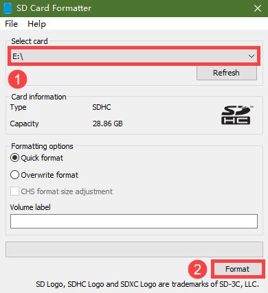

(3) 若出现下图所示提示，点击"**是**"按键即可。等待格式化完成。


### 2.3 镜像烧录

(1) 打开镜像烧录工具（Win32DiskImager），点击图标以选择镜像文件(镜像位于本文档同路径下，需用户自行下载解压，图片仅为示例，以实际镜像为准)，将"**Device**"一栏选择为SD卡的盘符，并点击"**Write**"按键，开始烧录镜像。


:::{Note}
镜像文件的存放路径不能存在中文字符。
:::

(2) 若出现下图所示提示，点击"**Yes**"按键即可。


(3) 若提示"**Write Successful**"，则烧录成功。若出现报错，请关闭防火墙一类的软件，并重新插入SD卡，再次进行本节操作。

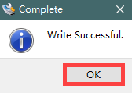

:::{Note}
烧录成功后，若出现是否格式化分区的提示，无视即可。
:::

(4) 烧录完成后将 SD卡弹出，从读卡器中拔下来，插入到树莓派主板上，如下图所示：

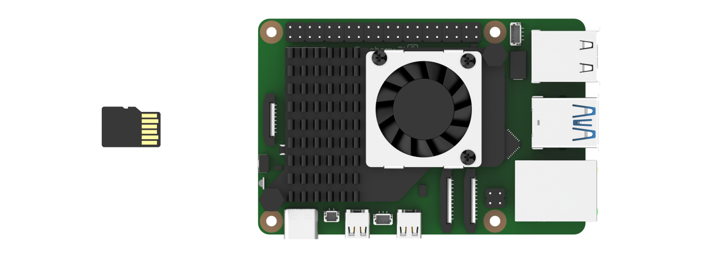

## 3. 首次开机及外设连接

:::{Note}
若没有显示器、键盘和鼠标等外设设备，可参考本章节"[4. 远程访问和远程传输文件](#anchor_4)"的课程，进行远程连接。
:::

### 3.1 启动前的准备

在前面的章节，我们将树莓派已经准备好了，就像日常生活中我们购买了一台新电脑启动前一样，需要从组装到安装系统再到连接线路准备开机。

没错，现在我们只需要进行一些开机前的工作即可正式开始"树莓派之旅"！

首先需要自备一个家用电脑的显示器，一套USB接口的键盘鼠标，Micro-HDMI线（根据你的显示器接口选择用于连接显示器的HDMI转VGA的、或者HDMI线转DVI的连接线）。

(1) 将之前烧录好系统镜像的SD卡插入树莓派中，注意SD卡金手指方向面向树莓派主板，如下图所示：


(2) 再将USB接口的键盘鼠标接入树莓派USB口中。与树莓派3B/3B+主板不同的是，树莓派5内的4个USB接口其中两个蓝色孔位的为USB3.0。


(3) 用HDMI线一端连接树莓派的HDMI接口，另一端插入显示器接口。


(4) 接上电源线，并打开电源（插入插排后可按按钮）；树莓派5采用Type-C供电接口，支持更大的电源输入（5.1V，5A），故直接插入电脑的USB接口是无法带动树莓派的。


### 3.2 启动树莓派

开启电源后，信号灯亮红色，随后变为绿色，等待几秒绿灯不规律闪烁，进入桌面，之后绿色灯常亮。


<p id="anchor_4"></p>

## 4. 远程访问和远程传输文件

### 4.1 准备工作

- #### 4.1.1 硬件准备

准备一台笔记本电脑，若使用台式电脑，请自备无线网卡，否则会无法和树莓派5连接到同一个局域网中。

- #### 4.1.2 MobaXterm工具安装和使用

MobaXterm是一个集成了多种远程计算工具并提供图形化界面的软件，我们可以通过连接树莓派的Wi-Fi热点，直接在电脑上控制树莓派。接下来将会分步讲解如何安装该软件。

① 解压"2 软件工具\3.远程连接工具\3.MobaXterm"中的文件，双击"**MobaXterm_installer_22.1.msi**"文件，单击"**Next**"。


② 在弹出的界面中选择同意接受协议，单击"**Next**"。


③ 选择要安装的路径，然后单击"**Next**"。

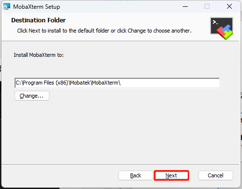

④ 单击"**Next**"。


⑤ 等待安装，片刻之后出现安装完成提示页面，单击"**Finish"**按钮即可。

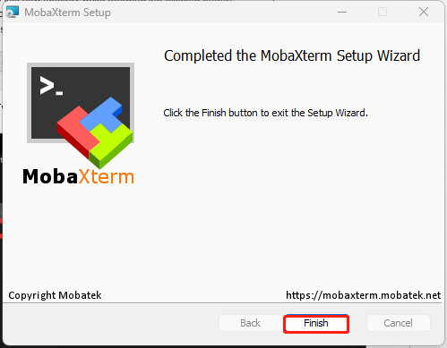

- #### 4.1.3 树莓派5开机

① 按照前面所学的教程，我们已经给树莓派5连接上了局域网。这里以教程演示为例，树莓派5已经连上"**Hiwonder**"的热点，这时候给我们的电脑也连上"**Hiwonder**"的热点。


② 通过**win+R**键打开"运行"窗口，输入cmd打开管理员模式。


③ 输入"**ping raspberrypi -4**"命令，查看热点给树莓派5分配的IP地址。

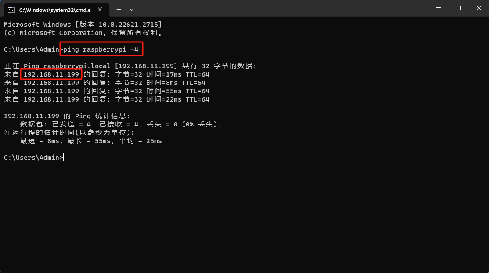

### 4.2 使用MobaXterm工具连接树莓派5

(1) 打开MobaXterm，在主界面，点击左上角"Session"，新建一个会话。


(2) 在会话界面，选择"**SSH**"，输入机器人的IP，，IP为"192.168.11.199"，勾选"**Specify username**"，然后输入用户名"**pi**"。点击"**OK**"选项即可。


(3) 第一次连接需要输入树莓派5的密码"raspberrypi"，输入密码不会显示，输入正确后按下回车键即可。


(4) 密码输入正确，进入系统成功，系统界面如下图所示：


### 4.3 树莓派的文件传输

我们经常会需要在自己的电脑与树莓派之间传输文件，本章将以SSH为例，使用MobaXterm工具进行说明，关于其他文件传输方法，可自行上网搜索学习。

- #### 4.3.1 从电脑端传输文件到树莓派

① 通过SSH连接后，这里以电脑端桌面新建一个test.txt文件为例。

② 调整MobaXterm放大比例，选中需要传输的文件，用鼠标拖拽文件到MobaXterm文件区。


③ 文件会自动传输到树莓派系统桌面，输入查看所有文件的指令"**ls**"，按下回车。如下图所示，从电脑端导入的文件已经传输成功。


- #### 4.3.2 从树莓派传输文件到电脑端

通过SSH连接后，在MobaXterm文件区找到选中需要传输的文件，用鼠标拖拽文件到电脑桌面，文件会自动传输到电脑桌面。


### 4.4 开启VNC连接

如果你对命令行操控不熟悉或者不习惯，而树莓派5烧录的官方系统镜像，默认是不开启VNC连接，我们可以通过ssh连接后进行相关操作开启VNC连接。

(1) 通过SSH连接后，输入"**sudo raspi-config**"指令，按下回车,打开树莓派5配置窗口。


(2) 在该界面使用"↑↓"箭头选择，"Enter"回车键用于确定，"Esc"键用于返回上一级。找到"**Interface Options**"，并按下回车，进入相关设置界面。


(3) 找到"**I2 VNC**"，并按下回车，进行VNC开关界面。

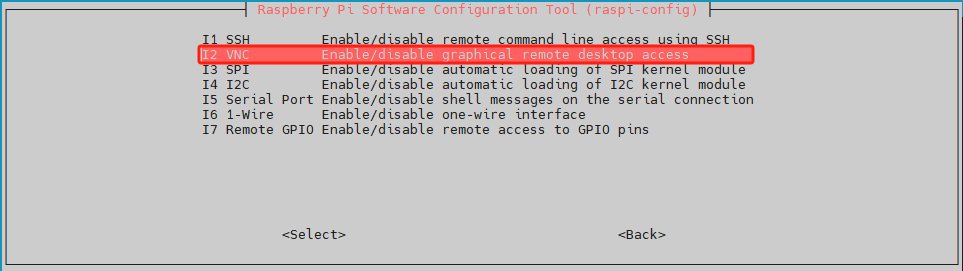

(4) 选择"**Yes**",并按下回车键，即可开启VNC连接。


(5) 开启VNC连接后，我们可以通过VNC连接到树莓派5的系统里面。

### 4.5 VNC安装和连接

VNC是一款远程控制工具软件，就像常用的Windows操作界面一样，能通过图形化桌面的方式来进行操作。

- #### 4.5.1 安装VNC

① 双击"**2 软件工具\3.远程连接工具\2.VNC（可视化桌面工具）**-\>**VNC-Viewer-6.17.731-Windows**"文件，在弹出的对话框中选择安装语言为"**English**"，单击"**OK**"按钮。


② 在弹出的界面单击"**Next**"按钮。


③ 在新的提示框中勾选同意协议，然后单击"**Next**"，接着弹出安装位置设置，保持默认设置，继续单击"**Next**"。

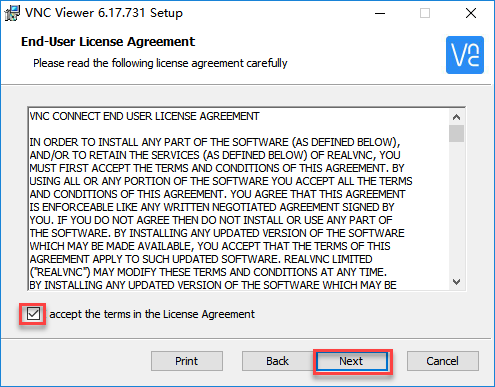

④ 在新弹出的页面中单击"**Install**"。


⑤ 等待安装，片刻之后出现安装完成提示页面，单击"**Finish**"按钮即可完成安装。


⑥ VNC完成连接，直接打开图标即可。

- #### 4.5.2 VNC连接

① 按照前面所学的教程，我们已经给树莓派5连接上了局域网。这里以教程演示为例，树莓派5已经连上"**Hiwonder**"的热点，这时候给我们的电脑也连上"**Hiwonder**"的热点。


② 打开安装完毕的VNC客户端。在打开的VNC Viewer中输入树莓派5的IP地址：**192.168.11.199**，然后按回车键。如果提示不是安全连接的话单击"**Continue**"。


③ 此时弹出一个提示框，要求输入密码，填入密码：**raspberrypi**（如果需要填账号的话输入"**pi**"）,勾选上记住密码框，然后单击"**OK**"，此时即可看到远程打开树莓派的桌面了。（如果是黑屏，只有一个鼠标的指针的画面，可尝试在重新启动树莓派后重复上述操作。）


## 5. 树莓派系统换源

树莓派默认的软件下载服务器是国外的，如果不进行换源的话，下载软件速度会比较慢或会发生出错的情况，所以需要切换成国内的服务器进行下载。

这里以切换到清华大学开源软件镜像站为例进行说明，其他的服务器可以参考官方提供的镜像列表：<https://www.raspbian.org/RaspbianMirrors>

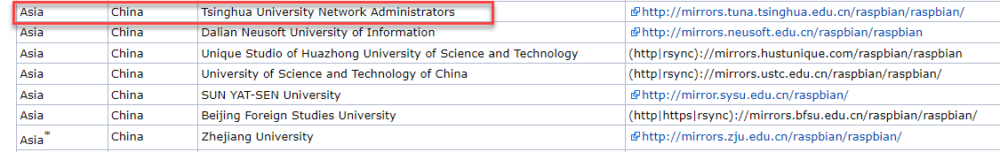

### 5.1 修改sources.list文件

(1)  按下"**Ctrl+Alt+T**"，打开命令行终端，输入如下命令编辑sources.list文件，然后按下回车。

```commandline
sudo nano /etc/apt/sources.list
```

(2)  通过键盘"← →"移动光标，移动到下图所示位置。

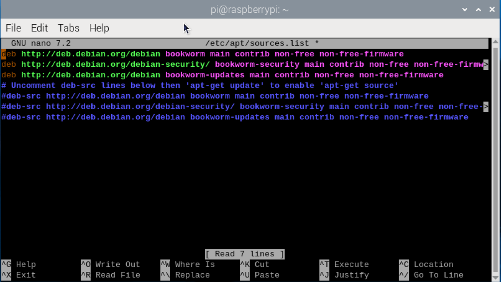

(3) 按下"**\#**"，注释原文件所有内容。


(4) 然后将光标移动到最下面空行，依次追加下方内容。（可通过复制粘贴进行，如果要粘贴，不能使用Ctrl+V，可按鼠标中键或右键选择"粘贴"。）**注意这里的源是清华大学开源软件镜像站，如使用其它的请对应修改。另外请严格按照下列格式进行，切勿换行，否则会失效造成换源失败。**

```commandline
deb https://mirrors.tuna.tsinghua.edu.cn/debian/ bookworm main contrib
deb https://mirrors.tuna.tsinghua.edu.cn/debian/ bookworm-updates main contrib
deb https://mirrors.tuna.tsinghua.edu.cn/debian/ bookworm-backports main contrib
deb https://security.debian.org/debian-security bookworm-security main contrib
```


(5) 按下"**Ctrl+O**"保存，出现下方提示，再按下回车。


(6) 保存完成以后，按下"**Ctrl+X**"即可退出。

### 5.2 修改raspi.list文件

(1) 按下"**Ctrl+Alt+T**"，打开命令行终端，输入如下命令编辑raspi.list文件，然后按下回车。

```commandline
sudo nano /etc/apt/sources.list.d/raspi.list
```

(2) 通过键盘"← →"移动光标，移动到下图所示位置。


(3) 按下"**\#**"，注释原文件所有内容。

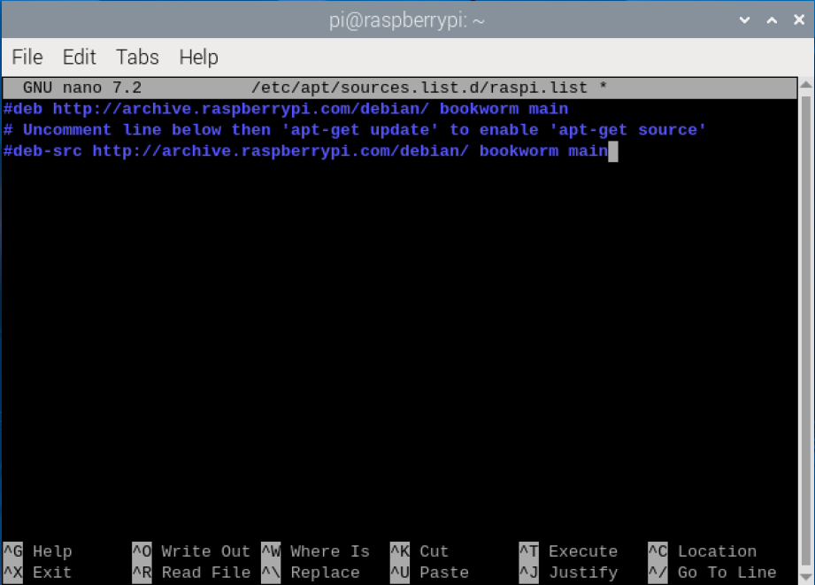

(4) 然后将光标移动到最下面空行，依次追加下方内容。（可通过复制粘贴进行，如果要粘贴，不能使用Ctrl+V，可按鼠标中键或右键选择"粘贴"。）。

```commandline
deb https://mirrors.tuna.tsinghua.edu.cn/raspberrypi/ bookworm main
```

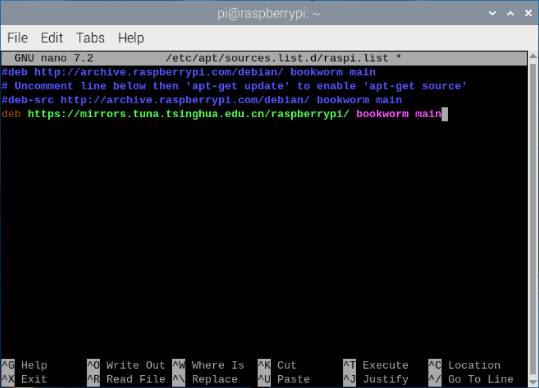

(5) 按下"**Ctrl+O**"保存，出现下方提示，再按下回车。


(6) 保存完成以后，按下"**Ctrl+X**"即可退出。

## 6. 更新和升级操作系统

使树莓派保持最新状态可以提高系统的安全性，但对于开发人员并不建议随意更新！

### 6.1 图像化界面更新

一般桌面的右上角也会显示树莓派系统更新的提示，可以点击相应选项进行更新。


### 6.2 命令行终端更新

(1) 按下"**Ctrl+Alt+T**"，打开命令行终端，输入如下指令，更新本地包缓存。更新过程中会提示是否愿意接受更改，输入"**Y**"按下回车，然后等待更新完成即可。

```commandline
sudo apt update
```

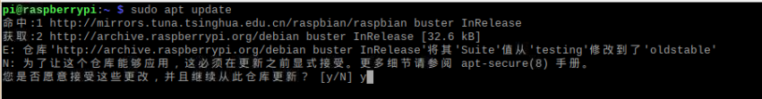


(2) 输入命令更新软件包，更新过程如出现提示消耗空间的选项，同样按下"**Y**"，再按下回车继续。（注意：初次配置，时间会比较久，需耐心等待）

```commandline
sudo apt full-upgrade
```

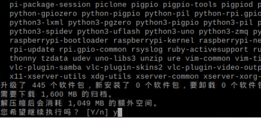

## 7. raspi-config配置工具介绍及使用

Raspi-config是树莓派操作系统Raspberry Pi OS中预装的配置工具，提供了一种简单便捷的命令行界面来管理树莓派系统的配置，使用户可以轻松地定制和优化其系统设置。

### 7.1 打开raspi-config工具

(1) 按下"**Ctrl+Alt+T**"，打开命令行终端，输入如下命令，然后按下回车。


```commandline
sudo raspi-config
```

(2) 在该界面使用"↑↓"箭头选择，"Enter"回车键用于确定，"Esc"键用于返回上一级。


### 7.2 功能列表

输入配置命令后，会看到raspi-config工具的界面，中间灰色框中会列出所有的选项。

**(1) System Options**

系统选项菜单，允许对引导、登录和网络、声音等各个部分进行配置更改，以及一些系统级别的更改。


**(2) Display Options**

显示选项，用来配置分辨率，去除黑边等。


**(3) Interface Options**

接口选项菜单，有以下选取可启用/禁用：Camera、SSH、VNC、SPI、I2C、Serial、1-wire和远程访问GPIO。


**(4) Performance Options**

性能选项，包括超频、调整显存大小、风扇转速等功能。


**(5) Localisation Options**

本地化选项，提供：键盘布局、时区、区域设置和无线LAN国家代码。


**(6) Advanced Options**

高级选项，可以对磁盘扩展、引导启动等选项进行设置。


**(7) Update**

将raspi-config工具更行到最新版本。


**(8) About raspi-config**

关于raspi-config的信息。


### 7.3 设置WIFI国家

(1) 选择"**5 Localisation Options Configure language and regional settings**"，然后按下"**Enter**"键。


(2) 然后选择"**L4 WLAN Country Set legal wireless channels for your country**"，然后按下"**Enter**"键。


(3) 选中"**HK Hong Kong**"，按下"**Enter**"键即修改成功。


## 8. config.txt文件说明

由于树莓派并没有传统意义上的BIOS，所以现在各种系统配置参数通常被存在"config.txt"这个文本文件中。

树莓派的config.txt文件会在ARM内核初始化之前被GPU读取，是树莓派系统特有的启动配置文件，位于SD卡的第一个（引导）分区上，其路径为：**/boot/config.txt**


### 8.1 文件格式

双击打开config.txt文件。每行单个语句，内容是整数或字符串；每个语句前可添加一行注释来解释语句作用，每行长度限制为98个字符，超过限制的内容部分会被忽略。


### 8.2 常用选项

- **Camera_auto_detect**

启用此设置后，固件将自动加载其识别的CSI摄像机的叠加层。

设置为禁用：

**camrea_auto_detect=0**

- **Display_auto_detect**

启用此设置后，固件将自动加载它识别的DSI显示器的叠加层。

设置为禁用：

**display_auto_detect=0**

- **Dtoverlay**

用于加载和配置设备树覆盖，通过配置dtoverlay，用户可以添加额外的硬件支持或功能到树莓派系统中。

加载启用内核图形驱动程序的覆盖层：

**dtoverlaydtoverlay=vc4-kms-v3d**

这里只列举部分选项，更详细的资料请去官方（https://www.raspberrypi.com/documentation/computers/raspberry-pi-5.html）查看教程。

## 9. 设置显示屏分辨率和旋转

显示屏分辨率选择不正确的话可能会出现花屏现象，可以按照产品支持的显示器分辨率设置。

### 9.1 外接显示屏显示设置

(1) 点击左上角的logo，选择Preference →Screen Configuration。


(2) 鼠标右击的HDMI输出接口就可以设置分辨率、旋转方向等。修改之后需要重启系统。


### 9.2 VNC远程显示设置

(1) 点击左上角的logo，选择**Preference **→**Raspberry Pi Configuration**。


(2) 点击进入"**Raspberry Pi Configuration**"界面，选择"**Display**"，并根据自身电脑屏幕的分辨率选择合适的尺寸。修改之后需要重启系统，重新连接VNC。


## 10. 设置屏幕休眠

树莓派5系统默认是10分钟无操作后自动息屏，接下来将演示两种设置方法如何修改屏幕休眠时间。

### 10.1 图形化界面设置

(1) 点击左上角的logo，选择**Preference** →**Raspberry Pi Configuration**。


(2) 点击进入"**Raspberry Pi Configuration**"界面，选择"**Display**"界面，Screen Blanking的启用/禁用是设置屏幕是否息屏。修改之后需要重启系统。


### 10.2 命令行终端设置

可以通过修改lightdm.conf文件来设置屏幕休眠。

(1) 按下"**Ctrl+Alt+T**"，打开命令行终端，输入"**sudo nano /etc/lightdm/lightdm.conf**"命令，打开lightdm.conf文件。

```commandline
sudo nano /etc/lightdm/lightdm.conf
```

(2) 取消"**xserver-command=X**"的注释符#，并修改成"**xserver-command=X -s 0-dpms**"，其中-s参数即为设置屏幕保护不启动，-dpms为关闭电源节能管理。


(3) 修改完成后，按下"Ctrl+X",并输入Y，然后回车，即可保存文件。

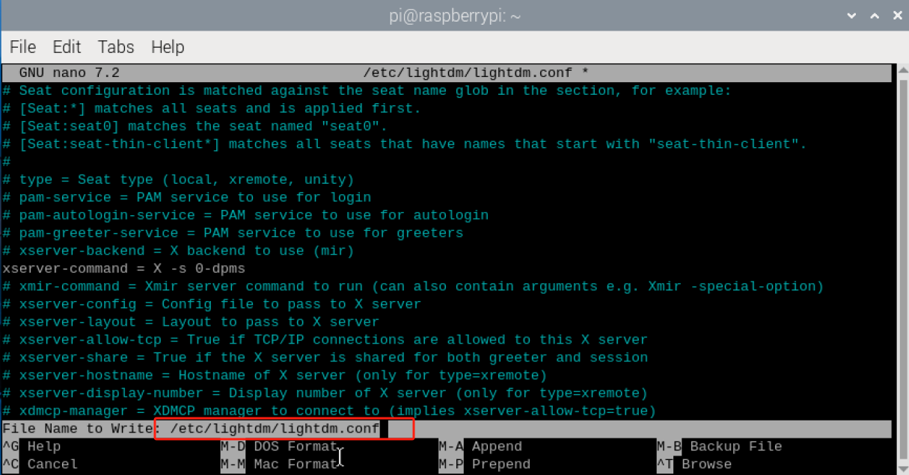

(4) 保存文件后，需要重启系统。

## 11. 播放音频和视频

VLC是最好的免费和开源的媒体播放器之一，几乎任何设备都可以使用。VLC的特点是支持绝大多数的视频和音频格式，而且内置支持来自互联网的流媒体。由于在基本的VLC安装中包含了大量的解码编码库，就不必担心寻找额外的编解码器了。

在树莓派5上播放音频和视频的最简单方法是使用预装的VLC应用程序，VLC程序使用硬件加速，可以播放许多流行的音频和视频文件格式，但由于树莓派5取消了音频接口，需要用户自行外接带有音频输出的显示器或者蓝牙音频设备。

### 11.1 安装VLC应用程序

VLC应用程序在树莓派操作系统仓库中是可用的，可以通过运行"apt install"命令轻松安装VLC。

按下"**Ctrl+Alt+T**"，打开命令行终端，输入如下指令，更新本地包缓存。更新过程中会提示是否愿意接受更改，输入"**Y**"按下回车，然后等待更新完成即可。

```commandline
sudo apt install -y vlc
```

下面以播放demo.mp4文件为例，列出一些常用的指令合集：

| 指令 | 说明 |
|:--:|:--:|
| vlc demo.mp4 | 播放demo.mp4文件 |
| vlc --play-and-exit demo.mp4 | 播放完demo.mp4文件，退出应用 |
| vlc --play-and-exit --fullscreen demo.mp4 | 全屏播放demo.mp4文件，播放完并退出应用 |
| cvlc --play-and-exit demo.mp4 | 不显示VLC图形界面播放demo.mp4 |

### 11.2 启动VLC

- #### 11.2.1 命令行启动

按下"**Ctrl+Alt+T**"，打开命令行终端，输入"**vlc /home/pi/demo.mp4**"，运行demo.mp4这个视频文件，其路径在/home/pi。

```bash
vlc /home/pi/demo.mp4
```


- #### 11.2.2 图形化界面启动

点击左上角的logo，选择并点击Sound&Video→VLC Media Player，即可打开"VLC Media Player"播放器。

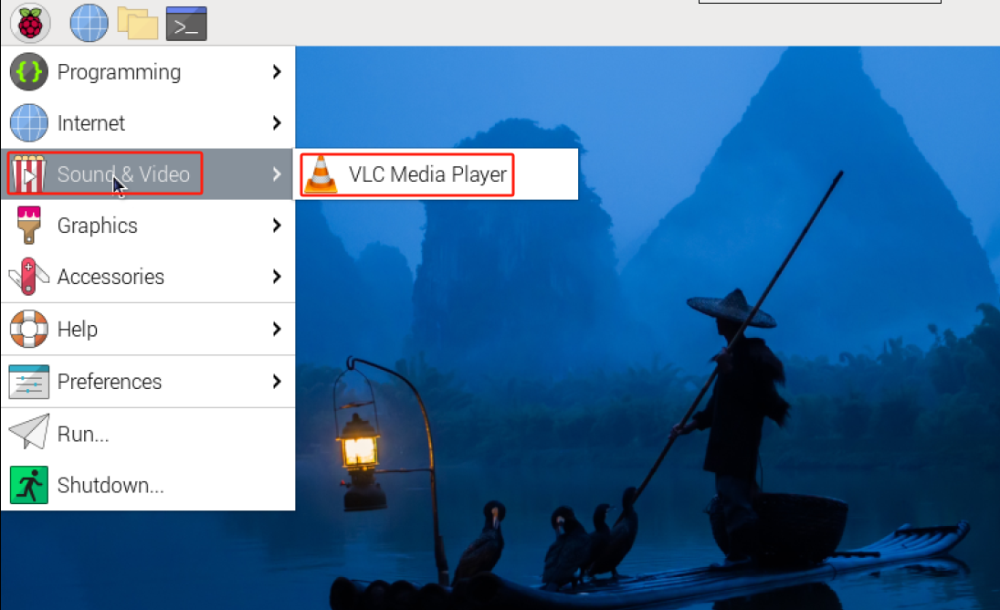

找到demo.mp4文件，打开并播放该文件。


## 12. 控制RGB颜色

本节主要控制扩展板上的RGB灯颜色，让其设置为红色、绿色等。

### 12.1 实现原理

RGB分别代表了红绿蓝三种颜色通道，它们的参数范围都是0~255，数值越大，颜色越深。在程序中，通过修改RGB灯亮灭的延时时间来控制它们的闪烁频率。该程序的源代码位于： **/home/pi/board_demo/rgb_control_demo.py**

(1) 本节通过调用Board库中的set_rgb()函数来实现对RGB的控制，以**board.set_rgb(\[\[1, 255, 0, 0\], \[2, 255, 0, 0\]\])**为例，其中：

(2) 第一个参数"**1**"代表RGB1，若为"**2**"则代表RGB2；

(3) 第二参数"**255, 0, 0**"表示颜色通道参数，其中，第一个参数"**255**"代表"**R**"通道（红色分量）的数值；第二、三个参数分别为"**G**"、"**B**"通道的数值。

### 12.2 准备工作

树莓派扩展板上板载了两个RGB彩灯，如下图所示位置：


### 12.3 实验步骤

(1) 将设备开机，将机器人通过VNC远程连接工具进行连接。

(2) 点击桌面左上角的图标，或按下快捷键"**Ctrl+Alt+T**"打开命令行终端。

(3) 输入玩法程序所在目录的指令"**cd board_demo/**"，按下回车键。

```commandline
cd board_demo/
```

(4) 然后输入运行玩法程序的指令"**python3** **rgb_control_demo.py**"，按下回车键。

```commandline
python3 rgb_control_demo.py
```

(5) 如需关闭此程序，可按下"**Ctrl+c**"。若关闭失败可重复此操作，直至退出。

### 12.4 功能实现

程序运行后，树莓派扩展板上的2个RGB灯循环亮起红、绿、蓝和黄4种灯光。

## 13. 控制RGB灯闪烁

本节将通过控制扩展板上的RGB灯来实现每0.5秒闪烁一次的颜色变化。

### 13.1 实现原理

RGB分别代表了红绿蓝三种颜色通道，它们的参数范围都是0~255，数值越大，颜色越深。在程序中，通过修改RGB灯亮灭的延时时间来控制它们的闪烁频率。该程序的源代码位于： **/home/pi/board_demo/rgb_flashing.py**

(1) 本节通过调用Board库中的set_rgb()函数来实现对RGB的控制，以**board.set_rgb(\[\[1, 255, 0, 0\], \[2, 255, 0, 0\]\])**为例，其中：

(2) 第一个参数"**1**"代表RGB1，若为"**2**"则代表RGB2；

(3) 第二参数"**255, 0, 0**"表示颜色通道参数，其中，第一个参数"**255**"代表"**R**"通道（红色分量）的数值；第二、三个参数分别为"**G**"、"**B**"通道的数值。

(4) 使用time.sleep(0.5)的延时来实现RGB灯的闪烁。

### 13.2 准备工作

树莓派扩展板上板载了两个RGB彩灯，如下图所示位置：


### 13.3 实验步骤

(1) 将设备开机，将机器人通过VNC远程连接工具进行连接。

(2) 点击桌面左上角的图标，或按下快捷键"**Ctrl+Alt+T**"打开命令行终端。


(3) 输入玩法程序所在目录的指令，按下回车键。

```commandline
cd board_demo/
```

(4) 然后输入运行玩法程序的指令，按下回车键。

```commandline
python3 rgb_flashing.py
```

(5) 如需关闭此程序，可按下"**Ctrl+c**"。若关闭失败可重复此操作，直至退出。

### 13.4 功能实现

程序运行后，树莓派扩展板上的2个RGB灯亮起红、绿、蓝和黄4种灯光进行闪烁。

## 14. 按键控制

本节学习任何通过扩展板上的不同按键来控制RGB灯的颜色。

### 14.1 实现原理

根据按键按下，检测GPIO口的高低电平控制RGB灯的颜色状态。


(1) 初始化树莓派扩展板和GPIO引脚，并设置一个信号处理函数来关闭程序运行，在一个循环中，不断检测两个按钮的状态，当按下"**Ctrl+C**"时关闭程序。

(2) 如果key1被按下，将RGB灯的颜色设置为红色。

(3) 如果key2按钮被按下，将RGB灯的颜色设置为蓝色。

(4) 打印按钮的状态（按下或释放）。

(5) 循环执行，直到接收到Ctrl+C信号终止程序。

(6) 该程序的源代码位于：**/home/pi/board_demo/key.py**

### 14.2 准备工作

树莓派扩展板上板载了2个按键，如下图所示位置：


### 14.3 实验步骤

(1) 将设备开机，将机器人通过VNC远程连接工具进行连接。

(2) 点击桌面左上角的图标，或按下快捷键"**Ctrl+Alt+T**"打开命令行终端。

(3) 输入玩法程序所在目录的指令，按下回车键。

```commandline
cd board_demo/
```

(4) 输入指令"**python3 key.py**"，然后按下回车键，会打印一个提示，我们根据提示进行操作。

```commandline
python3 key.py
```


(5) 输入如下指令：

```commandline
sudo systemctl stop hw_button_scan.service
```

(6) 输入指令"**python3 key.py**"，然后按下回车键，会打印一个提示

```commandline
python3 key.py
```


按下key1将灯光设置为红色，按下key2将灯光设置为蓝色，CTRL + C关闭程序。

(7) 在玩法结束后需要重新启动 hw_button_scan服务，输入重启服务指令。

```commandline
sudo systemctl start hw_button_scan.service
```

### 14.4 功能实现

- 如果按下了key1，使用board.set_rgb()函数将RGB颜色设置为红色。

- 如果按下了key2，使用board.set_rgb()函数将RGB颜色设置为蓝色。

- 在控制台上打印按键的状态（key1_state和key2_state）。CTRL + C关闭程序将退出程序。

## 15. 控制蜂鸣器

本节内容主要控制扩展板上的蜂鸣器发出声音。

### 15.1 实现原理

通过设定**set_buzzer()**"函数来调节蜂鸣器的高低电平。

该程序的源代码位于： **/home/pi/board_demo/buzzer_control_demo.py**

此程序通过调用"**Board**"库下的"**set_buzzer()**"函数来调节蜂鸣器的高低电平，"**set_buzzer(1900, 0.1, 0.9, 1)**"函数中的参数值是以1900Hz的频率，持续响0.1秒，关闭0.9秒，重复1次。

### 15.2 准备工作

树莓派扩展板上板载了一个蜂鸣器，如下图所示位置：


### 15.3 实验步骤

(1) 将设备开机，将机器人通过VNC远程连接工具进行连接。

(2) 点击桌面左上角的图标，或按下快捷键"**Ctrl+Alt+T**"打开命令行终端。

(3) 输入玩法程序所在目录的指令"**cd board_demo/**"，按下回车键。

```commandline
cd board_demo/
```

(4) 输入指令"**python3 buzzer_control_demo.py**"，然后按下回车键，启动玩法；此时蜂鸣器会短鸣一声，再长鸣三声自动退出玩法。

```commandline
python3 buzzer_control_demo.py
```

### 15.4 功能实现

玩法启动后，树莓派扩展板上的蜂鸣器短鸣一声，再长鸣三声，然后自动退出玩法程序。

## 16. 控制单个PWM舵机

本节课内容主要控制扩展板上的1号PWM接口，以控制单个舵机的转动。

### 16.1 实现原理

在程序中，通过修改运行时间和舵机脉宽来控制舵机的转动。该程序的源代码位于：**/home/pi/board_demo/single_servos.py**

本节通过调用Board库中的pwm_servo_set_position()函数来实现对舵机的控制，以**board.pwm_servo_set_position(0.5, \[\[1, 1500\]\])**，其中：

第一个参数"**0.5**"代表舵机运行时间为500毫秒，若为"1"则代表运行时间为1000毫秒；

第二参数"**\[\[1, 1100\]\]**"表示设置1号舵机脉宽为1500

### 16.2 准备工作

树莓派扩展板上板载了6个PWM舵机接口，我们接1号舵机进行测试如下图所示位置： 


### 16.3 实验步骤

(1) 将设备开机，将机器人通过VNC远程连接工具进行连接。

(2) 点击桌面左上角的图标，或按下快捷键"**Ctrl+Alt+T**"打开命令行终端。

(3) 输入玩法程序所在目录的指令"**cd board_demo/**"，按下回车键。

```commandline
cd board_demo/
```

然后输入运行玩法程序的指令"**python3** **single_servos.py**"，按下回车键。

```commandline
python3 single_servos.py
```

(4) 如需关闭此程序，可按下"**Ctrl+c**"。若关闭失败可重复此操作，直至退出。

### 16.4 功能实现

程序运行后，树莓派扩展板通过调整舵机的脉宽值，可以控制舵机的角度位置，从而实现不同的运动效果。

### 16.5 关于PWM舵机说明

- #### 16.5.1 舵机及工作原理介绍

**什么是舵机**

舵机，也被称为伺服电机，最开始被用来控制船舶的转向。因为它可以精准地控制舵盘的转动角度，所以常常被用在有较高精度需求的机械系统中。与舵机关系最紧密的就是机器人，不论是工业机器人，还是家庭服务机器人，它们都有很高的控制精度要求，舵机构成了它们的关节，在机器人中舵机属于执行器部分，因此可以把舵机比喻为机器人的肌肉，同时提供给它们动力。

**舵机构成及工作原理**

舵机内部由电机、控制电路板、齿轮组、电位器四部分组成。


传统舵机有三条导线，分别是**电源线**、**地线**、**信号控制线**。

舵机工作原理：当舵机的控制电路板接收到脉冲信号后，控制电机转动，电机通过齿轮组带动输出轴转动，输出轴转动的同时带动电位器转动。控制电路板检测到电位器转动后会判断电位器是否转动到了指定角度，如果转动到了指定角度就让电机停止转动，否则继续转动。


**PWM舵机介绍**

PWM舵机是由PWM控制的，区别于传统的模拟舵机，模拟舵机需要给它不停的发送PWM信号，才能让它保持在规定的位置或者让它按照某个速度转动，PWM舵机则只需要发送一次PWM信号就能保持在规定的某个位置。

另外舵机在拼装前，需要先将舵机进行中位操作。

我们所说的舵机中位即舵机初始的位置，是以此位置为"零点"进行正负角度转动，所以舵机在安装到舵盘前需调至中位再进行安装。

这是因为舵机在转动时，转动部件带动电位器转动，软件会假定中位这个位置为"零点"，否则电位器可能会进入"盲区"，造成整个组件无法正常运行，进而在机器人使用中，会出 现指定角度达不到或对应动作组不一致的情况。

## 17. 控制PWM舵机速度

本节课内容主要控制扩展板上的1号PWM接口，通过控制角度达到的时间实现舵机的速度控制。**如需要了解PWM舵机的原理说明可移步到 "第16课 控制单个PWM舵机\关于PWM舵机说明"**

### 17.1 实现原理

在程序中，通过修改运行时间、舵机ID和舵机的脉宽来控制舵机的转动速度。该程序的源代码位于：**/home/pi/board_demo/pwm_servo_speed.py**

本节通过调用Board库中的pwm_servo_set_position()函数来实现对舵机的控制，以**board.pwm_servo_set_position(0.5, \[\[1, 1100\]\])为例**，其中：

第一个参数"**0.5**"代表舵机运行时间为500毫秒，若为"1"则代表运行时间为1000毫秒；

第二参数"**\[\[1, 1100\]\]**"表示设置1号舵机脉宽为1100。

### 17.2 准备工作

树莓派扩展板上板载了6个PWM舵机接口，我们接1号舵机进行测试如下图所示位置： 


### 17.3 实验步骤

(1) 将设备开机，将机器人通过VNC远程连接工具进行连接。

(2) 点击桌面左上角的图标，或按下快捷键"**Ctrl+Alt+T**"打开命令行终端。

(3) 输入玩法程序所在目录的指令"**cd board_demo/**"，按下回车键。

```commandline
cd board_demo/
```

然后输入运行玩法程序的指令"**python3 pwm_servo_speed.py**"，按下回车键。

```commandline
python3 pwm_servo_speed.py
```

(4) 如需关闭此程序，可按下"**Ctrl+c**"。若关闭失败可重复此操作，直至退出。

### 17.4 功能实现

程序运行后，树莓派扩展板通过调整舵机的脉宽值，可以控制舵机到达指定角度的时间，从而实现速度控制。

## 18. 控制多个PWM舵机

本节课内容主要控制扩展板上的1、2号PWM接口，实现多个舵机的运动控制。**如需要了解PWM舵机的原理说明可移步到 "第16课 控制单个PWM舵机\关于PWM舵机说明"**

### 18.1 实现原理

我们来看一下本节课程的实现思路：

输送脉冲信号控制舵机的转动，通过代码参数设置舵机的转动角度和转动时间，该程序的源代码位于：**/home/pi/board_demo/pwm_servo_control_demo.py**

PWM舵机的控制主要引用Board库下的pwm_servo_set_position()函数。以代码"**board.pwm_servo_set_position(1, \[\[1, 1100\]\])**"为例，其中：

第一个参数"**1**"是运行时间（单位：s），此处参数为1，即为1s。

第二个参数"**\[\[1, 1100\]\]**"是表示要设置的舵机位置。它是一个列表，每个元素是一个二元组，包含舵机的编号和位置值。是经过角度换算得到的数据(脉宽=11.1\*角度+500（此公式仅作换算参考）)，因此会对应舵机转动角度54°；

### 18.2 准备工作

树莓派扩展板上板载了6个PWM舵机接口，我们接1、2号舵机接口进行测试如下图所示： 


### 18.3 实验步骤

(1) 将机器人开机，将机器人与VNC建立连接。

(2) 单击桌面左上角的的图标，或使用快捷键"**Ctrl+Alt+T**"，打开命令行终端。

(3) 输入指令"**cd /home/pi/GoGoPi/board_demo/**"，并按下回车，切换到玩法程序所在目录。

```commandline
cd /home/pi/GoGoPi/board_demo/
```

(4) 输入指令"**python3 pwm_servo_control_demo.py**"，并按下回车，运行玩法程序。

```commandline
python3 pwm_servo_control_demo.py
```

(5) 如需关闭此玩法，可在终端界面按下"**Ctrl+c**"。若关闭失败，请反复尝试。

### 18.4 功能实现

玩法开启后，1号舵机和2号舵机循环转动。

### 18.5 功能延伸

<p id="anchor_18_5_1"></p>

- #### 18.5.1 更换舵机接口

程序默认设置先转动1号舵机接口，如需更换舵机接口，在将舵机插入指定接口后，再进行操作，下面以修改为2号为例：

① 输入指令"**cd /home/pi/board_demo/**"，并按下回车，切换到玩法程序所在目录。

```commandline
cd /home/pi/board_demo/
```

② 输入指令"**vim pwm_servo_control_demo.py**"，并按下回车，打开程序文件。

```commandline
vim pwm_servo_control_demo.py
```

③ 在打开的页面中输入"**:set number**"将行号调出来（此步用户根据需要自行设置即可）。

 

④ 在打开的页面中找到如下图所示代码：


⑤ 按一下键盘上的"**i**"键，进入编辑模式。


⑥ 将"**board.pwm_servo_set_position**"括号内的第一个参数"1"全部改为"2"，如下图所示：


⑦ 修改完成后，按下键盘上的"**Esc**"键，然后依次输入"**:wq**"（注意wq前为冒号:），回车，即可保存并退出。

⑧ 退出之后，再次输出指令"**ython3 p wm_servo_control_demo.py**"，即可观看修改效果。

```commandline
ython3 p wm_servo_control_demo.py
```

- #### 18.5.2 修改转动角度

程序默认初始状态1号舵机在54°~90°范围之间循环转动。若想自定义舵机转动的角度，比如将舵机转动修改从30°~120°循环转动为例，可参照以下步骤进行修改。

① 参照"[更换舵机接口](#anchor_18_5_1)"步骤，打开程序文件，找到如下图所示代码。


② 舵机转动范围在500~2500脉宽之间，换算成角度就是0~180°，例如，1500脉宽就是90°，即1°等于11.1个脉宽；角度换算成位置数值的公式为：11.1\*角度+500。


③ 修改完成后，按下键盘上的"**Esc**"键，然后依次输入"**:wq**"（注意wq前为冒号：），回车，即可保存并退出。


④ 退出之后，再次输出指令"**python3 pwm_servo_control_demo.py**"，即可观看修改效果。

```commandline
python3 pwm_servo_control_demo.py
```

## 19. 驱动直流电机

本章节主要实现扩展板上的驱动直流电机以不同速度进行转动。（**注意：扩展板B、C不包含电机接口**）

### 19.1 实现原理

通过程序对电机的参数进行设置，当数值为正时前进，数值为负时则后退。该程序的源代码位于：**/home/pi/board_demo/motor_control_demo.py**

底盘电机的控制主要引用Board库下的set_motor_duty()函数。以代码"**board.set_motor_duty(\[\[1, 35\]\])**"为例，其中：

\[\[1, 35\]\] 设置电机的占空比，嵌套了二元组，二元组包含电机编号1和占空比之35，即速度为35。

### 19.2 准备工作

树莓派扩展板上板载了4个电机接口（如下图），我们接1号电机接口进行测试


<p id="anchor_19_3"></p>

### 19.3 实验步骤

(1) 将设备开机，将机器人通过VNC远程连接工具进行连接。

(2) 点击桌面左上角的图标，或按下快捷键"**Ctrl+Alt+T**"打开命令行终端。

(3) 输入玩法程序所在目录的指令"**cd board_demo/**"，按下回车键。

```commandline
cd board_demo/
```

(4) 输入控制电机转动的指令"**python3 motor_control_demo.py**"，按下回车。

```commandline
python3 motor_control_demo.py
```

5. 如需关闭此程序，可按下"**Ctrl+c**"。若关闭失败，请反复尝试。

### 19.4 功能实现 

玩法开启后，直流电机M1先以35的速度正转0.2秒，然后以90的速度正转0.2秒，以此不断循环转动。

### 19.5 功能延伸 

<p id="anchor_19_5_1"> </p>

- #### 19.5.1 速度和方向调节

:::{Note}
电机速度范围为-100~100，请勿设置超出范围的数值，以免对电机造成损坏。
:::

若想修改电机转动的速度和方向，可参照以下步骤进行。

本节以控制1号接口电机先以80的速度正转2秒，再以60的速度反转2秒，为例进行修改。

① 输入进入玩法程序所在目录的指令"**cd /home/pi/board_demo/**"，并按下回车。

```commandline
cd /home/pi/board_demo/
```

② 输入打开程序文件的指令"**vim motor_control_demo.py**"，并按下回车。

```commandline
vim motor_control_demo.py
```

③ 在打开的页面找到如下图框出代码。


④ 按一下键盘上的"**i**"键，进入编辑模式。


⑤ 如下图框出部分所示进行修改，需要注意，当速度值为正时，电机为正转，值越大，电机正转速度越快；当速度值为负值时，电机反转，值越小，电机反转速度越快。


⑥ 修改完成后，按下键盘上的"**Esc**"键，然后依次输入"**:wq**"（注意 wq 前为冒号:），输入完成后按下回车，即可保存并退出程序。

⑦ 程序保存之后，按照[19.3 实验步骤](#anchor_19_3)内容操作即可查看程序运行效果。

- #### 19.5.2 电机接口调节

① 程序默认的电机接口为1号，我们这里以修改为2号电机为例。参照[速度和方向调节](#anchor_19_5_1)找到电机参数的代码并进入编辑模式。

② 将电机1号接口修改为2号。如下图所示：

 

③ 修改完成后按下键盘上的"**Esc**"键，然后依次输入"**:wq**"（注意 wq 前为冒号:），输入完成后回车，即可保存并退出程序。

④ 程序保存之后按照[19.3 实验步骤](#anchor_19_3)内容操作即可查看程序运行效果。

## 20. GPIO口控制例程

本章节主要实现扩展板上GPIO口的高低电平使用。

### 20.1 实现原理

在程序中，通过控制树莓派的GPIO口高低电平，控制风扇模块的转动，风扇正转3秒，然后反转3秒。该程序的源代码位于：**/home/pi/board_demo/gpio_control.py**

① 本节通过调用导入了gpiod模块，提供了与GPIO引脚控制。

② 通过创建Chip类的实例，初始化GPIO。

③ 使用get_line方法从树莓派中获取了两个GPIO引脚（引脚8和引脚7），并分别赋值给fanPin1和fanPin2变量。

④ 使用request方法将两个引脚的方向设置为输出。

⑤ set_direction函数设置fanPin1和fanPin2的值来控制风扇的旋转方向。

⑥rotate_clockwise函数调用set_direction来使风扇顺时针旋转。

⑦ rotate_counterclockwise函数调用set_direction来使风扇逆时针旋转。

⑧ stop_rotation函数调用set_direction来停止风扇的旋转。

### 20.2 准备工作

树莓派扩展板上板载了4个GPIO口，以下我们使用GPIO7、GPIO8引脚控制。


<p id="anchor_20_3"></p>

### 20.3 实验步骤

(1) 将设备开机，将机器人通过VNC远程连接工具进行连接。

(2) 点击桌面左上角的图标，或按下快捷键"**Ctrl+Alt+T**"打开命令行终端。

(3) 输入玩法程序所在目录的指令"**cd board_demo/**"，按下回车键。

```commandline
cd board_demo/
```

然后输入运行玩法程序的指令"**python3** **gpio_control.py**"，按下回车键。

```commandline
python3 gpio_control.py
```

(4) 如需关闭此程序，可按下"**Ctrl+c**"。若关闭失败可重复此操作，直至退出。

### 20.4 功能实现

程序运行后，引脚会高低电平变换，从而控制风扇模块的转动。通过调整参数可以控制不同舵机的角度位置和运动时间实现速度控制。

